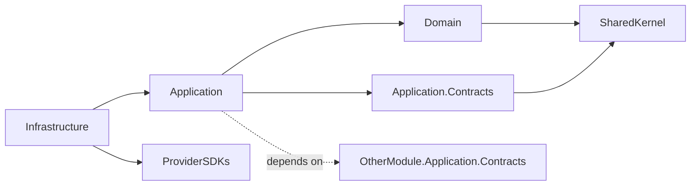

# Scaffolding a new backend module

## Purpose

Stand up a new modular-monolith module that complies with
[03-module-boundaries.md](../../../docs/architecture/03-module-boundaries.md) and
[01-architecture-standards.md](../../../docs/standards/01-architecture-standards.md)
out of the gate: four packages, the right project references, an `IModule`
registration, a permission catalogue, an audit matrix, and a place for the module's
EF DbContext.

## When to use

- A new platform capability genuinely warrants its own module (rare).
- The capability fits one of the named modules in
  [03-module-boundaries.md § Module Map](../../../docs/architecture/03-module-boundaries.md);
  use that name, not a new one.

## When not to use

- The capability is an aggregate inside an existing module. Add the aggregate, not a
  new module.
- The capability is domain-specific (English-learning vocabulary, yoga asanas, …).
  Express it as tenant customization data per
  [ADR-0018](../../../docs/decisions/0018-tenant-driven-customization-model.md).
- You're tempted to name the module `Verticals.*`. Forbidden. Architecture test
  `No_Source_Folder_Named_Verticals` will fail.

## Inputs

| Input | Required | Description |
|-------|----------|-------------|
| Module name | Yes | One of the named modules in 03-module-boundaries. PascalCase. |
| Owns | Yes | Aggregates this module owns. |
| Cross-module dependencies | Yes | Other modules' `Application.Contracts` it will reference. |
| Provider adapters | No | External-boundary interfaces it wraps (if any). |

## Workflow

### Step 1: Confirm the name

Open
[03-module-boundaries.md § Backend Modules](../../../docs/architecture/03-module-boundaries.md).
Your module must appear in that list. If not, **stop**; either fit the work into an
existing module or open an ADR to add a new module to the boundary map.

### Step 2: Create the four projects

```
backend/src/Modules/<Name>/
  LearnStack.Modules.<Name>.Application.Contracts/
    LearnStack.Modules.<Name>.Application.Contracts.csproj
  LearnStack.Modules.<Name>.Application/
    LearnStack.Modules.<Name>.Application.csproj
  LearnStack.Modules.<Name>.Domain/
    LearnStack.Modules.<Name>.Domain.csproj
  LearnStack.Modules.<Name>.Infrastructure/
    LearnStack.Modules.<Name>.Infrastructure.csproj
```

Project references follow the strict graph in
[01-architecture-standards.md § Dependency Direction](../../../docs/standards/01-architecture-standards.md):



Forbidden references (architecture test will catch them):

- Domain → Application / Infrastructure
- Application → Infrastructure
- Module A → Module B.Domain
- Module A → Module B.Infrastructure

### Step 3: Author the `IModule` registration

In `LearnStack.Modules.<Name>.Application/<Name>Module.cs`:

```csharp
public sealed class <Name>Module : ILearnStackModule
{
    public void Register(IServiceCollection services, IConfiguration configuration)
    {
        // NOT AddDbContext(... UseNpgsql(connectionString) ...). A context that
        // opens its own connection never saw the SET LOCAL that TransactionBehavior
        // issues on the ambient one, so every read through it returns ZERO ROWS
        // under the corrected RLS policy — silently. Per ADR-0040 every module
        // context is built on the connection IUnitOfWork owns, through the shared
        // helper, and Module_DbContexts_Enlist_In_The_Ambient_UnitOfWork fails the
        // build if you reach for the EF default instead.
        services.AddLearnStackDbContext<<Name>DbContext>();

        services.AddMediatRFromModule(typeof(<Name>Module).Assembly);
        services.AddValidatorsFromAssembly(typeof(<Name>Module).Assembly);

        // Provider adapters (composition root chooses concrete adapter):
        // services.AddScoped<I<Name>Provider, <Name>Provider>();
    }

    public void RegisterPermissions(IPermissionRegistry registry)
    {
        // see add-permission skill
    }

    public void RegisterAuditCoverage(IAuditCatalog catalog)
    {
        // see add-audit-coverage skill
    }
}
```

Call this from the composition root (`LearnStack.Api/Program.cs`):

```csharp
modules.Add(new <Name>Module());
```

### Step 4: Module DbContext

In `LearnStack.Modules.<Name>.Infrastructure/Persistence/<Name>DbContext.cs`:

```csharp
public sealed class <Name>DbContext(
    DbContextOptions<<Name>DbContext> options,
    ITenantContext tenantContext,
    IPublisher publisher)
    : DbContext(options)
{
    protected override void OnModelCreating(ModelBuilder modelBuilder)
    {
        // Tenant + Organization query filters are applied PER ENTITY in its
        // IEntityTypeConfiguration. There is no TenantQueryFilterConvention —
        // that type has never existed. Every_TenantOwned_Entity_HasFilterAndRlsPolicy
        // is what WILL make a forgotten filter fail — it is registered in the
        // catalogue and implemented in Phase 02a Packet 7, not before.
        modelBuilder.ApplyConfigurationsFromAssembly(typeof(<Name>DbContext).Assembly);
    }
}
```

Per [05-database.md](../../../docs/standards/05-database.md), one `DbContext` per
module — not one global.

### Step 5: Architecture test fixture

Add the module to the architecture-test list under
`backend/tests/LearnStack.Tests.Architecture/ModuleConventionsTests.cs`. The test
asserts:

- The four packages exist with the right dependency direction.
- No forbidden cross-module references.
- The module's audit-coverage matrix file exists at
  `docs/modules/<name>/audit.md`.
- The module's permission matrix file exists at
  `docs/modules/<name>/permissions.md`.

### Step 6: Module spec files

Per [13-documentation.md § Per-Module Specifications](../../../docs/standards/13-documentation.md),
create the spec files under `docs/modules/<name>/`:

- `overview.md` — what the module owns and does not own.
- `audit.md` — audit-coverage matrix (use the
  [add-audit-coverage](../add-audit-coverage/SKILL.md) skill).
- `permissions.md` — permission matrix (use the
  [add-permission](../add-permission/SKILL.md) skill).
- ER diagram, state diagrams, integration-event catalogue per the standard.

### Step 7: Wire migrations

Module migrations live with the module:

> `dotnet ef migrations add` needs `ConnectionStrings__Migration` exported into
> the process environment first — the design-time factory reads it and nothing
> else, and `--connection` does not satisfy it. See
> [add-ef-migration Step 1](../add-ef-migration/SKILL.md) for the one-line export;
> `make migrate` does the same thing for applying them.

```bash
# INTENT ONLY, snake_case: EF prepends the UTC timestamp, producing the
# <UTC_yyyyMMddHHmmss>_<intent> filename Standards 05 specifies.
dotnet ef migrations add create_<name>_schema \
  --project backend/src/Modules/<Name>/LearnStack.Modules.<Name>.Infrastructure \
  --startup-project backend/src/LearnStack.Api \
  --output-dir Persistence/Migrations
```

See [add-ef-migration](../add-ef-migration/SKILL.md) for migration conventions
(RLS, partitioning, naming).

## Validation

- `dotnet build` succeeds for all four projects.
- `LearnStack.Tests.Architecture` is green; specifically
  `Module_<Name>_DependencyDirection_IsCorrect`,
  `Module_<Name>_HasAuditMatrix`, `Module_<Name>_HasPermissionMatrix`.
- `dotnet ef migrations script` for the module shows the expected baseline schema.
- The module appears in [03-module-boundaries.md](../../../docs/architecture/03-module-boundaries.md)
  module map and in [docs/glossary.md](../../../docs/glossary.md) if it owns any
  glossary-worthy terms.

## Common pitfalls

- **Naming the module after a domain.** Forbidden by ADR-0018. Use the generic name
  from the boundary map.
- **Putting EF entities in `Application`.** They live in `Domain`. EF configurations
  live in `Infrastructure`.
- **Skipping the contracts package.** Other modules must reference the contracts,
  never the full application — the contracts package is what makes service
  extraction reversible.
- **Cross-module EF navigation properties.** Use id references only; cross-module
  reads go through repository contracts or read-model projections.
- **Forgetting the `IModule` registration in the composition root.** The module
  builds but no handlers run; takes hours to diagnose.
- **Missing `docs/modules/<name>/` spec files.** The architecture tests
  `Module_<Name>_HasAuditMatrix` / `_HasPermissionMatrix` fail; CI rejects the PR.
