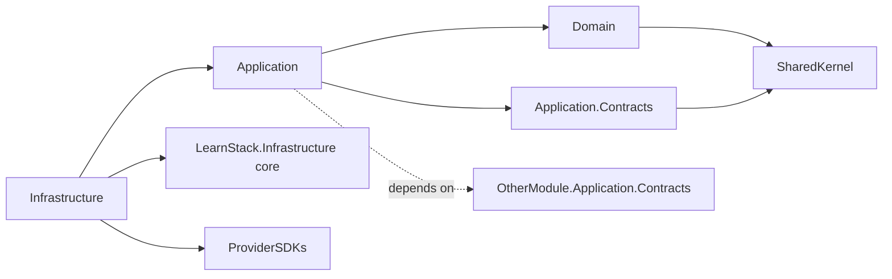

# Scaffolding a new backend module

## Purpose

Stand up a new modular-monolith module that complies with
[03-module-boundaries.md](../../../docs/architecture/03-module-boundaries.md) and
[01-architecture-standards.md](../../../docs/standards/01-architecture-standards.md)
out of the gate: four packages, the right project references, the composition-root
registration, a permission matrix, an audit matrix and its catalogue source, and a
place for the module's EF DbContext.

## When to use

- A new platform capability genuinely warrants its own module (rare).
- The capability fits one of the named modules in
  [03-module-boundaries.md § Module Map](../../../docs/architecture/03-module-boundaries.md);
  use that name, not a new one.

## When not to use

- The capability is an aggregate inside an existing module. Add the aggregate, not a
  new module.
- The capability is domain-specific (English-learning vocabulary, yoga asanas, …).
  Express it as tenant customization data per
  [ADR-0018](../../../docs/decisions/0018-tenant-driven-customization-model.md).
- You're tempted to name the module `Verticals.*`. Forbidden. Architecture test
  `No_Source_Folder_Named_Verticals` will fail.

## Inputs

| Input | Required | Description |
|-------|----------|-------------|
| Module name | Yes | One of the named modules in 03-module-boundaries. PascalCase. |
| Owns | Yes | Aggregates this module owns. |
| Cross-module dependencies | Yes | Other modules' `Application.Contracts` it will reference. |
| Provider adapters | No | External-boundary interfaces it wraps (if any). |

## Workflow

### Step 1: Confirm the name

Open
[03-module-boundaries.md § Backend Modules](../../../docs/architecture/03-module-boundaries.md).
Your module must appear in that list. If not, **stop**; either fit the work into an
existing module or open an ADR to add a new module to the boundary map.

### Step 2: Create the four projects

```
backend/src/Modules/<Name>/
  LearnStack.Modules.<Name>.Application.Contracts/
    LearnStack.Modules.<Name>.Application.Contracts.csproj
  LearnStack.Modules.<Name>.Application/
    LearnStack.Modules.<Name>.Application.csproj
  LearnStack.Modules.<Name>.Domain/
    LearnStack.Modules.<Name>.Domain.csproj
  LearnStack.Modules.<Name>.Infrastructure/
    LearnStack.Modules.<Name>.Infrastructure.csproj
```

Project references follow the strict graph in
[01-architecture-standards.md § Dependency Direction](../../../docs/standards/01-architecture-standards.md):



`Infrastructure → LearnStack.Infrastructure` (core) is required, not optional: it
carries `TenantScopedDbContext`, the base your module's `DbContext` derives from in
Step 4. The seam lives there rather than in `SharedKernel` because it calls EF
model-building APIs, and SharedKernel's EF reference is sanctioned for Vogen-emitted
converters only. Omit the reference and Step 4's sample does not compile — the base
clause is the first thing that fails.

Forbidden references (architecture test will catch them):

- Domain → Application / Infrastructure
- Application → Infrastructure
- Module A → Module B.Domain
- Module A → Module B.Infrastructure

### Step 3: Register the module's services

> **`IModule` does not exist.** No type by that name is in `backend/src`, no packet in
> Phase 02a ships one, and neither does anything named `AddMediatRFromModule`,
> `IModule.RegisterAuditDefaults()` or a `modules.Add(...)` call site. The glossary
> entry describes an intended shape; do not write code against it. Two real seams
> replace it:
>
> - **Handlers and validators** are registered today by passing the module's assembly
>   marker to `AddLearnStackMediatRPipeline(params Assembly[])` from the composition
>   root — one call, all modules, and it registers the validators from the same
>   assemblies.
> - **The audit catalogue** is a module-owned `IAuditCatalogSource` discovered from DI,
>   landing with **Phase 02a Packet 9** per
>   [ADR-0044 § 6](../../../docs/decisions/0044-audit-write-path.md). It is not a method
>   on a module-loading interface. The merged `IAuditCatalog` that `AuditLogBehavior`
>   injects is composition-root machinery built once at startup from every source; a
>   module author never writes one, and must not re-merge the sources per request.
>
> `IPermissionRegistry` lands later still, with the Identity module in
> [Phase 03](../../../docs/roadmap/phase-03-identity-admin.md) — see the note at the
> top of [docs/modules/tenancy/permissions.md](../../../docs/modules/tenancy/permissions.md).
> `AddModuleDbContext<T>` **does** exist and the warning below it is live today.

Composition root (`LearnStack.Api/Program.cs` and its `Composition/` extensions):

```csharp
// Handlers + validators for every module, one call.
services.AddLearnStackMediatRPipeline(
    typeof(LearnStack.Modules.<Name>.Application.AssemblyMarker).Assembly,
    /* … the other module markers … */);

// Provider adapters the module needs — the composition root picks the adapter,
// the module never branches on DeploymentMode.
// services.AddScoped<I<Name>Provider, <Name>Provider>();
```

And, from Packet 9, the module's audit catalogue — one class in the module's
`Application` project, registered like any other DI service
(see [add-audit-coverage](../add-audit-coverage/SKILL.md)):

```csharp
services.AddSingleton<IAuditCatalogSource, <Name>AuditCatalogSource>();
```

**The `DbContext` registration is a composition-root concern, not a module one.**
`AddModuleDbContext<T>` lives in `LearnStack.Infrastructure.Persistence`, and
`Application` may not reference `Infrastructure` — so the call belongs beside the
others in `AddLearnStackPersistence`
(`LearnStack.Api/Composition/PersistenceCompositionExtensions.cs`):

```csharp
services.AddModuleDbContext<<Name>DbContext>();
```

Not `AddDbContext(o => o.UseNpgsql(connectionString))`. A context that opens its
own connection never saw the `SET LOCAL` the ambient transaction carries, so every
read through it returns **zero rows** under the corrected RLS policy — silently.
Per [ADR-0040](../../../docs/decisions/0040-ambient-unit-of-work.md) every module
context is built on the connection `IUnitOfWork` owns, and
`Module_DbContexts_Enlist_In_The_Ambient_UnitOfWork` fails the build if you reach
for the EF default instead — from both sides: the registration, and the fact that
only three files under `backend/src` may mention `UseNpgsql` at all.

That one call site is also how the audit capture reaches your context. From Packet 9
`AddModuleDbContext` resolves `IEnumerable<ISaveChangesInterceptor>` from the provider
and attaches `AuditChangeTrackerInterceptor` beside the shipped
`TenantContextGuardInterceptor`. Registering an interceptor in DI **alone does not
attach it** — measured on EF Core 10 against this repository's hand-built options shape —
so a context registered any other way is a context whose writes are never captured.

### Step 4: Module DbContext

In `LearnStack.Modules.<Name>.Infrastructure/Persistence/<Name>DbContext.cs`:

```csharp
// `ModuleDbContextRegistration` builds every module context with
// `ActivatorUtilities.CreateInstance<TContext>(provider, options)`, which passes the
// options explicitly and resolves every other constructor parameter from DI — which
// is how the accessor below arrives. `Module_DbContexts_Enlist_In_The_Ambient_UnitOfWork`
// still forbids registering the context any other way. This is the shape the one
// shipped context carries.
public sealed class <Name>DbContext(
    DbContextOptions<<Name>DbContext> options, ITenantContextAccessor accessor)
    : TenantScopedDbContext(options, accessor)
{
    // The base owns the two members the filters close over and applies one to
    // every entity implementing ITenantOwned / IOrganizationScoped. Do not write
    // a filter here, and never from an IEntityTypeConfiguration: a configuration
    // reached by ApplyConfigurationsFromAssembly cannot close over the context
    // instance, and a filter whose closure root is anything else is constant-
    // folded into EF's cached model as a SQL literal. There is no
    // TenantQueryFilterConvention either; that type has never existed.
    //
    // The accessor rather than an injected ITenantContext: that contract is
    // registered transient and resolved from this same accessor, so a context
    // holding one freezes whatever the accessor held at construction.

    protected override void OnModelCreating(ModelBuilder modelBuilder)
    {
        modelBuilder.ApplyConfigurationsFromAssembly(typeof(<Name>DbContext).Assembly);

        // AFTER the configurations, so every entity type is in the model when the
        // base sweeps it. Forgetting this call loses every filter, silently.
        base.OnModelCreating(modelBuilder);
    }
}
```

Packet 7 step 3 settled how the accessor arrives: `ModuleDbContextRegistration`
switched to `ActivatorUtilities.CreateInstance<TContext>(provider, options)`, so DI
resolves it. The **accessor** and not an injected `ITenantContext`, and that is the
load-bearing half — the context contract is registered transient and resolved from
this same accessor, so a context holding one freezes whatever the accessor held at
construction and never moves again. Measured: a context built under tenant A kept
filtering to A after the accessor moved to B.

Per [05-database.md](../../../docs/standards/05-database.md), one `DbContext` per
module — not one global.

`ApplyConfigurationsFromAssembly` also **silently skips** a configuration class
that has constructor arguments — no exception, no log, the entity mapped by
convention with no filter at all — so `<Name>Configuration(ITenantContext ctx)`
disappears rather than failing. That is the second reason the filter is not a
configuration's job. See
[add-tenant-owned-entity Step 2](../add-tenant-owned-entity/SKILL.md).

### Step 5: Architecture test fixture

The dependency-direction and cross-module rules live in
`backend/tests/LearnStack.Tests.Architecture/ModuleDependencyTests.cs`. Both are
`[Theory]`-driven from the literal `ModuleNames` array in that file, not scanned —
**add `<Name>` to that array**. Until you do, the new module's `Domain` assembly is
never inspected and both rules pass vacuously. What is still owed is
`Every_Module_Has_An_AuditCoverage_Matrix`, registered in
[21-architecture-tests-catalogue.md](../../../docs/standards/21-architecture-tests-catalogue.md)
and **awaiting backfill in Packet 9** with the audit catalogue it reads. Until it
exists, the two matrix files below are a review check rather than a test.

### Step 6: Module spec files

Per [13-documentation.md § Per-Module Specifications](../../../docs/standards/13-documentation.md),
create the spec files under `docs/modules/<name>/`:

- `README.md` with an `## Overview` section — what the module owns and does not
  own. (The standard names the *section*, not a filename; the one shipped spec,
  `docs/modules/tenancy/README.md`, is the model.)
- `audit.md` — audit-coverage matrix, each row carrying the
  `{module}.{resource}.{verb}` operation slug its `IAuditCatalogSource` registers,
  plus a `(planned)` marker on rows classified ahead of the command that will raise
  them and `(off-path)` on operations that are not MediatR requests (use the
  [add-audit-coverage](../add-audit-coverage/SKILL.md) skill; the matrix and the
  catalogue are checked against each other by
  `Every_TenantOwned_Command_HasAuditCoverage`, in the two directions that skill's
  Step 1 sets out).
- `permissions.md` — permission matrix (use the
  [add-permission](../add-permission/SKILL.md) skill).
- ER diagram, state diagrams, integration-event catalogue per the standard.

### Step 7: Wire migrations

Module migrations live with the module:

> `dotnet ef migrations add` needs `ConnectionStrings__Migration` exported into
> the process environment first — the design-time factory reads it and nothing
> else, and `--connection` does not satisfy it. See
> [add-ef-migration Step 1](../add-ef-migration/SKILL.md) for the one-line export;
> `make migrate` does the same thing for applying them.

```bash
# INTENT ONLY, snake_case: EF prepends the UTC timestamp, producing the
# <UTC_yyyyMMddHHmmss>_<intent> filename Standards 05 specifies.
dotnet ef migrations add create_<name>_schema \
  --project backend/src/Modules/<Name>/LearnStack.Modules.<Name>.Infrastructure \
  --startup-project backend/src/LearnStack.Api \
  --output-dir Persistence/Migrations
```

See [add-ef-migration](../add-ef-migration/SKILL.md) for migration conventions
(RLS, partitioning, naming).

## Validation

- `dotnet build` succeeds for all four projects.
- `LearnStack.Tests.Architecture` is green; specifically the two rules that
  actually run, `ModuleDomain_DoesNotDependOn_OtherModuleDomain` and
  `ModuleDomain_DoesNotDependOn_AnyApplicationOrInfrastructure`, for `<Name>`.
- `dotnet ef migrations script` for the module shows the expected baseline schema.
- The module appears in [03-module-boundaries.md](../../../docs/architecture/03-module-boundaries.md)
  module map and in [docs/glossary.md](../../../docs/glossary.md) if it owns any
  glossary-worthy terms.

## Common pitfalls

- **Naming the module after a domain.** Forbidden by ADR-0018. Use the generic name
  from the boundary map.
- **Putting EF entities in `Application`.** They live in `Domain`. EF configurations
  live in `Infrastructure`.
- **Skipping the contracts package.** Other modules must reference the contracts,
  never the full application — the contracts package is what makes service
  extraction reversible.
- **Cross-module EF navigation properties.** Use id references only; cross-module
  reads go through repository contracts or read-model projections.
- **Forgetting the module's assembly marker in the composition root.** The module
  builds, MediatR scans nothing, and no handler and no validator runs; takes hours to
  diagnose.
- **Writing code against `IModule`.** The type does not exist. Register through
  `AddLearnStackMediatRPipeline` and an `IAuditCatalogSource`; a module-loading
  interface is not what Phase 02a ships.
- **Missing `docs/modules/<name>/` spec files.** Nothing fails.
  `Every_Module_Has_An_AuditCoverage_Matrix` is Registered against Packet 9 and
  there is no permission-matrix rule at all, so review is the only gate until then.
