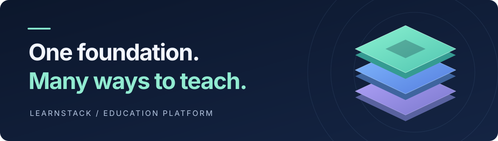

<h1 align="center">LearnStack</h1>

<p align="center">
  <strong>A shared platform for education businesses that teach live.</strong>
</p>

<p align="center">
  <a href="https://github.com/HodeTech/LearnStack/actions/workflows/ci.yml"></a>
</p>



<p align="center">
  <a href="#what-it-does">Product vision</a> ·
  <a href="#where-it-is-today">Current status</a> ·
  <a href="#quickstart">Quickstart</a> ·
  <a href="#how-it-fits-together">Architecture</a> ·
  <a href="#where-to-start">Documentation</a>
</p>

LearnStack is being built as a **white-label platform for multi-branch education
businesses**. A language school, a yoga studio and a music school share one codebase
and database schema, while keeping their own content, branding and tenant boundaries.
The product design supports a platform subdomain and optional custom domains; a
business does not need to bring its own domain.

The difference between those businesses lives in
[tenant customization data](docs/architecture/32-tenant-customization-model.md).
The [platform vision](docs/architecture/01-platform-vision.md) defines the scope and
the boundary between customization and capabilities that require platform code.

> **Under active development.** The backend foundation and Education schema are
> implemented. The first working browser experience is the current milestone;
> authentication, enrolment, payments and live teaching are still ahead.
> See [current status](#where-it-is-today) before trying the local scaffold.

## What it does

The product vision connects discovery, course content and live teaching in one place.
Three surfaces serve the people on each side of that experience:

| Surface | Who it serves | Intended experience |
|---|---|---|
| **Public site** | Visitors and prospective learners | Discover a school, browse its catalog and explore its content. |
| **Admin Studio** | Institution staff and instructors | Author content, manage people and organize teaching. |
| **Learner portal** | Enrolled learners | Work through lessons, track progress and join live sessions. |

These are planned product capabilities. Today, the frontend contains route scaffolds
for all three surfaces; the status below separates delivered foundations from the
remaining product work.

**Built for different ways of teaching.** Content types and level taxonomies already
have a validated customization model. The wider design covers page blocks, lesson
items, rules, custom fields and notification templates; their delivery is tracked in
[the roadmap](docs/roadmap/README.md). Institutions and their branches follow the
[Tenant / Organization model](docs/decisions/0017-tenant-organization-hierarchy.md).

## Where it is today

**Phase 01 and Phase 02a are complete. Phase 02d is in progress.**
[P02d-1](docs/roadmap/phase-02d-walking-skeleton.md) delivers the Education domain,
schema and isolation proofs. **P02d-2** owns course and lesson command handlers and
seed writes; **P02d-4** owns anonymous public API reads. Browser rendering follows
in P02d-5–7.

| Area | Delivered now | Next milestone |
|---|---|---|
| **Tenancy** | Tenant provisioning, organizations, host resolution and database isolation | User membership and permissions in [Phase 03](docs/roadmap/phase-03-identity-admin.md) |
| **Customization** | Content types, level taxonomies, payload validation and built-in seeds | Remaining authoring capabilities across [Phases 04–08a](docs/roadmap/README.md) |
| **Audit** | Classified write path and transactional durability for business changes | Operational hardening in [Phase 11](docs/roadmap/phase-11-production-hardening.md) |
| **Education** | Course and Lesson aggregates, translations, migrations and isolation tests | Commands, seeded content and public reading in [P02d-2–4](docs/roadmap/phase-02d-walking-skeleton.md) |
| **API foundation** | Error contracts, validation, tenancy, concurrency and observability infrastructure | Authentication and durable event processing in [Phase 02b](docs/roadmap/phase-02b-events-auth.md) |
| **Frontend** | Next.js app and public / studio / portal route scaffolds | First two-tenant browser demo in [P02d-5–7](docs/roadmap/phase-02d-walking-skeleton.md) |

**Four modules contain domain implementations:** Tenancy, Customization, Audit and
Education. Identity, Content and Media remain scaffolded.

The subsequent product milestones are CMS and media ([04](docs/roadmap/phase-04-cms-media-pages.md)),
the full course catalog ([05](docs/roadmap/phase-05-education-learning-content.md)),
renderer and Studio ([06](docs/roadmap/phase-06-renderer-admin-studio.md)),
enrolment and progress ([07](docs/roadmap/phase-07-enrollment-learner-portal.md)),
assessment and notifications ([08a](docs/roadmap/phase-08a-assessment-notifications.md)),
scheduling ([08b](docs/roadmap/phase-08b-scheduling.md)),
live classroom ([08c](docs/roadmap/phase-08c-classroom.md)),
and billing ([09](docs/roadmap/phase-09-billing-integrations-analytics.md)).
The [roadmap dependency map](docs/roadmap/README.md) owns the order: **02d runs before
02b**, despite the filenames.

## Quickstart

### 1. Prepare the tools

Use Docker with **Compose V2**, Git, Make, Bash, Python 3 and curl, plus:

| Tool | Repository requirement |
|---|---|
| .NET SDK | `10.0.112` with the roll-forward policy in [backend/global.json](backend/global.json) |
| Node.js | `>=20.11.0`, as declared in [frontend/package.json](frontend/package.json) |
| pnpm | `9.12.3`, pinned in [frontend/package.json](frontend/package.json) |

### 2. Bootstrap from the repository root

```bash
make install   # create .env if absent, restore dependencies, install git hooks
make seed      # start infrastructure, apply migrations, seed two demo tenants
```

The seed provisions `demo-english` and `demo-yoga`, their organizations and host
mappings, plus built-in content-type and taxonomy definitions. **It does not yet seed
courses or lessons**; P02d-2 owns those writes.

### 3. Start the applications in separate terminals

`make seed` starts infrastructure. The API and web app run separately on your host.
The API needs the application connection string from `.env`; it does not load that
file automatically. From the repository root:

```bash
# Terminal 1 — read only the application credential, then start the API.
export ConnectionStrings__Default="$(sed -n 's/^ConnectionStrings__Default=//p' .env \
  | tail -1 | tr -d '\r' | sed "s/^['\"]//; s/['\"]$//")"
(cd backend && dotnet run --project src/LearnStack.Api)
```

```bash
# Terminal 2 — start the frontend.
(cd frontend && pnpm dev)
```

The API's liveness endpoint is <http://localhost:5080/healthz>; the frontend scaffold
is at <http://localhost:3000>. The application connection uses `learnstack_app`;
`make migrate` manages the separate migration credential. See
[local setup](.claude/skills/local-dev-setup/SKILL.md) for the persistent user-secrets
alternative and [Compose documentation](infra/compose/README.md) for service endpoints
and troubleshooting.

> **The two-site browser demo is not available yet.** The seed currently registers
> `demo-english.learnstack.local` and `demo-yoga.learnstack.local`.
> [Phase 02d gates G32 and G45](docs/roadmap/phase-02d-walking-skeleton.md#the-decision-register)
> own the final host setup and demo command. The frontend's production tenant-resolution
> guard currently returns `503`; a successful build is not a production-ready site.

### Everyday commands

| Command | Purpose |
|---|---|
| `make help` | List available tasks. |
| `make dev` | Start the default local infrastructure. |
| `make migrate` | Apply platform and module migration chains. |
| `make test` | Restore dependencies and run backend and frontend suites; Docker is required. |
| `make lint` | Check backend formatting and frontend lint rules. |
| `make down` | Stop infrastructure while preserving its data volumes. |

The service inventory and optional `gated` profile live in
[infra/compose/README.md](infra/compose/README.md).

## How it fits together

**A modular monolith:** one ASP.NET Core host, explicit module boundaries and a
PostgreSQL database with a `DbContext` per module. One Next.js application holds the
three product surfaces. See the
[technical architecture](docs/architecture/04-technical-architecture.md) and
[cross-module contracts](docs/architecture/10-cross-module-contracts.md).

| Layer | Choice | Current scope |
|---|---|---|
| Backend | .NET 10 · ASP.NET Core · EF Core · MediatR | Foundation and four domain modules implemented |
| Database | PostgreSQL 18 | Migrations, tenant / organization RLS and integration proofs |
| Frontend | Next.js 15 · React 19 · TypeScript | App and shared packages scaffolded |
| Observability | OpenTelemetry · Serilog → OTLP | Cross-cutting backend instrumentation implemented |
| Identity | Keycloak | Local realms configured; application authentication belongs to Phase 02b |
| Storage and search | SeaweedFS · PostgreSQL full-text search | Selected architecture; feature delivery belongs to Phases 04–05 |
| Live classroom | LiveKit through a provider adapter | Planned in Phase 08c, starting with Cloud and retaining a self-hosted path |

Infrastructure grows against explicit triggers. The running foundation uses
`InProcessEventBus`, `InMemoryCacheService`, `ConfigurationSecretProvider` and
`NullEntitlementProvider`. Adapter ownership and activation conditions live in
[Infrastructure Stack Standards](docs/standards/20-infrastructure-stack.md) and
[ADR-0035](docs/decisions/0035-demand-gated-infrastructure.md).

**Deployment wiring is distinct from product readiness.** `Development` and `SaaS`
have current backend wiring. `Dedicated`, `SelfHostedOnline` and
`SelfHostedAirGapped` are prepared seams pending
[Phase 11](docs/roadmap/phase-11-production-hardening.md).
[LearnStack Hub](https://github.com/HodeTech/LearnStack-Hub) is the separate operator
control plane. Its boundary is explicit: it stores tenant metadata, never tenant
content, and communication goes through named adapters
([ADR-0034](docs/decisions/0034-hub-contract-surface-invariant.md)).

## How this codebase defends itself

- **Isolation reaches the database.** Tenant context, EF query filters and PostgreSQL
  RLS work together. Isolation tests run as `learnstack_app`, the same non-bypass role
  used by the API. [Database standard](docs/standards/05-database.md).
- **Required business audit records commit with their changes.** The business
  transaction owns durability; unclassified operations fail closed.
  [Audit write path](docs/decisions/0044-audit-write-path.md).
- **Architecture claims have executable checks.** Module boundaries, isolation
  conventions and documentation claims are checked against a named
  [test catalogue](docs/standards/21-architecture-tests-catalogue.md).
- **Verification includes failure cases.** The suites exercise planted violations and
  mutations as well as successful paths. CI rejects skipped backend tests; the
  [workflow](.github/workflows/ci.yml) defines the current checks.

## What is in the repository

```text
backend/
  src/            API, shared kernel, infrastructure and domain modules
  tests/          Unit, architecture, contract and integration suites
  analyzers/      LearnStack Roslyn analyzers
frontend/
  apps/web/       Public site, Admin Studio and learner portal scaffolds
  packages/       Shared config, UI and generated API SDK
infra/            Compose stack and service configuration
scripts/          Seed and verification helpers
docs/             Architecture, decisions, standards, roadmap and module specs
```

## Where to start

| Your question | Start here |
|---|---|
| What are we building, and for whom? | [Platform vision](docs/architecture/01-platform-vision.md) · [MVP scope](docs/architecture/05-mvp-scope.md) |
| What works today, and what comes next? | [Roadmap](docs/roadmap/README.md) · [Current phase](docs/roadmap/phase-02d-walking-skeleton.md) |
| How do I contribute? | [Contributing](.github/CONTRIBUTING.md) · [Working agreement](CLAUDE.md) · [Engineering standards](docs/standards/README.md) |
| Why was a decision made? | [ADR index](docs/decisions/README.md) |
| How are institutions isolated? | [Tenant isolation](docs/architecture/09-tenant-isolation.md) · [Tenancy module](docs/modules/tenancy/README.md) |
| How does customization work? | [Customization model](docs/architecture/32-tenant-customization-model.md) · [Module spec](docs/modules/customization/README.md) |
| How are courses and lessons modeled? | [Education module](docs/modules/education/README.md) |
| How is the audit trail built? | [Audit subsystem](docs/architecture/31-audit-subsystem.md) · [Audit module](docs/modules/audit/README.md) |
| What belongs in the Hub? | [Hub architecture](docs/architecture/24-learnstack-hub.md) · [Deployment models](docs/architecture/25-deployment-models.md) |
| What does a term mean here? | [Glossary](docs/glossary.md) |

<details>
<summary><strong>Every architecture document</strong> — browse by topic</summary>

**Strategy and shape** ·
[01 Platform Vision](docs/architecture/01-platform-vision.md) ·
[02 Domain Model](docs/architecture/02-domain-model.md) ·
[03 Module Boundaries](docs/architecture/03-module-boundaries.md) ·
[04 Technical Architecture](docs/architecture/04-technical-architecture.md) ·
[05 MVP Scope](docs/architecture/05-mvp-scope.md) ·
[06 Extension Model](docs/architecture/06-extension-model.md) ·
[11 Extension Points](docs/architecture/11-extension-points.md) ·
[19 MVP Vertical Slice](docs/architecture/19-mvp-vertical-slice.md)

**Platform substrate** ·
[09 Tenant Isolation](docs/architecture/09-tenant-isolation.md) ·
[10 Cross-Module Contracts](docs/architecture/10-cross-module-contracts.md) ·
[15 Events and Outbox](docs/architecture/15-event-and-outbox.md) ·
[28 Platform Tenant + Organization](docs/architecture/28-platform-tenant-organization.md) ·
[31 Audit Subsystem](docs/architecture/31-audit-subsystem.md) ·
[32 Tenant Customization Model](docs/architecture/32-tenant-customization-model.md) ·
[33 Cross-Cutting Concerns](docs/architecture/33-cross-cutting-concerns.md)

**Product surfaces** ·
[12 Localization](docs/architecture/12-localization.md) ·
[13 Identity and Authentication](docs/architecture/13-identity-and-auth.md) ·
[14 Frontend Architecture](docs/architecture/14-frontend-architecture.md) ·
[16 Media Pipeline](docs/architecture/16-media-pipeline.md) ·
[17 Page Builder](docs/architecture/17-page-builder.md) ·
[20 Search](docs/architecture/20-search.md) ·
[21 Feature Flags and Entitlements](docs/architecture/21-feature-flags.md) ·
[23 Data Protection (KVKK / GDPR)](docs/architecture/23-data-protection.md)

**Live classroom** ·
[07 In-App Live Classroom](docs/architecture/07-in-app-live-classroom.md) ·
[08 Cost Model](docs/architecture/08-livekit-cost-model.md) ·
[18 WebRTC Build vs Adopt](docs/architecture/18-webrtc-build-vs-adopt.md)

**Hub, deployment and edge** ·
[22 Custom Domains](docs/architecture/22-custom-domains.md) ·
[24 LearnStack Hub](docs/architecture/24-learnstack-hub.md) ·
[25 Deployment Models](docs/architecture/25-deployment-models.md) ·
[26 Hybrid License Model](docs/architecture/26-hybrid-license-model.md) ·
[27 Custom Domain + TLS](docs/architecture/27-custom-domain-tls.md) ·
[29 Dapr Integration](docs/architecture/29-dapr-integration.md) ·
[30 API Gateway (APISIX)](docs/architecture/30-api-gateway.md)

</details>

### Documentation layout

| Directory | Purpose |
|---|---|
| [`docs/architecture/`](docs/architecture/01-platform-vision.md) | Product and system concepts; browse the complete index above. |
| [`docs/decisions/`](docs/decisions/README.md) | Architectural decisions, their context and consequences. |
| [`docs/standards/`](docs/standards/README.md) | Engineering rules and their enforcement status. |
| [`docs/roadmap/`](docs/roadmap/README.md) | Dependency-ordered phases, decision gates and delivery records. |
| [`docs/modules/`](docs/modules/tenancy/README.md) | Module contracts, permission matrices and audit coverage. |

## Conventions

Documentation is **English**; diagrams use **Mermaid** with a text fallback.
Commits follow **Conventional Commits**. The glossary, ADRs, standards and roadmap
each own their respective facts; other documents link to those sources.
See [Contributing](.github/CONTRIBUTING.md), the
[documentation standard](docs/standards/13-documentation.md) and
[review standard](docs/standards/17-code-review.md) before opening a pull request.
