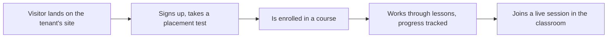

# LearnStack

**A white-label platform for education businesses that teach live.** One binary, one
schema, one set of container images — and a language school, a yoga studio and a music
school each get their own site, their own content shapes and their own vocabulary.

What differs between them is **tenant customization data loaded at provisioning, not
compiled code** ([ADR-0018](docs/decisions/0018-tenant-driven-customization-model.md)).
There is no `Verticals/` folder, and an architecture test fails the build if one appears.

That claim has a stated edge, and it lives in exactly one place:
[Platform Vision § Genericity boundary](docs/architecture/01-platform-vision.md). Content
shape, presentation and pure rule evaluation are tenant data. Stateful entitlement —
credit packs, session quotas — and external capability invocation — running submitted
code, scoring speech — are platform features gated by plan. They need a release, not a
customization row.

---

## What it does

An education business that teaches live needs more than a course list. It needs a public
site it can edit, a catalog that reflects what it actually sells, a way to enrol people
and track what they finished, a room to teach in, and a schedule behind it. LearnStack is
that whole path, once, for every tenant on it.



Each tenant gets three surfaces, served by one deployment:

- **The public site** — landing pages, catalog and lesson pages, built from content the
  tenant authors and rendered from its own branding tokens.
- **Admin Studio** — where staff write that content, define their own shapes, manage
  people and watch what happened.
- **The learner portal** — enrolment, progress, assessments, and the in-app live
  classroom with attendance and optional consent-aware recording.

Four roles, scoped per tenant and per organization: `tenant-admin`, `editor`,
`instructor`, `learner`. A tenant may be one school or a chain of branches — an
**organization** is a sub-unit inside a tenant, and the isolation model treats it as a
first-class boundary rather than a filter someone remembers to apply
([ADR-0017](docs/decisions/0017-tenant-organization-hierarchy.md)).

### What a tenant authors as data, not as code

This is the part that makes one binary serve unrelated businesses. A tenant declares its
own **content types**, **page blocks**, **lesson item types**, **level taxonomy**,
**scoring rules**, **completion rules**, **custom fields** and **notification
templates** — each a JSON Schema or a sandboxed expression, validated before a row is
written ([ADR-0043](docs/decisions/0043-customization-payload-validation.md)).

CEFR levels, a vocabulary card, a placement test that recommends a level, kyu/dan ranks,
an asana catalog: all of them are rows. None of them is a branch in any module. When a
yoga studio and an English school render different sites from the same deployment, that
is the mechanism doing its job — and
[Phase 10](docs/roadmap/phase-10-english-learning-mvp.md) is the showcase that fills all
eight aggregates at once for a single tenant, not the proof that it works.

---

## Quickstart

```bash
make install   # one-time per clone: dependencies + git hooks
make dev       # bring the local stack up (Postgres, Keycloak, SeaweedFS, …)
make migrate   # apply the platform + module migration chains
make seed      # write the two demo tenants through the real command path
```

`make help` lists every target. `make test` runs the whole suite — unit, architecture,
contract and the Docker-bound integration tests — and it installs what it is about to run.

The seed writes two tenants in unrelated domains, each reachable on its own host:

| Tenant | Host | Shape |
|---|---|---|
| `demo-english` | `demo-english.learnstack.local` | Online English school |
| `demo-yoga` | `demo-yoga.learnstack.local` | Yoga studio |

Add both to `/etc/hosts` pointing at `127.0.0.1`. They are not a demo fixture: they are
written through `ProvisionTenantCommand` and the same handlers a request uses, so
`make seed` exercises the production path rather than a second one. From
[Phase 02d](docs/roadmap/phase-02d-walking-skeleton.md) they render side by side in a
browser — which is how the genericity claim is tested continuously rather than asserted
once at the end.

---

## Where it is today

**The platform kernel is finished; the product layers land on top of it.** What runs today
is multi-tenancy with real isolation, the customization foundation, the audit trail, and
the API conventions everything else is built against. What does not run yet is every
learner-facing surface — there are no users, no courses and no classroom in this
repository right now, and the documentation says so wherever it describes them.

| Capability | Phase | State |
|---|---|---|
| Multi-tenancy, organizations, isolation to the database row | [02a](docs/roadmap/phase-02a-kernel-tenancy.md) | **Running** |
| Tenant customization foundation — content types and level taxonomy | [02a](docs/roadmap/phase-02a-kernel-tenancy.md) | **Running** (2 of the 8 aggregates) |
| Audit trail, written inside the business transaction | [02a](docs/roadmap/phase-02a-kernel-tenancy.md) | **Running** |
| API conventions, entitlement socket, foundation ports | [02a](docs/roadmap/phase-02a-kernel-tenancy.md) | **Running** |
| Two tenants rendering their own sites, side by side | [02d](docs/roadmap/phase-02d-walking-skeleton.md) | **Next** |
| Authentication, sessions, events | [02b](docs/roadmap/phase-02b-events-auth.md) | Planned |
| Users, roles, permissions, admin foundation | [03](docs/roadmap/phase-03-identity-admin.md) | Planned |
| Headless CMS, page builder, media library | [04](docs/roadmap/phase-04-cms-media-pages.md) | Planned |
| Course catalog and learning content | [05](docs/roadmap/phase-05-education-learning-content.md) | Planned |
| Public site renderer and Admin Studio | [06](docs/roadmap/phase-06-renderer-admin-studio.md) | Planned |
| Enrolment, learner portal, progress | [07](docs/roadmap/phase-07-enrollment-learner-portal.md) | Planned |
| Assessment, notifications, background jobs | [08a](docs/roadmap/phase-08a-assessment-notifications.md) | Planned |
| Scheduling and booking | [08b](docs/roadmap/phase-08b-scheduling.md) | Planned |
| In-app live classroom | [08c](docs/roadmap/phase-08c-classroom.md) | Planned |
| Billing, integrations, analytics | [09](docs/roadmap/phase-09-billing-integrations-analytics.md) | Planned |
| Production hardening and the demand-gated adapters | [11](docs/roadmap/phase-11-production-hardening.md) | Planned |

The order is dependency-driven, not numeric — [the roadmap](docs/roadmap/README.md) is
authoritative, and it explains why `02d` runs before `02b`. Every phase document carries
the same six sections, and a shipped one carries a delivery record listing what it built
**and the defects it introduced and caught in its own review rounds**.

Three modules hold domain code today — **Tenancy**, **Customization** and **Audit**. The
other four module assemblies are scaffolded and empty.

---

## How this codebase defends itself

Most of the interesting engineering here is not a feature. It is the machinery that stops
a plausible change from quietly breaking an invariant.

**Tenant isolation is defense in depth, from the first migration.** Every tenant-owned
table carries a tenant column, an EF Core query filter, and a PostgreSQL Row Level
Security policy under `ENABLE` **and** `FORCE` — plus an integration test that connects as
`learnstack_app`, the application's own `NOBYPASSRLS` role, because a test that runs as
the table owner passes even when every policy is inert. The canonical policy template is
written as SQL in exactly one document,
[Database Standards](docs/standards/05-database.md); an earlier copy of it lived in four
and was wrong in all four.

**MUST-class audit commits with the change it describes.** Not "the same `SaveChanges`" —
the same *transaction*, which is what a reader of `audit_log` actually observes
([ADR-0033](docs/decisions/0033-audit-durability-model.md)). An operation the catalogue
does not classify is rejected rather than silently unaudited.

**The rules the documentation states are the rules that run.** The
[architecture-test catalogue](docs/standards/21-architecture-tests-catalogue.md) is the
canonical list, and it is checked against the suite rather than trusted: an entry that
reports a rule *Implemented* must name a test method that exists, no test may be skipped,
and the counts the catalogue publishes about itself are recomputed by a test — because
the first version of those counts was wrong in the commit that wrote them.

**Every rule ships with a companion that proves it can fail.** The lesson the review
rounds kept repeating is *a rule that cannot tell clean from blind*: a guard passes
because nothing violates it, and nobody has checked that its mechanism works at all. So a
scan is fed a planted violation, and a behavioural claim is mutation-checked — break the
production code on purpose, watch the test go red, put it back.

---

## What is in the repository

```
backend/
  src/            LearnStack.{Api,Domain,Application,Infrastructure*,SharedKernel} + Modules/
  tests/          Unit · Architecture · Contract · Integration (Testcontainers)
  analyzers/      LearnStack.Analyzers — the LS0001 Roslyn rule
frontend/
  apps/web        Next.js 15 App Router — the one application
  packages/       config · ui · sdk (generated from the API's OpenAPI document)
infra/
  compose/        the local dev stack, plus the gated profile and the e2e overlay
  keycloak/ …     per-service configuration
docs/             architecture · decisions · standards · roadmap · modules · glossary
scripts/          seed.sh and the CI helpers
```

`docs/` is not an afterthought here — it is where the decisions live, and the code is
expected to agree with it. See [CLAUDE.md](CLAUDE.md) for the working agreement every
contributor (and every agent) follows.

---

## The stack

| Layer | Choice | Notes |
|---|---|---|
| Backend | .NET 10 · ASP.NET Core · EF Core · MediatR | Modular monolith, four cross-module mechanisms and no fifth ([ADR-0010](docs/decisions/0010-cross-module-communication.md)) |
| Database | PostgreSQL 18 | RLS from day one, four database roles, one canonical policy template ([ADR-0003](docs/decisions/0003-tenant-isolation-defense-in-depth.md)) |
| Frontend | Next.js 15 · TypeScript · React | One app with route segments for public, studio and portal ([ADR-0009](docs/decisions/0009-frontend-single-app-first.md)) |
| Identity | Keycloak, self-hosted | Two realms: `learnstack` for tenant users, `learnstack-hub` for operators |
| Live classroom | LiveKit OSS, self-hosted | Cloud available behind the same `ILiveClassProvider`; a custom SFU is out of scope ([ADR-0005](docs/decisions/0005-live-classroom-media-stack.md)) |
| Storage · Search | SeaweedFS · PostgreSQL FTS | S3-compatible in production; Meilisearch behind `ITenantSearch` when scale requires it |
| Observability | OpenTelemetry · Serilog → OTLP | Spans enriched centrally; module code never tags a tenant id ([ADR-0032](docs/decisions/0032-exception-handling-logging-and-observability.md)) |

**Vendor adapters are demand-gated.** Each has a seam that ships today, an owning phase and
a **written trigger condition** in
[ADR-0035](docs/decisions/0035-demand-gated-infrastructure.md); a building block missing any
of those is not demand-gated, it is missing. Most seams are a port in
`LearnStack.SharedKernel` with a working default — `IEventBus` / `InProcessEventBus` for
Kafka, `ICacheService` / `InMemoryCacheService` for Valkey, `ISecretProvider` /
`ConfigurationSecretProvider` for Vault, `IEntitlementProvider` / `NullEntitlementProvider`
for the Hub. Not all of them are: APISIX's seam is the composition root, and `audit_log`
partitioning is schema-internal.
[Infrastructure Stack Standards § Demand-gated](docs/standards/20-infrastructure-stack.md)
is the table that maps each one, and it is the authority.

**One binary, five `DeploymentMode` values, two of them wired.** `Development` and `SaaS`
run end to end. `Dedicated`, `SelfHostedOnline` and `SelfHostedAirGapped` are **prepared
seams, not supported deployments**, until
[Phase 11](docs/roadmap/phase-11-production-hardening.md) builds their adapters and suites.
The three *production* categories those values serve are SaaS, Dedicated and Self-Hosted
([ADR-0020](docs/decisions/0020-triple-deployment-hybrid-license.md),
[25 — Deployment Models](docs/architecture/25-deployment-models.md)).

SaaS and Dedicated are backed by **LearnStack Hub**, a separate control plane repository
([ADR-0019](docs/decisions/0019-learnstack-hub.md),
[GitHub](https://github.com/HodeTech/LearnStack-Hub)). It is expected at
`../LearnStack-Hub` so the cross-repository links resolve, and it owns its own roadmap.
This repository holds only LearnStack's side of the boundary, in
[Phase 02c](docs/roadmap/phase-02c-hub-foundation.md). The contract is governed by two
invariants — the Hub stores no tenant content, and every crossing goes through a named
adapter ([ADR-0034](docs/decisions/0034-hub-contract-surface-invariant.md)).

---

## Where to start

| If you want to… | Read |
|---|---|
| Understand what this is and why | [Platform Vision](docs/architecture/01-platform-vision.md) → [MVP Scope](docs/architecture/05-mvp-scope.md) |
| See what is being built next | [Roadmap](docs/roadmap/README.md) → [Phase 02d](docs/roadmap/phase-02d-walking-skeleton.md) |
| Contribute code | [CLAUDE.md](CLAUDE.md) → [Engineering principles](docs/standards/00-principles.md) → [Standards index](docs/standards/README.md) |
| Know why something was decided | [ADR index](docs/decisions/README.md) |
| Understand the technical shape | [Technical Architecture](docs/architecture/04-technical-architecture.md) → [Module Boundaries](docs/architecture/03-module-boundaries.md) → [Cross-Module Contracts](docs/architecture/10-cross-module-contracts.md) |
| Understand tenancy | [Tenant Isolation](docs/architecture/09-tenant-isolation.md) → [Platform Tenant + Organization](docs/architecture/28-platform-tenant-organization.md) → [Tenancy module spec](docs/modules/tenancy/README.md) |
| Understand customization | [Tenant Customization Model](docs/architecture/32-tenant-customization-model.md) → [Customization module spec](docs/modules/customization/README.md) |
| Understand the audit trail | [Audit Subsystem](docs/architecture/31-audit-subsystem.md) → [Audit module spec](docs/modules/audit/README.md) → [ADR-0044](docs/decisions/0044-audit-write-path.md) |
| Understand the Hub boundary | [LearnStack Hub](docs/architecture/24-learnstack-hub.md) → [Deployment Models](docs/architecture/25-deployment-models.md) → [Hybrid License Model](docs/architecture/26-hybrid-license-model.md) |
| Look up a term | [Glossary](docs/glossary.md) |

<details>
<summary><strong>Every architecture document</strong> — 33 of them, grouped</summary>

**Strategy and shape** ·
[01 Platform Vision](docs/architecture/01-platform-vision.md) ·
[02 Domain Model](docs/architecture/02-domain-model.md) ·
[03 Module Boundaries](docs/architecture/03-module-boundaries.md) ·
[04 Technical Architecture](docs/architecture/04-technical-architecture.md) ·
[05 MVP Scope](docs/architecture/05-mvp-scope.md) ·
[06 Extension Model](docs/architecture/06-extension-model.md) ·
[11 Extension Points](docs/architecture/11-extension-points.md) ·
[19 MVP Vertical Slice](docs/architecture/19-mvp-vertical-slice.md)

**Platform substrate** ·
[09 Tenant Isolation](docs/architecture/09-tenant-isolation.md) ·
[10 Cross-Module Contracts](docs/architecture/10-cross-module-contracts.md) ·
[15 Events and Outbox](docs/architecture/15-event-and-outbox.md) ·
[28 Platform Tenant + Organization](docs/architecture/28-platform-tenant-organization.md) ·
[31 Audit Subsystem](docs/architecture/31-audit-subsystem.md) ·
[32 Tenant Customization Model](docs/architecture/32-tenant-customization-model.md) ·
[33 Cross-Cutting Concerns](docs/architecture/33-cross-cutting-concerns.md)

**Product surfaces** ·
[12 Localization](docs/architecture/12-localization.md) ·
[13 Identity and Authentication](docs/architecture/13-identity-and-auth.md) ·
[14 Frontend Architecture](docs/architecture/14-frontend-architecture.md) ·
[16 Media Pipeline](docs/architecture/16-media-pipeline.md) ·
[17 Page Builder](docs/architecture/17-page-builder.md) ·
[20 Search](docs/architecture/20-search.md) ·
[21 Feature Flags and Entitlements](docs/architecture/21-feature-flags.md) ·
[23 Data Protection (KVKK / GDPR)](docs/architecture/23-data-protection.md)

**Live classroom** ·
[07 In-App Live Classroom](docs/architecture/07-in-app-live-classroom.md) ·
[08 Cost Model](docs/architecture/08-livekit-cost-model.md) ·
[18 WebRTC Build vs Adopt](docs/architecture/18-webrtc-build-vs-adopt.md)

**Hub, deployment and edge** ·
[22 Custom Domains](docs/architecture/22-custom-domains.md) ·
[24 LearnStack Hub](docs/architecture/24-learnstack-hub.md) ·
[25 Deployment Models](docs/architecture/25-deployment-models.md) ·
[26 Hybrid License Model](docs/architecture/26-hybrid-license-model.md) ·
[27 Custom Domain + TLS](docs/architecture/27-custom-domain-tls.md) ·
[29 Dapr Integration](docs/architecture/29-dapr-integration.md) ·
[30 API Gateway (APISIX)](docs/architecture/30-api-gateway.md)

</details>

### Documentation layout

| Directory | Holds | Mutability |
|---|---|---|
| [`docs/architecture/`](docs/architecture/01-platform-vision.md) | What we are building, conceptually — 33 numbered documents | Editable as the system evolves |
| [`docs/decisions/`](docs/decisions/README.md) | ADRs: one-time decisions with context and consequences | Accepted ADRs change only by dated Amendment or the two bounded corrections in [ADR-0041](docs/decisions/0041-correcting-false-statements-in-accepted-adrs.md) |
| [`docs/standards/`](docs/standards/README.md) | The rules every PR is held to, 00–21, each labelled `Active` or `Adopted` by what actually enforces it | Editable as the team learns; changes cite an ADR |
| [`docs/roadmap/`](docs/roadmap/README.md) | Phases 00–12, with dependency order that filename order does not imply | Editable per phase; a shipped phase's delivery record is not rewritten |
| [`docs/modules/`](docs/modules/tenancy/README.md) | Per-module specs, with permission and audit matrices | Editable with the module |

---

## Conventions

- **English** for all documentation
  ([ADR-0007](docs/decisions/0007-documentation-language-and-conventions.md)). A tenant's
  Turkish-facing UI is a separate concern.
- **Mermaid** for diagrams, in fenced code blocks, readable as text when unrendered.
- **Conventional Commits**, imperative subject, ≤ 72 characters — enforced by the
  `commit-msg` hook and re-run in CI, which states no grammar of its own.
- **Single source of truth.** The glossary holds terms, ADRs hold decisions, standards
  hold ongoing rules, the roadmap holds phases. A second copy is a copy that will go
  stale — the corpus has the scars to prove it.
- Every pull request is reviewed against [Code Review Standards](docs/standards/17-code-review.md),
  whose zero-tolerance blocker list is short and non-negotiable.
