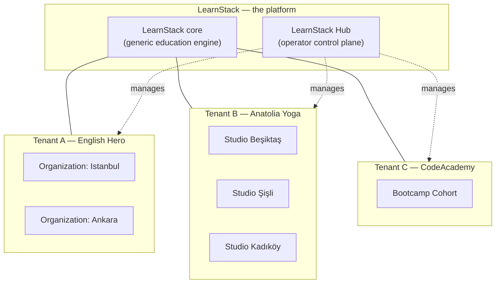

# Platform Vision

LearnStack is a **white-label platform for multi-branch education businesses that teach
live**. Its customer is an education business — a language school with three branches, a
yoga studio with four, a coding bootcamp, a music school — that sells courses, teaches
them partly or wholly in scheduled live sessions, and wants its own brand on its own
domain rather than a listing inside someone else's marketplace. LearnStack is not itself
an education product.

Three properties define the fit. A prospect that has none of them is not the target
customer:

- **Multi-branch.** Campuses, studios, departments, or cohorts that share one brand and
  one catalog but keep their own members, staff, and schedules. This is the
  `Organization` level ([ADR-0017](../decisions/0017-tenant-organization-hierarchy.md)),
  and it is the reason a single-teacher course seller is a poor fit.
- **Teaches live.** Scheduling, booking, attendance, and an in-app live classroom are
  first-class subsystems, not an add-on bolted to a video library.
- **Owns its brand.** Own domain, own design tokens, own locales, own notification
  senders, own catalog — no LearnStack logo in the learner's browser.

What is **not** fixed is the subject those businesses teach. The same code paths serve:

- An online English-learning platform with CEFR levels and placement tests.
- A yoga studio platform with asana taxonomy, sequence-based lessons, and teacher
  scheduling.
- A coding bootcamp with programming-exercise lesson items and automatic grading.
- A music school with score-reading lesson items, MIDI playback, and audio submissions.
- A meditation app with timed practice sessions and habit-streak tracking.
- A driving school with vehicle scheduling and progress-checkpoint workflows.
- An art workshop with portfolio uploads and peer-review assessments.
- A certification body, an exam-prep provider, or a domain not anticipated above.

LearnStack ships **one codebase, one set of container images, one Helm chart** that
serves all of these customers. The differentiator across customers is their **data**
(content, content type definitions, page block schemas, scoring rules, level taxonomies,
custom fields) — not their code. LearnStack engineers never write per-vertical code.
That claim holds inside a stated edge — see
[Genericity boundary](#genericity-boundary) below.

## Product thesis

Education businesses need infrastructure that is:

- **Multi-tenant from the start.** Every customer is a tenant; tenants are isolated at
  every layer (auth, query, storage, search, cache, audit, files).
- **Domain-agnostic.** Yoga and coding and language sit on the same primitives.
- **Customisable without coding.** Customers self-service their content types, page
  blocks, lesson item types, scoring rules, completion rules through Admin Studio —
  data-driven, not code-driven (ADR-0018).
- **Brand-owning.** Each tenant runs on their own domain
  ([27-custom-domain-tls.md](27-custom-domain-tls.md)), with their own branding, locales,
  notification senders.
- **Operationally separable.** LearnStack operators manage tenant lifecycle, billing,
  licensing, custom domains, compliance via a **separate control plane**, LearnStack Hub
  ([24-learnstack-hub.md](24-learnstack-hub.md)).
- **Deployment-flexible.** Same codebase deploys as SaaS, Dedicated (LearnStack-managed
  single-tenant), or Self-Hosted ([25-deployment-models.md](25-deployment-models.md)).
  `Development` and `SaaS` are wired end to end today; the other three `DeploymentMode`
  values are prepared seams until Phase 11 builds their adapters and integration suites
  ([ADR-0035](../decisions/0035-demand-gated-infrastructure.md)).

## The three layers

- **LearnStack core** owns reusable capabilities. Identity, tenancy, organization,
  content, catalog, enrollment, progress, classroom, scheduling, media, notification,
  audit, reporting modules. Every tenant gets the same set of modules; they cannot install
  or uninstall modules. Plan tiers differentiate by **features** within those modules, not
  by module presence (ADR-0021).
- **Tenant** is an independent education platform. Fully isolated. Owns content, users,
  brand, domain. Subscribes to a plan; the plan's features and limits define the tenant's
  entitlement.
- **Organization** is a sub-unit within a tenant — branch, studio, campus, department,
  cohort. Two-level hierarchy strict (ADR-0017). Tenant without explicit orgs has one
  default org auto-created.

See [28-platform-tenant-organization.md](28-platform-tenant-organization.md) for the full
conceptual model.

## Genericity boundary

"The domain is data" is true inside a boundary, and stating the boundary is what keeps
the claim credible. The boundary is drawn in
[ADR-0018 Amendment (2026-08-08)](../decisions/0018-tenant-driven-customization-model.md);
this section is its product-facing statement.

**Inside the boundary — tenant customization data, no LearnStack release required:**

| Dimension | What the tenant declares | Example |
|---|---|---|
| **Content shape** | A `TenantContentType` JSON Schema | A vocabulary card, an asana pose, a grammar topic, a repertoire piece |
| **Presentation** | Which blocks compose a page, which fields a card renders, what the level taxonomy is called | CEFR A1–C2 versus Foundation–Advanced versus kyu/dan |
| **Pure rule evaluation** | A `TenantScoringRule` or `TenantCompletionRule` expression | Map a placement-test answer set to a recommended level; decide a lesson is complete from facts already recorded |

The discriminating property is that all three are **pure functions of tenant data and
already-recorded state**. Nothing in this column holds new state or reaches outside the
process, so a schema plus an evaluator is a complete answer.

**Outside the boundary — platform features, written by LearnStack, gated by plan:**

| Dimension | Example | Why it cannot be a customization row |
|---|---|---|
| **Stateful entitlement** | A ten-session credit pack; "three make-up classes per term"; a per-learner session quota | The tenant needs a balance that is decremented on booking, refunded on cancellation, expired on a schedule, and reconstructible in a dispute. **A JSON Schema declares a shape; it cannot declare a ledger.** |
| **External capability invocation** | Running a learner's submitted program; scoring pronunciation from an audio clip; automated proctoring | The tenant needs a sandbox, a runtime, a resource budget, and a security boundary that survives hostile input. **A rule DSL evaluates; it does not execute arbitrary programs.** |

Said plainly: **a tenant that needs something in the second column needs a LearnStack
release, or an integration with an external provider through an adapter. It does not
need — and cannot have — a customization row.** Sales conversations, plan design, and
roadmap intake all depend on that sentence being said out loud rather than discovered
during implementation.

Two things this boundary does **not** change:

- **The core stays domain-neutral either way.** A credit-pack ledger is not a yoga
  feature and an execution sandbox is not a coding-bootcamp feature. Both are named for
  the capability, never for the domain that first asked for it — the rule
  `Core_Modules_HaveNo_DomainSpecific_Names` enforces the naming mechanically from
  [Phase 02a Packet 10](../roadmap/phase-02a-kernel-tenancy.md).
- **There is still no `Verticals/` folder.** A platform feature is a generic capability
  offered to every tenant and switched on by a `FeatureKey`; it is not a per-vertical
  code package. [ADR-0011](../decisions/0011-extension-points.md) stays superseded.

## Design principles

- **Generic-only core.** No domain-specific code in LearnStack modules. CEFR levels,
  asana taxonomies, and programming-exercise shapes live as **tenant data** (ADR-0018),
  never as `LearnStack.Verticals.*` source code. Where a tenant need falls outside the
  customization model, it becomes a **generically named platform capability** — see
  [Genericity boundary](#genericity-boundary) — not a vertical package.
- **Multi-tenant from day one.** Tenant isolation is non-negotiable; defense-in-depth =
  tenant context + organization filter + EF query filter + RLS + architecture tests
  (ADR-0003 Amendment 1).
- **Modular monolith first.** Clear module boundaries today; service extraction tomorrow
  only when proven necessary. Cross-module communication only through the four sanctioned
  mechanisms (ADR-0010).
- **Headless core.** REST APIs expose the core; product-specific frontends consume them.
  The renderer is a client of the core, not the other way around.
- **Provider adapters everywhere.** Payments, auth, storage, search, live classroom,
  notifications, recording — all behind interfaces. No SaaS lock-in baked into core code.
- **Auditability and event tracking as platform primitives.** Domain events, the
  LearnStack-owned outbox, and the audit log are designed in, not bolted on. MUST-class
  audit is a durable intent written inside the business transaction
  ([ADR-0033](../decisions/0033-audit-durability-model.md), superseding ADR-0016).
- **Ports on day one, adapters on demand.** The one-way-door test
  ([ADR-0035](../decisions/0035-demand-gated-infrastructure.md)) separates decisions that
  get more expensive every week — isolation, schema ownership, typed identifiers — from
  decisions a port makes reversible. `IEventBus` ships in Phase 02a; its Dapr/Kafka
  adapter ships in Phase 11 when a second process needs to consume an integration event
  (ADR-0014 decides *what*, ADR-0035 decides *when*).
- **Versioned publish workflows** for content and courses that affect learners.
- **Hub-separated control plane.** Tenant lifecycle, billing, licensing, custom domains,
  compliance run in a separate codebase (`learnstack-hub`, ADR-0019). LearnStack core
  serves tenants; Hub serves operators. The two never share a process or a Keycloak realm.
- **Triple deployment, one codebase.** SaaS, Dedicated, Self-Hosted (online and air-
  gapped) all run the same container images. Hybrid license model (phone-home + RSA-
  signed key + 30-day grace) covers all modes (ADR-0020).

## Non-goals

- **Building a marketplace of independent instructors.** LearnStack is infrastructure;
  marketplace is a product on top.
- **Writing per-vertical code (English, Yoga, Coding modules).** ADR-0018 forbids domain-
  specific names in LearnStack modules. The whole point of the PaaS positioning is that
  LearnStack doesn't ship verticals — customers build theirs.
- **Building a custom WebRTC stack from scratch.** LiveKit OSS + provider adapter
  (ADR-0005); see [18-webrtc-build-vs-adopt.md](18-webrtc-build-vs-adopt.md).
- **Implementing every LMS standard on day one.** SCORM, LTI, xAPI come later as
  pluggable adapters when a tenant needs them.
- **Starting with microservices.** Modular monolith with extract-when-proven seams.
- **Optimising for hypothetical education domains before the first tenant exists.** The
  generic-only model is precisely so we don't over-fit on the first vertical.

## What success looks like

When the foundation is in place, LearnStack should be able to:

- **Provision a new tenant in under 1 minute** — Hub-driven, Stripe-checkout-first; or
  sales-assisted for Enterprise.
- **Map a custom domain end-to-end** — DNS verification → Let's Encrypt cert → APISIX
  hot-reload → tenant resolver mapping. All Hub-orchestrated, ADR-0022.
- **Run radically different tenant platforms on the same binary** — English learning +
  yoga studio + coding bootcamp + driving school — without LearnStack writing any domain
  code. Two such tenants exist from
  [Phase 02a Packet 7](../roadmap/phase-02a-kernel-tenancy.md) and render side by side in
  a browser from [Phase 02d](../roadmap/phase-02d-walking-skeleton.md), so the claim is
  tested continuously rather than asserted until the showcase phase.
- **Tenant admin defines a custom content type in Admin Studio** (e.g. "BreathTechnique"
  for a yoga tenant) — JSON Schema authored in a visual editor — and immediately uses it
  in a course lesson.
- **Tenant runs an organisation-scoped flow** — Anatolia Yoga's Beşiktaş studio manages
  its own members and schedule without seeing the Şişli studio's data.
- **Operator publishes a new plan in Hub** ("Growth Annual at $1,990/yr with 100,000
  classroom minutes/month") and tenants can subscribe within minutes — no LearnStack code
  release needed.
- **Air-gapped customer renews a license key offline** — signed `.lic` file delivered via
  SFTP, placed on disk, SIGHUP triggers re-read, entitlement refreshed — no outbound
  network required.
- **Regulator inquires about a specific tenant's history** — audit log
  ([ADR-0033](../decisions/0033-audit-durability-model.md)) plus Hub audit stream answer
  "who did what when" with full correlation, and the MUST-class rows are there because
  the operation would have been rejected if they could not be written.
- **Customer migrates from SaaS to Self-Hosted** — same binary, same data export tools, no
  rewrite.

## How to read this corpus

- [05-mvp-scope.md](05-mvp-scope.md) — what ships in the first phases.
- [28-platform-tenant-organization.md](28-platform-tenant-organization.md) — conceptual
  model.
- [04-technical-architecture.md](04-technical-architecture.md) — stack and high-level
  architecture.
- [09-tenant-isolation.md](09-tenant-isolation.md) — defense-in-depth.
- [32-tenant-customization-model.md](32-tenant-customization-model.md) — how customers
  customise without code.
- [24-learnstack-hub.md](24-learnstack-hub.md) — the operator control plane.
- [25-deployment-models.md](25-deployment-models.md) — SaaS / Dedicated / Self-Hosted.
- [docs/decisions/](../decisions/) — ADRs.
- [docs/standards/](../standards/) — engineering rules.

## References to formative decisions

- ADR-0003 Amendment 1 (Organization scope) + Amendment 3 (corrected RLS template and
  database role model) — Tenant Isolation.
- ADR-0014 — Adopt Dapr (what), with ADR-0035 deciding when.
- ADR-0015 — APISIX gateway (what), with ADR-0035 deciding when.
- ADR-0017 — Tenant + Organization hierarchy.
- ADR-0018 — Tenant-driven customization (supersedes ADR-0011 vertical packs); the
  2026-08-08 Amendment draws the genericity boundary above.
- ADR-0019 — LearnStack Hub.
- ADR-0020 — Triple deployment + hybrid license.
- ADR-0021 — Feature-based entitlement.
- ADR-0022 — Custom domain & TLS.
- [ADR-0033](../decisions/0033-audit-durability-model.md) — Audit durability model
  (supersedes ADR-0016).
- [ADR-0034](../decisions/0034-hub-contract-surface-invariant.md) — Hub contract surface
  invariant.
- [ADR-0035](../decisions/0035-demand-gated-infrastructure.md) — Demand-gated
  infrastructure.
