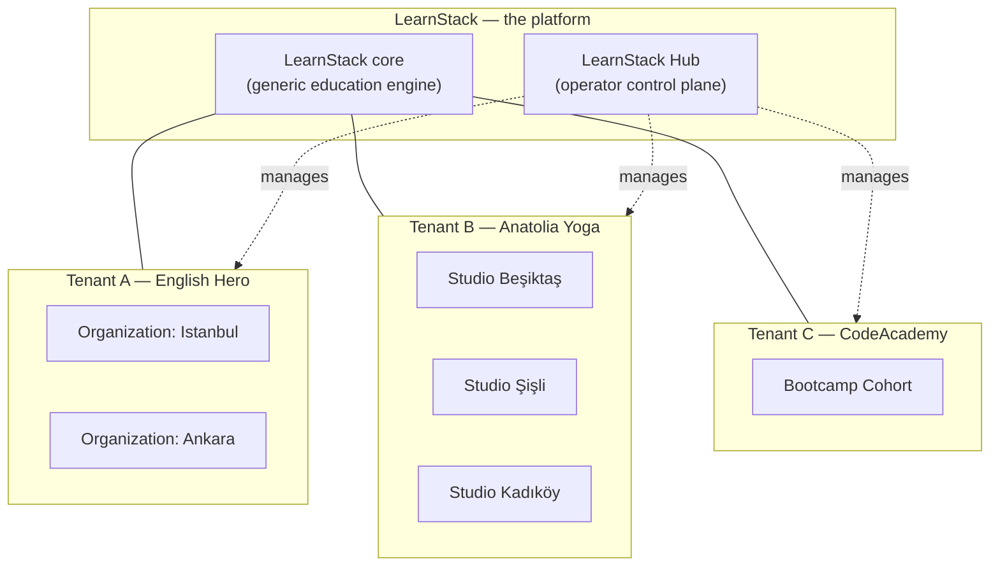

# Platform Vision

LearnStack is a **PaaS for education** — a platform on which customers build their own
education platforms in arbitrary domains and disciplines. It is not itself an education
product. Customers might use LearnStack to build:

- An online English-learning platform with CEFR levels and placement tests.
- A yoga studio platform with asana taxonomy, sequence-based lessons, and teacher
  scheduling.
- A coding bootcamp with code-challenge lesson items and automatic test-runner grading.
- A music school with score-reading lesson items, MIDI playback, and audio submissions.
- A meditation app with timed practice sessions and habit-streak tracking.
- A driving school with vehicle scheduling and progress-checkpoint workflows.
- An art workshop with portfolio uploads and peer-review assessments.
- A meditation, certification, exam-prep, or any domain not anticipated above.

LearnStack ships **one codebase, one set of container images, one Helm chart** that
serves all of these customers. The differentiator across customers is their **data**
(content, content type definitions, page block schemas, scoring rules, level taxonomies,
custom fields) — not their code. LearnStack engineers never write per-vertical code.

## Product thesis

Education businesses need infrastructure that is:

- **Multi-tenant from the start.** Every customer is a tenant; tenants are isolated at
  every layer (auth, query, storage, search, cache, audit, files).
- **Domain-agnostic.** Yoga and coding and language sit on the same primitives.
- **Customisable without coding.** Customers self-service their content types, page
  blocks, lesson item types, scoring rules, completion rules through Admin Studio —
  data-driven, not code-driven (ADR-0018).
- **Brand-owning.** Each tenant runs on their own domain
  ([27-custom-domain-tls.md](27-custom-domain-tls.md)), with their own branding, locales,
  notification senders.
- **Operationally separable.** LearnStack operators manage tenant lifecycle, billing,
  licensing, custom domains, compliance via a **separate control plane**, LearnStack Hub
  ([24-learnstack-hub.md](24-learnstack-hub.md)).
- **Deployment-flexible.** Same codebase deploys as SaaS, Dedicated (LearnStack-managed
  single-tenant), or Self-Hosted ([25-deployment-models.md](25-deployment-models.md)).

## The three layers

- **LearnStack core** owns reusable capabilities. Identity, tenancy, organization,
  content, catalog, enrollment, progress, classroom, scheduling, media, notification,
  audit, reporting modules. Every tenant gets the same set of modules; they cannot install
  or uninstall modules. Plan tiers differentiate by **features** within those modules, not
  by module presence (ADR-0021).
- **Tenant** is an independent education platform. Fully isolated. Owns content, users,
  brand, domain. Subscribes to a plan; the plan's features and limits define the tenant's
  entitlement.
- **Organization** is a sub-unit within a tenant — branch, studio, campus, department,
  cohort. Two-level hierarchy strict (ADR-0017). Tenant without explicit orgs has one
  default org auto-created.

See [28-platform-tenant-organization.md](28-platform-tenant-organization.md) for the full
conceptual model.

## Design principles

- **Generic-only core.** No domain-specific code in LearnStack modules. CEFR, asanas,
  code challenges live as **tenant data** (ADR-0018), never as `LearnStack.Verticals.*`
  source code.
- **Multi-tenant from day one.** Tenant isolation is non-negotiable; defense-in-depth =
  tenant context + organization filter + EF query filter + RLS + architecture tests
  (ADR-0003 Amendment 1).
- **Modular monolith first.** Clear module boundaries today; service extraction tomorrow
  only when proven necessary. Cross-module communication only through the four sanctioned
  mechanisms (ADR-0010).
- **Headless core.** REST APIs expose the core; product-specific frontends consume them.
  The renderer is a client of the core, not the other way around.
- **Provider adapters everywhere.** Payments, auth, storage, search, live classroom,
  notifications, recording — all behind interfaces. No SaaS lock-in baked into core code.
- **Auditability and event tracking as platform primitives.** Domain events, integration
  events (outbox → Dapr pub/sub → Kafka — ADR-0014), and audit log (ADR-0016) are designed
  in, not bolted on.
- **Versioned publish workflows** for content and courses that affect learners.
- **Hub-separated control plane.** Tenant lifecycle, billing, licensing, custom domains,
  compliance run in a separate codebase (`learnstack-hub`, ADR-0019). LearnStack core
  serves tenants; Hub serves operators. The two never share a process or a Keycloak realm.
- **Triple deployment, one codebase.** SaaS, Dedicated, Self-Hosted (online and air-
  gapped) all run the same container images. Hybrid license model (phone-home + RSA-
  signed key + 30-day grace) covers all modes (ADR-0020).

## Non-goals

- **Building a marketplace of independent instructors.** LearnStack is infrastructure;
  marketplace is a product on top.
- **Writing per-vertical code (English, Yoga, Coding modules).** ADR-0018 forbids domain-
  specific names in LearnStack modules. The whole point of the PaaS positioning is that
  LearnStack doesn't ship verticals — customers build theirs.
- **Building a custom WebRTC stack from scratch.** LiveKit OSS + provider adapter
  (ADR-0005); see [18-webrtc-build-vs-adopt.md](18-webrtc-build-vs-adopt.md).
- **Implementing every LMS standard on day one.** SCORM, LTI, xAPI come later as
  pluggable adapters when a tenant needs them.
- **Starting with microservices.** Modular monolith with extract-when-proven seams.
- **Optimising for hypothetical education domains before the first tenant exists.** The
  generic-only model is precisely so we don't over-fit on the first vertical.

## What success looks like

When the foundation is in place, LearnStack should be able to:

- **Provision a new tenant in under 1 minute** — Hub-driven, Stripe-checkout-first; or
  sales-assisted for Enterprise.
- **Map a custom domain end-to-end** — DNS verification → Let's Encrypt cert → APISIX
  hot-reload → tenant resolver mapping. All Hub-orchestrated, ADR-0022.
- **Run three radically different tenant platforms on the same binary** — English
  learning + yoga studio + coding bootcamp + driving school — without LearnStack writing
  any domain code.
- **Tenant admin defines a custom content type in Admin Studio** (e.g. "BreathTechnique"
  for a yoga tenant) — JSON Schema authored in a visual editor — and immediately uses it
  in a course lesson.
- **Tenant runs an organisation-scoped flow** — Anatolia Yoga's Beşiktaş studio manages
  its own members and schedule without seeing the Şişli studio's data.
- **Operator publishes a new plan in Hub** ("Growth Annual at $1,990/yr with 100,000
  classroom minutes/month") and tenants can subscribe within minutes — no LearnStack code
  release needed.
- **Air-gapped customer renews a license key offline** — signed `.lic` file delivered via
  SFTP, placed on disk, SIGHUP triggers re-read, entitlement refreshed — no outbound
  network required.
- **Regulator inquires about a specific tenant's history** — audit log (ADR-0016) plus
  Hub audit stream answer "who did what when" with full correlation.
- **Customer migrates from SaaS to Self-Hosted** — same binary, same data export tools, no
  rewrite.

## How to read this corpus

- [05-mvp-scope.md](05-mvp-scope.md) — what ships in the first phases.
- [28-platform-tenant-organization.md](28-platform-tenant-organization.md) — conceptual
  model.
- [04-technical-architecture.md](04-technical-architecture.md) — stack and high-level
  architecture.
- [09-tenant-isolation.md](09-tenant-isolation.md) — defense-in-depth.
- [32-tenant-customization-model.md](32-tenant-customization-model.md) — how customers
  customise without code.
- [24-learnstack-hub.md](24-learnstack-hub.md) — the operator control plane.
- [25-deployment-models.md](25-deployment-models.md) — SaaS / Dedicated / Self-Hosted.
- [docs/decisions/](../decisions/) — ADRs.
- [docs/standards/](../standards/) — engineering rules.

## References to formative decisions

- ADR-0003 Amendment 1 — Tenant Isolation + Organization scope.
- ADR-0014 — Adopt Dapr.
- ADR-0015 — APISIX gateway.
- ADR-0016 — Audit log subsystem.
- ADR-0017 — Tenant + Organization hierarchy.
- ADR-0018 — Tenant-driven customization (supersedes ADR-0011 vertical packs).
- ADR-0019 — LearnStack Hub.
- ADR-0020 — Triple deployment + hybrid license.
- ADR-0021 — Feature-based entitlement.
- ADR-0022 — Custom domain & TLS.
