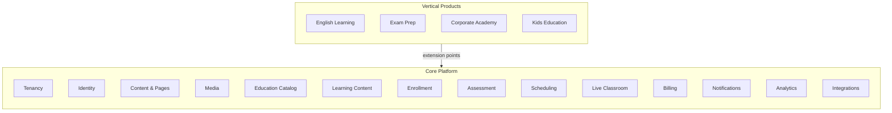

# Platform Vision

LearnStack is a core platform for creating online education products.

It should behave less like a fixed LMS and more like an **education-aware platform engine**: content management, page composition, media management, course catalog, learning workflows, tenant configuration, integrations, in-app live classrooms, and product-specific extensions are all first-class concerns.

## Product Thesis

Education businesses usually need more than course CRUD.

They need:

- Public landing pages and SEO-friendly content.
- Program and course catalogs.
- Learning materials, quizzes, assignments, and progress tracking.
- Student, instructor, and admin portals.
- Tenant-specific branding, navigation, domains ([22-custom-domains.md](22-custom-domains.md)), and feature flags ([21-feature-flags.md](21-feature-flags.md)).
- Optional billing, authentication policies, scheduling, and integrations.
- In-app live classes with attendance and recording.
- A way to create different vertical products without rebuilding the foundation.

LearnStack provides that foundation. Vertical products plug into the core through documented extension points instead of forking it.

## Core vs. Vertical

The **core platform** owns reusable capabilities. Vertical products add domain-specific behavior such as CEFR levels, placement tests, speaking practice, exam curricula, certification rules, or corporate compliance training — without polluting the generic core.

## Design Principles

- **Multi-tenant from the beginning.** Tenant isolation is non-negotiable and lives in every layer (auth, query, storage, search).
- **Modular monolith first.** Clear module boundaries today, service extraction tomorrow only when proven necessary.
- **Headless core.** APIs expose the core; product-specific frontends consume them. The renderer is a client of the core, not the other way around.
- **Education-specific domain.** Not a generic CMS with a few course fields glued on. Course versioning, enrollments, progress, assessments, and live classroom are first-order concepts.
- **Provider adapters everywhere.** Payments, auth, storage, search, live classroom, notifications, recording — all behind interfaces. No SaaS lock-in baked into core code.
- **Auditability and event tracking as platform primitives.** Domain events and integration events are designed in, not bolted on.
- **Versioned publish workflows** for content and courses that affect learners.

## Non-Goals for the First Version

- Building a marketplace of independent instructors.
- Building a custom video-conferencing system from scratch. (See [In-App Live Classroom](07-in-app-live-classroom.md): WebRTC standards plus an open-source SFU, not a from-scratch media server.)
- Implementing every LMS standard (SCORM, LTI, xAPI) on day one.
- Starting with microservices.
- Optimizing for every possible education domain before the first vertical product exists.

## What Success Looks Like

When the foundation is in place, LearnStack should be able to:

- Spin up a new tenant with a custom domain and brand.
- Publish a tenant's landing pages, catalog, and course detail pages.
- Manage courses, modules, lessons, and learning materials with draft/publish workflow.
- Grant learner access and track progress.
- Run quizzes and placement tests.
- Run in-app live online classes with attendance and recording metadata.
- Extend payment, notifications, search, storage, analytics, and live-classroom providers through adapters.
- Add vertical products (English-learning first) without modifying the generic core modules.
