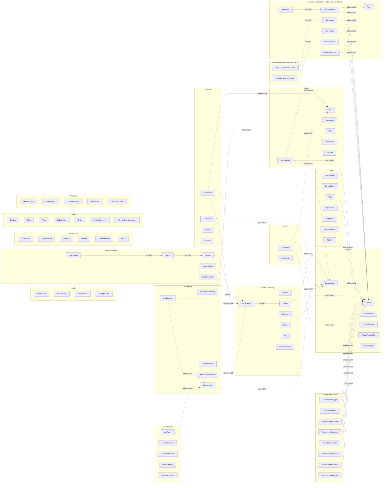

# Domain Model

This document describes the first domain shape. It is intentionally conceptual and evolves as implementation begins. For naming, see the [Glossary](../glossary.md).

> **2026-05-18 update.** Per [ADR-0017](../decisions/0017-tenant-organization-hierarchy.md)
> and [ADR-0018](../decisions/0018-tenant-driven-customization-model.md), the domain model
> adds:
>
> 1. **`Organization` aggregate** in the Identity / Tenancy module — sub-unit within a
>    tenant; carries optional `CustomSubdomain`, `BrandingOverride`, `Status`. See
>    [28-platform-tenant-organization.md](28-platform-tenant-organization.md) for the full
>    conceptual diagram. Org-scoped entities (`Course`, `Enrollment`, `LiveSession`, ...)
>    gain a nullable `OrganizationId`; tenant-wide entities leave it null.
> 2. **Customization aggregates**: `TenantContentType`, `TenantPageBlock`,
>    `TenantLessonItemType`, `TenantLevelTaxonomy`, `TenantScoringRule`,
>    `TenantCompletionRule`, `TenantCustomFieldDef`, `TenantTemplateLibrary`. These hold
>    JSON Schema definitions and DSL expressions that LearnStack runtime + frontend
>    compose into per-tenant content shapes without code changes. See
>    [32-tenant-customization-model.md](32-tenant-customization-model.md) for the data
>    model.
> 3. **`AuditEntry` aggregate** in `LearnStack.Modules.Audit` per
>    [ADR-0016](../decisions/0016-audit-log-subsystem.md). Inherits `Entity<TId>` (not
>    `AuditableEntity<T>`) — append-only by design. See
>    [31-audit-subsystem.md](31-audit-subsystem.md).
> 4. **Hub-side aggregates** (`Plan`, `HubSubscription`, `Entitlement`, `HubInvoice`,
>    `LicenseKey`, `CustomDomain`, `CompliancePolicy`) live in the `learnstack-hub`
>    repository, **not in this domain model**. See [24-learnstack-hub.md](24-learnstack-hub.md).
>    The LearnStack core mirrors only a minimal `Tenant` row + `platform_entitlement_cache`.
> 5. **`User`, `Course`, `Enrollment`, `LiveSession`** etc. extend their schema with
>    `custom_fields jsonb` column populated from `TenantCustomFieldDef` definitions.

## Aggregate Roots and Modules

Each entity lives inside exactly one module and is owned by exactly one aggregate. Cross-aggregate references use ids only — never EF navigation properties.

## Tenancy

| Entity | Aggregate root? | Notes |
|--------|-----------------|-------|
| `Tenant` | Yes | Global table; sits above `tenant_id` scoping. Status: Trial / Active / Suspended / Archived. |
| `Organization` | Yes | Sub-unit within a tenant (branch, studio, campus, department, cohort). Two-level hierarchy strict (ADR-0017). Every tenant has at least one default org. |
| `TenantDomain` | Inside Tenant | Subdomain on `{slug}.learnstack.app` (always available) or custom domain (Hub-managed; see [27-custom-domain-tls.md](27-custom-domain-tls.md)). |
| `TenantBranding` | Inside Tenant | Logo, colors, typography tokens. May be overridden per-organization via `OrganizationBranding`. |
| `OrganizationBranding` | Inside Organization | Optional partial design-token override (logo / colors / typography) merged on top of `TenantBranding` at render time. When the resolved request carries an organization id and a row exists, the merged token set is injected as CSS variables on the SSR'd HTML root; missing fields fall through to the tenant default. See [Glossary § Branding](../glossary.md). |
| `TenantFeatureFlag` | Inside Tenant | Experimental / gradual-rollout flags. Plan-level features are surfaced via the entitlement projection (ADR-0021), not stored here. See [21-feature-flags.md](21-feature-flags.md). |
| `TenantSettings` | Inside Tenant | Locale set, timezone, default notification sender, content settings. |

## Identity

| Entity | Aggregate root? | Notes |
|--------|-----------------|-------|
| `User` | Yes | Global; identifies a person across tenants. Keycloak `sub` is the stable id. |
| `UserProfile` | Inside User | Personal details. Tenant-specific profile fields live on `Membership`. |
| `Membership` | Yes | Per-tenant + per-org relationship. Triple key `(user_id, tenant_id, organization_id)`. Carries role assignments. A user can have memberships in multiple tenants and multiple orgs within one tenant. |
| `Role` | Yes | Tenant-scoped (most) or platform-scoped (Hub realm only). May be Tenant-scoped or Organization-scoped (org-scoped roles apply only within one org). |
| `Permission` | Inside Role | Fine-grained capability key `{module}.{resource}.{action}`. Permission scope: Platform / Tenant / Organization (ADR-0017). |
| `Invitation` | Yes | Pending membership offer; bound to email; expires; revocable. |

`AuditLog` previously listed here moved to its own [Audit module section](#audit) per ADR-0016.

Tenant-customization data (CEFR levels, custom content types, scoring rules) — previously
called "vertical extensions" — now lives in [Tenant Customization aggregates](#tenant-customization)
per ADR-0018, not on `Membership` extension tables.

## Content

| Entity | Aggregate root? | Notes |
|--------|-----------------|-------|
| `ContentType` | Yes | Schema for structured content; tenant-scoped. |
| `ContentEntry` | Yes | Instance of a content type. Has draft/published state. |
| `Page` | Yes | Owns versions and blocks. |
| `PageVersion` | Inside Page | Draft or published snapshot. |
| `PageBlock` | Inside PageVersion | Typed unit; schema-versioned. |
| `NavigationMenu` | Yes | Named tree of links. |
| `Redirect` | Yes | URL redirect, tenant-scoped. |

## Media

| Entity | Aggregate root? | Notes |
|--------|-----------------|-------|
| `MediaAsset` | Yes | The logical asset; references a `StorageObject`. |
| `MediaFolder` | Yes | Organizational hierarchy. |
| `MediaVariant` | Inside MediaAsset | Resized / transcoded derivative. |
| `StorageObject` | Inside MediaAsset | Physical object metadata (bucket, key, content hash). |

## Education Catalog

| Entity | Aggregate root? | Notes |
|--------|-----------------|-------|
| `Program` | Yes | Higher-level learning product grouping. |
| `Course` | Yes | Catalog-level entity; never mutated structurally after publish. |
| `CourseVersion` | Yes | Versioned course structure. Enrollments target a `CourseVersion`. |
| `Category` | Yes | Catalog grouping. |
| `Level` | Yes | Generic. Tenants define their own taxonomy (CEFR, yoga difficulty, kyu/dan, coding-difficulty, …) in [Tenant Customization](#tenant-customization) — `TenantLevelTaxonomy`. The `Level` table holds the items declared by a tenant's taxonomy, looked up by `(tenant_id, taxonomy_key, key)`. |
| `Tag` | Yes | Search/discovery metadata. |
| `InstructorProfile` | Yes | Tenant-scoped public instructor information. |

> **Course vs. CourseVersion.** `Course` carries identity, catalog metadata, SEO, public visibility. `CourseVersion` carries the structure (modules, lessons, items) and is what enrollments and progress bind to. Editing a course never breaks a learner currently progressing through a published version.

## Learning Content

| Entity | Aggregate root? | Notes |
|--------|-----------------|-------|
| `Module` | Inside CourseVersion | Ordered grouping of lessons. |
| `Lesson` | Inside CourseVersion | Unit of consumption. |
| `LessonItem` | Inside Lesson | Polymorphic: rich text, video, file, quiz reference, live-session reference, embedded tool. |
| `LearningPath` | Yes | Optional cross-course traversal. |
| `CompletionRule` | Inside CourseVersion | Determines when a lesson / module / course is complete. |

## Assessment

| Entity | Aggregate root? | Notes |
|--------|-----------------|-------|
| `Assessment` | Yes | Quiz / exam / placement test / survey. |
| `QuestionBank` | Yes | Reusable question collection. |
| `Question` | Inside QuestionBank | Prompt and answer definition. |
| `Attempt` | Yes | Learner attempt with lifecycle. |
| `AttemptAnswer` | Inside Attempt | Submitted answer per question. |
| `Score` | Inside Attempt | Computed result. |

## Enrollment & Access

| Entity | Aggregate root? | Notes |
|--------|-----------------|-------|
| `Enrollment` | Yes | Grant of access to a `CourseVersion` (optionally bound to a `Cohort`). Has status (active, suspended, completed, cancelled) and source (manual, billing, invitation, integration). |
| `Entitlement` | Yes | Right to access a paid or assigned capability. Enrollment is one source. |
| `Cohort` | Yes | Group of learners progressing on a shared timeline through a `CourseVersion`. Has its own lifecycle (open → in-progress → completed → archived). |
| `Progress` | Inside Enrollment | Learner advancement record. |

### Cohort × LiveSession × LiveBooking — relations and cardinalities

| Relation | Cardinality | Notes |
|----------|-------------|-------|
| `Cohort` ↔ `CourseVersion` | many-to-one | A cohort is always bound to exactly one `CourseVersion`; many cohorts may share the same `CourseVersion` (different cohorts on different timelines). |
| `Cohort` ↔ `Enrollment` | one-to-many | Every `Enrollment` is optionally bound to one `Cohort` (`Enrollment.CohortId nullable`). One-off enrollments leave it null. |
| `Cohort` ↔ `LiveSession` | many-to-many through `LiveBooking` | A cohort can be associated with many live sessions; a live session can host learners from many cohorts (mixed-cohort sessions are allowed). `LiveBooking` is the join. |
| `LiveSession` ↔ `LiveBooking` | one-to-many | A session may have many bookings: each booking references either a single learner (`LiveBooking.UserId`) **or** a cohort (`LiveBooking.CohortId`); exactly one is non-null. |
| `LiveBooking` ↔ `User` | many-to-one (when learner-booked) | One-on-one speaking sessions use direct user bookings with no cohort. |
| `LiveSession` ↔ `LiveRoom` | one-to-one (when opened) | The runtime room only exists while the session is in lifecycle states `opened` → `ended`. Before / after, `LiveRoom` is absent. |
| `Cohort.Progress` | derived | Per-cohort progress is a projection over the `Progress` records of the cohort's enrollments. Not its own aggregate. |

Lifecycle interactions:

- Cancelling a `Cohort` does **not** auto-cancel the cohort's enrollments — that is an
  operator-chosen action with its own audit entry. Cancelling enrollments
  individually is the safer default.
- A `LiveBooking` cancelled before the session opens reduces the participant count;
  cancelling after the session opens is a no-op (attendance carries the truth).
- `LiveAttendance` is computed from `LiveSessionEvent` streams, not from
  `LiveBooking`. A booked learner who never joined and an unbooked learner who joined
  via a public token both appear correctly.

> **Naming hygiene.** "Cohort" is the grouping; "LiveSession" is the scheduled event;
> "LiveRoom" is the runtime room. Earlier drafts used "Classroom" for grouping —
> that term is removed.

## Scheduling

| Entity | Aggregate root? | Notes |
|--------|-----------------|-------|
| `InstructorAvailability` | Yes | Available teaching windows. |
| `LiveSession` | Yes | Scheduled live event. Owns time, role mix, and lifecycle (scheduled → opened → in-progress → ended → archived). |
| `LiveBooking` | Yes | Reservation that ties a learner or cohort to a `LiveSession`. |
| `LiveAttendance` | Inside LiveSession | Per-participant attendance record computed from classroom events. |
| `LiveSessionMaterial` | Inside LiveSession | Files, links, or content entries attached to the session. |

## Live Classroom Runtime

These entities cover the **runtime** of a Live Session: actual rooms, tokens, recording, events.

| Entity | Aggregate root? | Notes |
|--------|-----------------|-------|
| `LiveRoom` | Yes | Runtime room created via `ILiveClassProvider`. Lives for the duration of a `LiveSession`. |
| `LiveRoomToken` | Inside LiveRoom | Short-lived join token; scoped to user + room + role. |
| `LiveRoomProvider` | Reference | The provider implementation that owns this room. |
| `LiveRecording` | Yes | Recording metadata, consent state, retention. File lives in SeaweedFS/S3. |
| `LiveSessionEvent` | Append-only | join / leave / screen-share / recording started / network drop. Feeds `ClassroomEvent` analytics. |

See [In-App Live Classroom](07-in-app-live-classroom.md) for the provider abstraction.

## Billing

| Entity | Aggregate root? | Notes |
|--------|-----------------|-------|
| `Product` | Yes | Sellable item. |
| `Plan` | Yes | Package / subscription definition. |
| `Price` | Inside Plan | Currency / interval / amount. |
| `Subscription` | Yes | Recurring access. |
| `Order` | Yes | Purchase intent and lifecycle. |
| `InvoiceReference` | Inside Order | Pointer to external invoice/payment record. |
| `PaymentProviderAccount` | Yes | Per-tenant provider configuration. |

Billing produces `Entitlement`s; the Enrollment module consumes them through an integration event.

## Analytics

| Event | Source |
|-------|--------|
| `LearningEvent` | Learner behavior (lesson viewed, lesson completed). |
| `ContentEvent` | Content interactions (page view, block engagement). |
| `CommerceEvent` | Funnel and payment events. |
| `AdminEvent` | Operational events. |
| `ClassroomEvent` | Derived from `LiveSessionEvent` streams; provider-agnostic. |

Events are append-only, schema-versioned, and suitable for reporting, automation, and future learning analytics.

## Tenant Customization

Per [ADR-0018](../decisions/0018-tenant-driven-customization-model.md), the platform is
100% domain-agnostic. Tenants declare their domain shape as **data**. The customization
module owns these aggregates:

| Entity | Aggregate root? | Notes |
|--------|-----------------|-------|
| `TenantContentType` | Yes | JSON Schema for a content type (e.g. `VocabularyCard`, `AsanaPose`, `CodeChallenge`). Tenant-scoped; key unique per `(tenant_id, key)`; `schema_version` per record. |
| `TenantPageBlock` | Yes | JSON Schema for a page block + composite renderer key (e.g. `default-card`, `content-list`). |
| `TenantLessonItemType` | Yes | JSON Schema for a custom lesson item type + player composite key. |
| `TenantLevelTaxonomy` | Yes | Flat list of level items with metadata (sort, color, …). Examples: CEFR, yoga-difficulty, coding-difficulty. |
| `TenantScoringRule` | Yes | DSL expression for assessment scoring (sandboxed; engine choice pending ADR). |
| `TenantCompletionRule` | Yes | Boolean DSL expression for lesson/module/course completion. |
| `TenantCustomFieldDef` | Yes | Field definition added to built-in entities (`User`, `Course`, `Enrollment`, …). Stored in the entity's `custom_fields jsonb` column. |
| `TenantTemplateLibrary` | Yes | Notification templates (email, SMS, WhatsApp, in-app) authored as Liquid / Handlebars, per locale. |

Org-scoping: most customization aggregates are tenant-wide, but some
(e.g. `TenantTemplateLibrary` for org-branded notifications, `TenantCustomFieldDef` for
org-specific user fields) MAY carry a nullable `organization_id`. The architecture test
`Every_OrgScoped_Entity_HasOrgIdAndFilter` checks the marker is consistent.

Full data model, sandbox-engine choices, schema versioning rules, and worked tenant
examples live in [32-tenant-customization-model.md](32-tenant-customization-model.md).

## Audit

Per [ADR-0033](../decisions/0033-audit-durability-model.md), which supersedes
[ADR-0016](../decisions/0016-audit-log-subsystem.md), the Audit module owns the
append-only platform-level audit trail and MUST-class rows commit with the state change
they describe.

| Entity | Aggregate root? | Notes |
|--------|-----------------|-------|
| `AuditEntry` | Yes (append-only — inherits `Entity<TId>` NOT `AuditableEntity<T>`) | One row per command/sensitive query/security event. Fields: `tenant_id`, `organization_id?`, `actor_user_id?`, `module`, `operation`, `operation_type`, `operation_class`, `entity_type?`, `entity_id?`, `outcome` (`success` \| `denied` \| `failed`), `error_key?`, `before_state` (jsonb), `after_state` (jsonb), `changes` (jsonb), `correlation_id?`, `ip_address?`, `user_agent?`, `reason?`, `timestamp`, `metadata?`. Stored in the `audit_log` table — a single plain table with the composite key `(id, timestamp)` in Phase 02a; partitioned by month from [Phase 11](../roadmap/phase-11-production-hardening.md) per [ADR-0035](../decisions/0035-demand-gated-infrastructure.md). |
| `AuditConfig` | Yes | Per-tenant override of per-(module, operation) audit enablement. Tenant-overridable within MUST/SHOULD/MAY classification. |

Capture pipeline (`AuditChangeTrackerInterceptor` → `IAuditStateCapture` →
`AuditLogBehavior` → `IAuditStore`) lives in `LearnStack.Infrastructure.Audit`. Full deep
dive: [31-audit-subsystem.md](31-audit-subsystem.md).

## External: LearnStack Hub aggregates (mirrored, not owned)

LearnStack Hub ([ADR-0019](../decisions/0019-learnstack-hub.md)) is a separate codebase
with its own aggregates. The LearnStack core's domain model does **not** own these; it
mirrors only a minimal subset for runtime entitlement reads.

| Hub aggregate (external) | Where it lives | LearnStack mirror? |
|---------------------------|----------------|--------------------|
| `Plan` | `learnstack-hub` repo | No |
| `HubSubscription` | `learnstack-hub` repo | No |
| `Entitlement` | `learnstack-hub` repo | **Yes** — projected into `platform_entitlement_cache` (15-min cache TTL; eager-invalidated on `learnstack.hub.entitlement` Dapr pub/sub event). |
| `HubInvoice` / `HubInvoiceLine` | `learnstack-hub` repo | No |
| `WebhookLedger` | `learnstack-hub` repo | No |
| `LicenseKey` | `learnstack-hub` repo | Air-gapped: signed `.lic` file on disk (read by `SignedLicenseKeyEntitlementProvider`). |
| `CustomDomain` | `learnstack-hub` repo | **Yes** — projected into `platform_host_to_tenant` mapping (host → tenant_id), used by `IHostToTenantResolver` at the LearnStack edge. |
| `CompliancePolicy` | `learnstack-hub` repo | Embedded in entitlement projection's `compliance.caps` field. |
| `UsageAggregate` | `learnstack-hub` repo | No (LearnStack reports usage to Hub via `POST /api/v1/usage/report`; Hub aggregates). |

The LearnStack ↔ Hub contract surface is narrow:
`POST /api/v1/internal/license/verify`, `POST /api/v1/usage/report`,
`PUT /api/internal/tenants/{id}/entitlements` (Hub→LearnStack),
`POST /api/internal/tenants` (Hub→LearnStack tenant create). See
[24-learnstack-hub.md §3](24-learnstack-hub.md).

## Cross-module references

Modules reference each other by **id only**. See [Cross-Module Contracts](10-cross-module-contracts.md) for how Page blocks reference Courses, how Billing notifies Enrollment, and how the Classroom module notifies Scheduling.

## Strongly-typed identifiers

All ids are strongly typed (`TenantId`, `UserId`, `CourseId`, `LessonItemId`, etc.). See [Backend Coding Standards](../standards/02-backend-coding.md) for the value-converter pattern.
