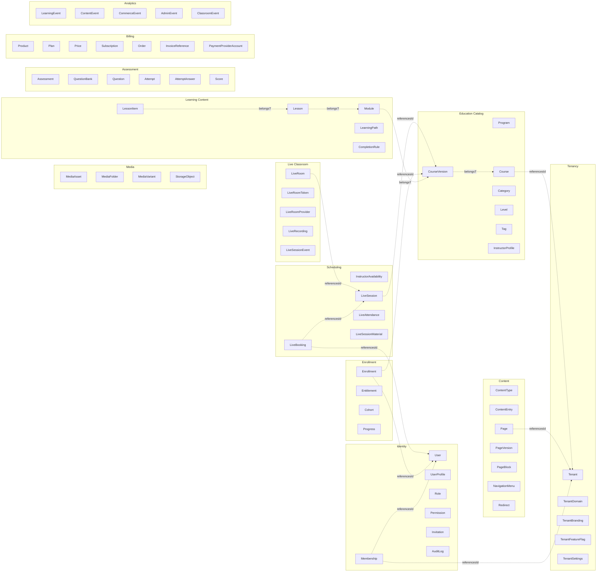

# Domain Model

This document describes the first domain shape. It is intentionally conceptual and evolves as implementation begins. For naming, see the [Glossary](../glossary.md).

## Aggregate Roots and Modules

Each entity lives inside exactly one module and is owned by exactly one aggregate. Cross-aggregate references use ids only — never EF navigation properties.

## Tenancy

| Entity | Aggregate root? | Notes |
|--------|-----------------|-------|
| `Tenant` | Yes | Global table; sits above `tenant_id` scoping. |
| `TenantDomain` | Inside Tenant | Custom domain or subdomain. |
| `TenantBranding` | Inside Tenant | Logo, colors, typography tokens. |
| `TenantFeatureFlag` | Inside Tenant | Feature availability per tenant. |
| `TenantSettings` | Inside Tenant | Locale, timezone, billing, auth, content settings. |

## Identity

| Entity | Aggregate root? | Notes |
|--------|-----------------|-------|
| `User` | Yes | Global; identifies a person across tenants. |
| `UserProfile` | Inside User | Personal details. Tenant-specific profile fields live on `Membership`. |
| `Membership` | Yes | Per-tenant relationship. Carries roles and tenant-specific profile data. |
| `Role` | Yes | Tenant-scoped except for built-in platform roles. |
| `Permission` | Inside Role | Fine-grained capability flag. |
| `Invitation` | Yes | Pending membership offer. |
| `AuditLog` | Append-only | Security and admin activity. |

Vertical products that need extra per-user data attach it to `Membership` via extension tables, not via `User`.

## Content

| Entity | Aggregate root? | Notes |
|--------|-----------------|-------|
| `ContentType` | Yes | Schema for structured content; tenant-scoped. |
| `ContentEntry` | Yes | Instance of a content type. Has draft/published state. |
| `Page` | Yes | Owns versions and blocks. |
| `PageVersion` | Inside Page | Draft or published snapshot. |
| `PageBlock` | Inside PageVersion | Typed unit; schema-versioned. |
| `NavigationMenu` | Yes | Named tree of links. |
| `Redirect` | Yes | URL redirect, tenant-scoped. |

## Media

| Entity | Aggregate root? | Notes |
|--------|-----------------|-------|
| `MediaAsset` | Yes | The logical asset; references a `StorageObject`. |
| `MediaFolder` | Yes | Organizational hierarchy. |
| `MediaVariant` | Inside MediaAsset | Resized / transcoded derivative. |
| `StorageObject` | Inside MediaAsset | Physical object metadata (bucket, key, content hash). |

## Education Catalog

| Entity | Aggregate root? | Notes |
|--------|-----------------|-------|
| `Program` | Yes | Higher-level learning product grouping. |
| `Course` | Yes | Catalog-level entity; never mutated structurally after publish. |
| `CourseVersion` | Yes | Versioned course structure. Enrollments target a `CourseVersion`. |
| `Category` | Yes | Catalog grouping. |
| `Level` | Yes | Generic; CEFR-like mappings live in vertical extensions, not here. |
| `Tag` | Yes | Search/discovery metadata. |
| `InstructorProfile` | Yes | Tenant-scoped public instructor information. |

> **Course vs. CourseVersion.** `Course` carries identity, catalog metadata, SEO, public visibility. `CourseVersion` carries the structure (modules, lessons, items) and is what enrollments and progress bind to. Editing a course never breaks a learner currently progressing through a published version.

## Learning Content

| Entity | Aggregate root? | Notes |
|--------|-----------------|-------|
| `Module` | Inside CourseVersion | Ordered grouping of lessons. |
| `Lesson` | Inside CourseVersion | Unit of consumption. |
| `LessonItem` | Inside Lesson | Polymorphic: rich text, video, file, quiz reference, live-session reference, embedded tool. |
| `LearningPath` | Yes | Optional cross-course traversal. |
| `CompletionRule` | Inside CourseVersion | Determines when a lesson / module / course is complete. |

## Assessment

| Entity | Aggregate root? | Notes |
|--------|-----------------|-------|
| `Assessment` | Yes | Quiz / exam / placement test / survey. |
| `QuestionBank` | Yes | Reusable question collection. |
| `Question` | Inside QuestionBank | Prompt and answer definition. |
| `Attempt` | Yes | Learner attempt with lifecycle. |
| `AttemptAnswer` | Inside Attempt | Submitted answer per question. |
| `Score` | Inside Attempt | Computed result. |

## Enrollment & Access

| Entity | Aggregate root? | Notes |
|--------|-----------------|-------|
| `Enrollment` | Yes | Grant of access to a `CourseVersion`. Has status (active, suspended, completed, cancelled) and source (manual, billing, invitation, integration). |
| `Entitlement` | Yes | Right to access a paid or assigned capability. Enrollment is one source. |
| `Cohort` | Yes | Group of learners progressing on a shared timeline through a `CourseVersion`. |
| `Progress` | Inside Enrollment | Learner advancement record. |

> **Cohort is not a Live Session.** A cohort can be associated with many live sessions; a one-on-one speaking session has no cohort. Earlier drafts also used `Classroom` for grouping — that term is removed; use `Cohort` for groups and `LiveRoom` for the runtime room.

## Scheduling

| Entity | Aggregate root? | Notes |
|--------|-----------------|-------|
| `InstructorAvailability` | Yes | Available teaching windows. |
| `LiveSession` | Yes | Scheduled live event. Owns time, role mix, and lifecycle (scheduled → opened → in-progress → ended → archived). |
| `LiveBooking` | Yes | Reservation that ties a learner or cohort to a `LiveSession`. |
| `LiveAttendance` | Inside LiveSession | Per-participant attendance record computed from classroom events. |
| `LiveSessionMaterial` | Inside LiveSession | Files, links, or content entries attached to the session. |

## Live Classroom Runtime

These entities cover the **runtime** of a Live Session: actual rooms, tokens, recording, events.

| Entity | Aggregate root? | Notes |
|--------|-----------------|-------|
| `LiveRoom` | Yes | Runtime room created via `ILiveClassProvider`. Lives for the duration of a `LiveSession`. |
| `LiveRoomToken` | Inside LiveRoom | Short-lived join token; scoped to user + room + role. |
| `LiveRoomProvider` | Reference | The provider implementation that owns this room. |
| `LiveRecording` | Yes | Recording metadata, consent state, retention. File lives in MinIO/S3. |
| `LiveSessionEvent` | Append-only | join / leave / screen-share / recording started / network drop. Feeds `ClassroomEvent` analytics. |

See [In-App Live Classroom](07-in-app-live-classroom.md) for the provider abstraction.

## Billing

| Entity | Aggregate root? | Notes |
|--------|-----------------|-------|
| `Product` | Yes | Sellable item. |
| `Plan` | Yes | Package / subscription definition. |
| `Price` | Inside Plan | Currency / interval / amount. |
| `Subscription` | Yes | Recurring access. |
| `Order` | Yes | Purchase intent and lifecycle. |
| `InvoiceReference` | Inside Order | Pointer to external invoice/payment record. |
| `PaymentProviderAccount` | Yes | Per-tenant provider configuration. |

Billing produces `Entitlement`s; the Enrollment module consumes them through an integration event.

## Analytics

| Event | Source |
|-------|--------|
| `LearningEvent` | Learner behavior (lesson viewed, lesson completed). |
| `ContentEvent` | Content interactions (page view, block engagement). |
| `CommerceEvent` | Funnel and payment events. |
| `AdminEvent` | Operational events. |
| `ClassroomEvent` | Derived from `LiveSessionEvent` streams; provider-agnostic. |

Events are append-only, schema-versioned, and suitable for reporting, automation, and future learning analytics.

## Cross-module references

Modules reference each other by **id only**. See [Cross-Module Contracts](10-cross-module-contracts.md) for how Page blocks reference Courses, how Billing notifies Enrollment, and how the Classroom module notifies Scheduling.

## Strongly-typed identifiers

All ids are strongly typed (`TenantId`, `UserId`, `CourseId`, `LessonItemId`, etc.). See [Backend Coding Standards](../standards/02-backend-coding.md) for the value-converter pattern.
