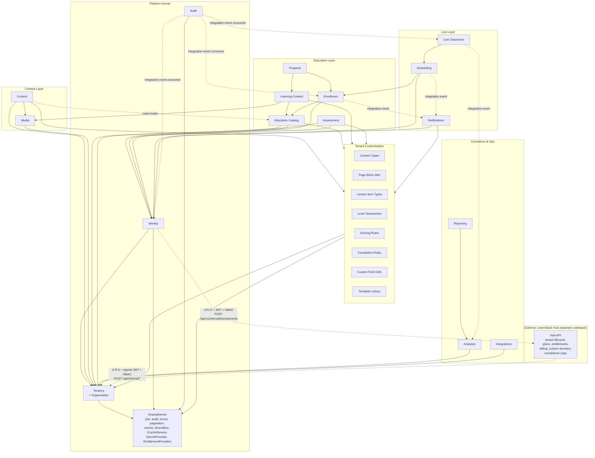

# Module Boundaries

LearnStack starts as a modular monolith. Modules must be independently understandable, depend only on explicit contracts, and be extractable into separate services later without rewiring callers.

> **2026-05-18 updates.** Three changes consolidated below:
>
> 1. **`LearnStack.Modules.Audit`** added as a first-class platform module per
>    [ADR-0016](../decisions/0016-audit-log-subsystem.md). It owns the `AuditEntry`
>    aggregate, repository, retention job, admin API. The audit infrastructure
>    (interceptor + state capture + MediatR behavior + `audit_log` table) lives in
>    `LearnStack.Infrastructure.Audit` and is shared across modules. See
>    [31-audit-subsystem.md](31-audit-subsystem.md).
> 2. **`Organization` aggregate** lives inside the **Tenancy** module per
>    [ADR-0017 Amendment 2 (2026-08-10)](../decisions/0017-tenant-organization-hierarchy.md).
>    Tenant-owned entities
>    that are org-scoped carry `OrganizationId`; the column is nullable
>    (tenant-wide rows leave it null).
> 3. **LearnStack Hub** ([ADR-0019](../decisions/0019-learnstack-hub.md)) is **NOT a
>    LearnStack module** — it lives in the separate `learnstack-hub` repository.
>    Communication is HTTPS-only via mTLS-protected internal API. Hub is shown in
>    architecture diagrams as **external system**, not a module. Architecture test
>    `LearnStack_Modules_DoNotReference_Hub` enforces this.
>
> The pre-2026-05-18 module map below adds two boxes: `Audit` under platform-kernel
> tier, and an external "LearnStack Hub" cluster sitting outside the platform kernel
> communicating to it via `/api/internal/*`.

## Module Map



The dashed arrows are **integration events** (via Dapr pub/sub → Kafka, ADR-0014), **read-model projections**, or **Hub HTTPS contracts** — not direct calls or shared tables.

## Backend Modules

The platform kernel + customization + audit modules below are the **substrate** every
LearnStack deployment ships with. The Hub-side aggregates (`Plan`, `HubSubscription`,
`Entitlement`, …) are owned by the `learnstack-hub` repository, **not** by any module
listed here.

### Tenancy
Owns tenants, **organizations** (sub-units within a tenant — ADR-0017), domains,
branding (with optional per-organization override), settings, tenant feature flags, and
tenant resolution. Exposes a read-only `TenantContext` (`TenantId`, `OrganizationId?`,
`UserId?`) to other modules. Custom-domain lifecycle is co-owned with the Hub —
LearnStack mirrors the host→tenant mapping but does not own the issuance flow
([27-custom-domain-tls.md](27-custom-domain-tls.md)). Feature-flag catalog and runtime:
[21-feature-flags.md](21-feature-flags.md).

### Identity
Owns users, memberships (triple-keyed on `(user_id, tenant_id, organization_id)`), roles,
permissions (with scope: Platform / Tenant / Organization per ADR-0017), invitations,
and sessions. Wraps the auth provider (Keycloak today — see
[Authentication Strategy](13-identity-and-auth.md)). Security-relevant operations
publish integration events that the Audit module consumes; Identity does **not** own its
own audit table.

### Tenant Customization
Owns the customization aggregates per [ADR-0018](../decisions/0018-tenant-driven-customization-model.md):
`TenantContentType`, `TenantPageBlock`, `TenantLessonItemType`, `TenantLevelTaxonomy`,
`TenantScoringRule`, `TenantCompletionRule`, `TenantCustomFieldDef`,
`TenantTemplateLibrary`. Schemas are stored as JSON Schema; expressions are stored as
sandboxed DSL strings (engine choice pending its own ADR). The runtime reads these
records to compose per-tenant content shapes, scoring, completion, and custom fields
**without code changes**. Full data model and worked tenant examples:
[32-tenant-customization-model.md](32-tenant-customization-model.md).

### Audit
Owns the append-only platform audit trail per [ADR-0016](../decisions/0016-audit-log-subsystem.md):
the `AuditEntry` aggregate, `AuditConfig` (per-tenant override of MUST/SHOULD/MAY
classification), the partitioned `audit_log` table, the retention job, and the admin
read API. The capture infrastructure (`AuditChangeTrackerInterceptor`,
`IAuditStateCapture`, `AuditLogBehavior`, `IAuditStore`) lives in
`LearnStack.Infrastructure.Audit` and is shared by every module via the MediatR
pipeline. Audit consumes integration events from Identity, Enrollment, Classroom, etc.
to enrich entries (actor, target, before/after state). Deep dive:
[31-audit-subsystem.md](31-audit-subsystem.md).

### Content
Owns content types, content entries, pages, page versions, page blocks, navigation,
redirects, and publication workflow. Block schemas are versioned and registered.
Per-tenant block shapes resolve through Tenant Customization
(`TenantPageBlock`).

### Media
Owns media assets, object storage metadata, file lifecycle, variants, asset access policies. Knows about SeaweedFS/S3 via the storage provider adapter.

### Education Catalog
Owns programs, courses, course versions, categories, levels, tags, instructor profiles,
catalog metadata. The `Level` table holds items declared by a tenant's
`TenantLevelTaxonomy`; the taxonomy itself lives in Tenant Customization.

### Learning Content
Owns modules, lessons, lesson items, learning paths. Bound to `CourseVersion`. Per-tenant
custom lesson-item types resolve through Tenant Customization
(`TenantLessonItemType`); per-tenant completion semantics resolve through
`TenantCompletionRule`.

### Enrollment
Owns enrollments, entitlements (per-learner access grants — distinct from Hub-side
plan-level `Entitlement`), cohorts. Consumes integration events from Billing and Hub
(via the entitlement projection) to grant access.

### Progress
Owns lesson / module / course progress for an enrollment. Subscribes to learning events.

### Assessment
Owns assessments, question banks, questions, attempts, answers, and result publication.
Scoring rules resolve through Tenant Customization (`TenantScoringRule`).

### Scheduling
Owns instructor availability, live sessions, bookings, attendance, session materials.

### Live Classroom
Owns the runtime concepts (rooms, tokens, recordings, classroom events) and wraps `ILiveClassProvider`.

### Notifications
Owns notification dispatch orchestration, delivery channels, and user preferences.
Templates (email/SMS/WhatsApp/in-app, per-locale, with optional org override) resolve
through Tenant Customization (`TenantTemplateLibrary`). Wraps email/SMS/WhatsApp
providers.

### Billing
Owns products, plans, prices, orders, subscriptions, invoice references, and payment
provider adapters at the **tenant-facing** level (the storefront a tenant exposes to its
own learners). The platform-level plans/billing that govern the tenant's own
LearnStack subscription live in the **Hub** ([24-learnstack-hub.md](24-learnstack-hub.md)),
not here.

### Analytics
Owns event ingestion (learning, content, commerce, admin, classroom events) and reporting read models.

### Integrations
Owns external provider credentials, webhooks, API keys, LTI/xAPI readiness, integration lifecycle.

## Dependency Rules

| Allowed | Forbidden |
|---------|-----------|
| Reference another module's **public contract** (interfaces in `Application.Contracts`). | Reference another module's EF entities or DbContext. |
| Subscribe to another module's **integration event** (via the outbox → Dapr pub/sub). | Cross-module EF navigation properties. |
| Read another module's **public read model** (projection table). | Joining across module-owned tables in SQL. |
| Use the **shared kernel** (ids, audit fields, errors, pagination, base types, `IEventBus`, `ICacheService`, `ISecretProvider`, `IEntitlementProvider`). | Importing another module's `Domain` namespace. |
| Provide an **adapter implementation** at the composition root. | Domain-specific names (`CEFR`, `Asana`, `Kyu`, …) anywhere in a core module — those belong to tenant customization data, not code. |
| Read a **Hub-mirrored projection** (`platform_entitlement_cache`, `platform_host_to_tenant`) for read-only entitlement / host resolution. | Direct HTTPS calls to Hub from anywhere except the `IEntitlementProvider` / `IUsageReporter` / `IHubTenantSync` adapter implementations; resolving a host by calling the Hub at all — `IHostToTenantResolver` reads `platform_host_to_tenant` and nothing else ([ADR-0034](../decisions/0034-hub-contract-surface-invariant.md)). |
| Reference the `LearnStack.Modules.Audit` module via integration events (Audit subscribes to events from other modules). | Writing to `audit_log` directly from outside the Audit infrastructure pipeline. |

Architecture tests enforce these rules — see [Testing Standards](../standards/06-testing.md).

## Cross-module Contracts

The four allowed cross-module patterns:

1. **Application service contract.** Interface in `<Module>.Application.Contracts`, implementation in `<Module>.Application`.
2. **Domain event** (intra-module). Stays inside the same module.
3. **Integration event** (inter-module). Published via the outbox; subscribed by other modules.
4. **Read-model projection.** A read-only table owned by one module that other modules can `SELECT` from for fast reads.

See [Cross-Module Contracts](10-cross-module-contracts.md) for concrete examples (Page block → Catalog, Billing → Enrollment, Classroom → Analytics).

## Suggested Backend Project Layout

```
backend/
  src/
    LearnStack.Api/                       # ASP.NET host (single deployment unit)
    LearnStack.Application/               # composition root, MediatR pipeline
    LearnStack.Domain/                    # shared kernel domain pieces
    LearnStack.Infrastructure/            # EF, Valkey, SeaweedFS, OpenTelemetry, Dapr wiring
    LearnStack.Infrastructure.Audit/      # audit interceptor + state capture + MediatR behavior
    LearnStack.SharedKernel/              # ids, audit fields, errors, paging, IEventBus,
                                          # ICacheService, ISecretProvider, IEntitlementProvider

    Modules/
      Tenancy/
        LearnStack.Modules.Tenancy.Application/
        LearnStack.Modules.Tenancy.Application.Contracts/
        LearnStack.Modules.Tenancy.Domain/                   # Tenant, Organization, TenantDomain, ...
        LearnStack.Modules.Tenancy.Infrastructure/
      Identity/
        LearnStack.Modules.Identity.Application/
        LearnStack.Modules.Identity.Application.Contracts/
        LearnStack.Modules.Identity.Domain/                  # User, Membership, Role, ...
        LearnStack.Modules.Identity.Infrastructure/
      Customization/
        LearnStack.Modules.Customization.Application/
        LearnStack.Modules.Customization.Application.Contracts/
        LearnStack.Modules.Customization.Domain/             # TenantContentType, TenantPageBlock,
                                                             # TenantLessonItemType, TenantLevelTaxonomy,
                                                             # TenantScoringRule, TenantCompletionRule,
                                                             # TenantCustomFieldDef, TenantTemplateLibrary
        LearnStack.Modules.Customization.Infrastructure/
      Audit/
        LearnStack.Modules.Audit.Application/
        LearnStack.Modules.Audit.Application.Contracts/
        LearnStack.Modules.Audit.Domain/                     # AuditEntry, AuditConfig
        LearnStack.Modules.Audit.Infrastructure/             # IAuditStore, retention job
      Content/
      Media/
      Education/        # catalog + learning content
      Enrollment/       # enrollment + progress
      Assessment/
      Scheduling/
      Classroom/
      Notifications/
      Billing/          # tenant-facing storefront billing (Hub-side platform billing lives in learnstack-hub repo)
      Analytics/
      Integrations/

  tests/
    LearnStack.Tests.Architecture/        # NetArchTest / ArchUnitNET rules
    LearnStack.Tests.Unit/
    LearnStack.Tests.Integration/         # Testcontainers
    LearnStack.Tests.EndToEnd/            # API-level golden flows
```

There is **no `Verticals/` folder**. The pre-2026-05-18 layout reserved one for per-domain
extension assemblies; [ADR-0018](../decisions/0018-tenant-driven-customization-model.md)
supersedes that approach. Domain-specific shapes (English-learning CEFR, yoga asana
catalog, coding-bootcamp tracks, …) live as **tenant customization data** in the
Customization module's aggregates, not as compiled code. Architecture test
`No_Source_Folder_Named_Verticals` enforces this.

The companion **`learnstack-hub`** repository ([ADR-0019](../decisions/0019-learnstack-hub.md))
follows the same modular monolith layout for its own concerns (`Plan`, `HubSubscription`,
`Entitlement`, `HubInvoice`, `LicenseKey`, `CustomDomain`, `CompliancePolicy`,
`UsageAggregate`) and is **not** a module of LearnStack.
