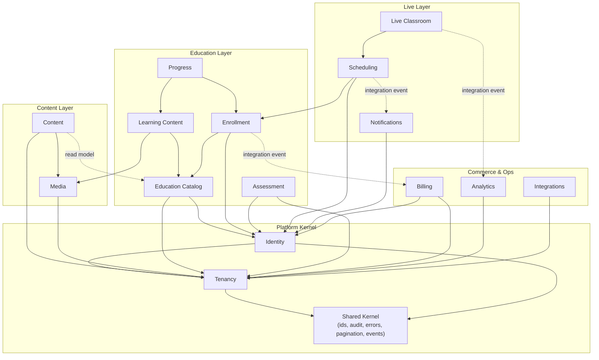

# Module Boundaries

LearnStack starts as a modular monolith. Modules must be independently understandable, depend only on explicit contracts, and be extractable into separate services later without rewiring callers.

## Module Map



The dashed arrows are **integration events** or **read-model projections** — not direct calls or shared tables.

## Backend Modules

### Tenancy
Owns tenants, domains, branding, settings, feature flags, and tenant resolution. Exposes a read-only `TenantContext` to other modules. Custom-domain lifecycle: [22-custom-domains.md](22-custom-domains.md). Feature-flag catalog and runtime: [21-feature-flags.md](21-feature-flags.md).

### Identity
Owns users, memberships, roles, permissions, invitations, sessions, and security audit events. Wraps the auth provider (Keycloak today — see [Authentication Strategy](13-identity-and-auth.md)).

### Content
Owns content types, content entries, pages, page versions, page blocks, navigation, redirects, and publication workflow. Block schemas are versioned and registered.

### Media
Owns media assets, object storage metadata, file lifecycle, variants, asset access policies. Knows about MinIO/S3 via the storage provider adapter.

### Education Catalog
Owns programs, courses, course versions, categories, levels, tags, instructor profiles, catalog metadata.

### Learning Content
Owns modules, lessons, lesson items, learning paths, completion rules. Bound to `CourseVersion`.

### Enrollment
Owns enrollments, entitlements, cohorts. Consumes integration events from Billing to grant access.

### Progress
Owns lesson / module / course progress for an enrollment. Subscribes to learning events.

### Assessment
Owns assessments, question banks, questions, attempts, answers, scoring, and result publication.

### Scheduling
Owns instructor availability, live sessions, bookings, attendance, session materials.

### Live Classroom
Owns the runtime concepts (rooms, tokens, recordings, classroom events) and wraps `ILiveClassProvider`.

### Notifications
Owns notification templates, delivery channels, user preferences, dispatch orchestration. Wraps email/SMS/WhatsApp providers.

### Billing
Owns products, plans, prices, orders, subscriptions, invoice references, and payment provider adapters.

### Analytics
Owns event ingestion (learning, content, commerce, admin, classroom events) and reporting read models.

### Integrations
Owns external provider credentials, webhooks, API keys, LTI/xAPI readiness, integration lifecycle.

## Dependency Rules

| Allowed | Forbidden |
|---------|-----------|
| Reference another module's **public contract** (interfaces in `Application.Contracts`). | Reference another module's EF entities or DbContext. |
| Subscribe to another module's **integration event**. | Cross-module EF navigation properties. |
| Read another module's **public read model** (projection table). | Joining across module-owned tables in SQL. |
| Use the **shared kernel** (ids, audit fields, errors, pagination, base types). | Importing another module's `Domain` namespace. |
| Provide an **adapter implementation** at the composition root. | Vertical-specific business rules inside a core module. |

Architecture tests enforce these rules — see [Testing Standards](../standards/06-testing.md).

## Cross-module Contracts

The four allowed cross-module patterns:

1. **Application service contract.** Interface in `<Module>.Application.Contracts`, implementation in `<Module>.Application`.
2. **Domain event** (intra-module). Stays inside the same module.
3. **Integration event** (inter-module). Published via the outbox; subscribed by other modules.
4. **Read-model projection.** A read-only table owned by one module that other modules can `SELECT` from for fast reads.

See [Cross-Module Contracts](10-cross-module-contracts.md) for concrete examples (Page block → Catalog, Billing → Enrollment, Classroom → Analytics).

## Suggested Backend Project Layout

```
backend/
  src/
    LearnStack.Api/                       # ASP.NET host
    LearnStack.Application/               # composition root, MediatR pipeline
    LearnStack.Domain/                    # shared kernel domain pieces
    LearnStack.Infrastructure/            # EF, Redis, MinIO, OpenTelemetry wiring
    LearnStack.SharedKernel/              # ids, audit, errors, events, paging

    Modules/
      Tenancy/
        LearnStack.Modules.Tenancy.Application/
        LearnStack.Modules.Tenancy.Application.Contracts/
        LearnStack.Modules.Tenancy.Domain/
        LearnStack.Modules.Tenancy.Infrastructure/
      Identity/
        ...
      Content/
      Media/
      Education/        # catalog + learning content
      Enrollment/       # enrollment + progress
      Assessment/
      Scheduling/
      Classroom/
      Notifications/
      Billing/
      Analytics/
      Integrations/

      Verticals/
        EnglishLearning/
          LearnStack.Verticals.English.Application/
          LearnStack.Verticals.English.Domain/
          LearnStack.Verticals.English.Infrastructure/

  tests/
    LearnStack.Tests.Architecture/        # NetArchTest / ArchUnitNET rules
    LearnStack.Tests.Unit/
    LearnStack.Tests.Integration/         # Testcontainers
    LearnStack.Tests.EndToEnd/            # API-level golden flows
```

Vertical modules (`Verticals/EnglishLearning/`) follow the same internal layout as core modules and use the same extension points.
