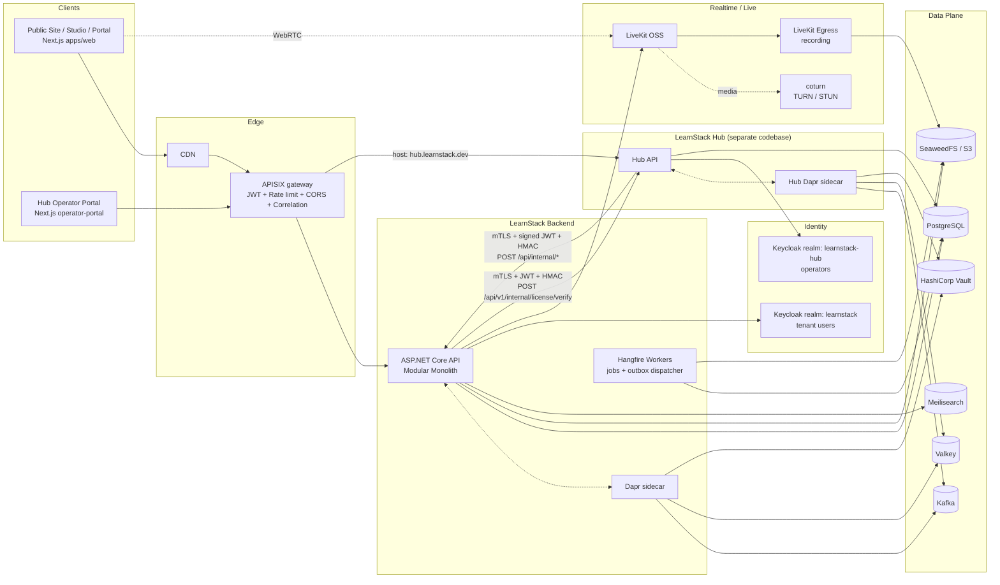
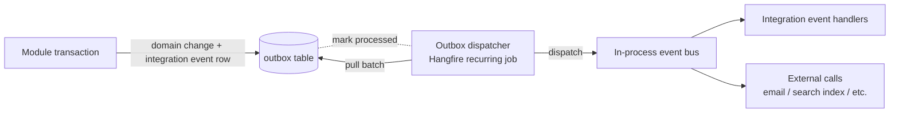

# Technical Architecture

## Stack

| Layer | Technology |
|-------|------------|
| Backend runtime | .NET 10, ASP.NET Core Web API |
| Language | C# |
| ORM | Entity Framework Core |
| Database | PostgreSQL 18.x (major pinned per [ADR-0031](../decisions/0031-postgresql-major-version.md); shared schema + RLS isolation; ADR-0003) |
| Cache & coordination | **`InMemoryCacheService` now; Valkey 8.x via Dapr State Store after its trigger** (Linux-Foundation BSD-3 fork per [ADR-0030](../decisions/0030-redis-compatible-store-valkey.md); [29-dapr-integration.md](29-dapr-integration.md), [ADR-0038](../decisions/0038-cross-cutting-port-and-event-contracts.md)) |
| Pub/Sub | **`InProcessEventBus` now; Apache Kafka via Dapr Pub/Sub after its trigger** ([29-dapr-integration.md](29-dapr-integration.md), [ADR-0038](../decisions/0038-cross-cutting-port-and-event-contracts.md)) |
| Secrets | **`ConfigurationSecretProvider` now; HashiCorp Vault via Dapr Secret Store after its trigger** ([ADR-0035](../decisions/0035-demand-gated-infrastructure.md); every mode resolves the configuration-backed default today) |
| Distributed runtime | **Dapr 1.17.7** in the gated local stack; sidecar target for pub/sub, state, and secrets |
| Object storage | SeaweedFS (local), S3-compatible (production) |
| Background jobs | Hangfire (Postgres storage) |
| Search | Meilisearch (initial), OpenSearch (later, if needed). See [ADR 0012](../decisions/0012-search-strategy.md) |
| Auth | Keycloak (self-hosted OIDC) — two realms: `learnstack` (tenant users) + `learnstack-hub` (operators); ADR-0004 Amendment 1 |
| Live classroom | LiveKit OSS (self-hosted) + coturn — see [07-in-app-live-classroom.md](07-in-app-live-classroom.md) |
| Frontend | Next.js (App Router), React, TypeScript — one app for tenant users (`apps/web`); separate Next.js app for Hub operators (`operator-portal`, in `learnstack-hub` repo) |
| API gateway | **Apache APISIX** (standalone mode) — JWT validation, rate limit, CORS, correlation ID; [30-api-gateway.md](30-api-gateway.md), [ADR-0015](../decisions/0015-api-gateway-apisix.md) |
| API contract | REST + OpenAPI + RFC 7807 Problem Details; GraphQL only if a clear frontend requirement appears |
| Observability | OpenTelemetry (traces + metrics + logs), Sentry, Grafana + Tempo + Loki + Prometheus |
| Container runtime | Docker; Docker Compose locally; Kubernetes (Helm chart) in production |
| **Control plane (Hub)** | **`learnstack-hub`** — separate codebase + separate Keycloak realm + separate Postgres schema. Manages tenant lifecycle, plans, subscriptions, entitlements, custom domains, compliance caps. [24-learnstack-hub.md](24-learnstack-hub.md), [ADR-0019](../decisions/0019-learnstack-hub.md) |
| Deployment | **SaaS / Dedicated / Self-Hosted** (online + air-gapped) all from one codebase; hybrid license model with phone-home + RSA-signed key + 30-day grace; [25-deployment-models.md](25-deployment-models.md), [ADR-0020](../decisions/0020-triple-deployment-hybrid-license.md) |

## High-Level Architecture



## Architecture Style

**Modular monolith first.**

This gives the project:
- Faster local development.
- Simpler deployment.
- Stronger refactoring while the domain is still forming.
- Clear extraction paths for future services.

Potential future service candidates: Billing, Notifications, Analytics ingestion, Search indexing, Media processing, Live Classroom egress.

Module boundaries and dependency rules are in [Module Boundaries](03-module-boundaries.md).

## Backend Layering

| Layer | Responsibility |
|-------|----------------|
| `Api` | HTTP endpoints, auth middleware, request binding, OpenAPI emission, tenant resolution middleware. |
| `Application` | Use cases (MediatR commands/queries), validation, transactions, pipeline behaviors. |
| `Domain` | Entities, aggregates, value objects, domain services, domain events. |
| `Infrastructure` | EF Core, Valkey, SeaweedFS, Hangfire, OpenTelemetry, external adapters. |
| `Modules.*` | Bounded feature areas, each with their own `Application` / `Domain` / `Infrastructure` internals and a public `Application.Contracts` surface. |

## Multi-Tenancy

| Decision | Initial choice |
|----------|----------------|
| Database | **Single PostgreSQL**, **shared schema**, `tenant_id` column on tenant-owned tables. |
| Tenant resolution | Host header → tenant id resolver, with explicit override for admin/studio and for background jobs. |
| Application enforcement | EF Core global query filter rewriting every tenant-owned query. |
| Defense-in-depth | PostgreSQL Row Level Security (RLS) on every tenant-owned table from day 1. |
| Architecture tests | Automated tests fail the build if a tenant-owned entity is missing the filter / column / policy. |

Full details: [Tenant Isolation](09-tenant-isolation.md).

Future options (deferred): schema-per-tenant for enterprise tenants, read replicas, reporting projections.

## API Strategy

- **REST + OpenAPI** from day one. OpenAPI is generated, not handwritten, and consumed by the frontend SDK.
- **Problem Details (RFC 7807)** for all error responses.
- **Cursor pagination** for list endpoints. Offset pagination is allowed only for admin-bounded lists.
- **Idempotency keys** for `POST` operations that have external side effects (payments, webhooks, send-notification).
- **Optimistic concurrency** for any mutable entity using `xmin` or `row_version` column.
- **API versioning** via URL prefix: `/api/v1/...`. Breaking changes bump to `/api/v2/...`; non-breaking additions stay on the existing version. See [ADR-0024](../decisions/0024-api-versioning-policy.md), which fixed exactly this `/v1/` vs `/api/v1/` inconsistency.
- **Authentication** via OIDC bearer tokens issued by Keycloak. Frontends use Auth.js to bridge.
- **Authorization** layered: tenant scope → role/permission → resource ownership where applicable.

GraphQL is not in scope for the MVP. Revisit only when a frontend surface (e.g. studio query workload) demonstrably needs it.

## Database Conventions

| Concern | Rule |
|---------|------|
| Naming | `snake_case` for tables/columns; plural table names (`users`, `course_versions`). |
| Primary keys | Strongly-typed ids backed by `uuid`. |
| Tenant column | `tenant_id uuid not null` on every tenant-owned table; RLS policy enforces it. |
| Audit columns | `created_at`, `created_by`, `updated_at`, `updated_by`, optional `deleted_at`, `deleted_by`. |
| Concurrency | `row_version` (`xmin` or explicit `bigint` column) on mutable entities. |
| Migrations | EF Core migrations; every PR includes a paired migration if the schema changes. |
| Soft delete | Opt-in per aggregate; not a global default. |

See [Database Standards](../standards/05-database.md).

## Background Jobs and Outbox



- All side-effects beyond the database transaction are deferred to **integration events** written to a transactional `outbox` table in the same transaction as the domain change.
- A dispatcher polls the outbox and dispatches events to in-process handlers and external systems.
- Idempotency keys plus consumer-side deduplication guarantee at-least-once with effective once-only semantics.

Full details: [Events & Outbox](15-event-and-outbox.md).

## Frontend Strategy

- Next.js (App Router) for public site, admin studio, learner portal, instructor portal.
- Server Components by default; Client Components only where interactivity needs it.
- Tenant resolution at the edge / middleware layer; tenant context propagated via header into RSC and route handlers.
- Typed API client generated from OpenAPI.

Detailed conventions: [Frontend Architecture](14-frontend-architecture.md) and [Frontend Architecture Standards](../standards/07-frontend-architecture.md).

## Local Infrastructure

`docker-compose` brings up:

```
postgres
valkey
seaweedfs            # single dev binary: master + volume + filer + S3 gateway
meilisearch
keycloak
livekit-server
livekit-egress
coturn
mailhog
otel-collector
```

Application projects run **outside** containers during active development for fast iteration. CI runs identical container versions.

## Observability

Three signals, one correlation id:
- **Structured logs** via Serilog → OTLP → collector.
- **Distributed traces** via OpenTelemetry SDK.
- **Metrics** via OpenTelemetry → Prometheus-compatible exporter.

A `traceparent` header binds frontend → API → background jobs → LiveKit events. Errors surface in Sentry; performance and infra metrics in Grafana.

Full details: [Observability Standards](../standards/10-observability.md).

## Security

- All HTTP behind TLS.
- Strict secure headers (HSTS, CSP, X-Content-Type-Options, Referrer-Policy, etc.).
- Secrets via environment + sealed-secret / cloud secret manager; never in repo.
- Rate limiting on auth and write endpoints.
- File upload validation (MIME sniff + extension + size + virus scan hook).
- Webhook signature verification on every inbound provider webhook.
- LiveKit join tokens scoped per-user, per-room, short TTL.

Full details: [Security Standards](../standards/11-security.md).

## Performance Budgets (initial)

| Surface | Budget |
|---------|--------|
| Public landing page (TTFB) | < 200 ms server, < 1.5 s Largest Contentful Paint |
| Course catalog list | < 300 ms server |
| Lesson player initial load | < 500 ms server |
| API p95 (read) | < 200 ms |
| API p95 (write) | < 500 ms |
| LiveKit join time (token + room) | < 1.5 s |

These are reviewed quarterly. See [Performance Standards](../standards/15-performance.md).
