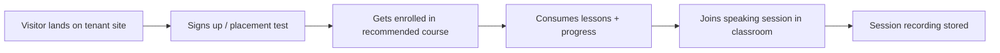

# MVP Scope

The MVP proves that LearnStack can power one real education product **without LearnStack
writing any domain-specific code**. The first tenant happens to be an English-learning
brand; the same code paths must serve a yoga, coding, music, or driving-school tenant
provisioned later.

The platform substrate below — kernel, tenancy + organization, identity, customization,
audit, content, media, education, enrollment, progress, assessment, scheduling,
classroom, notifications, analytics, integrations — ships in **every** deployment. The
domain-specific shape (CEFR levels, vocabulary cards, placement-test rules, …) is loaded
as **tenant customization data** ([ADR-0018](../decisions/0018-tenant-driven-customization-model.md))
at tenant provisioning, not compiled into the binary.

## MVP Goal

Run an end-to-end online English-learning tenant on LearnStack, where:
- The public site is content-managed.
- The course catalog is real.
- Learners enroll and progress through lessons.
- Speaking practice happens **inside** an in-app live classroom with attendance and
  recording.
- The tenant's domain shape (CEFR taxonomy, vocabulary content type, placement-test
  scoring rule, speaking-practice lesson item, lesson-package custom fields) is loaded
  from `TenantContentType`, `TenantLevelTaxonomy`, `TenantScoringRule`, etc. **No
  English-specific code lives in any module.**
- A second tenant — a **yoga studio** — has existed since
  [Phase 02a Packet 7](../roadmap/phase-02a-kernel-tenancy.md), with its own
  taxonomy, content types and branding loaded from its own customization data. The
  substrate-genericity proof is therefore continuous from
  [Phase 02d](../roadmap/phase-02d-walking-skeleton.md) onward, not a checkbox at MVP
  exit.

## Vertical Slice First

Rather than building every module to feature parity before moving on, the MVP cuts a
**vertical slice** from tenant resolution to learner outcome:

Every phase delivers a thin layer across this slice rather than a deep layer in one
module. The same slice runs against the second (non-English) tenant in the cross-tenant
test pass.

## In Scope

### Platform Kernel
- Dapr building blocks wired through `IEventBus` (pub/sub → Kafka), `ICacheService`
  (state → Valkey), `ISecretProvider` (secrets → Vault). See
  [29-dapr-integration.md](29-dapr-integration.md) and
  [ADR-0014](../decisions/0014-adopt-dapr.md).
- APISIX gateway in standalone mode (YAML hot-reload) — JWT verification, CORS,
  rate-limit, custom-host routing. See [30-api-gateway.md](30-api-gateway.md) and
  [ADR-0015](../decisions/0015-api-gateway-apisix.md).
- `IEntitlementProvider` interface with `NullEntitlementProvider` default for
  development; Hub-backed and signed-license-key implementations land in Phase 02c.
- `IHostToTenantResolver` + `platform_host_to_tenant` projection (host → tenant_id),
  populated by Hub for SaaS / by config for Self-Hosted.
- `platform_entitlement_cache` projection (15-min TTL, eager-invalidated on
  `learnstack.hub.entitlement` Dapr pub/sub event).
- Architecture tests run **from Day 1** of Phase 02 (not added later as cleanup).

### Tenancy & Organization
- Create and manage tenants (Hub-driven for SaaS, CLI for Self-Hosted).
- **Organization** as sub-unit within a tenant — every tenant has at least one default
  organization; org-scoped entities carry `OrganizationId`; tenant-wide entities leave
  it null ([ADR-0017](../decisions/0017-tenant-organization-hierarchy.md)).
- Configure tenant branding (logo, colors, typography tokens), with optional
  per-organization override.
- Map custom domains via Hub's `CustomDomain` aggregate; LearnStack mirrors the
  host→tenant mapping. See [27-custom-domain-tls.md](27-custom-domain-tls.md).
- Per-tenant feature flags (catalog-defined; runtime via Valkey cache + Postgres). See
  [21-feature-flags.md](21-feature-flags.md).
- Per-tenant settings (locale, timezone, default notification sender).

### Identity
- Admin login via Keycloak.
- User management with **triple-keyed Membership** `(user_id, tenant_id, organization_id)`.
- Roles (`tenant-admin`, `editor`, `instructor`, `learner`) and permissions with
  explicit scope (Platform / Tenant / Organization per ADR-0017).
- Invitations bound to email + tenant + organization.

### Tenant Customization
Per [ADR-0018](../decisions/0018-tenant-driven-customization-model.md), the
customization aggregates are first-class in MVP:
- `TenantContentType` (JSON Schema for tenant-defined content types).
- `TenantPageBlock` (JSON Schema + renderer key for tenant-defined page blocks).
- `TenantLessonItemType` (JSON Schema + player key for tenant-defined lesson items).
- `TenantLevelTaxonomy` (flat list of level items — CEFR, yoga difficulty, kyu/dan,
  coding difficulty).
- `TenantScoringRule` (sandboxed DSL expression for assessment scoring).
- `TenantCompletionRule` (boolean DSL expression for lesson/module/course completion).
- `TenantCustomFieldDef` (custom fields stored on built-in entities' `custom_fields
  jsonb` column).
- `TenantTemplateLibrary` (notification templates per locale; optional per-org override).
- Admin Studio editor for all of the above.

### Audit
- `LearnStack.Modules.Audit` with `AuditEntry` aggregate, `AuditConfig` per-tenant
  override, partitioned `audit_log` table, and retention job
  ([ADR-0016](../decisions/0016-audit-log-subsystem.md)).
- Capture pipeline (`AuditChangeTrackerInterceptor` → `IAuditStateCapture` →
  `AuditLogBehavior` → `IAuditStore`) in `LearnStack.Infrastructure.Audit`, shared by
  every module.
- MUST-class audit coverage for every command and security event per the
  [Audit Coverage Standard](../standards/18-audit-coverage.md). Read API for admins
  ships with Admin Studio in Phase 06.

### CMS
- Content types backed by `TenantContentType` JSON Schemas; the built-in primitives
  (text, number, image, reference) compose with tenant-defined types.
- Pages with versions, blocks, slug, SEO metadata. Per-tenant block shapes resolve
  through `TenantPageBlock`.
- Navigation menus.
- Draft / published workflow with preview tokens.

### Media
- Upload to SeaweedFS via signed URLs.
- Asset metadata, folders, tags.
- Image variants on upload.
- Use assets inside content and page blocks.

### Education Catalog
- Programs, courses, course versions.
- Modules, lessons, lesson items (with tenant-defined item types).
- Categories, **levels backed by `TenantLevelTaxonomy`**, tags.
- Instructor profiles.
- Catalog visibility and SEO metadata.

### Enrollment & Progress
- Manual learner enrollment.
- Course access by entitlement (per-learner Enrollment entitlement; **not** the
  Hub-side plan entitlement, which is a separate concept).
- Lesson / module / course progress with completion resolved via
  `TenantCompletionRule`.
- Learning events recorded.

### Assessment
- Question banks, questions, quizzes.
- Attempts and scoring resolved via `TenantScoringRule` (e.g. placement-test → CEFR
  recommendation as a tenant-authored rule, not hard-coded English logic).

### Live Classroom
- Self-hosted LiveKit OSS via `ILiveClassProvider`.
- Schedule a Live Session.
- Generate scoped join tokens.
- Audio, video, screen share, in-room chat.
- Attendance from classroom events.
- Recording with consent flow (see [Recording & Consent](16-media-pipeline.md));
  execution **tenant-configurable and off by default**.

### Scheduling
- Instructor availability.
- Bookings (1-on-1 and small group).
- Session lifecycle (scheduled → opened → ended → archived).

### Notifications
- Email channel (transactional).
- Templates resolved through `TenantTemplateLibrary` (per-locale, per-org-override).
- Built-in template stubs for invitation, enrollment, session reminders, password reset,
  assessment completion — tenants override or extend.

### Public Rendering
- Tenant landing pages with composed blocks.
- Course catalog and detail pages.
- Tenant-customization-driven landing page (e.g. the English tenant renders a
  placement-test entry block; the coding tenant renders a track-selector block — both
  using the same page-builder pipeline against different `TenantPageBlock` data).
- 404 + redirect handling.
- Custom-domain resolution via `IHostToTenantResolver`.

### Admin Studio
- Login + tenant switcher (platform admin).
- Content, media, page builder.
- Catalog, course version editor.
- User management (with org filter).
- **Customization editor** (content types, page blocks, lesson item types, level
  taxonomy, scoring rules, completion rules, custom field defs, template library).
- Audit log viewer.
- Live-session schedule view.

### Learner & Instructor Portal
- My courses.
- Lesson player (with custom lesson-item renderers from `TenantLessonItemType`).
- Resume learning.
- Profile basics.
- Speaking session entry to in-app classroom.

### LearnStack Hub (Phase 02c — parallel track)
The Hub Foundation socket ships in parallel with Phase 02b's events/auth wiring; the
**MVP
deployment may run with `NullEntitlementProvider` and skip Hub entirely**, but the
contracts and the option to point at a Hub instance are MVP-complete:
- Separate `learnstack-hub` repository ([ADR-0019](../decisions/0019-learnstack-hub.md)).
- Separate Keycloak realm (`learnstack-hub`).
- `Plan` / `HubSubscription` / `Entitlement` aggregates on the Hub side.
- mTLS + signed JWT + HMAC internal API:
  `PUT /api/internal/tenants/{id}/entitlements`, `POST /api/internal/tenants`,
  `POST /api/v1/internal/license/verify`, `POST /api/v1/usage/report`.
- Feature-based entitlement projection per
  [ADR-0021](../decisions/0021-feature-based-entitlement.md).

### First Tenant Customization Showcase (online English education)
Delivered as **tenant customization data** loaded at provisioning, **not** as code:
- `TenantLevelTaxonomy` with CEFR levels (A1, A2, B1, B2, C1, C2).
- `TenantContentType` for `VocabularyCard`, `SpeakingPrompt`, `LessonPackage`.
- `TenantLessonItemType` for `SpeakingPracticeItem` (with live-session reference).
- `TenantScoringRule` for placement-test → CEFR-level recommendation.
- `TenantCompletionRule` for English-specific lesson-package completion semantics.
- `TenantCustomFieldDef` for `User.preferredAccent`, `InstructorProfile.dialectsTaught`,
  etc.
- `TenantTemplateLibrary` populated with English-locale email templates.

The **second tenant already exists** — the yoga studio seeded in
[Phase 02a Packet 7](../roadmap/phase-02a-kernel-tenancy.md) and rendered in a browser
since [Phase 02d](../roadmap/phase-02d-walking-skeleton.md). Phase 10 is therefore a
**depth** showcase rather than a breadth one: its job is to exercise *every*
customization aggregate against one real tenant, proving the customization surface is
complete. Genericity is already proven, and re-proven on every CI run.

## Deferred

| Capability | Reason for deferral | Owning phase |
|------------|---------------------|--------------|
| Full subscription lifecycle | MVP uses manual enrollment + manual payment + optional Stripe/iyzico via adapter. | Phase 09 (storefront billing adapter delivers the basics; full subscription lifecycle extends post-MVP) |
| Hub-side platform billing & invoicing | Hub Foundation ships entitlements; full plan/billing/invoice is Hub-roadmap. | Phase 09b (parallel Hub track) |
| Hub Marketplace (template / customization-data sharing) | Out of scope for MVP exit. | Phase 12 (optional) |
| Advanced assessment (essay grading, adaptive) | Out of scope; placeholder question types only. | Post-MVP backlog (no phase yet) |
| Native mobile apps | Web-first; mobile considered after Phase 11. | Post-MVP backlog (no phase yet) |
| Complex reporting dashboards | Read models exist; dashboards beyond the basics are post-MVP. | Phase 11 ships baseline dashboards; advanced reporting is post-MVP backlog |
| LTI / xAPI implementation | Integrations module is ready; protocol implementations are post-MVP. | Post-MVP backlog (Integrations module structure lands in Phase 09) |
| Marketplace features | Out of scope. | Not on the roadmap |
| AI features (pronunciation feedback, transcription) | Post-MVP. Hooks in the classroom event stream make later addition straightforward. | Post-MVP backlog (no phase yet) |
| Whiteboard, breakout rooms | Post-MVP. | Post-MVP backlog (no phase yet) |
| Self-service tenant signup | Tenants are provisioned by Hub admin (SaaS) or CLI (Self-Hosted) in MVP. | Post-MVP backlog (no phase yet) |

## Bar for Adding to Core

A request that initially looks like a core feature gets evaluated against:

> *Does this belong in the core because every education product will need it, or does it
> belong as **tenant customization data** because only some domains need it?*

The bar is high. CEFR levels, placement-test scoring rules, vocabulary banks, speaking
practice item types, kyu/dan ranks, asana catalogs, kata progressions, beat-counting
exercises, code-challenge runners, and exam curricula are **all** tenant customization
data, **not** core code. Core only owns generic primitives.

If a candidate feature cannot be expressed via the customization aggregates
(`TenantContentType`, `TenantPageBlock`, `TenantLessonItemType`,
`TenantLevelTaxonomy`, `TenantScoringRule`, `TenantCompletionRule`,
`TenantCustomFieldDef`, `TenantTemplateLibrary`), the first question is "should we
extend a customization aggregate?" — not "should we add a core module?".

## Exit Criteria for MVP

- A visitor opens an English-tenant public site rendered by LearnStack.
- They can start a placement test.
- The test produces a CEFR-level recommendation **through `TenantScoringRule`
  evaluation against the tenant's `TenantLevelTaxonomy`** — no English-specific code
  involved.
- A tenant admin enrolls them in the recommended course.
- They open the course and complete a lesson (with completion resolved via
  `TenantCompletionRule`).
- They book a speaking session.
- They join the in-app live classroom and the instructor joins too.
- The recording metadata model and consent flow are in place, and visible to the
  instructor and tenant admin. Recording execution itself is **tenant-configurable and
  off by default** ([16-media-pipeline.md](16-media-pipeline.md)); whether any session
  actually records during MVP exit depends on the tenant's policy.
- The **second tenant** (the yoga studio, seeded in
  [Phase 02a Packet 7](../roadmap/phase-02a-kernel-tenancy.md)) still runs on the same
  code paths with a different customization data set; cross-tenant isolation tests pass
  under the `learnstack_app` role.

  > A coding bootcamp was the other candidate and was **dropped**. Its distinguishing
  > feature — running a learner's submitted code — falls outside the genericity
  > boundary drawn in
  > [ADR-0018's amendment](../decisions/0018-tenant-driven-customization-model.md):
  > external capability invocation needs a sandbox, a runtime and a resource budget,
  > so it is a plan-gated platform feature written by LearnStack, not a customization
  > row. Choosing it as the genericity proof would have proven the opposite of the
  > intended point.
- Every MUST-class audit event in [Audit Coverage Standard](../standards/18-audit-coverage.md)
  is captured for both tenants and queryable via the Audit admin API.
- LearnStack runs against either `NullEntitlementProvider` (no Hub) or against a real
  Hub instance (mTLS internal API) without code changes — only configuration.
