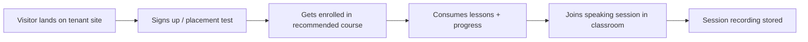

# MVP Scope

The MVP proves that LearnStack can power one real education product without hardcoding that product into the core.

## MVP Goal

Run an end-to-end online English-learning tenant on LearnStack, where:
- The public site is content-managed.
- The course catalog is real.
- Learners enroll and progress through lessons.
- Speaking practice happens **inside** an in-app live classroom with attendance and recording.
- No vertical-specific code lives in core modules.

## Vertical Slice First

Rather than building every module to feature parity before moving on, the MVP cuts a **vertical slice** from tenant resolution to learner outcome:

Every phase delivers a thin layer across this slice rather than a deep layer in one module.

## In Scope

### Platform & Tenancy
- Create and manage tenants.
- Configure tenant branding (logo, colors, typography tokens).
- Map custom domains. See [22-custom-domains.md](22-custom-domains.md).
- Per-tenant feature flags. See [21-feature-flags.md](21-feature-flags.md).
- Per-tenant settings (locale, timezone).

### Identity
- Admin login via Keycloak.
- User management.
- Roles (`tenant-admin`, `editor`, `instructor`, `learner`) and permissions.
- Tenant memberships.
- Invitations.

### CMS
- Content types with the field types listed in [CMS phase](../roadmap/phase-04-cms-media-pages.md).
- Pages with versions, blocks, slug, SEO metadata.
- Navigation menus.
- Draft / published workflow with preview tokens.

### Media
- Upload to MinIO via signed URLs.
- Asset metadata, folders, tags.
- Image variants on upload.
- Use assets inside content and page blocks.

### Education Catalog
- Programs, courses, course versions.
- Modules, lessons, lesson items.
- Categories, levels, tags.
- Instructor profiles.
- Catalog visibility and SEO metadata.

### Enrollment & Progress
- Manual learner enrollment.
- Course access by entitlement.
- Lesson / module / course progress.
- Learning events recorded.

### Assessment
- Question banks, questions, quizzes.
- Attempts and scoring.
- Pass/fail rule.

### Live Classroom
- Self-hosted LiveKit OSS via `ILiveClassProvider`.
- Schedule a Live Session.
- Generate scoped join tokens.
- Audio, video, screen share, in-room chat.
- Attendance from classroom events.
- Recording with consent flow (see [Recording & Consent](16-media-pipeline.md)).

### Scheduling
- Instructor availability.
- Bookings (1-on-1 and small group).
- Session lifecycle (scheduled → opened → ended → archived).

### Notifications
- Email channel (transactional).
- Templates for invitation, enrollment, session reminders, password reset, assessment completion.

### Public Rendering
- Tenant landing pages with composed blocks.
- Course catalog and detail pages.
- Placement-test landing page (renders an English vertical content block).
- 404 + redirect handling.

### Admin Studio
- Login + tenant switcher (platform admin).
- Content, media, page builder.
- Catalog, course version editor.
- User management.
- Live-session schedule view.

### Learner & Instructor Portal
- My courses.
- Lesson player.
- Resume learning.
- Profile basics.
- Speaking session entry to in-app classroom.

### English Vertical (first vertical product)
- CEFR level taxonomy.
- Placement test.
- Vocabulary list content type.
- Speaking practice content type.
- Lesson package definition.
- Teacher matching metadata.

## Deferred

| Capability | Reason for deferral |
|------------|---------------------|
| Full subscription lifecycle | MVP uses manual enrollment + manual payment + optional Stripe/iyzico via adapter. |
| Advanced assessment (essay grading, adaptive) | Out of scope; placeholder question types only. |
| Native mobile apps | Web-first; mobile considered after Phase 11. |
| Complex reporting dashboards | Read models exist; dashboards beyond the basics are post-MVP. |
| LTI / xAPI implementation | Module structure is ready; protocol implementations are post-MVP. |
| Marketplace features | Out of scope. |
| AI features (pronunciation feedback, transcription) | Post-MVP. Hooks in the classroom event stream make later addition straightforward. |
| Whiteboard, breakout rooms | Post-MVP. |
| Self-service tenant signup | Tenants are provisioned by platform admin in MVP. |

## First Vertical Product Candidate

Online English education. It is the test of whether the core stays clean. Every English-specific requirement gets evaluated against:

> *Does this belong in the core because every education product will need it, or does it belong in the English vertical module because only English needs it?*

The bar is high. CEFR levels, placement-test scoring rules, vocabulary banks, and speaking practice content types live in the English vertical, not in core `Level`, `Assessment`, or `Lesson`.

## Exit Criteria for MVP

- A visitor opens an English-tenant public site rendered by LearnStack.
- They can start a placement test.
- The test produces a CEFR-level recommendation through vertical logic.
- A tenant admin enrolls them in the recommended course.
- They open the course and complete a lesson.
- They book a speaking session.
- They join the in-app live classroom and the instructor joins too.
- The recording metadata model and consent flow are in place, and visible to the instructor and tenant admin. Recording execution itself is **tenant-configurable and off by default** ([16-media-pipeline.md](16-media-pipeline.md)); whether any session actually records during MVP exit depends on the tenant's policy.
- A second tenant exists in parallel and the cross-tenant isolation tests pass.
