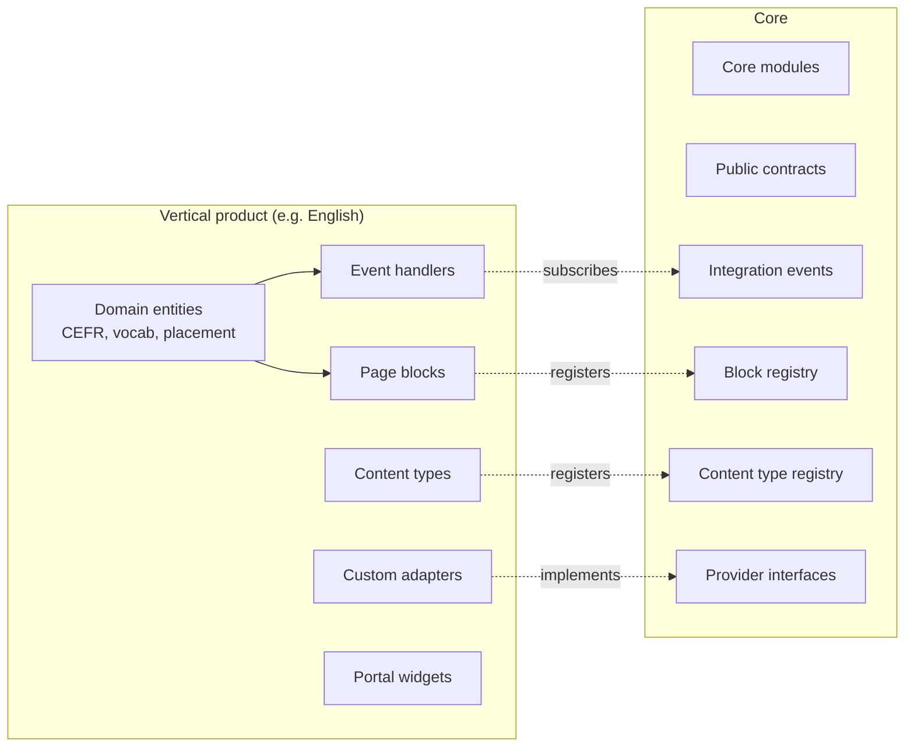

# Extension Model

LearnStack supports vertical education products without modifying the core. Vertical products attach to documented **extension points**.

## Extension Surfaces

## Extension Types

### 1. Domain Extensions
Product-specific entities and workflows. Live in the vertical's own module, never in core.

Examples:
- CEFR taxonomy and level-recommendation logic.
- Exam curriculum mapping for exam-prep verticals.
- Corporate compliance-training rules.

The vertical owns its own EF DbContext slice and its own database tables (prefixed by the vertical, e.g. `english_*`).

### 2. Content Extensions
Product-specific content types and page blocks.

| Extension | Hook |
|-----------|------|
| Content type | `IContentTypeRegistration` — vertical registers its schemas. |
| Page block | `IPageBlockRegistration` — vertical registers block code + JSON schema + renderer component. |

Examples:
- Vocabulary list content type.
- Grammar unit content type.
- Instructor spotlight block.
- Placement-test CTA block.

### 3. Integration Extensions
Provider adapters behind documented interfaces.

| Interface | Adapter examples |
|-----------|-----------------|
| `ILiveClassProvider` | `LiveKitOssLiveClassProvider`, `LiveKitCloudLiveClassProvider`, `DailyLiveClassProvider`, `ManualMeetingLinkProvider` (fallback only) |
| `IPaymentProvider` | `StripePaymentProvider`, `IyzicoPaymentProvider`, `PayTRPaymentProvider`, `OfflinePaymentProvider` |
| `IEmailProvider` | `PostmarkEmailProvider`, `ResendEmailProvider`, `SmtpEmailProvider` |
| `ISmsProvider` | `TwilioSmsProvider`, `NetGsmSmsProvider` |
| `IStorageProvider` | `MinioStorageProvider`, `S3StorageProvider`, `R2StorageProvider` |
| `ISearchProvider` | `MeilisearchSearchProvider`, `OpenSearchSearchProvider`. See [Search](20-search.md) |
| `IRecordingEgressProvider` | `LiveKitEgressProvider` |

### 4. UI Extensions
Tenant- or product-specific frontend code.

| Extension | Hook |
|-----------|------|
| Block renderer | Vertical ships a React component matching the block schema; registered in the renderer's block map. |
| Portal widget | Verticals can register portal dashboard widgets behind a typed slot system. |
| Page template | Verticals can register named templates as starting points in the page builder. |
| Theme tokens | Tenant branding includes a theme-token override layer; verticals may ship preset token packs. |

### 5. Event Extensions
Subscribe to integration events to react to platform changes.

Examples:
- The English vertical subscribes to `EnrollmentCreated` to schedule a recommended placement test.
- The English vertical subscribes to `LiveSessionEnded` to update vocabulary review state.

## Extension Rules

1. **Core defines stable primitives.** Vertical products only consume; they do not modify core entities.
2. **Vertical-specific business rules never leak into core modules.** CEFR mapping does not belong in `Level`. Placement-test scoring does not belong in `Assessment`.
3. **Provider-specific code stays behind adapters.** LiveKit SDK types never appear in `Domain` or `Application`.
4. **Tenant configuration decides which extensions are active.** Feature flags + tenant-scoped registration. See [Feature Flags](21-feature-flags.md) for the registry and runtime evaluation.
5. **Versioning.** Content types and block schemas are versioned per vertical. Upgrades are explicit migrations.

## Example: English Learning Vertical

Core provides:
- Tenant, Page, Course, CourseVersion, Lesson, Assessment, Enrollment, Progress, InstructorProfile, LiveSession, LiveRoom.

English vertical adds:

| Capability | Type |
|------------|------|
| CEFR level taxonomy (A1–C2) | Domain extension |
| Placement test scoring rules | Domain extension + event handler |
| Speaking session metadata | Domain extension referencing `LiveSession` by id |
| Grammar topic taxonomy | Domain extension |
| Vocabulary bank | Content type + Domain extension |
| Teacher matching rules | Domain extension |
| Lesson package definitions | Domain extension |
| Placement-test CTA block | Content extension |
| Speaking-session widget | UI extension |
| Recommendation engine | Subscribes to `AssessmentCompleted` |

If a hypothetical exam-prep vertical were added later, it would do the same — its own module, its own schemas, its own event subscriptions, its own blocks — without touching the English vertical or the core.

## Anti-patterns to Reject

| Anti-pattern | Why bad |
|--------------|---------|
| Adding `cefr_level` to core `Level` table | Vertical leaks into core. |
| Importing `LiveKit.Server` types in `Domain` | Provider lock-in. |
| A vertical module reaching into another module's DbContext | Breaks module boundaries. |
| A vertical module mutating core entities directly | Breaks ownership. |
| Hardcoding a tenant id in vertical code | Verticals must be tenant-agnostic in code; configuration is per-tenant. |
| Feature flags scattered without a registry | Flags must live in `TenantFeatureFlag` with a typed key catalog. See [Feature Flags](21-feature-flags.md). |
