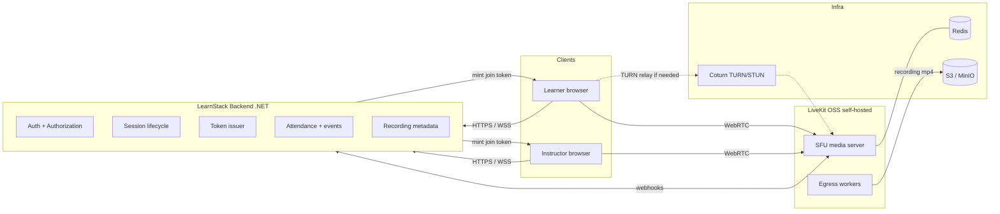

# In-App Live Classroom

LearnStack supports live online education **inside the product experience**, not as a detached external meeting link. Learners and instructors join from the LearnStack portal; the platform owns access control, session lifecycle, attendance, recording metadata, and learning events. Media transport (audio, video, screen share, data channels) is delegated to a provider behind a stable adapter interface.

External meeting links (Zoom, Google Meet) are accepted **only as a temporary fallback** during very early development. They are not the target architecture.

## Decision Summary

| Decision | Choice |
|---|---|
| Realtime transport | WebRTC |
| Topology | SFU (Selective Forwarding Unit) |
| Server | **LiveKit OSS, self-hosted** by default |
| Hosted option | LiveKit Cloud is supported but optional |
| Core platform coupling | Provider-agnostic via `ILiveClassProvider` |
| Recording | Server-side composite via LiveKit Egress, written to S3-compatible storage |
| Custom WebRTC stack | Explicitly out of scope. See ADR 0005. |

The full reasoning behind selecting LiveKit OSS over a custom Mediasoup/Pion stack or LiveKit Cloud as the default is captured in [ADR 0005](../decisions/0005-live-classroom-media-stack.md).

## Why In-App, Not External Links

Owning the classroom inside the product gives LearnStack control over:

- Learner and instructor access control.
- Session lifecycle (created, scheduled, opened, in-progress, ended).
- Attendance calculation and certification.
- Recording metadata and learning analytics.
- In-class events (questions, raise-hand, reactions, screen share).
- Branding and tenant-specific classroom UX.
- Future education-specific tools: whiteboards, vocabulary panels, AI feedback, pronunciation scoring, lesson context.

An external meeting link cannot deliver any of these in a controlled way.

## Why LiveKit OSS, Not Custom WebRTC

A frequently asked question is whether we should build the WebRTC stack ourselves to avoid vendor cost or lock-in. The honest answer is no, and the cost analysis is in [LiveKit Cost Model](08-livekit-cost-model.md). The short version:

- "Custom WebRTC" in practice means **building a custom SFU on top of an open-source library** (Mediasoup, Pion, Janus). The WebRTC protocol itself is too large to reimplement.
- A custom SFU requires writing signaling, room state, simulcast/SVC strategy, reconnection, multi-region routing, recording orchestration, and SDKs for web/iOS/Android. This is 6–12 months of senior engineering plus ongoing maintenance.
- LiveKit OSS provides exactly this layer under Apache 2.0. Self-hosting it has no per-minute or per-GB licence fees; the only cost is infrastructure that any SFU would need.
- Vendor lock-in concern is misplaced: the lock-in is to the WebRTC SDK shape, not to LiveKit Cloud. We can run LiveKit on our own servers and migrate to a different SFU later behind the same `ILiveClassProvider` interface.

## Target Topology



The flow:

1. Learner or instructor authenticates with LearnStack.
2. LearnStack verifies enrollment / session permission and issues a **scoped, short-lived LiveKit join token**.
3. The client connects to LiveKit OSS via WebRTC (`wss://livekit.<tenant-domain>`), using TURN relay only when direct connectivity is blocked.
4. LiveKit emits webhooks (`participant_joined`, `track_published`, `room_finished`, etc.); LearnStack records them as `LiveSessionEvent` rows.
5. Optional recording: LearnStack triggers a LiveKit Egress job; the Egress worker writes the composite recording to S3/MinIO, and LearnStack stores `LiveRecording` metadata.

## Provider-Agnostic Core

The core platform owns education and session semantics. It does **not** depend on LiveKit SDK types in domain or application layers.

Core owns:

- Session scheduling, participants, bookings.
- Attendance, late join, leave/rejoin tracking.
- Classroom access policy (who may join, with what role).
- Room lifecycle state in our own database.
- Recording metadata and retention rules.
- Session materials and in-class events.

LiveKit owns:

- WebRTC signaling and media transport.
- SFU routing, simulcast, congestion control.
- Audio/video/screen-share tracks and data channels.
- Recording/egress execution when requested.

## Domain Concepts

| Concept | Purpose |
|---|---|
| `LiveSession` | A scheduled live event (1-on-1 or group). Bound to a `Booking` and optionally a `Cohort`. |
| `LiveSessionParticipant` | A user assigned to a session, with a role (`host`, `instructor`, `learner`, `observer`). |
| `LiveBooking` | The act of reserving a slot, with status (`pending`, `confirmed`, `cancelled`, `no_show`). |
| `LiveAttendance` | Computed participation record per `LiveSessionParticipant`. |
| `LiveRoom` | A provider room instance (e.g. LiveKit room name + sid), bound 1:1 to a `LiveSession` while open. |
| `LiveRoomProvider` | Adapter discriminator (`livekit_self_hosted`, `livekit_cloud`, `manual_link`). |
| `LiveRoomToken` | A short-lived join token, issued per participant, never persisted long-term. |
| `LiveRecording` | Metadata for a stored recording file (storage key, duration, status, retention). |
| `LiveSessionMaterial` | Files or links surfaced inside the classroom (lesson plan, slides, vocab list). |
| `LiveSessionEvent` | Append-only event: `room_opened`, `participant_joined`, `screen_share_started`, etc. |
| `InstructorAvailability` | Recurring or one-off teaching windows. |

## Provider Interface

```csharp
public interface ILiveClassProvider
{
    string ProviderKey { get; }

    Task<CreateLiveRoomResult> CreateRoomAsync(
        CreateLiveRoomRequest request, CancellationToken ct);

    Task<CreateJoinTokenResult> CreateJoinTokenAsync(
        CreateJoinTokenRequest request, CancellationToken ct);

    Task<EndLiveRoomResult> EndRoomAsync(
        EndLiveRoomRequest request, CancellationToken ct);

    Task<StartRecordingResult> StartRecordingAsync(
        StartRecordingRequest request, CancellationToken ct);

    Task<StopRecordingResult> StopRecordingAsync(
        StopRecordingRequest request, CancellationToken ct);

    Task<ProviderWebhookHandleResult> HandleWebhookAsync(
        ProviderWebhookEnvelope envelope, CancellationToken ct);
}
```

Initial implementations:

- `LiveKitSelfHostedProvider` — primary, used in development and production.
- `LiveKitCloudProvider` — same SDK, different endpoint and credentials; one configuration switch.
- `ManualMeetingLinkProvider` — fallback only, for environments where WebRTC cannot run.

## Token Issuance

Join tokens are issued by LearnStack, never by the client. Each token includes:

- `room` — the LiveKit room name (mapped from `LiveSession.Id`).
- `identity` — `{tenantId}:{userId}`, to avoid cross-tenant identity collision.
- `name` — display name (from `UserProfile`).
- `metadata` — JSON: `{ "role": "instructor", "sessionId": "...", "tenantId": "..." }`.
- `grants` — minimal scope: `roomJoin`, `canPublish` (instructor only by default), `canSubscribe`, `canPublishData`.
- `ttl` — short (5 minutes), refreshed by LearnStack while the session is live.

Tokens are signed with the LiveKit API secret stored as a tenant-scoped secret (or per environment if self-hosted).

## Recording Strategy

Recording is a **first-class but opt-in** capability. See [Cost Model](08-livekit-cost-model.md) for the financial reasoning.

Defaults:

- Recording is **off by default** at the tenant level.
- A tenant administrator can enable it for the entire tenant, for a course, or for a specific session.
- Composite (single-file) recording is the default mode. Track-based recording is available for advanced post-processing scenarios.
- Recordings are written to S3/MinIO; retention defaults to **30 days** and is configurable per tenant up to a tenant-wide retention cap. See [16-media-pipeline.md](16-media-pipeline.md) § Recordings for the storage pipeline and [23-data-protection.md](23-data-protection.md) § Right to Erasure for deletion under KVKK / GDPR.
- Recordings require consent: the classroom UI shows a "Recording" indicator while active, and the tenant onboarding agreement covers consent.

## MVP Scope for the Classroom

The first in-app classroom supports:

- Instructor joins a scheduled session from the instructor portal.
- Learner joins from the learner portal.
- Role-based room permissions (instructor can publish video/audio/screen by default, learners on request).
- Audio and video.
- Screen sharing.
- Participant list.
- Session start/end events.
- Attendance calculation from `participant_joined` / `participant_left` events.
- In-room chat via LiveKit data channels.
- Optional recording with metadata.

Deferred to later phases:

- Whiteboard.
- Breakout rooms.
- AI pronunciation feedback and live transcription.
- Automatic post-recording transcoding pipeline (beyond LiveKit Egress output).
- Native mobile classroom (web mobile is supported).
- Advanced moderation (mute-all, remote screen control).

## Operations: Self-Hosted LiveKit

A working self-hosted deployment needs:

1. **LiveKit server** — Docker container, behind a TLS reverse proxy on `wss://livekit.<domain>`.
2. **Redis** — for multi-node coordination (single-node deployments can skip but multi-node needs it).
3. **TURN server** — Coturn behind UDP/TCP ports, plus TLS for TURNS. Required for users behind restrictive NATs and corporate networks.
4. **Egress workers** — separate containers, started on demand by LiveKit when a recording is requested.
5. **Object storage** — S3 or MinIO with a `recordings/` bucket.
6. **Monitoring** — LiveKit exports Prometheus metrics; Grafana dashboards are available upstream.
7. **Webhooks** — `https://api.<domain>/webhooks/livekit` with HMAC signature verification.

The local development setup runs all of these in `infra/compose/livekit.yml`. Production hardening is covered in [Phase 11](../roadmap/phase-11-production-hardening.md).

## Architecture-Level Risks

- **Bandwidth pricing** is the largest hidden cost. Hosting on AWS/GCP egress is significantly more expensive than on bandwidth-friendly providers (Hetzner, OVH, Contabo). The provider choice for the LiveKit SFU node is a real architectural decision.
- **TURN traffic** can be 15–30% of total bandwidth depending on the user base. Plan for this in capacity estimates.
- **Multi-region** is non-trivial. Start with a single region close to the primary user base; only add regions when measured latency or compliance demands it.
- **Egress CPU** is the bottleneck during recording. Run Egress workers on separate nodes from the SFU so they do not steal CPU from live media.
- **Provider failure handling** — when LiveKit is unreachable, the classroom must fail gracefully (show a clear error, queue retries, optionally fall back to a manual link if explicitly configured).

## Roadmap Touchpoints

- Phase 01 — local LiveKit OSS in Docker Compose for development.
- Phase 02 — `ILiveClassProvider` skeleton, but no implementation yet.
- Phase 08b — in-app classroom MVP, scheduling, attendance, notification flow.
- Phase 09 — recording metadata and classroom usage analytics.
- Phase 10 — English vertical uses the classroom for speaking sessions.
- Phase 11 — production hardening: TURN, monitoring, recording retention, bandwidth budget, cost dashboards.
