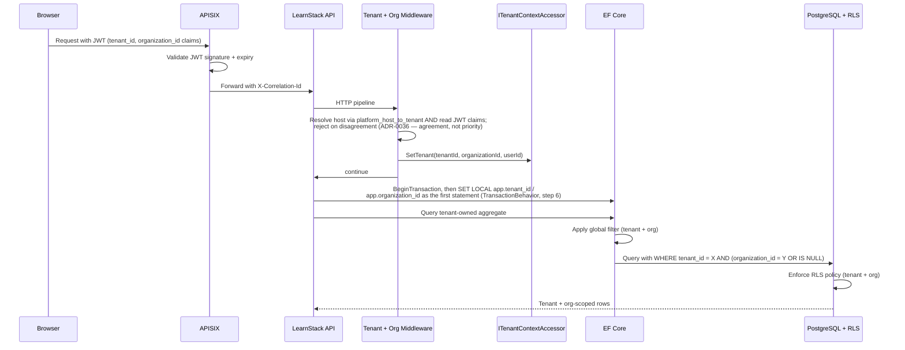

# Tenant Isolation

LearnStack is multi-tenant from the beginning. Tenant isolation is a **layered safety
model**, not a single query convention. Following [ADR-0017](../decisions/0017-tenant-organization-hierarchy.md),
LearnStack also supports an additional **organization** scope inside tenants — defense-
in-depth extends to organization isolation when the entity is org-scoped.

## Decision

Use a shared PostgreSQL database and shared schema, protected by defense in depth at
two scopes (tenant + organization):

- Tenant context resolved per request, background job, and event handler.
- Organization context resolved alongside tenant context where applicable.
- `tenant_id` on every tenant-owned table (mandatory).
- `organization_id` on every org-scoped tenant-owned table (nullable; null = tenant-wide).
- EF Core global query filters for both `tenant_id` and `organization_id`.
- PostgreSQL Row Level Security on every tenant-owned table: **one** permissive policy
  whose predicate `AND`s the tenant term with the organization term, plus the two
  `AS RESTRICTIVE` write guards when the table is org-scoped. Never a second permissive
  policy — PostgreSQL combines those with `OR`, which is the defect
  [ADR-0003 Amendment 3](../decisions/0003-tenant-isolation-defense-in-depth.md)
  corrects. Platform-scoped tables — the ones read *before* the tenant is known — follow
  a different rule; see
  [Database Standards § Table classes](../standards/05-database.md).
- Architecture tests that detect unprotected tenant-owned / org-scoped entities.
- Explicit platform-admin paths for cross-tenant operations (Hub-driven, audited).
- Tenant- and org-aware storage, cache, search, analytics, audit, and logs.

## Defense-in-depth layers

| Layer | Tenant mechanism | Organization mechanism |
|-------|------------------|------------------------|
| Application context | `ITenantContextAccessor.Current.TenantId` (AsyncLocal) | `ITenantContextAccessor.Current.OrganizationId` (AsyncLocal; nullable) |
| EF Core | Global query filter `e.TenantId == currentTenantId` | Global query filter `e.OrganizationId == null OR e.OrganizationId == currentOrgId` |
| PostgreSQL | The tenant term of the single policy: `tenant_id = NULLIF(current_setting('app.tenant_id', true), '')::uuid` | The organization term `AND`-ed into that **same** policy, plus the restrictive `UPDATE` / `DELETE` write guards. Canonical SQL in [Database Standards](../standards/05-database.md) |
| Identity | Single-realm `learnstack` with `tenant_id` JWT claim (default per [ADR-0004](../decisions/0004-authentication-strategy.md); realm-per-tenant is an opt-in for enterprise isolation only) | `organization_id` JWT claim populated from active org membership |
| Cache | Cache key auto-prefixed `{tenant_id}:{key}` | `{tenant_id}:{org_id}:{key}` when org context set |
| Files (SeaweedFS) | Object key prefix `tenants/{tenant_id}/...` | `tenants/{tenant_id}/organizations/{org_id}/...` for org-scoped assets |
| Search | `tenant_id` as a mandatory filter composed **inside** `ITenantSearch` — callers pass criteria, never filter strings. Until Meilisearch's demand gate fires ([ADR-0035](../decisions/0035-demand-gated-infrastructure.md)), search runs on PostgreSQL full-text over tenant-owned tables and inherits Row Level Security; the engine-enforced per-request tenant token arrives with the Meilisearch adapter in [Phase 09](../roadmap/phase-09-billing-integrations-analytics.md) | `organization_id = X OR organization_id IS NULL` clause when org context |
| Jobs (Hangfire) | `JobParams.TenantId` mandatory | `JobParams.OrganizationId` nullable |
| Audit (ADR-0016) | `audit_log.tenant_id` mandatory | `audit_log.organization_id` nullable |
| Logs (Serilog) | Every log scope carries `TenantId` | `OrganizationId` when context set |
| Architecture tests | `Every_TenantOwned_Entity_HasTenantIdAndFilter` | `Every_OrgScoped_Entity_HasOrgIdAndFilter` |

## Isolation flow

**One request, from the browser to a tenant-scoped row.** Each hop narrows what
the next one can see; no hop trusts the one before it to have done so.



In text, for a reader whose renderer does not draw it:

1. The browser sends a request carrying a JWT with `tenant_id` and
   `organization_id` claims.
2. APISIX validates the signature and expiry, then forwards with an
   `X-Correlation-Id`.
3. Middleware resolves the host through `platform_host_to_tenant` **and** reads
   the JWT claims, rejecting on disagreement — agreement, not priority
   ([ADR-0036](../decisions/0036-tenant-resolution-trusted-inputs.md)).
4. It sets the ambient context and the request continues.
5. `TransactionBehavior` opens the transaction and issues
   `SET LOCAL app.tenant_id` / `app.organization_id` as its **first** statement.
6. EF Core applies the global query filter, so the SQL carries the tenant and
   organization predicate before it leaves the process.
7. PostgreSQL enforces the RLS policy on the same row set, and returns only what
   both layers agree on.

## RLS policy templates

The **canonical SQL template** — for both the tenant-only and the tenant + organization
shape — lives in exactly one place:
[Database Standards § Tenant-Owned and Organization-Scoped Tables](../standards/05-database.md).
It is not repeated here. Copying it into a second document is how the four divergent
copies that preceded [ADR-0003 Amendment 3](../decisions/0003-tenant-isolation-defense-in-depth.md)
came about.

Three properties of that template matter to the isolation model described on this page:

- **One policy, one `AND`-ed predicate.** Tenant and organization scope are evaluated
  together. Two separate policies would both be *permissive*, and PostgreSQL combines
  permissive policies with `OR` — under which a tenant-wide row (`organization_id IS
  NULL`) satisfies the organization half on its own and becomes visible to every
  tenant. A second policy may only ever be added `AS RESTRICTIVE`.
- **`ENABLE` and `FORCE ROW LEVEL SECURITY`.** Without `FORCE`, the table owner
  bypasses its own policies — and the default Entity Framework Core arrangement makes
  the application that owner.
- **An explicit `WITH CHECK`.** `USING` decides what is readable; `WITH CHECK` decides
  what is writable.

The `app.scope = 'tenant'` setting is issued by `TransactionBehavior`, alongside
`app.tenant_id` and `app.organization_id` and for the same reason — all three are
transaction-local, so middleware setting them would discard them before the guarded
query ran ([Security Standards § Tenant Context](../standards/11-security.md) is the
single authority). What middleware contributes is the *input*: the request comes from a
tenant-admin role carrying a tenant-wide operation flag (e.g. cross-org reporting), and
the behavior turns that into the session variable. It
widens **reads** across organizations within the caller's tenant; it never widens
writes, and it never crosses a tenant boundary. The default scope (`null` or
`'organization'`) restricts reads to the caller's organization plus tenant-wide rows.

## Default org semantics

Per ADR-0017, every tenant has at least one **default organization** auto-created at
provisioning. Tenants without explicit org structures:

- Have one default org.
- Org switcher is hidden in UI.
- `organization_id` defaults to the default-org id when context is set.
- Tenant-wide entities (`organization_id IS NULL`) still exist for things that don't fit
  in a single org (tenant-level content catalog, brand tokens).

## Platform admin access

Platform admin (LearnStack operator) access must be explicit:

- Operator credentials authenticate against `learnstack-hub` realm (ADR-0004 Amendment 1),
  not `learnstack` realm.
- Cross-tenant queries from Hub go through `/api/internal/*` endpoints with mTLS + signed
  JWT + HMAC; never proxied via APISIX (ADR-0019).
- The LearnStack-side endpoint receives a request with no tenant context and runs the
  query through `EnterPlatformAdminScope(reason)`, which opens a **second connection**
  authenticated as `learnstack_platform` — the `BYPASSRLS` role of the four-role model.
  There is no `learnstack_audit_admin` role, and `learnstack_app` is not a member of
  `learnstack_platform`, so the application role cannot reach the bypass by `SET ROLE`.
  Every cross-tenant access emits a `read-sensitive` audit row, written inside the scope
  under the sentinel platform tenant id. See
  [Database Standards § Database roles](../standards/05-database.md).
- No hidden arbitrary `IgnoreQueryFilters()` usage; architecture test
  `IgnoreQueryFilters_OnlyInPlatformAdminScope` forbids it outside the
  `LearnStack.Modules.Identity.Application.Platform` namespace.

## Background jobs

Every tenant-scoped job payload (`JobParams`):

```csharp
public abstract record JobParams
{
    public required Guid TenantId { get; init; }
    public Guid? OrganizationId { get; init; }
    public string? CorrelationId { get; init; }
    public Guid? InitiatedBy { get; init; }
    public string? IdempotencyKey { get; init; }
}
```

Workers restore tenant + org context (`accessor.SetTenant(tenantId, orgId, null)`) before
reading or writing tenant-owned data. `LearnStackJob<TParams>` base class enforces this
(Nexora analogue: `Nexora/docs/architecture/multi-tenancy.md` and
`Nexora/docs/decisions/0012-tenant-management.md`; LearnStack will implement
equivalent `LearnStackJob<TParams>` in Phase 02).

`PlatformJob<TParams>` (cross-tenant background work) iterates all active tenants:

```csharp
public abstract class PlatformJob<TParams> : LearnStackJob<TParams>
{
    protected sealed override async Task ExecuteAsync(TParams parameters, CancellationToken ct)
    {
        var tenants = await _activeTenantProvider.GetActiveTenantsAsync(ct);
        foreach (var tenant in tenants)
        {
            using var scope = _serviceProvider.CreateAsyncScope();
            scope.ServiceProvider.GetRequiredService<ITenantContextAccessor>()
                .SetTenant(tenant.TenantId, null, null);
            try
            {
                await ExecuteForTenantAsync(parameters, tenant, scope.ServiceProvider, ct);
            }
            catch (Exception ex)
            {
                _logger.LogError(ex, "Platform job failed for tenant {TenantId}", tenant.TenantId);
                // Continue with next tenant; one failure does not abort all.
            }
        }
    }
    protected abstract Task ExecuteForTenantAsync(TParams parameters,
        ActiveTenantInfo tenant, IServiceProvider services, CancellationToken ct);
}
```

## Architecture tests (Phase 02 blocker)

| Test | Asserts |
|------|---------|
| `Every_TenantOwned_Entity_HasTenantId` | Every aggregate marked `[TenantOwned]` (or inheriting `AuditableEntity<>`) has a `TenantId` property and an EF query filter referencing it. |
| `Every_OrgScoped_Entity_HasOrgIdAndFilter` | Every aggregate marked `[OrganizationScoped]` has `OrganizationId` nullable + EF query filter. |
| `Every_TenantOwned_Table_HasRlsPolicy` | Migration scan: every tenant-owned table has `ENABLE` **and** `FORCE ROW LEVEL SECURITY` and **exactly one** permissive policy with an explicit `WITH CHECK`. Two permissive policies fail the test. |
| `Every_OrgScoped_Table_HasOrgRlsPolicy` | Migration scan: the organization term is `AND`-ed inside that single policy — not in a second permissive one — and both `AS RESTRICTIVE` write guards are present. |
| `IgnoreQueryFilters_OnlyInPlatformAdminScope` | Roslyn source scan: `IgnoreQueryFilters()` appears only in `LearnStack.Modules.Identity.Application.Platform` or behind an `architecture-allow: ignore-query-filters ADR-NNNN` marker. |
| `Hangfire_JobPayloads_IncludeTenantId` | Reflection: every `LearnStackJob<TParams>` subclass's `TParams` has `TenantId`. |
| `LearnStackJob_RunAsync_SetsTenantBeforeExecute` | Source-grep + reflection: `RunAsync` is non-virtual; `SetTenant(...)` precedes `ExecuteAsync(...)`. |
| `No_DirectDaprClient_OutsideInfrastructure` | Roslyn source scan: `Dapr.Client.*` only in `LearnStack.Infrastructure.{Caching, Messaging, Secrets}`. |
| `Provider_SDK_Types_NotImported_InDomain` | Provider SDK types (Stripe, Iyzico, LiveKit, Keycloak admin, SeaweedFS) only in `LearnStack.Infrastructure.*` adapters. |

## Storage, cache, search, audit, logs

Tenant + org isolation applies outside PostgreSQL too:

### Storage (SeaweedFS)

```text
tenants/{tenant_id}/organizations/{org_id}/courses/{course_id}/...   ← org-scoped
tenants/{tenant_id}/brand/...                                        ← tenant-wide
```

### Cache (Dapr State Store / Valkey)

```
{tenant_id}:{org_id}:{module}:{entity}:{id}     ← org context set
{tenant_id}:{module}:{entity}:{id}              ← tenant-wide or no org context
platform:{module}:{entity}:{id}                 ← platform-admin operation
```

**The caller composes the key; an adapter only validates it.** `CacheKey.ForTenant`,
`CacheKey.ForOrganization` and `CacheKey.ForPlatform` produce the shapes above, and
every `ICacheService` implementation calls `CacheKey.EnsureValid` and rewrites nothing
([ADR-0038](../decisions/0038-cross-cutting-port-and-event-contracts.md)). An adapter
that prefixed as well would emit `{tenant}:{tenant}:{module}:{entity}` — and a module
writing an unprefixed key would be writing one two tenants can both compute, which is
the whole reason the tenant segment is mandatory.

### Search (Meilisearch — ADR-0012)

```
Mandatory filter: tenant_id = X
Org filter:       organization_id = Y OR organization_id IS NULL
Locale filter:    locale = "tr" (or per-locale index)
```

### Audit (ADR-0016)

```
audit_log.tenant_id NOT NULL
audit_log.organization_id NULL (when applicable)
```

### Logs (Serilog)

```
LogContext.PushProperty("TenantId", tenantId);
LogContext.PushProperty("OrganizationId", organizationId);
LogContext.PushProperty("CorrelationId", correlationId);
```

## References

- ADR-0003 — Tenant Isolation Defense in Depth (Amendment 1 for organization scope).
- ADR-0017 — Tenant + Organization Hierarchy.
- ADR-0038 — Cross-Cutting Port and Event Contracts (all cache adapters validate
  tenant- and organization-qualified keys).
- ADR-0016 — Audit Log Subsystem (audit rows carry tenant + organization).
- [28-platform-tenant-organization.md](28-platform-tenant-organization.md) — conceptual
  model.
- [31-audit-subsystem.md](31-audit-subsystem.md) — audit detail.
- Nexora reference: `Nexora/docs/architecture/multi-tenancy.md`,
  `Nexora/docs/decisions/0002-schema-per-tenant.md`,
  `Nexora/docs/decisions/0012-tenant-management.md`.
