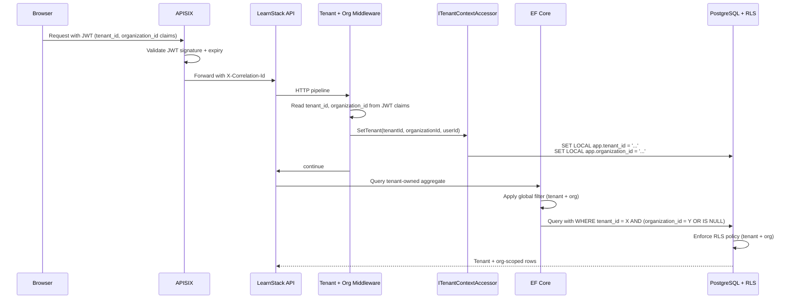

# Tenant Isolation

LearnStack is multi-tenant from the beginning. Tenant isolation is a **layered safety
model**, not a single query convention. Following [ADR-0017](../decisions/0017-tenant-organization-hierarchy.md),
LearnStack also supports an additional **organization** scope inside tenants — defense-
in-depth extends to organization isolation when the entity is org-scoped.

## Decision

Use a shared PostgreSQL database and shared schema, protected by defense in depth at
two scopes (tenant + organization):

- Tenant context resolved per request, background job, and event handler.
- Organization context resolved alongside tenant context where applicable.
- `tenant_id` on every tenant-owned table (mandatory).
- `organization_id` on every org-scoped tenant-owned table (nullable; null = tenant-wide).
- EF Core global query filters for both `tenant_id` and `organization_id`.
- PostgreSQL Row Level Security policies on every tenant-owned table; org-scoped tables
  carry an additional policy.
- Architecture tests that detect unprotected tenant-owned / org-scoped entities.
- Explicit platform-admin paths for cross-tenant operations (Hub-driven, audited).
- Tenant- and org-aware storage, cache, search, analytics, audit, and logs.

## Defense-in-depth layers

| Layer | Tenant mechanism | Organization mechanism |
|-------|------------------|------------------------|
| Application context | `ITenantContextAccessor.Current.TenantId` (AsyncLocal) | `ITenantContextAccessor.Current.OrganizationId` (AsyncLocal; nullable) |
| EF Core | Global query filter `e.TenantId == currentTenantId` | Global query filter `e.OrganizationId == null OR e.OrganizationId == currentOrgId` |
| PostgreSQL | RLS policy `tenant_id = current_setting('app.tenant_id', true)::uuid` | RLS policy `organization_id IS NULL OR organization_id = current_setting('app.organization_id', true)::uuid` |
| Identity | Single-realm `learnstack` with `tenant_id` JWT claim (default per [ADR-0004](../decisions/0004-authentication-strategy.md); realm-per-tenant is an opt-in for enterprise isolation only) | `organization_id` JWT claim populated from active org membership |
| Cache | Cache key auto-prefixed `{tenant_id}:{key}` | `{tenant_id}:{org_id}:{key}` when org context set |
| Files (MinIO) | Object key prefix `tenants/{tenant_id}/...` | `tenants/{tenant_id}/organizations/{org_id}/...` for org-scoped assets |
| Search (Meilisearch) | `tenant_id` as mandatory filter | `organization_id = X OR organization_id IS NULL` clause when org context |
| Jobs (Hangfire) | `JobParams.TenantId` mandatory | `JobParams.OrganizationId` nullable |
| Audit (ADR-0016) | `audit_log.tenant_id` mandatory | `audit_log.organization_id` nullable |
| Logs (Serilog) | Every log scope carries `TenantId` | `OrganizationId` when context set |
| Architecture tests | `Every_TenantOwned_Entity_HasTenantIdAndFilter` | `Every_OrgScoped_Entity_HasOrgIdAndFilter` |

## Isolation flow



## RLS policy templates

### Tenant-only entity

```sql
ALTER TABLE <table> ADD COLUMN tenant_id uuid NOT NULL;
CREATE INDEX ix_<table>_tenant_id ON <table> (tenant_id);

ALTER TABLE <table> ENABLE ROW LEVEL SECURITY;
CREATE POLICY <table>_tenant_isolation ON <table>
    USING (tenant_id = current_setting('app.tenant_id', true)::uuid);
```

### Tenant + Organization entity

```sql
ALTER TABLE <table> ADD COLUMN tenant_id uuid NOT NULL;
ALTER TABLE <table> ADD COLUMN organization_id uuid NULL;
CREATE INDEX ix_<table>_tenant_org ON <table> (tenant_id, organization_id);

ALTER TABLE <table> ENABLE ROW LEVEL SECURITY;
CREATE POLICY <table>_tenant_isolation ON <table>
    USING (tenant_id = current_setting('app.tenant_id', true)::uuid);
CREATE POLICY <table>_organization_isolation ON <table>
    USING (
        organization_id IS NULL                                                  -- tenant-wide row, visible to all orgs in tenant
        OR organization_id = current_setting('app.organization_id', true)::uuid  -- org-scoped row, only matching org
        OR current_setting('app.scope', true) = 'tenant'                         -- tenant-scope operation (admin / reporting) sees all orgs
    );
```

The `app.scope = 'tenant'` setting is set by middleware when the request comes from a
tenant-admin role with a tenant-wide operation flag (e.g. cross-org reporting). The
default scope (`null` or `'organization'`) honours both filters strictly.

## Default org semantics

Per ADR-0017, every tenant has at least one **default organization** auto-created at
provisioning. Tenants without explicit org structures:

- Have one default org.
- Org switcher is hidden in UI.
- `organization_id` defaults to the default-org id when context is set.
- Tenant-wide entities (`organization_id IS NULL`) still exist for things that don't fit
  in a single org (tenant-level content catalog, brand tokens).

## Platform admin access

Platform admin (LearnStack operator) access must be explicit:

- Operator credentials authenticate against `learnstack-hub` realm (ADR-0004 Amendment 1),
  not `learnstack` realm.
- Cross-tenant queries from Hub go through `/api/internal/*` endpoints with mTLS + signed
  JWT + HMAC; never proxied via APISIX (ADR-0019).
- LearnStack-side endpoint receives request with no tenant context; sets a special
  `learnstack_audit_admin` Postgres role for the query, which **bypasses RLS** (and
  emits a `read-sensitive` audit row for every cross-tenant access).
- No hidden arbitrary `IgnoreQueryFilters()` usage; architecture test
  `IgnoreQueryFilters_OnlyInPlatformAdminScope` forbids it outside the
  `LearnStack.Modules.Identity.Application.Platform` namespace.

## Background jobs

Every tenant-scoped job payload (`JobParams`):

```csharp
public abstract record JobParams
{
    public required Guid TenantId { get; init; }
    public Guid? OrganizationId { get; init; }
    public string? CorrelationId { get; init; }
    public Guid? InitiatedBy { get; init; }
    public string? IdempotencyKey { get; init; }
}
```

Workers restore tenant + org context (`accessor.SetTenant(tenantId, orgId, null)`) before
reading or writing tenant-owned data. `LearnStackJob<TParams>` base class enforces this
(Nexora analogue: `Nexora/docs/architecture/multi-tenancy.md` and
`Nexora/docs/decisions/0012-tenant-management.md`; LearnStack will implement
equivalent `LearnStackJob<TParams>` in Phase 02).

`PlatformJob<TParams>` (cross-tenant background work) iterates all active tenants:

```csharp
public abstract class PlatformJob<TParams> : LearnStackJob<TParams>
{
    protected sealed override async Task ExecuteAsync(TParams parameters, CancellationToken ct)
    {
        var tenants = await _activeTenantProvider.GetActiveTenantsAsync(ct);
        foreach (var tenant in tenants)
        {
            using var scope = _serviceProvider.CreateAsyncScope();
            scope.ServiceProvider.GetRequiredService<ITenantContextAccessor>()
                .SetTenant(tenant.TenantId, null, null);
            try
            {
                await ExecuteForTenantAsync(parameters, tenant, scope.ServiceProvider, ct);
            }
            catch (Exception ex)
            {
                _logger.LogError(ex, "Platform job failed for tenant {TenantId}", tenant.TenantId);
                // Continue with next tenant; one failure does not abort all.
            }
        }
    }
    protected abstract Task ExecuteForTenantAsync(TParams parameters,
        ActiveTenantInfo tenant, IServiceProvider services, CancellationToken ct);
}
```

## Architecture tests (Phase 02 blocker)

| Test | Asserts |
|------|---------|
| `Every_TenantOwned_Entity_HasTenantId` | Every aggregate marked `[TenantOwned]` (or inheriting `AuditableEntity<>`) has a `TenantId` property and an EF query filter referencing it. |
| `Every_OrgScoped_Entity_HasOrgIdAndFilter` | Every aggregate marked `[OrganizationScoped]` has `OrganizationId` nullable + EF query filter. |
| `Every_TenantOwned_Table_HasRlsPolicy` | Migration scan: every tenant-owned table has at least one RLS policy. |
| `Every_OrgScoped_Table_HasOrgRlsPolicy` | Migration scan: every org-scoped table has the org isolation policy. |
| `IgnoreQueryFilters_OnlyInPlatformAdminScope` | Roslyn source scan: `IgnoreQueryFilters()` appears only in `LearnStack.Modules.Identity.Application.Platform` or behind an `architecture-allow: ignore-query-filters ADR-NNNN` marker. |
| `Hangfire_JobPayloads_IncludeTenantId` | Reflection: every `LearnStackJob<TParams>` subclass's `TParams` has `TenantId`. |
| `LearnStackJob_RunAsync_SetsTenantBeforeExecute` | Source-grep + reflection: `RunAsync` is non-virtual; `SetTenant(...)` precedes `ExecuteAsync(...)`. |
| `No_DirectDaprClient_OutsideInfrastructure` | Roslyn source scan: `Dapr.Client.*` only in `LearnStack.Infrastructure.{Caching, Messaging, Secrets}`. |
| `Provider_SDK_Types_NotImported_InDomain` | Provider SDK types (Stripe, Iyzico, LiveKit, Keycloak admin, MinIO) only in `LearnStack.Infrastructure.*` adapters. |

## Storage, cache, search, audit, logs

Tenant + org isolation applies outside PostgreSQL too:

### Storage (MinIO)

```
tenants/{tenant_id}/organizations/{org_id}/courses/{course_id}/...   ← org-scoped
tenants/{tenant_id}/brand/...                                        ← tenant-wide
```

### Cache (Dapr State Store / Redis)

```
{tenant_id}:{org_id}:{module}:{entity}:{id}     ← org context set
{tenant_id}:{module}:{entity}:{id}              ← tenant-wide or no org context
platform:{module}:{entity}:{id}                 ← platform-admin operation
```

`DaprCacheService.PrefixKey` auto-prefixes; modules write keys in the unprefixed form
(`{module}:{entity}:{id}`).

### Search (Meilisearch — ADR-0012)

```
Mandatory filter: tenant_id = X
Org filter:       organization_id = Y OR organization_id IS NULL
Locale filter:    locale = "tr" (or per-locale index)
```

### Audit (ADR-0016)

```
audit_log.tenant_id NOT NULL
audit_log.organization_id NULL (when applicable)
```

### Logs (Serilog)

```
LogContext.PushProperty("TenantId", tenantId);
LogContext.PushProperty("OrganizationId", organizationId);
LogContext.PushProperty("CorrelationId", correlationId);
```

## References

- ADR-0003 — Tenant Isolation Defense in Depth (Amendment 1 for organization scope).
- ADR-0017 — Tenant + Organization Hierarchy.
- ADR-0014 — Adopt Dapr (cache + state store carry the org-prefixed keys).
- ADR-0016 — Audit Log Subsystem (audit rows carry tenant + organization).
- [28-platform-tenant-organization.md](28-platform-tenant-organization.md) — conceptual
  model.
- [31-audit-subsystem.md](31-audit-subsystem.md) — audit detail.
- Nexora reference: `Nexora/docs/architecture/multi-tenancy.md`,
  `Nexora/docs/decisions/0002-schema-per-tenant.md`,
  `Nexora/docs/decisions/0012-tenant-management.md`.
