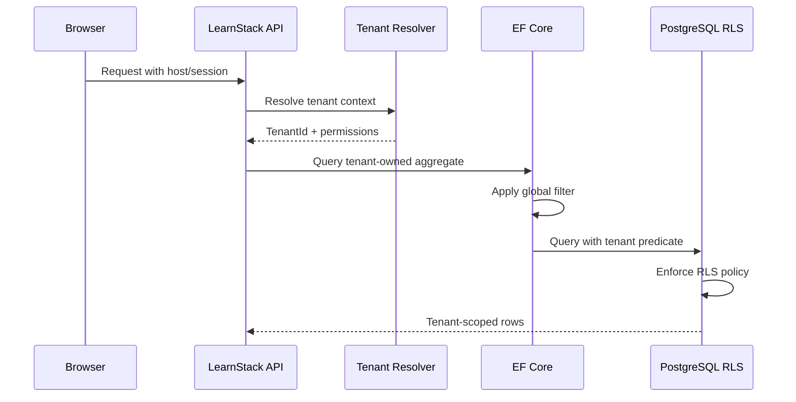

# Tenant Isolation

LearnStack is multi-tenant from the beginning. Tenant isolation is a layered safety model, not a single query convention.

## Decision

Use a shared PostgreSQL database and shared schema initially, protected by defense in depth:

- Tenant context resolved per request, background job, and event handler.
- `tenant_id` on every tenant-owned table.
- EF Core global query filters.
- PostgreSQL Row Level Security on tenant-owned tables.
- Architecture tests that detect unprotected tenant-owned entities.
- Explicit platform-admin paths for cross-tenant operations.
- Tenant-aware storage, cache, search, analytics, and logs.

## Isolation Flow

## Platform Admin Access

Platform admin access must be explicit:

- Dedicated platform-admin endpoints.
- Platform-level permissions.
- Audit logs for cross-tenant reads and writes.
- No hidden arbitrary `IgnoreQueryFilters()` usage.

## Background Jobs

Every tenant-scoped job payload includes:

- `tenantId`
- `correlationId`
- `initiatedBy`
- job purpose
- idempotency key when applicable

Workers restore tenant context before reading or writing tenant-owned data.

## Architecture Tests

Tests must verify:

- Tenant-owned entities implement the tenant-scoped marker/base type.
- Tenant-owned EF configurations define tenant filters.
- RLS migrations exist for production-bound tenant-owned tables.
- Cross-module DbContext access is forbidden.
- Raw SQL is reviewed and tagged.

## Storage, Cache, Search, Analytics

Tenant isolation applies outside PostgreSQL:

- Object storage keys include tenant-safe prefixes.
- Cache keys include tenant id.
- Search indexes are tenant-scoped or enforce tenant filters.
- Analytics events include tenant id and correlation id.

