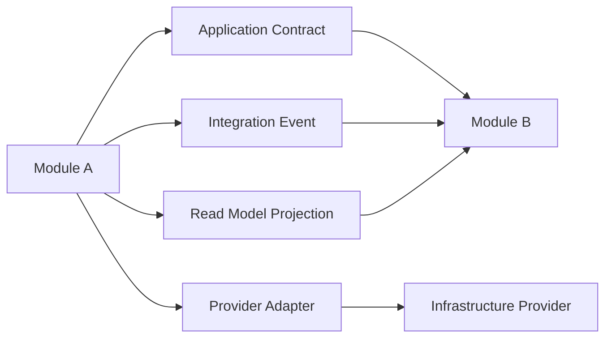
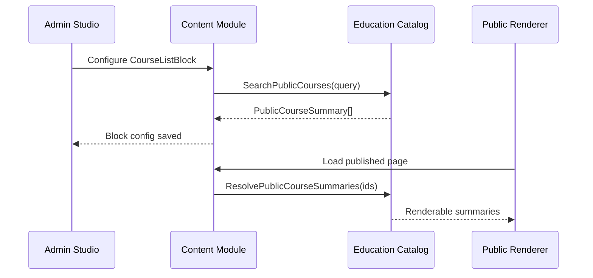

# Cross-Module Contracts

Modules collaborate only through explicit contracts. This keeps the modular monolith extractable and avoids accidental database coupling.

> **2026-08-26 update.** Per [ADR-0038](../decisions/0038-cross-cutting-port-and-event-contracts.md),
> integration events (Mechanism #3 in this document) dispatch through `IEventBus`:
> `InProcessEventBus` today and Dapr pub/sub → Kafka only after its Phase 11 trigger.
> The outbox table remains the durable producer-side buffer. Topic naming convention:
> `learnstack.{module}.{aggregate}`, with `learnstack.hub.{domain}.{event}` as the one
> exception — a fourth segment is accepted only when the second is `hub`, which is what
> `Integration_Event_TopicNames_FollowConvention` enforces. Consumer-side idempotency via per-module inbox guard
> (`IInboxGuard`). Application contracts (Mechanism #1), intra-module domain events
> (Mechanism #2), and read-model projections (Mechanism #4) are unchanged. See
> [15-event-and-outbox.md](15-event-and-outbox.md) for the full producer/consumer flow.

## Allowed Contract Types

## Application Contracts

Use for synchronous cross-module behavior.

Example:

- Content editor needs a course picker.
- Content calls Education's catalog query contract.
- Education returns `PublicCourseSummary`.

Rules:

- Contracts live in `<Module>.Application.Contracts`.
- Return DTOs, not EF entities.
- Write operations are exposed only when the owning module explicitly allows them.

## Integration Events

Use for asynchronous reactions.

Examples:

- Billing emits `OrderPaidV1`.
- Enrollment consumes it and grants entitlements.
- Classroom emits `LiveSessionEndedV1`.
- Analytics consumes it and updates reporting projections.

Rules:

- Events are versioned.
- Events are dispatched through the outbox.
- Consumers are idempotent.
- Tenant context is included in metadata.

## Read Model Projections

Use for fast read access to public data owned by another module.

Example:

- Education owns course structure.
- Content page blocks need published course summaries.
- Education publishes `public_course_summaries`.
- Content reads that projection for rendering and editor pickers.

## Page Block to Course Contract

## Broken References

If a page block references a deleted or unpublished course:

- Editor surfaces a validation warning.
- Publish is blocked for required references.
- Public renderer uses a safe fallback for optional references.
- Broken references are reported in content health checks.

## Forbidden Coupling

- Cross-module EF navigation properties.
- Cross-module joins against module-owned tables.
- Importing another module's domain namespace.
- Sharing mutable domain entities.
- Vertical-specific rules inside core modules.
