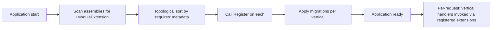

# Extension Points

This document is the **concrete mechanism** behind the [Extension Model](06-extension-model.md). Where the extension model says "verticals add behaviour through extension points," this document says exactly how a vertical assembly registers, what the runtime does with it, and what guardrails prevent the core from being corrupted.

## Vertical Module Layout

A vertical product is a .NET assembly that follows the standard module layout:

```text
LearnStack.Modules.English/
  Domain/
  Application/
  Infrastructure/
  Extensions/
    EnglishModuleExtension.cs      // entry point
    Levels/
      CefrLevelExtension.cs
    Assessments/
      PlacementTestScoringStrategy.cs
    Content/
      VocabularyListBlock.cs
      GrammarUnitBlock.cs
    Pages/
      LevelLandingTemplate.cs
  Migrations/
```

The entry point implements `IModuleExtension`:

```csharp
public interface IModuleExtension
{
    string Key { get; }                  // "english", "exam-prep", ...
    Version Version { get; }
    void Register(IExtensionRegistry registry);
    Task ApplyMigrationsAsync(IServiceProvider services, CancellationToken ct);
}
```

The runtime discovers all `IModuleExtension` implementations at startup, calls `Register(...)`, and applies migrations under the vertical's own EF Core context.

## The Extension Registry

`IExtensionRegistry` is a typed surface — there is no "register anything you want" escape hatch. Each registration goes through a dedicated method:

```csharp
public interface IExtensionRegistry
{
    // Domain extensions
    ILevelExtensionRegistration Levels { get; }
    IAssessmentScoringRegistration Assessments { get; }
    ICompletionRuleRegistration CompletionRules { get; }
    IEntitlementSourceRegistration EntitlementSources { get; }

    // Content extensions
    IPageBlockRegistration PageBlocks { get; }
    IContentTypeRegistration ContentTypes { get; }
    ILessonItemTypeRegistration LessonItemTypes { get; }

    // Integration extensions
    IProviderRegistration<IPaymentProvider> PaymentProviders { get; }
    IProviderRegistration<ILiveClassProvider> LiveClassProviders { get; }
    IProviderRegistration<INotificationChannel> NotificationChannels { get; }

    // UI extensions (consumed by the frontend renderer over the API)
    IFrontendBlockRegistration FrontendBlocks { get; }
    IPortalWidgetRegistration PortalWidgets { get; }

    // Domain events the vertical wants to react to
    IEventSubscriptionRegistration EventSubscriptions { get; }
}
```

Adding a new extension surface requires a code change in the core, which is intentional: the core controls what verticals can hook into.

## Lifecycle



Notes:

- Verticals can declare `requires = ["core"]` or other vertical keys; the loader orders them topologically.
- Migrations are per-vertical, in the vertical's own schema (`english.*`, `exam_prep.*`). The core schema (`public.*`) is owned only by core modules.
- A vertical that fails to register or migrate cleanly **fails application startup**. There is no "skip a broken vertical" mode in production.

## Tenant-Level Enablement

A vertical being loaded is not the same as a tenant using it. Tenants enable verticals via configuration:

```sql
SELECT tenant_id, extension_key, version, settings
  FROM tenant_extensions
 WHERE tenant_id = $1 AND enabled = true;
```

The extension registry exposes `IsEnabledForTenantAsync(extensionKey, tenantId)`. Vertical-provided handlers wrap with a tenant-enable check at the boundary, so unrelated tenants are not affected.

## Examples: How Real Things Plug In

### Adding CEFR levels to the English vertical

The core `Level` model has fields `{ Key, DisplayName, Sort }`. Hardcoding CEFR enum into core is forbidden. Instead:

```csharp
public class CefrLevelExtension : ILevelExtension
{
    public string Key => "cefr";
    public IEnumerable<LevelDefinition> Provide() => new[]
    {
        new LevelDefinition("a1", "A1 — Beginner", sort: 1, metadata: new { cefr = "A1" }),
        new LevelDefinition("a2", "A2 — Elementary", sort: 2, metadata: new { cefr = "A2" }),
        // ...
    };
}

// In EnglishModuleExtension.Register:
registry.Levels.RegisterTaxonomy(new CefrLevelExtension());
```

The core `Level` table stores rows with `taxonomy_key = "cefr"`. Queries that need CEFR semantics filter by `taxonomy_key`. Other verticals (exam prep) register their own taxonomies without conflict.

### Adding a placement test scoring strategy

```csharp
public class PlacementTestScoringStrategy : IAssessmentScoringStrategy
{
    public string Key => "english.placement";
    public Task<ScoringResult> ScoreAsync(Attempt attempt, ScoringContext ctx, CancellationToken ct)
    {
        // section-weighted scoring, CEFR band mapping
    }
}

// In EnglishModuleExtension.Register:
registry.Assessments.RegisterScoringStrategy(new PlacementTestScoringStrategy());
```

Tenant admins assign `english.placement` to a specific assessment via configuration. The core assessment module routes `Attempt`-scoring through the registered strategy by `Assessment.ScoringStrategyKey`.

### Adding a page block

```csharp
public class VocabularyListBlock : IPageBlockDefinition
{
    public string Key => "english.vocabulary-list";
    public Version SchemaVersion => new(1, 0);
    public JsonSchema Schema => /* JSON schema for the block's data */;
    public string ServerComponent => "@learnstack/english/blocks/VocabularyList";
}

// In EnglishModuleExtension.Register:
registry.PageBlocks.Register(new VocabularyListBlock());
```

The CMS allows authors to use the block in any tenant where the English vertical is enabled. Block schema versioning is governed by [Page Builder](17-page-builder.md).

### Subscribing to a core event

```csharp
public class GrantSpeakingCreditOnEnrollment : IIntegrationEventHandler<EnrollmentCreated>
{
    public Task HandleAsync(EnrollmentCreated evt, CancellationToken ct)
    {
        // English-specific: grant initial speaking-session credits
    }
}

// In EnglishModuleExtension.Register:
registry.EventSubscriptions.Subscribe<EnrollmentCreated, GrantSpeakingCreditOnEnrollment>();
```

The handler runs inside the tenant context propagated by the outbox dispatcher (see [Cross-Module Communication](10-cross-module-contracts.md)).

## What Verticals Cannot Do

Hard rules enforced by architecture tests:

- Verticals may not reference core EF entities (`Course`, `Lesson`, `Assessment`, …) via navigation. Read access goes through `IEducationCatalogReadApi`, `IAssessmentReadApi`, etc.
- Verticals may not alter core tables. Migrations are scoped to the vertical's own schema.
- Verticals may not publish events with core event types. Vertical event types are namespaced (`english.placement.completed.v1`).
- Verticals may not depend on each other. The English vertical knows nothing about the Exam Prep vertical.
- Verticals may not bypass `ITenantContext`. They cannot access another tenant's data even if logic suggests it.

Architecture tests:

```csharp
[Fact]
public void Vertical_modules_do_not_reference_core_entity_types()
{
    Types.InAssemblies(VerticalAssemblies)
        .Should()
        .NotHaveDependencyOn("LearnStack.Modules.Education.Domain.Entities")
        .Check();
}
```

## Frontend Extension Points

Page blocks and portal widgets are registered server-side (so the CMS knows about them) and resolved client-side in the Next.js renderer. The renderer ships with a block resolver:

```ts
const resolver = new BlockResolver();
resolver.register('hero', HeroBlock);                        // core block
resolver.register('english.vocabulary-list', VocabularyList); // vertical block
```

A page render fetches the block list from the API; the resolver maps each block to a component. Unknown block keys render as a "block unavailable" placeholder, not an error — this protects renders when a vertical is disabled mid-flight.

See [Frontend Architecture](14-frontend-architecture.md) for the resolver's place in the render pipeline.

## Versioning

- Each `IModuleExtension` declares a `Version`. Core stores the active version per tenant.
- Schema-changing extensions (e.g. new page block field) declare a `SchemaVersion`. Old content stays on its original version; renderers handle multiple schema versions or render a placeholder.
- Removing an extension surface (a registry method) is a core-breaking change and requires a deprecation cycle (one minor version with warning logs, removal in the next major).

## Risks

- Vertical-to-vertical coupling — easy to slip in, hard to remove. The architecture test catches direct references; behavioural coupling (vertical A relies on vertical B's events) is harder. Reviewers should flag any vertical subscribing to another vertical's events.
- Performance — a registry lookup per page block render is fine; an unbounded number of registered handlers per event is not. The registry must support `Where(...)` filtering at registration time so handlers can opt out cheaply.
- Failure isolation — a vertical throwing during event handling must not corrupt the core transaction. Handlers run in their own transaction with their own retry policy.
