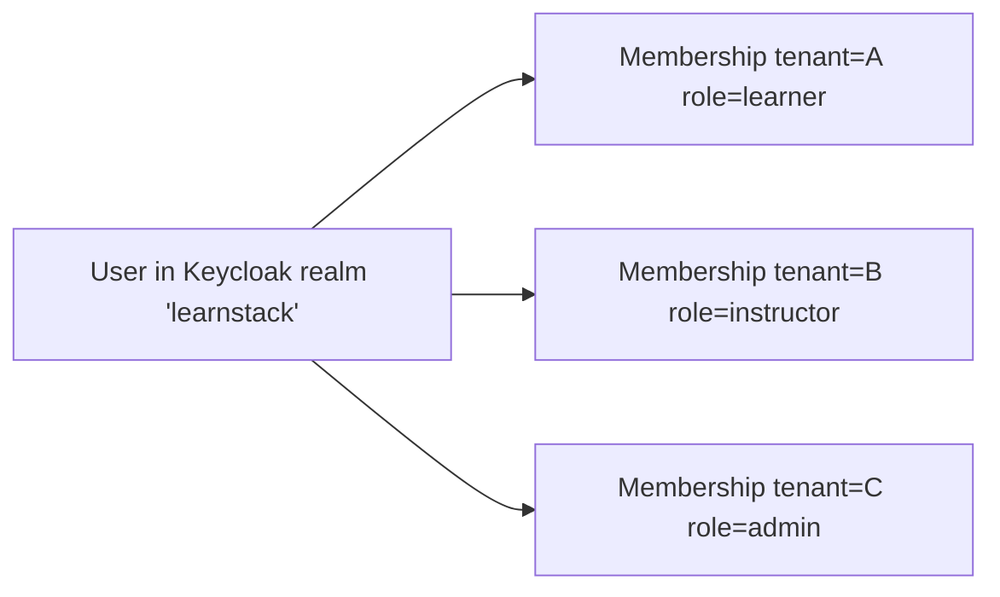
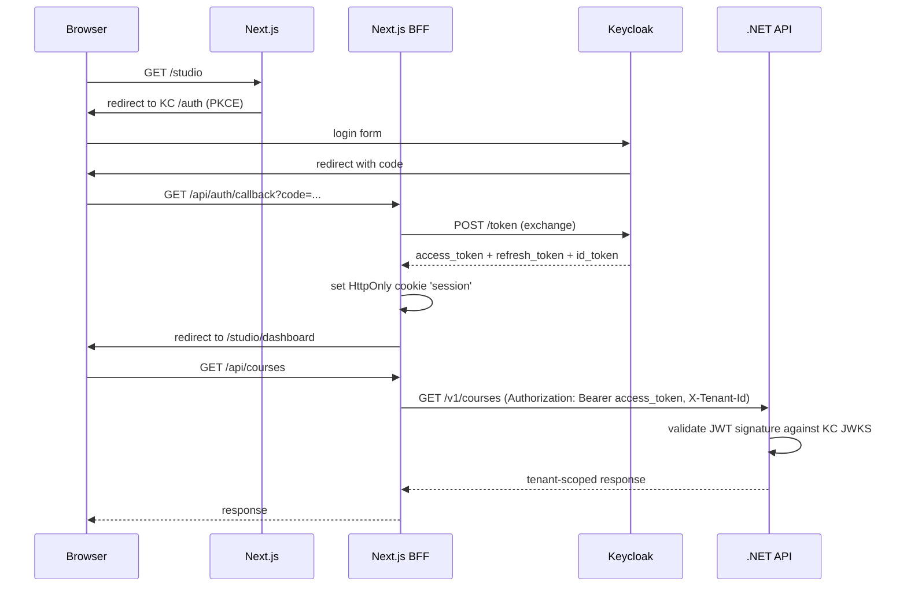
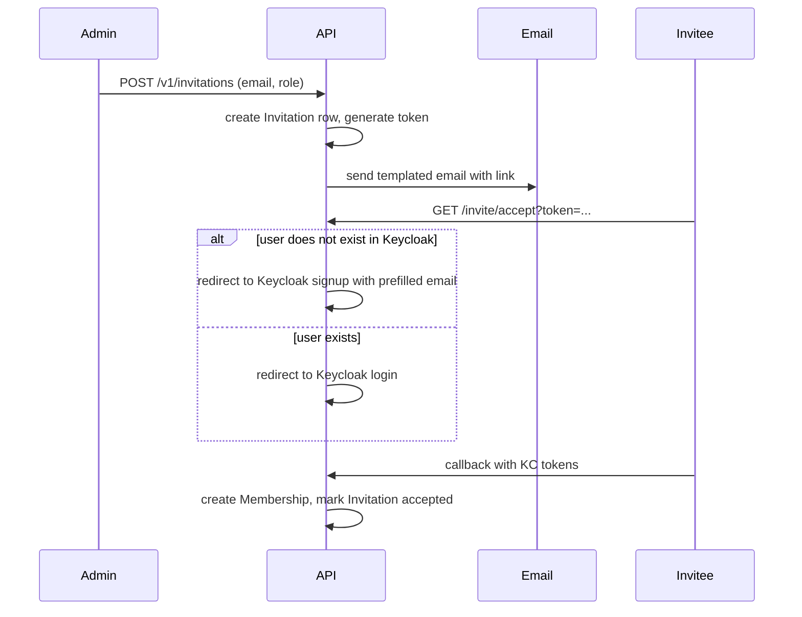

# Identity and Authentication

LearnStack delegates user authentication to a self-hosted identity provider rather than building one inside the .NET application. The default provider is **Keycloak** (Authentik is the documented alternative). The decision and the trade-offs are recorded in [ADR 0004](../decisions/0004-identity-strategy.md).

This document covers what lives where: in Keycloak vs in LearnStack, how multi-tenant identity works, how tokens flow, and how SSO/OIDC integrations land later.

## Why Not Build It Ourselves

Email + password + refresh tokens + invitation flow + password reset + email verification + audit + future SSO + future MFA is a large, security-sensitive surface. Each of these pieces is non-trivial in isolation and easy to get subtly wrong. Off-the-shelf identity systems have been hardened against the entire OWASP authentication catalogue; replicating that hardening costs months of engineering and ongoing vigilance.

The chosen identity provider:

- Implements OIDC (Authorization Code with PKCE), refresh tokens, and standard logout.
- Supports email/password, social logins, SAML, and OIDC federation.
- Has a battle-tested admin UI for user management.
- Is self-hostable (we control the data, the deployment, the upgrades).

The cost is one more service to operate. That is acceptable; see [Team capacity](../../README.md) and the user's stated preference for self-hosted infrastructure.

## What Lives Where

| Concern | Keycloak | LearnStack |
|---|---|---|
| User credentials (password hash, MFA factors) | yes | no |
| OIDC tokens (issuance, signing keys) | yes | no |
| Federation with social/SAML/OIDC providers | yes | no |
| Email verification, password reset emails | yes (or LearnStack via SMTP delegation) | no |
| Global `User` record (canonical identity, email) | mirrored | source for application data |
| `Membership` (per-tenant role, permissions) | no | yes |
| Roles, permissions inside a tenant | no | yes |
| Invitations | no | yes |
| Audit log of identity events | yes (own) | yes (mirrored for cross-events) |
| Profile (display name, photo, bio, preferences) | minimal | yes |

The split keeps Keycloak focused on authentication (knowing who you are) and LearnStack focused on authorisation and domain context (what you can do in which tenant).

## Multi-Tenant Identity Model

A user is **global**. A user has a `Membership` in zero or more tenants. The same email can be a learner in tenant A and an instructor in tenant B without two accounts.

Two realm strategies were considered:

- **Single realm, multi-tenant claims** (chosen). One Keycloak realm; users have a custom claim `memberships: [{tenant_id, role}, ...]` populated by a Keycloak protocol mapper or by LearnStack post-login.
- **Realm-per-tenant**. Cleaner isolation, but a user with memberships in multiple tenants needs separate accounts; user discovery and SSO get more complex.

The single-realm approach matches the "global user, tenant-scoped membership" domain model. Realm-per-tenant remains available for enterprise tenants with strict identity isolation, on a case-by-case basis.

## Token Flow

Key details:

- **PKCE only.** No implicit flow, no client secrets in the browser.
- **Cookies, not localStorage.** Tokens never enter JavaScript; the BFF holds them.
- **Short access token TTL** (5 minutes). Refresh handled silently by the BFF.
- **JWKS rotation.** API validates tokens against Keycloak's JWKS endpoint, with key caching and rotation handling built into the .NET OIDC middleware.

## Tenant Resolution Across Identity

When a user logs in, they may have multiple memberships. The active tenant is determined by:

1. The host the user hit (custom domain / subdomain).
2. An explicit tenant selector for Studio (for cross-tenant operators).
3. The user's last active tenant (cookie hint).

The JWT carries a `tenant_id` claim for the active session; LearnStack rejects requests where the host-derived tenant disagrees with the claim. See [Tenant Isolation](09-tenant-isolation.md).

## Roles and Permissions

Roles live in LearnStack, not in Keycloak. Keycloak does not know what an "instructor" is. The reasons:

- Tenant-scoped roles. A user can be an admin in one tenant and a learner in another. Encoding all of this in Keycloak realm roles bloats tokens and couples authorisation to authentication.
- Permission evolution. Permissions change as the product evolves; iterating in LearnStack is faster than via Keycloak's role API.
- Resource-scoped authorisation. "This instructor can edit *their own* courses" cannot be expressed as a flat role claim.

Mechanism:

- `Membership` carries one or more `Role` references.
- `Role` carries `Permission`s (atomic capabilities like `course.publish`, `enrollment.create`).
- Resource-scoped checks (`course.edit` is allowed only when `course.owner_id == current_user.id`) live in policy classes, evaluated in the application layer.

The JWT carries `sub` (Keycloak user ID), `email`, and `tenant_id`. It does **not** carry the full permission list — that is fetched and cached server-side per request.

## Invitations

Invitations are owned by LearnStack:

Edge cases:

- **Invitee uses a different email at Keycloak signup.** The invitation token is bound to the email; mismatched signup is rejected.
- **Invitation expires.** Default TTL 14 days, configurable per tenant.
- **Invitation revoked.** Tenant admin can revoke; accepting a revoked invitation is rejected.

## SSO and Federation

Tenant-specific SSO is enabled per tenant. Implementation:

- A tenant can configure a SAML or OIDC identity provider in Keycloak (admin API).
- The tenant's public site shows "Sign in with {tenant}" on the login page.
- Users authenticating via tenant SSO land in the LearnStack realm; their Keycloak account is federated, and LearnStack creates or matches a `Membership` based on the email.

This does not require LearnStack code changes per tenant; it is a configuration in Keycloak that LearnStack exposes via a tenant-admin UI.

## MFA

MFA is a Keycloak responsibility. Enforced for:

- Platform admin accounts (mandatory).
- Tenant admin accounts (configurable, defaults to mandatory).
- Other roles (tenant choice).

LearnStack reads the `amr` claim to know whether MFA was used; sensitive operations can require a recent-MFA assertion.

## Logout

- Browser logout clears the session cookie and calls Keycloak's end-session endpoint with the `id_token_hint`.
- Keycloak revokes the refresh token and clears its SSO session.
- Other LearnStack sessions for the same user are not affected unless the user explicitly signs out everywhere.

## Audit

Two audit streams:

- **Keycloak audit** — login success/failure, password change, MFA enroll, account lock. Retained inside Keycloak.
- **LearnStack `AuditLog`** — role change, permission change, invitation, tenant setting change, platform admin bypass. Owned by LearnStack.

Mirrored events (e.g. `user.created`) are propagated via Keycloak webhooks into LearnStack so cross-system queries are possible.

## Local Development

Local Keycloak runs in Docker Compose (`infra/compose/keycloak.yml`). Seed data sets up:

- Realm `learnstack`.
- Two tenants (Tenant A and Tenant B) with admin users.
- A user with memberships in both tenants for cross-tenant testing.
- A platform admin user.

The seed is idempotent and runs on `make seed`.

## Risks

- **Keycloak as a bottleneck for sign-in.** Mitigated by running Keycloak in HA from the start, using PostgreSQL (not the dev H2) as its store, and caching JWKS.
- **Single-realm token bloat.** Memberships claim grows with multi-tenant users; capped at a small N (e.g. 20) in the token; full membership list is fetched server-side.
- **Migration path away from Keycloak.** Unlikely, but: usernames + emails are stable, so a migration to Authentik or a custom provider is mechanical. Refresh tokens would not migrate; users would re-authenticate.
- **Federation complexity.** Per-tenant SSO requires careful admin UX to avoid misconfiguration; tenant admins should not be able to break their own login by removing the only IdP.
