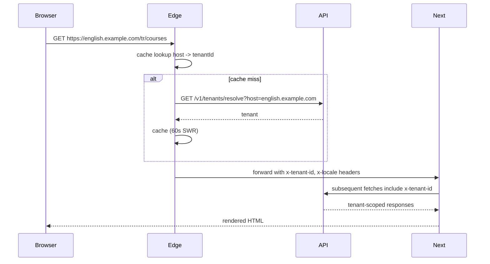

# Frontend Architecture

The frontend is Next.js (App Router). The initial deployment is a **single application** with route segments separating public, studio, and portal experiences; the multi-app split is deferred until concrete need ([ADR 0009 — Frontend Single App First](../decisions/0009-frontend-single-app-first.md)).

This document covers app shape, tenant resolution at the edge, theming, rendering strategies, data fetching, the page-block resolver, and the path to extracting independent apps when warranted.

## App Shape

```text
apps/web/
  src/
    app/
      (public)/
        [tenant-by-host]/        # virtual segment, resolved in middleware
        page.tsx
        courses/
        blog/
      (studio)/
        login/
        dashboard/
        content/
        pages/
        courses/
        media/
      (portal)/
        my-courses/
        lesson/[id]/
        sessions/
      api/                       # only thin BFF proxies, see "Data Fetching"
    components/
      blocks/                    # core page blocks
      ui/                        # design-system primitives
    lib/
      api/
      auth/
      tenant/
      i18n/
    middleware.ts                # tenant + locale resolution
    extensions/                  # client-side block resolver, see Page Builder
packages/
  ui/                            # extracted only once duplication is real
  sdk/                           # generated typed API client
  config/                        # eslint, tsconfig, tailwind shared bits
```

Two boundaries inside one app:

- **Route segments** (`(public)`, `(studio)`, `(portal)`) keep code physically separated.
- **Layouts** in each segment apply different shells (public marketing layout vs admin chrome vs portal chrome).

Splitting into separate apps is governed by [ADR 0009 — Frontend Single App First](../decisions/0009-frontend-single-app-first.md); the split triggers (independent deploy cadence, build-time becomes a bottleneck, separate teams) are listed there.

## Tenant Resolution at the Edge

Next.js middleware resolves the tenant before any route handler runs.

```ts
// src/middleware.ts
export async function middleware(req: NextRequest) {
  const host = normaliseHost(req.headers.get('host') ?? '');
  const tenant = await resolveTenantByHost(host);
  if (!tenant) return new NextResponse(null, { status: 404 });

  const locale = resolveLocaleFromPathOrTenant(req.nextUrl, tenant);

  const res = NextResponse.next();
  res.headers.set('x-tenant-id', tenant.id);
  res.headers.set('x-locale', locale);
  // forward to downstream API calls
  return res;
}

export const config = {
  matcher: ['/((?!_next/static|_next/image|favicon.ico).*)'],
};
```

`resolveTenantByHost` is backed by a short-TTL edge cache (~60 s) that fetches from the API. Tenant deletions invalidate the cache via a webhook into the edge runtime (Vercel KV / Cloudflare KV / equivalent).



## Rendering Strategies

Per segment:

| Segment | Strategy | Notes |
|---|---|---|
| `(public)` | SSR with cache (ISR-like) | Pages built on demand, cached by tenant+slug+locale. Revalidated by webhook on publish. |
| `(studio)` | SSR, no cache | Always fresh; authentication required at the edge. |
| `(portal)` | SSR for lesson shell, CSR for player | Player benefits from client-side state; shell needs SEO/auth. |

Static export is not used; tenants are resolved at request time and the renderer needs per-request context.

## Theming

A tenant's branding flows from the API as design tokens. The renderer applies them as CSS variables on the document root.

```html
<html style="--brand-primary: #1f3a8a; --brand-on-primary: #ffffff; --brand-font: 'Inter';">
```

Tailwind reads these variables via `theme.extend.colors.brand.primary = 'rgb(var(--brand-primary) / <alpha-value>)'`. The first paint is themed; there is no FOUC because tokens are injected into the SSR'd HTML.

Logo and font assets are URLs (served from CDN). Custom fonts are validated and rate-limited at upload to prevent unbounded font payloads.

A `ThemeProvider` is **not** introduced unless dynamic theme switching is needed; the CSS-variable approach handles the static-per-request case more cheaply.

## Data Fetching

Two paths:

- **Server-side** — React Server Components and route handlers call the .NET API directly using the typed SDK in `packages/sdk`. The SDK is generated from OpenAPI on `dotnet build`.
- **Client-side** — interactive components fetch through a thin BFF endpoint under `/api/...` that forwards the request with the user's JWT and the tenant header. The BFF exists to keep API base URLs and CORS off the public web origin, not to wrap business logic.

The SDK is the only sanctioned way to call the API. Hand-rolled `fetch('/v1/...')` calls are blocked by lint (`no-restricted-imports`).

## Authentication on the Frontend

Auth is delegated to the identity provider (Keycloak/Authentik, see [Identity and Authentication](13-identity-and-auth.md)). The frontend uses OIDC Authorization Code with PKCE.

- Session is held in HTTP-only cookies set by the BFF after callback.
- Refresh is handled silently by the BFF; the frontend never sees the refresh token.
- Studio and Portal segments require an authenticated session at the edge; unauthenticated requests redirect to the identity provider.
- Public segment is anonymous-by-default; authenticated users get personalised hero blocks etc.

## Page-Block Resolver

The CMS stores pages as ordered lists of blocks. The renderer resolves each block to a component:

```ts
type BlockResolver = {
  register(key: string, component: BlockComponent): void;
  resolve(key: string): BlockComponent;
};

// At startup:
resolver.register('hero', HeroBlock);
resolver.register('rich-text', RichTextBlock);
// vertical-provided blocks registered by the active vertical packages:
resolver.register('english.vocabulary-list', VocabularyList);
```

Unknown keys render a placeholder (a small "block unavailable" notice in studio preview, an empty fragment in production). This is the renderer-side counterpart to [Page Builder](17-page-builder.md) schema-version handling.

Server Components are preferred for blocks; Client Components are used only for blocks with interactivity (forms, video players, the live classroom panel).

## Live Classroom Integration

The classroom screen is a Client Component under `(portal)/sessions/[id]/room`. It:

- Calls the API to obtain a short-lived LiveKit join token.
- Connects to the configured LiveKit server (URL provided by the API, **not** hardcoded — supports both self-hosted and Cloud configurations).
- Uses `@livekit/components-react` for the UI shell (participants, controls, screen share).
- Renders the lesson-context panel from the API (lesson plan, vocabulary, instructor notes).

The classroom screen is the only place that knows the LiveKit URL; the rest of the application is provider-agnostic.

## Performance Budgets

The public renderer has hard budgets:

- Time to First Byte: < 200 ms at the origin under steady state.
- Largest Contentful Paint: < 2.5 s on a mid-tier mobile device on 4G.
- JavaScript shipped on the public segment: < 150 KB gzipped initial route bundle.

Studio and Portal have higher budgets because they are authenticated apps and benefit from client-side state.

CI runs Lighthouse on representative public pages on every PR; budgets failing the threshold fail the build.

## Accessibility

- WCAG 2.2 AA is the target.
- `axe-core` runs in component tests; violations fail the test.
- Keyboard navigation and focus order are reviewed before any block ships.
- Color contrast is verified for every branded theme — tenant brand tokens that violate contrast cannot be saved.

## Splitting into Multiple Apps Later

If and when the single-app model breaks down (rebuild times, deploy cadence conflicts, separate teams owning different surfaces), the split path is:

1. Extract `packages/ui` first — duplicated primitives become a shared package.
2. Extract `packages/sdk` — already generated, easy lift.
3. Move `(studio)` into `apps/studio`. Keep `(public)` and `(portal)` together initially.
4. Move `(portal)` into `apps/portal` only when its needs diverge from `(public)`.

The route-segment structure today is deliberately shaped to make this extraction mechanical.

## Risks

- **Per-tenant SSR cost** — caching is per `(tenantId, locale, slug)`. Cardinality is bounded; budget memory headroom.
- **Cookie domain scoping** — tenants on custom domains complicate auth cookies. Use SameSite-Lax + path scoping; do not share auth cookies across tenants. Domain registration and TLS flow: [22-custom-domains.md](22-custom-domains.md).
- **Brand-token contrast failures** — surface a warning at save time, not a render-time surprise.
- **Block schema drift** — verticals shipping new block versions while the renderer is older. The placeholder path keeps this safe; CI tests verify forward compatibility.
