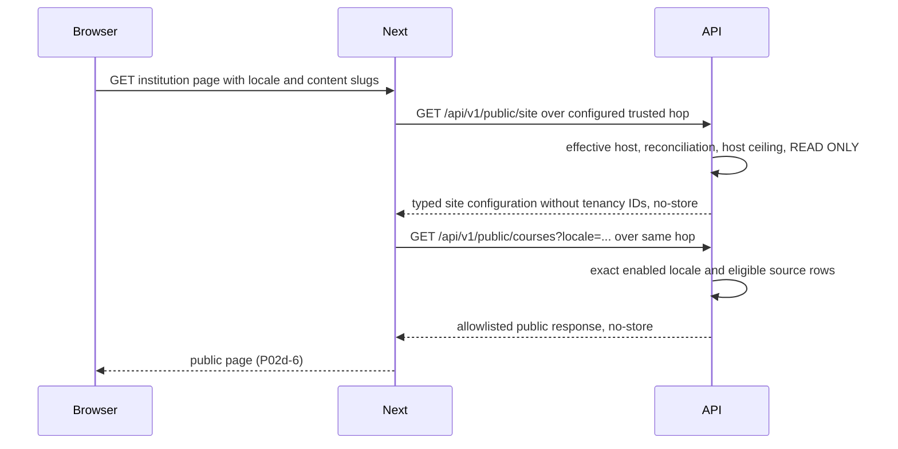

# Frontend Architecture

LearnStack ships **two independent Next.js applications**:

- **`apps/web`** in *this* repository — the tenant-facing surface. One Next.js app
  (App Router) with `(public)`, `(studio)`, and `(portal)` route segments separating
  marketing/CMS rendering, admin Studio, and learner/instructor portals. The multi-app
  split is deferred until concrete need
  ([ADR 0009 — Frontend Single App First](../decisions/0009-frontend-single-app-first.md)).
- **`operator-portal`** in the **separate `learnstack-hub` repository** — the
  **operator portal** at `hub.learnstack.dev`. Operators authenticate against the
  `learnstack-hub` Keycloak realm (ADR-0004 Amendment 1); different realm, different
  user pool, different domain. The two apps **do not share code at runtime**. If a
  shared design-system package is later extracted (`packages/ui`), it is a build-time-only
  dependency. The operator portal scope lives in
  [24-learnstack-hub.md §6](24-learnstack-hub.md) and is not duplicated here.

This document covers `apps/web`: app shape, tenant resolution at the edge, theming with
optional per-organization override, rendering strategies, data fetching, the tenant-driven
block resolver, entitlement-aware UI, custom-domain handling, and the path to extracting
independent apps when warranted.

> **P02d-4 Accepted design — 2026-10-03.** Step 2 delivers site bootstrap;
> Steps 3–4 deliver Education and contract/SDK controls; P02d-5 owns the server consumer.
> [ADR-0052](../decisions/0052-anonymous-public-read-boundary.md) selects host-resolved
> site bootstrap in place of public edge ID lookup. Its
> [approval package](../roadmap/phase-02d-walking-skeleton.md#p02d-4-decision-package-2026-10-03)
> records public DTOs, locale and cache rules, read-only execution and implementation
> steps. Runtime delivery is recorded by the packet; P02d-5 owns server transport.

## App Shape

```text
frontend/
  apps/
    web/                                  # the only tenant-facing Next.js app
      src/
        app/
          (public)/
            [tenant-by-host]/             # virtual segment, resolved in middleware
            page.tsx
            courses/
            blog/
          (studio)/
            login/
            dashboard/
            content/
            pages/
            courses/
            media/
          (portal)/
            my-courses/
            lesson/[id]/
            sessions/
          api/                            # only thin BFF proxies, see "Data Fetching"
        components/
          blocks/                         # built-in primitive page blocks
          ui/                             # design-system primitives
        lib/
          api/
          auth/
          tenant/
          i18n/
        middleware.ts                     # tenant + organization + locale resolution
        extensions/                       # client-side block resolver, see Page Builder
  packages/
    ui/                                   # extracted only once duplication is real
    sdk/                                  # generated typed API client
    config/                               # eslint, tsconfig, tailwind shared bits
```

> **Open in Phase 02d.** Where composite and primitive components live (G41), where the
> UI string catalogue lives (G39) and middleware placement (G36) are open
> in
> [Phase 02d's decision register](../roadmap/phase-02d-walking-skeleton.md#the-decision-register).
> The tree records the plan written before them.

The operator portal (`operator-portal`) is a **separate Next.js application in the
separate `learnstack-hub` repository**; nothing about it lives under this `frontend/`
tree.

Two boundaries inside one app:

- **Route segments** (`(public)`, `(studio)`, `(portal)`) keep code physically separated.
- **Layouts** in each segment apply different shells (public marketing layout vs admin chrome vs portal chrome).

Splitting into separate apps is governed by [ADR 0009 — Frontend Single App First](../decisions/0009-frontend-single-app-first.md); the split triggers (independent deploy cadence, build-time becomes a bottleneck, separate teams) are listed there.

## Tenant + Organization Resolution at the Edge

**Accepted public boundary — 2026-10-03.** Site bootstrap is delivered in Step 2;
P02d-5 Step 3 delivers server transport; page consumers remain P02d-6. The frontend
uses host-resolved site bootstrap, not an edge registry returning tenancy IDs.
[ADR-0052](../decisions/0052-anonymous-public-read-boundary.md) owns the read boundary;
[Frontend Standards](../standards/07-frontend-architecture.md#tenant-resolution)
owns the ongoing frontend rule. P02d-5/G35/G36 delivers the configured transport
and Node middleware entry; P02d-6 owns public page consumers.

The API computes the effective host once under ADR-0036's direct/trusted-hop rules,
resolves its existing mapping and preserves a factory host ceiling. The configured
server caller states the visitor host over the authenticated hop; neither public
configuration nor SDK options select a tenant by ID. Credentials may cause refusal
but cannot widen institution public visibility.


```mermaid
sequenceDiagram
    Browser->>Next: GET institution page with locale and content slugs
    Next->>API: GET /api/v1/public/site over configured trusted hop
    API->>API: effective host, reconciliation, host ceiling, READ ONLY
    API-->>Next: typed site configuration without tenancy IDs, no-store
    Next->>API: GET /api/v1/public/courses?locale=... over same hop
    API->>API: exact enabled locale and eligible source rows
    API-->>Next: allowlisted public response, no-store
    Next-->>Browser: public page (P02d-6)
```

For text renderers:

1. The browser selects an institution host and a locale/content URL.
2. The P02d-5 server caller supplies the trusted transport and visitor host.
3. The API resolves authority and dispatches marked read-only requests.
4. Bootstrap returns enabled/default locales, whole typed theme or null and
   effective attribution, without tenant/organization IDs or raw settings.
5. Education calls use explicit query locale; headers never select content.
6. P02d-6 renders the bounded DTOs. No site/Education representation cache or edge
   lookup cache is part of this API contract; ADR-0053 also forbids shared Next
   representation caches.

The API host resolver's own cache remains unchanged and never calls Hub. Existing
custom-domain push and invalidation contracts remain under their named phases;
this bootstrap does not add an event bus adapter or a second resolver surface.
Organization public visibility intersects host scope with normal context and RLS,
so a claim cannot enlarge what the host serves.

## Rendering Strategies

**P02d-5 Accepted — 2026-10-08.**
[ADR-0053](../decisions/0053-trusted-public-server-rendering.md) accepts native socket
provenance, a server-only configured transport and uncached institution rendering.
Its four-step [delivery plan](../roadmap/phase-02d-walking-skeleton.md#p02d-5-implementation-plan)
records implementation and reviews: Steps 1–3 are complete; Step 4 implements
frontend fences, no-skip outcomes and real-API production HTML/RSC proofs. Its
review closeout remains pending.
P02d-6 owns public page consumers.

Per segment:

| Segment | Strategy | Notes |
|---|---|---|
| `(public)` | Dynamic SSR, no-store | ADR-0053: no shared Next data/route/ISR cache; fresh API eligibility on each new server request. |
| `(studio)` | SSR, no cache | Always fresh; authentication required at the edge. |
| `(portal)` | SSR for lesson shell, CSR for player | Player benefits from client-side state; shell needs SEO/auth. |

Static export is not used; tenants are resolved at request time and the renderer needs per-request context.

## Theming

**P02d-4 Step 2 public projection delivered.** Bootstrap returns
only the whole typed four-color theme or null; frontend safe CSS defaults remain
owned here, without backend duplication. Baseline colors apply independently of
plan. Effective WhiteLabelBranding removes LearnStack attribution only. Public
responses expose no setting keys, raw/partial JSON or organization merge. G42
still owns document injection in P02d-6.

**P02d-2/3 delivered foundation — 2026-10-03.** The theme writer and typed settings
accessor are implemented. Step 2 delivers the anonymous projection; renderer
injection remains P02d-6. The
[whole-theme contract](../modules/tenancy/README.md#whole-theme-setting-and-public-boundary)
selects only tenant-wide color values and no remote subresource. Organization merges,
logo/font URLs and Studio below are Phase 06 targets, not this packet's behavior.
G42 still selects safe HTML injection before P02d-6.

A tenant's branding flows from the API as design tokens, and the renderer applies them
as CSS custom properties in the SSR'd page. The variable names are the `--ls-*` set
[Frontend Architecture Standards § Tenant Branding](../standards/07-frontend-architecture.md#tenant-branding)
names and the shared Tailwind preset reads; this document keeps no second vocabulary.
The accepted [Tenancy contract](../modules/tenancy/README.md#whole-theme-setting-and-public-boundary)
owns P02d-2's admitted tokens and values. P02d-4 accepts their public projection and
attribution rule; Step 2 delivers this API projection.
How the tokens reach the document, and how that mechanism stays compatible with the
nonce-based policy that
[Security Standards § HTTP Headers](../standards/11-security.md#http-headers) sets as
the target, is G42 in the same register.

In Phase 06's planned organization override, when the request carries an organization id
and that organization has a
`BrandingOverride`, the override merges on top of the tenant defaults before injection —
the merged token set is the source of truth for the SSR'd page.

P02d-6's target is a themed first paint through safe SSR injection; no renderer
injection is implemented yet.

Logo/font assets and uploads are Phase 06 targets, requiring safe media and
subresource contracts before their writers or consumers. P02d-2's accepted color-only
theme admits no asset URL, font or cross-origin subresource. It does not authorize
the future CDN/custom-font behavior.

A `ThemeProvider` is **not** introduced unless dynamic theme switching is needed; the
CSS-variable approach handles the static-per-request case (one render = one theme = one
merge of tenant + optional org) more cheaply.

## Data Fetching

Two paths:

- **Server-side** — React Server Components and route handlers call the .NET API directly using the typed SDK in `packages/sdk`. The SDK is generated from the backend's OpenAPI document; [Standards 07 § SDK](../standards/07-frontend-architecture.md) owns when and how.
- **Client-side** — interactive components fetch through a thin BFF endpoint under `/api/...` that forwards the request with the user's JWT and the tenant header. The BFF exists to keep API base URLs and CORS off the public web origin, not to wrap business logic.

The SDK is the only sanctioned way to call the API. Hand-rolled `fetch('/api/v1/...')` calls are blocked by lint — `no-restricted-globals`, because `fetch` is a global and an import rule could never have caught a single call.

## Authentication on the Frontend

Auth is delegated to the identity provider (Keycloak/Authentik, see [Identity and Authentication](13-identity-and-auth.md)). The frontend uses OIDC Authorization Code with PKCE.

- Session is held in HTTP-only cookies set by the BFF after callback.
- Refresh is handled silently by the BFF; the frontend never sees the refresh token.
- Studio and Portal segments require an authenticated session at the edge; unauthenticated requests redirect to the identity provider.
- Public segment is anonymous-by-default; authenticated users get personalised hero blocks etc.

## Page-Block Resolver

The CMS stores pages as ordered lists of blocks. The renderer resolves each block to a
component using a two-tier registry:

```ts
type BlockResolver = {
  register(key: string, component: BlockComponent): void;
  resolveAsync(tenantId: string, key: string): Promise<BlockComponent>;
};

// Tier 1 — at startup, code-registered built-in primitives:
resolver.register('hero', HeroBlock);
resolver.register('rich-text', RichTextBlock);
resolver.register('image', ImageBlock);
resolver.register('content-list', ContentListBlock);
resolver.register('card-grid', CardGridBlock);

// Tier 2 — tenant-defined blocks via TenantPageBlock (ADR-0018):
// the renderer fetches the tenant's TenantPageBlock catalog from the API and dynamically
// resolves keys against a JSON-Schema-driven composite renderer that knows how to read
// the block's data shape and dispatch to a registered renderer-key (e.g. 'default-card').
```

There is **no `english.vocabulary-list` block in code**. A tenant that wants vocabulary
cards declares a `TenantContentType` (`vocabulary-card`) plus a `TenantPageBlock`
(`vocabulary-list` → renderer-key `content-list`); the renderer reads the schema, queries
the content entries, and renders the list with the chosen `content-list` composite.
Different tenants get different blocks **without code changes** — this is the runtime
counterpart to [Page Builder](17-page-builder.md) and the
[Tenant Customization Model](32-tenant-customization-model.md).

Unknown keys render a placeholder (a small "block unavailable" notice in studio
preview, an empty fragment in production). Schema-version mismatches between a
block's stored data and its current `TenantPageBlock` schema fall back to the placeholder
plus a console warning in studio.

Server Components are preferred for blocks; Client Components are used only for blocks
with interactivity (forms, video players, the live classroom panel).

## Entitlement-Aware UI

The frontend reads the tenant's **effective** flags and limits through a thin API endpoint
backed by **`IFeatureFlags`** — the one module-facing read, which composes the plan
projection with the tenant's own flags and lays the platform killswitches over both
([ADR-0045 § 2](../decisions/0045-entitlement-and-feature-flag-socket.md)). The plan
projection alone answers neither: a feature a killswitch has turned off still reads as
granted there, and a tenant flag is not in it at all. Nothing reads
`platform_entitlement_cache` either — its storage belongs to the provider that owns it. The
raw `IEntitlementProvider` projection is for a surface that shows the plan itself — what
was bought rather than what is on — and never for gating. Two hooks expose the gating
data:

```ts
const recordingEnabled = useFeatureFlag(FeatureKeys.ClassroomRecording);
const { current, limit, soft } = useLimit(LimitKeys.ConcurrentLiveSessions);
```

Three UI patterns flow from these:

1. **Feature gating.** Tabs / nav items / buttons whose feature key is not in the
   entitlement projection are hidden, not greyed out. Example: the *Custom Domain* tab
   in Studio is absent for tenants whose plan doesn't include `FeatureKeys.CustomDomain`.
2. **Limit visualization.** Studio shows `current / limit` for limit keys
   (`100/500 users`, `12,000/50,000 classroom minutes`) with a colour ramp at 80% / 95%.
   Limits projected as `soft` show a banner but allow the action; `hard` block at the
   API layer (the frontend re-renders the blocking error from RFC 7807).
3. **Upgrade nudges.** A blocked action surfaces a link to the tenant's plan management
   page in the **Hub** (or, on Self-Hosted, a `mailto:` to the LearnStack vendor) —
   never an in-app "upgrade now" form, because the storefront and billing for the
   tenant's *own* LearnStack subscription live on Hub-side, not in `apps/web`.

The entitlement projection is invalidated eagerly on the
`learnstack.hub.entitlement` Dapr pub/sub event (15-min TTL is the upper bound, not the
typical refresh window).

## Custom Domains

Custom-domain registration, DNS validation, and TLS issuance are **Hub-owned admin
actions**. The tenant-facing surface in `apps/web` is read-only:

- Studio shows the current custom-domain status (`pending-dns`, `pending-tls`,
  `active`, `failed`) by reading the entitlement projection (which mirrors Hub's
  `CustomDomain` aggregate).
- Studio renders a banner with the DNS records the tenant must add and a "Recheck now"
  button that **proxies to a Hub admin endpoint** through the internal API.
- Registering a *new* custom domain happens in the **operator portal**
  (`operator-portal`), not in `apps/web`. Tenant admins request a domain via a form
  in Studio that creates a support ticket / Hub-side request — the actual create is an
  operator action.

Full flow: [27-custom-domain-tls.md](27-custom-domain-tls.md). Auth-cookie scoping for
custom domains uses SameSite-Lax with explicit `Domain=` per active host; no cookies
shared across tenants.

## Live Classroom Integration

The classroom screen is a Client Component under `(portal)/sessions/[id]/room`. It:

- Calls the API to obtain a short-lived LiveKit join token.
- Connects to the configured LiveKit server (URL provided by the API, **not** hardcoded — supports both self-hosted and Cloud configurations).
- Uses `@livekit/components-react` for the UI shell (participants, controls, screen share).
- Renders the lesson-context panel from the API (lesson plan, vocabulary, instructor notes).

The classroom screen is the only place that knows the LiveKit URL; the rest of the application is provider-agnostic.

## Performance Budgets

The public renderer's budgets — time to first byte, Largest Contentful Paint, layout
shift, interaction latency and the initial JavaScript payload — are owned by
[Performance Standards § Initial Budgets and § Bundle Size](../standards/15-performance.md).
This document does not restate them.

Studio and Portal have higher budgets because they are authenticated apps and benefit from client-side state.

CI's Lighthouse job over representative public pages is scaffolded and not yet active.
Whether it activates in [Phase 02d](../roadmap/phase-02d-walking-skeleton.md), and what
it asserts, is G44 in
[Phase 02d's decision register](../roadmap/phase-02d-walking-skeleton.md#the-decision-register).

## Accessibility

- WCAG 2.2 AA is the target.
- Automated `axe-core` checks run through Playwright, per
  [Accessibility Standards § Tooling](../standards/16-accessibility.md#tooling);
  [Testing Standards § End-to-End Tests](../standards/06-testing.md#end-to-end-tests)
  names the owning phase.
- Keyboard navigation and focus order are reviewed before any block ships.
- Color contrast is verified for every branded theme, including the merged tenant and
  organization token set, per
  [Accessibility Standards § Color and Contrast](../standards/16-accessibility.md#color-and-contrast).
  P02d-2's accepted G16(d) contract refuses failing palettes before saving; the
  [Tenancy contract](../modules/tenancy/README.md#whole-theme-setting-and-public-boundary)
  owns supported pairs. Phase 06 decides safe override composition before its writer.

## Splitting into Multiple Apps Later

The operator portal split has already happened: `operator-portal` is a *separate
repository*, not a separate app within this repo. Within `apps/web`, if and when the
single-app model breaks down (rebuild times, deploy cadence conflicts, separate teams
owning different surfaces), the split path is:

1. Extract `packages/ui` first — duplicated primitives become a shared package. (This
   is the same `packages/ui` candidate that, post-extraction, could be a build-time
   dependency for `operator-portal` as well.)
2. Extract `packages/sdk` — already generated, easy lift.
3. Move `(studio)` into `apps/studio`. Keep `(public)` and `(portal)` together
   initially.
4. Move `(portal)` into `apps/portal` only when its needs diverge from `(public)`.

The route-segment structure today is deliberately shaped to make this extraction
mechanical.

## Risks

> **Remaining Phase 02d decision.** Public route caching and its key remain G37 in
> [the phase register](../roadmap/phase-02d-walking-skeleton.md#the-decision-register).
> G16(d) now requires contrast refusal, not a warning-only save. Neither decision
> claims implemented transport or rendering.

- **Per-tenant SSR cost** — caching is per `(tenantId, organizationId?, locale, slug)`.
  Cardinality is bounded; budget memory headroom.
- **Cookie domain scoping** — tenants on custom domains complicate auth cookies. Use
  SameSite-Lax + explicit `Domain=` per host; do not share auth cookies across tenants.
  Domain registration and TLS flow:
  [27-custom-domain-tls.md](27-custom-domain-tls.md).
- **Brand-token contrast failures** — refuse saving a failing palette and explain
  the refusal before rendering. The contrast check also runs against the merged
  tenant+org token set, not only the tenant defaults.
- **Block schema drift** — tenants editing their `TenantPageBlock` schema while pages
  have stored content against the older shape. The renderer's placeholder path keeps
  this safe; the customization editor surfaces the drift at save time and offers a
  migration hint.
- **Entitlement projection staleness** — the 15-min TTL is a fallback; eager
  invalidation via the Dapr event is the typical path. A tenant whose plan was just
  upgraded but whose UI hasn't refreshed sees the new features within seconds of the
  Hub publishing the event, not 15 minutes.
