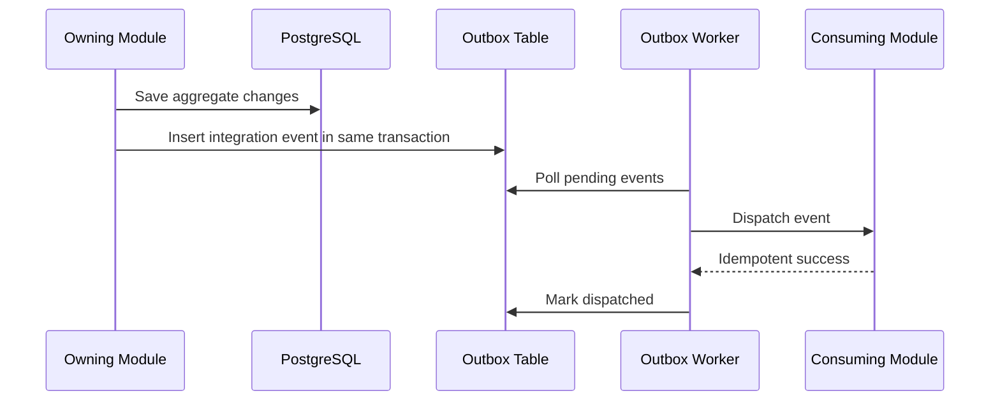

# Events and Outbox

Events allow modules to collaborate without cross-module database coupling.

## Decision

Use domain events within a module and integration events across modules. Integration events are persisted through an outbox in the same transaction as the state change.

## Event Types

| Type | Scope | Example |
|------|-------|---------|
| Domain Event | Inside one module | `CourseVersionPublished` |
| Integration Event | Across modules | `OrderPaidV1` |
| Analytics Event | Reporting stream | `LessonCompleted` |
| Provider Event | External callback | `LiveKitParticipantJoined` |

## Flow

## Rules

- Integration events are versioned.
- Consumers are idempotent.
- Tenant id, correlation id, causation id, and actor id are required metadata.
- Ordering is guaranteed per aggregate when required.
- Failed dispatches retry with backoff.
- Poison events move to a dead-letter state.

## Service Extraction Readiness

The outbox is the future service boundary. If a module becomes a separate service later, its integration events can move from in-process dispatch to a broker without changing the module's domain model.

