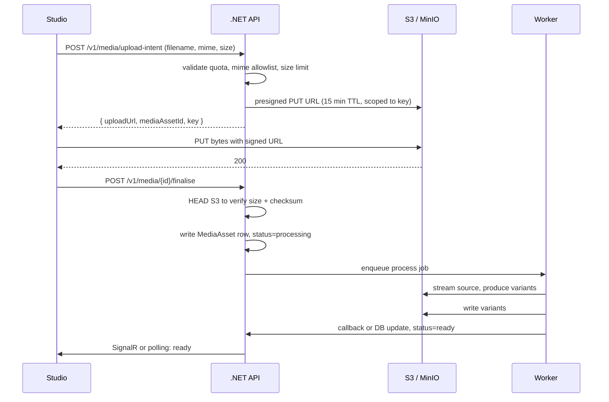
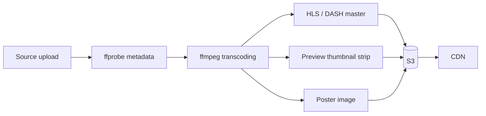
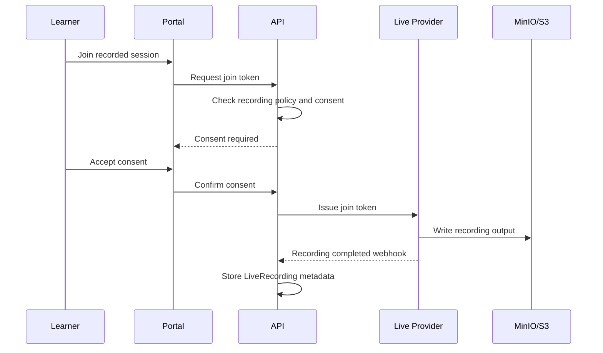

# Media Pipeline

LearnStack hosts user-uploaded media — images for pages and content, videos for lessons, files attached to lessons, and recordings produced by the live classroom. Media is one of the largest cost drivers and one of the easier areas to get wrong. This document defines upload, processing, storage, delivery, lifecycle, and the recording/consent rules that sit on top of all of it.

## Media vs. Live Classroom

Lesson media and live classroom media are different problems with overlapping storage:

| Concern | Lesson media (uploaded) | Live classroom (real-time) |
|---|---|---|
| Protocol | HTTPS, HLS/DASH for video | WebRTC |
| Source | Uploaded asset | Real-time participants |
| Storage | Required; this document | Optional recording; this document, § Recordings |
| CDN | Important | Not on the WebRTC path |
| Provider | S3-compatible storage + optional managed transcoder | LiveKit OSS via `ILiveClassProvider` |

Both share the same object storage and tenant-scoped key layout described below. Live transport is in [07-in-app-live-classroom.md](07-in-app-live-classroom.md).

## Object Storage

- **Local development**: MinIO running in Docker Compose, S3-compatible API.
- **Production**: S3-compatible storage. Specific provider chosen per deployment (AWS S3, Backblaze B2, Wasabi, Cloudflare R2, MinIO on owned infrastructure). The provider choice is operational, not architectural — the application sees the S3 API.

Buckets are per-environment, not per-tenant. Tenant isolation in storage is enforced by the key prefix and signed-URL scoping; bucket-per-tenant explodes operational complexity and is not used.

## Key Layout

```text
{tenant_id}/{category}/{yyyy}/{mm}/{asset_id}/{variant}.{ext}
```

Examples:

```text
ten_01H.../media/2026/05/ast_01J.../original.png
ten_01H.../media/2026/05/ast_01J.../w800.webp
ten_01H.../media/2026/05/ast_01J.../w400.webp
ten_01H.../lesson-video/2026/05/ast_01J.../source.mp4
ten_01H.../lesson-video/2026/05/ast_01J.../hls/master.m3u8
ten_01H.../lesson-video/2026/05/ast_01J.../hls/720p/seg-0001.ts
ten_01H.../recording/2026/05/rec_01K.../composite.mp4
```

The prefix lets us scope tenant operations cheaply (listing, deletion, retention) and matches how IAM policies / RLS for storage signed URLs would be applied.

## Upload Flow

Direct-to-S3 with a server-issued, scoped, time-limited PUT URL. The .NET API never proxies media bytes.



Validation at upload-intent:

- MIME allowlist per category. Images: `image/png`, `image/jpeg`, `image/webp`, `image/svg+xml` (SVG sanitised on processing). Video: `video/mp4`, `video/webm`. Audio: `audio/mpeg`, `audio/ogg`, `audio/webm`. Documents: `application/pdf`.
- Size limits per category and per tenant. Defaults: images 25 MB, video 5 GB, audio 500 MB, documents 100 MB. Tenant-overridable up to a platform cap.
- Tenant quota: total bytes used vs purchased; computed nightly from `MediaAsset` rows.

## Image Processing

Pipeline:

- Source is preserved (`original.<ext>`).
- Variants generated synchronously for small images (< 5 MB) and asynchronously otherwise: `w400`, `w800`, `w1600`, `thumb` (128×128), all in WebP and a JPEG/PNG fallback.
- EXIF data is stripped except orientation; faces and personally identifying metadata are not stored.
- SVG is sanitised (no `<script>`, no `xlink:href` external, no event handlers) before serving.

Delivery is through a CDN. The CDN URL is constructed as `https://cdn.<domain>/{key}` with cache headers controlled by the API.

## Video Processing

Videos are processed asynchronously by a worker pool. The pipeline:



Worker:

- **First implementation**: a queue of ffmpeg-based jobs, processed by long-running .NET workers using a managed ffmpeg binary. Adequate for moderate volume.
- **Scale path**: replace workers with a managed transcoding service (Mux, AWS MediaConvert, Cloudflare Stream) behind an `IVideoTranscoder` interface when in-house transcoding becomes operationally heavy. The interface is in place from the start to avoid future rewriting.

Output:

- HLS master playlist with renditions at 480p, 720p, and 1080p (configurable per tenant tier).
- Per-rendition segment duration: 4 s, suitable for browser adaptive playback.
- Poster image at 5 % of duration.
- Sprite-sheet thumbnail strip every 10 s for hover previews.

Source files are retained for 30 days by default, then archived to a cheaper storage tier. They are needed to re-transcode if encoding profiles change.

## Delivery and Access Control

Three access modes:

- **Public** — `public-read` ACL on the variant; CDN caches aggressively; signed URLs not needed.
- **Tenant-scoped** — variant is private; URL is signed by the API on each request, TTL 1 hour, includes the user's IP for HMAC binding. Suitable for lesson videos.
- **Per-user** — variant is private; signed URL is bound to user ID and IP; TTL 5 minutes. Suitable for assessment material or sensitive content.

The signed-URL service is the only place that mints URLs:

```csharp
public interface IMediaSignedUrlService
{
    Task<Uri> CreatePublicReadUrlAsync(MediaAssetId id, MediaVariantKey variant, CancellationToken ct);
    Task<Uri> CreateTenantScopedReadUrlAsync(MediaAssetId id, MediaVariantKey variant, TimeSpan ttl, CancellationToken ct);
    Task<Uri> CreateUserScopedReadUrlAsync(MediaAssetId id, MediaVariantKey variant, UserId userId, IPAddress ip, TimeSpan ttl, CancellationToken ct);
}
```

CDN-cached URLs (the public mode) are versioned by content hash so cache invalidation is rarely needed (`?v=<hash>`).

## CDN

A CDN sits in front of the storage backend for public and tenant-scoped reads. The CDN:

- Honours `Cache-Control` set by the API.
- Honours signed URLs (CloudFront-style or signed-cookie equivalent for private content; for fully self-hosted MinIO the application proxies private reads via a short-lived URL with no CDN caching).
- Provides per-tenant access metrics (bytes served, request count) that feed into the analytics pipeline.

## Recordings (Live Classroom)

Recording is desired but cost-, privacy-, storage-, and consent-sensitive. The platform supports it as an opt-in capability, never as a default.

### Decision

Recording is supported but **not globally enabled by default**. It must be:

- Tenant-configurable.
- Session-configurable.
- Consent-aware.
- Retention-aware.
- Cost-monitored.

### Pipeline

LiveKit Egress writes recordings directly to the S3-compatible bucket under the `recording/` prefix. LearnStack:

- Receives a webhook when the recording is finalised.
- Creates the `LiveRecording` row with the storage key, duration, status `ready`.
- Triggers a (optional) re-transcode to standard HLS for in-portal playback.
- Applies the tenant retention policy: default 30 days, then deleted (file removed, row marked `purged` with timestamp).

Retention is enforced by a daily Hangfire job. Tenants can pin specific recordings (compliance, complaint investigation) to skip retention.

### Consent Flow



### Recording Metadata

For each recording, store:

- Tenant id.
- Live session id.
- Provider (`livekit_self_hosted`, `livekit_cloud`, ...).
- Provider recording id.
- Storage bucket / key.
- Duration.
- File size.
- Recording type (composite, per-track).
- Consent state per participant.
- Retention deadline.
- Access policy (instructor only, instructor + learners, tenant-admin only).

### Retention

- Default retention is short (30 days at most for MVP).
- A tenant can extend retention within a platform-wide cap.
- Purge jobs delete both metadata row and storage object.
- Legal-hold flag blocks purge when required (compliance, complaint investigation).

### Cost Control

- Recording is **off by default** at the tenant level.
- A tenant administrator can enable it for the entire tenant, for a course, or for a specific session.
- Prefer selective recording over recording every session.
- Track recording minutes and storage growth per tenant. See [08-livekit-cost-model.md](08-livekit-cost-model.md).
- Recording usage surfaces in admin reporting before paying users land on a tenant.

## Lifecycle Rules

- New `MediaAsset` starts `pending` → `uploading` → `processing` → `ready` (or `failed`).
- Failed assets retain their source file for 7 days for diagnostics, then are purged.
- Deleting a `MediaAsset` row marks it `purging`; the background job deletes all variants from storage; only when storage delete succeeds is the row hard-deleted. This prevents orphans.
- A nightly job scans storage for keys without a `MediaAsset` row and reports orphans; orphans older than 7 days are deleted with an audit log.

## Tenant Deletion

When a tenant is deleted:

- All `MediaAsset` rows for the tenant move to `purging`.
- A background job removes the entire `{tenant_id}/` prefix from storage.
- The job is rate-limited and idempotent; failures are retried with exponential backoff.
- An audit record retains the byte count purged for compliance reporting.

## Provider-Agnostic Video Delivery

The default delivery path is direct from S3-compatible storage with signed URLs (private) or CDN (public). Managed video platforms remain available behind a future `IVideoTranscoder` adapter; the interface is in place from the first implementation so a swap is mechanical:

- **Mux** — full managed pipeline.
- **Cloudflare Stream** — bandwidth-friendly managed delivery.
- **Bunny Stream** — low-cost CDN-bundled managed delivery.
- **AWS MediaConvert + CloudFront** — when the rest of the stack is AWS-resident.

A managed adapter takes over transcoding, manifest generation, and CDN; the LearnStack side keeps `MediaAsset` and signed URL minting unchanged.

## Risks

- **Bandwidth cost from video** is the single largest media cost. CDN choice matters; bandwidth-friendly providers (Bunny, Cloudflare) are preferred for production.
- **Re-encoding profile changes** invalidate previous variants. Source retention buys re-encode capability; the schedule for retention extension is a per-tenant configuration.
- **MIME-type lying** — clients can claim a different MIME than the file body. Always re-detect after upload using a magic-byte check before processing.
- **Public-bucket misconfiguration** — buckets are private by default; "public" assets are served by ACL on the object, not by making the bucket public. A `public-read` bucket is an operational red flag.
- **Storage egress in self-hosted MinIO** — when MinIO runs on owned infrastructure, the bottleneck shifts to the colo's bandwidth. Plan capacity accordingly.
