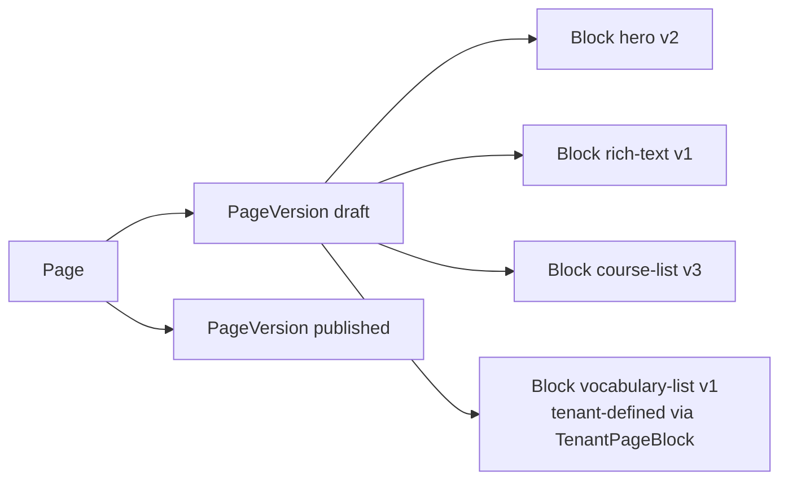

# Page Builder

This document captures the page-builder model referenced by
[Extension Model](06-extension-model.md), [Frontend Architecture](14-frontend-architecture.md),
[Localization](12-localization.md), and
[Tenant Customization Model](32-tenant-customization-model.md). The accepted decision
lives in [ADR-0013 Page Block Schema Versioning](../decisions/0013-page-block-schema-versioning.md);
the data-driven block model is governed by
[ADR-0018 Tenant-Driven Customization Model](../decisions/0018-tenant-driven-customization-model.md).

## Conceptual Model

A page is an ordered list of **blocks**. Each block instance carries a typed payload
and references a `BlockDefinition` by `(key, schemaVersion)`. Two tiers of block
definitions exist:

- **Built-in primitive blocks** — registered in code by LearnStack
  (`hero`, `rich-text`, `image`, `content-list`, `card-grid`, …). The set is closed and
  changes only with a LearnStack release.
- **Tenant-defined blocks** — declared as `TenantPageBlock` rows in the customization
  module ([ADR-0018](../decisions/0018-tenant-driven-customization-model.md)). A
  tenant defines a schema + composite-renderer key (e.g. `default-card`); the runtime
  reads the schema, renders via the named composite, and dispatches to the configured
  built-in renderer. There are **no vertical-prefixed block keys**
  (`english.vocabulary-list` is not a code identifier — it is a `TenantPageBlock`
  row for the English tenant).

## Block Lifecycle Rules

- Payloads are JSON validated against the registered `JsonSchema` at save time.
- Schema versions are immutable; a breaking change ships a new `(key, schemaVersion)` pair.
- Removing a `(key, schemaVersion)` is allowed only after a query confirms zero remaining instances.
- Lazy migration on save in the studio; bulk migration available as a platform-admin operation with dry-run.

## Renderer Safety

- Known `(key, version)` → renders the component.
- Known `key`, unknown `version` → `UnknownVersionBlock` placeholder; log warning.
- Unknown `key` → `UnknownBlock` placeholder; log warning. Triggered when the `TenantPageBlock` defining the block has been deleted or its key has been renamed without migrating the existing page payloads.

Each block renders inside a React error boundary; one block crashing does not crash the page.

## Studio MVP

- No drag-and-drop. Picker + reorder buttons.
- Form-based editing driven by the block's `JsonSchema`.
- Inline preview via the production renderer in preview mode.
- Block edits are saved to the draft `PageVersion`; published version untouched until "Publish".

## Localisation

Two strategies per block:

- **Locale-baked block** (default): one block instance per locale; page-level locale selector in the studio.
- **Localised fields inside payload**: for translation-heavy blocks where switching the entire page version per locale is awkward (e.g. rich text), payload uses `LocalizedText` per field.

See [Localization](12-localization.md).

## Cross-Module References

When a block references data owned by another module (e.g. `course-list` block references the Education module's courses), the reference resolves through the owning module's read API — never through cross-module SQL or EF navigation. See [Cross-Module Contracts](10-cross-module-contracts.md).
