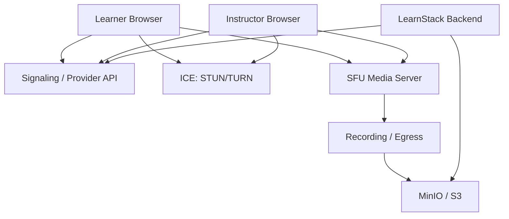

# WebRTC Build vs Adopt Analysis

This document answers whether LearnStack should build its own WebRTC infrastructure or adopt an existing open-source SFU such as LiveKit.

## Decision Summary

LearnStack should build the product-level classroom experience itself, but should not build a WebRTC SFU, TURN infrastructure, or recording pipeline from scratch.

Recommended path:

- Use browser WebRTC APIs on the frontend.
- Use a provider-agnostic classroom module in the .NET backend.
- Adopt LiveKit as the preferred SFU/provider implementation.
- Use self-hosted LiveKit when operational ownership is acceptable.
- Use LiveKit Cloud when speed and managed reliability matter more.

This means a paid service is not mandatory. The important decision is to adopt a mature media server instead of writing a new one.

## What Building WebRTC Ourselves Means

| Level | What We Build | Feasibility |
|-------|---------------|-------------|
| Product UI | Classroom screens, lesson context, controls, teacher tools | Required |
| Signaling | Offer/answer exchange, room membership, reconnection state | Possible, but not enough |
| P2P calls | Browser-to-browser one-on-one WebRTC | Useful for prototypes |
| TURN/STUN operations | NAT traversal infrastructure | Possible, operationally sensitive |
| SFU media server | Multi-party routing, simulcast, bandwidth adaptation | Expensive and risky |
| Recording/egress | Composite recordings, individual tracks, storage export | Expensive and operationally risky |
| Global media operations | Regions, routing, monitoring, failover, cost control | Very expensive |

## WebRTC Components

WebRTC gives browsers media primitives. It does not provide a complete classroom product, signaling server, production SFU, recording pipeline, or operational model.

## Why P2P Is Not Enough

P2P can work for simple one-on-one prototypes. It is not enough for LearnStack because:

- Group classes require every participant to upload to every other participant.
- Recording is difficult without server-side media access.
- Attendance quality signals are harder to centralize.
- Network and device differences create inconsistent classroom quality.
- Teacher-side upload bandwidth becomes a bottleneck in group sessions.
- Moderation, permissions, reconnection, and screen sharing are harder to standardize.

## Why Not Write Our Own SFU

A production SFU requires:

- RTP/RTCP handling.
- ICE, DTLS, SRTP.
- Simulcast and SVC support.
- Codec negotiation.
- Congestion control.
- Packet loss recovery.
- Selective subscription.
- Speaker detection.
- Reconnection behavior.
- Browser compatibility handling.
- Observability and debugging.
- Security hardening.
- Multi-node routing.
- Recording and egress integration.

This is a separate product line. LearnStack's value is education workflow and platform composition.

## Candidate Options

### LiveKit

Best fit for LearnStack.

Pros:

- Open-source and self-hostable.
- Managed Cloud option.
- Web, mobile, and backend SDKs.
- Room, participant, token, webhook, and egress concepts match LearnStack needs.
- Good path from MVP to scale.

Cons:

- Cloud is usage-based.
- Self-hosting requires media operations skill.
- Recording needs careful cost and infrastructure planning.

### mediasoup

Powerful low-level SFU.

Pros:

- Very flexible.
- Excellent for deep media control.
- Signaling agnostic.

Cons:

- Lower-level than LiveKit.
- More application and operational work falls on LearnStack.

### Janus

Mature general-purpose WebRTC server.

Pros:

- Mature.
- Flexible plugin architecture.

Cons:

- More infrastructure-shaped than product-shaped.
- Less aligned with a modern room/token/egress app developer experience.

### Custom Pion-Based SFU

Possible but not recommended.

Pros:

- Maximum control.
- Go ecosystem.

Cons:

- Highest engineering and operational cost.
- Long runway before classroom quality is competitive.
- Distracts from LearnStack's education platform goals.

## Final Recommendation

Do not build a custom WebRTC media stack from scratch.

Build LearnStack's classroom UX, scheduling, attendance, consent, analytics, and provider abstraction. Adopt LiveKit as the preferred implementation because it offers both a self-hosted path and a managed path.

