# MVP Vertical Slice

The roadmap is broad. The first implementation should still move through a narrow vertical slice.

## Relationship to the Roadmap

The roadmap (`docs/roadmap/`) is organised **module by module**: tenancy → identity → CMS → catalog → renderer → portal → assessment → classroom → billing. This is a deliberate construction order — clean module boundaries are easier to enforce when each phase builds one module deeply rather than thin layers across many.

The vertical slice described here is not an alternative construction plan. It is the **exit validation milestone** that every applicable phase must support by its completion:

- After Phase 02b — the slice's "tenant resolves; request lands" portion works.
- After Phase 04 — the slice's "tenant publishes a landing page" portion works.
- After Phase 05 — "publish one course version" works.
- After Phase 06 — the landing page and the course detail page render publicly.
- After Phase 07 — manual enrollment + learner sees the course + completes a lesson.
- After Phase 08b/08c — booking a speaking session, joining the in-app classroom, attendance recorded.
- After Phase 10 — the English vertical layers CEFR / placement / vocabulary on top.

So: the **module-per-phase order is the build sequence**; the **vertical slice is the readiness test** at each phase exit. A phase is not "done" if the slice up to that point cannot be re-run end to end against a clean seed.

## Goal

Prove that LearnStack can power one real English learning flow without building every platform capability first.

## Slice

```mermaid
flowchart LR
    Tenant["Create tenant"] --> Page["Publish landing page"]
    Page --> Course["Publish one course"]
    Course --> Enroll["Manually enroll learner"]
    Enroll --> Lesson["Learner completes lesson"]
    Lesson --> Session["Book live speaking session"]
    Session --> Room["Join in-app classroom"]
    Room --> Attendance["Record attendance"]
```

## Included

- One tenant.
- One public landing page.
- One course with one published version.
- One module and a few lessons.
- Manual enrollment.
- Learner portal.
- Instructor availability.
- One-on-one live speaking session.
- In-app classroom via provider adapter.
- Attendance from classroom events.
- Recording metadata and consent model, even if recording is disabled initially.

## Excluded

- Full billing.
- Full page builder polish.
- Advanced assessment engine.
- AI pronunciation feedback.
- Multi-region classroom operations.
- Marketplace features.

## Why This Matters

This slice keeps the platform honest. It exercises tenancy, content, catalog, enrollment, portal, scheduling, classroom, and analytics without requiring every module to reach final maturity.

