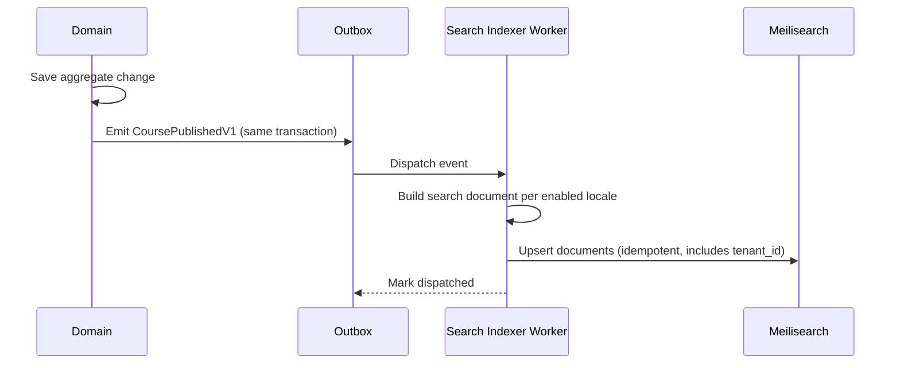
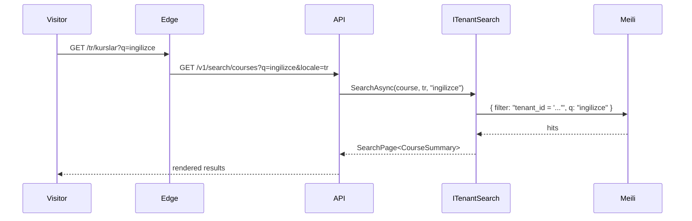

# Search

LearnStack uses **Meilisearch** for tenant-scoped full-text search across courses, content entries, media metadata, and lesson item titles. This document defines index layout, tenant + locale isolation, indexing pipeline, query path, and operational rules.

The strategic decision lives in [ADR 0012: Search Strategy](../decisions/0012-search-strategy.md). This document is the implementation reference.

## Scope

Search covers:

- Course catalog browsing (public site + studio).
- Content entry lookup (CMS picker, admin studio).
- Media library search (filename, alt text, tags).
- Lesson item discovery inside a course version.

Out of scope for the search infrastructure itself:

- Learner progress search → use the analytics read models.
- Audit log search → audit aggregate has its own indexed view.
- Live recording transcript search → deferred until transcription is in scope.

## Index Layout

LearnStack ships one Meilisearch instance per environment. Indexes are named by **kind + locale**:

```
<environment>-<kind>-<locale>
```

Examples:

- `prod-course-en`
- `prod-course-tr`
- `prod-content-entry-en`
- `prod-media-en`

Rules:

- **Tenant isolation** is enforced as a **filter** on every query (`tenant_id = ?`), not by index-per-tenant. Meilisearch lacks per-document RLS, so the query layer is the only enforcement point — this is treated as a security-sensitive surface in [11-security.md](../standards/11-security.md) § OWASP A01.
- **Locale isolation** is enforced as an **index split**. A search for "ingilizce başlangıç" against the Turkish index must never hit the English index. This matches ICU tokenisation differences and avoids cross-language false positives.
- Documents are versioned per `(kind, locale)` so additive schema changes are non-breaking.

### Why not index-per-tenant?

- 10,000+ tenants × 4 locales × 4 kinds = 160,000 indexes. Meilisearch is not optimised for this cardinality.
- Per-tenant indexes complicate platform-admin cross-tenant search (legal hold, abuse investigation).
- Per-tenant indexes mean per-tenant downtime during reindex, which is operationally worse.

Filter-by-tenant is the simpler and more defensible choice — provided **every query** carries `tenant_id` as the first filter. The query helper enforces this; an architecture test rejects direct Meilisearch client calls that bypass it.

## Tenant Isolation in Queries

A single helper sits between the application and the Meilisearch client. Direct client access is forbidden by architecture test.

```csharp
public interface ITenantSearch
{
    Task<SearchPage<T>> SearchAsync<T>(
        SearchKind kind,
        LocaleCode locale,
        string query,
        SearchOptions options,
        CancellationToken ct);
}
```

Inside, the helper:

1. Resolves the current tenant from `ITenantContext`. If none, throws — never silently falls back to platform-admin scope.
2. Composes the Meilisearch request with a mandatory `filter` that includes `tenant_id = "{currentTenant}"` joined with any caller-supplied filter.
3. Reads from `<env>-<kind>-<locale>` only; cross-locale fan-out is opt-in via a separate API and audited.

Platform-admin search uses a different helper (`IPlatformSearch`) that is allowed to run without a tenant filter; calls write a `platform-admin` audit entry (see [18-audit-coverage.md](../standards/18-audit-coverage.md)).

## Indexing Pipeline

Indexing is **event-driven via the outbox**. Direct writes from synchronous handlers are forbidden.



Rules:

- One indexer worker per kind; horizontal scaling by partitioning on `tenant_id` hash.
- Indexer is idempotent: same event id processed twice produces the same final document.
- Failed upserts retry with backoff; max attempts → dead letter; alert on `learnstack_outbox_dispatch_failed_total{event_type="search.*"} > 0`.
- A nightly reconciliation job walks the source-of-truth tables for each kind and verifies the index is in sync. Drift is reported and rebuilt on demand.

### Reindex

Full reindex is a platform-admin operation:

```
POST /v1/platform/search/reindex
{ "kind": "course", "locale": "en", "tenantId": null }
```

- `tenantId = null` reindexes all tenants (cross-tenant operation, audited).
- The reindex job streams from the source table in tenant-batches, writes to a new index alias, then swaps atomically when verification passes.

## Schema per Kind

### `course`

| Field | Source | Notes |
|-------|--------|-------|
| `id` | `Course.Id` | Primary key. |
| `tenant_id` | `Course.TenantId` | **Mandatory filter.** |
| `course_version_id` | latest published `CourseVersion.Id` | Filterable. |
| `slug` | per locale | Stored, not searchable. |
| `title` | per locale | Searchable. |
| `description` | per locale | Searchable; truncated to 5000 chars in index. |
| `category_ids[]` | tags | Filterable. |
| `level_keys[]` | levels | Filterable. |
| `tag_keys[]` | tags | Filterable. |
| `published_at` | `Course.PublishedAt` | Sortable. |
| `visibility` | `Course.Visibility` | Filterable. |

Renaming a field is a breaking change → bump schema version, dual-write, drop old.

### `content-entry`

| Field | Source |
|-------|--------|
| `id` | `ContentEntry.Id` |
| `tenant_id` | `ContentEntry.TenantId` (mandatory filter) |
| `content_type_key` | `ContentType.Key` |
| `slug` | per locale |
| `title` | per locale |
| `body` | per locale, stripped of markup |
| `tag_keys[]` | tags |
| `published_at` | `ContentEntry.PublishedAt` |

### `media`

| Field | Source |
|-------|--------|
| `id` | `MediaAsset.Id` |
| `tenant_id` | `MediaAsset.TenantId` |
| `filename` | original filename |
| `alt_text` | per locale |
| `tag_keys[]` | tags |
| `mime_type` | mime |
| `created_at` | `MediaAsset.CreatedAt` |

### Tenant Content-Type Kinds

Per [ADR-0018](../decisions/0018-tenant-driven-customization-model.md), there are
**no vertical modules**. Tenants surface their own searchable shapes by declaring
`TenantContentType` rows (data, not code) with a `searchable: true` marker plus
declared filterable / facet fields. The indexer reads the customization registry
at startup, materialises a search kind per declared content type, and applies the
**same isolation rules** as built-in kinds — `tenant_id` is the mandatory first
filter, locale is index-split, and facets resolve through the type's JSON Schema.

Example (data, in `tenant_content_types`): an English-tenant `VocabularyCard`
content type with `searchable: true` produces a `<env>-vocabulary-card-<locale>`
index per enabled locale; the type's `level` field is declared filterable and
resolves against the tenant's `TenantLevelTaxonomy`. A yoga-tenant `AsanaPose`
content type with `searchable: true` produces a parallel set of indexes with its
own `difficulty` facet — same code path, different tenant data.

The architecture test
`Search_Kinds_AreNot_Domain_Prefixed_In_Code` ensures no LearnStack module
registers a domain-prefixed search kind (`english.*`, `yoga.*`, `cefr_level`,
…); every domain-specific shape arrives via `TenantContentType`.

## Query Path

Public site (no auth):



Studio search (authenticated) follows the same path but is allowed to filter by `visibility = "draft"` if the actor has `education.course.read`.

## Performance Budgets

| Surface | p95 |
|---------|-----|
| Course catalog search query | < 200 ms server |
| Content picker search | < 150 ms server |
| Media library search | < 200 ms server |
| Reindex throughput | ≥ 5,000 docs/min per partition |

Slow searches (> 500 ms) are logged with `slow_search=true` and reviewed weekly.

## Operational Notes

- Meilisearch master key in the platform secret manager; rotation is documented per provider.
- Index storage is on the same disk class as PostgreSQL; large-volume kinds (recordings, lessons) get their own volume if the index exceeds ~50% of host RAM.
- Backups: indexes are rebuildable from source-of-truth tables. The nightly reconciliation job is the disaster-recovery path, not a Meilisearch dump.
- Health check: `/healthz` includes a Meilisearch ping; the readiness probe (`/readyz`) requires every active index to respond.

## Risks

- **Tenant filter bypass.** The single most dangerous failure mode. Mitigations: `ITenantSearch` is the only allowed call site (architecture test); platform search has its own type and is audited; integration tests assert cross-tenant queries return zero hits.
- **Locale leakage.** Indexes are split by locale, but a misconfigured query that targets the wrong locale index produces wrong results. The query helper derives the locale index from `ITenantContext` + the explicit query parameter and rejects mismatches.
- **Index drift.** Outbox failures or partial reindexes leave stale documents. The nightly reconciliation job is the safety net.
- **Cost of locale split for sparse tenants.** A tenant with two locales (Turkish, English) has documents in two indexes. Cross-locale facet aggregation is not a Meilisearch primitive; cross-locale queries fan out at the application layer.

## Roadmap Touchpoints

- **Phase 01** — Meilisearch in Docker Compose for development. No real data yet.
- **Phase 04** — `content-entry` and `media` indexes go online (CMS phase produces the source events).
- **Phase 05** — `course` index goes online when the catalog ships.
- **Phase 06** — Public renderer consumes the course / content indexes.
- **Phase 09** — Search reporting feeds the analytics module; platform-admin search lands.
- **Phase 11** — Reindex tooling, drift dashboards, master-key rotation runbook.
