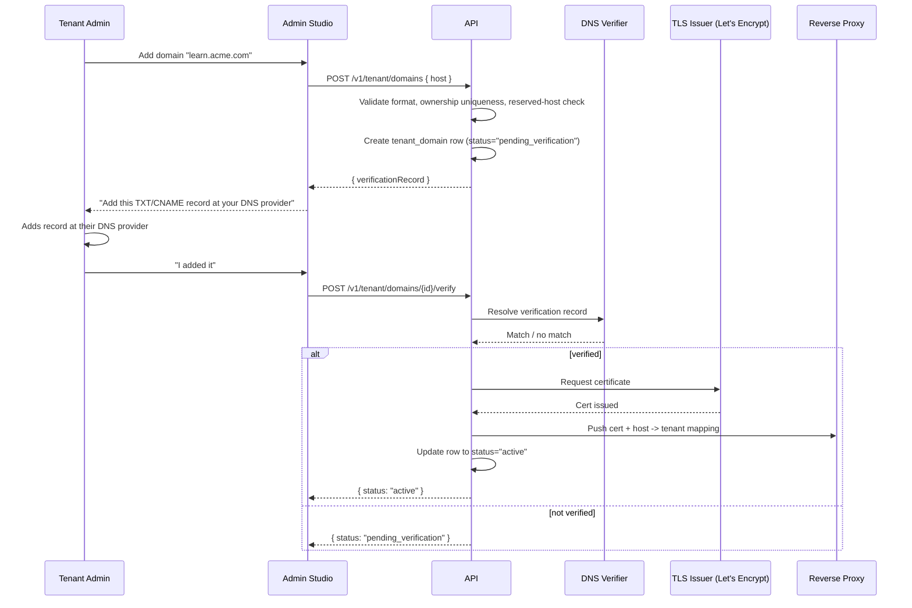

# Custom Domains

LearnStack tenants serve their public site on a tenant-chosen domain (custom domain or subdomain on the platform domain). This document defines how tenants add a domain, how DNS and TLS are verified, how the routing layer maps a host to a tenant, and what the admin experience looks like.

Tenant resolution by host is already a foundational concern ([09-tenant-isolation.md](09-tenant-isolation.md), [14-frontend-architecture.md](14-frontend-architecture.md)). This document focuses on the **management** of those domains — the surface that was previously implicit.

## Domain Models

LearnStack supports three domain shapes:

| Shape | Example | Tenant management |
|-------|---------|-------------------|
| Subdomain on the platform domain | `acme.learnstack.io` | Provisioned automatically when a tenant is created; TLS handled by the platform wildcard cert. |
| Custom domain owned by the tenant | `learn.acme.com` | Tenant adds it via Admin Studio; DNS and TLS verified by the platform before traffic is routed. |
| Apex domain | `acme.com` | Same as custom domain, with explicit guidance on apex DNS (ALIAS / ANAME / flattened CNAME). |

A tenant may have one default domain and multiple aliases (e.g., `acme.com` and `www.acme.com`).

## Add-Domain Flow

## Verification Methods

Two verification paths supported; the tenant picks the one that fits their DNS provider:

- **TXT record** at `_learnstack-verify.<host>` containing a per-domain token. Easy to add, easy to remove.
- **CNAME alias** from `<host>` to `<tenant-key>.proxy.learnstack.io`. Required for the domain to actually receive traffic; verification reuses the resolution.

For apex domains (no CNAME at root), the tenant uses ALIAS / ANAME if their DNS provider supports it, or a flattened CNAME, or A records pointing at the platform's anycast IPs (documented in admin help).

## DNS Verifier

A small worker resolves DNS records for pending domains:

- Authoritative-server lookup, not recursive (avoids resolver caches lying to us).
- Multiple resolutions across geographic resolvers; majority wins.
- Retries with backoff for up to 24 hours; after that the verification expires and the tenant must restart.
- DNSSEC validation when available; logs but does not block.

The verifier writes results to `tenant_domain_verification_attempts` for diagnostics.

## TLS

TLS is issued via **Let's Encrypt** (ACME HTTP-01 or DNS-01 challenge):

- The platform's reverse proxy terminates TLS; the application sees plain HTTP behind it.
- HTTP-01 is the default for custom domains pointing CNAME → proxy.
- DNS-01 is used for apex domains or when wildcard coverage is desired (e.g., `*.acme.com`).
- Certificates auto-renew at 30 days before expiry; renewal failures alert at 14 days.
- The certificate store is keyed by tenant + host; a tenant cannot reuse another tenant's certificate.

## Reserved Hosts

Some hosts are platform-reserved and a tenant cannot claim them:

- `*.learnstack.io` outside the tenant's own subdomain.
- `api.*`, `admin.*`, `auth.*`, `cdn.*` of any platform domain.
- Apex domains the platform itself owns.
- Hosts already registered to another tenant (uniqueness enforced).

A user attempting to register a reserved host receives a clear validation error.

## Tenant Resolution at the Edge

This document complements [14-frontend-architecture.md](14-frontend-architecture.md) § Tenant Resolution at the Edge. The runtime path:

1. Request arrives at the proxy / edge.
2. Edge middleware reads `Host` header.
3. Middleware looks up host → tenant in a short-TTL cache (~60 s); cache miss → API `GET /v1/tenants/resolve?host=...`.
4. If no tenant found, edge returns 404 (no platform disclosure).
5. Tenant id is propagated downstream as `x-tenant-id` and the locale is resolved from the path.

The host → tenant table is populated when a domain transitions to `status="active"`. A removed domain stays in the table with `status="archived"` for 30 days, returning 410 Gone — so users get a recognisable signal rather than an empty 404.

## Admin Studio Surface

A tenant admin sees:

- A **Domains** page listing the tenant's domains, with statuses (`pending_verification`, `active`, `failed`, `archived`).
- Per-domain detail with the verification record, current status, TLS expiry, and any error history.
- **Add Domain** flow with the verification instructions.
- **Set Default** action (per-tenant; affects canonical URL emission).
- **Remove Domain** action (moves to `archived`, keeps the 410 redirect for 30 days).

Audit entries (`tenancy.custom_domain.write`, MUST-audit) record every status transition with the actor and reason.

## Failure Modes

- **DNS misconfigured.** Verifier surfaces specific guidance ("we expected `_learnstack-verify.learn.acme.com` to contain TOKEN but found ..."); does not auto-retry indefinitely.
- **TLS issuance failed.** ACME rate limits or CAA records often the culprit. Admin Studio surfaces the actual ACME error.
- **Tenant disputes another tenant's domain.** Manual platform-admin process; uniqueness is enforced at the application level, not as a SQL constraint that would race.
- **Cert renewal failed.** Alert at 14 days; the platform attempts renewal daily with jitter; tenant is notified at 7 days with steps to validate DNS.

## Permissions

- `tenancy.custom_domain.read` — view the domain list.
- `tenancy.custom_domain.write` — add, modify, archive.
- `tenancy.custom_domain.admin` — set default, request cert reissuance.

Platform admins additionally use `platform.tenant_domain.admin` for cross-tenant operations (dispute resolution, emergency revocation).

## Risks

- **Race for the same host.** Mitigated by the uniqueness check at registration time and by the verifier verifying ownership before traffic routing.
- **ACME rate limits.** Mitigated by per-domain retry policy and by aggregating renewals.
- **Cache invalidation lag.** Edge cache is 60 s; new domain activation might take that long to propagate. Acceptable for an opt-in operation; surfaced in Admin Studio as "may take up to one minute".
- **Tenant moving away.** Domain removal cleans up the routing entry but the certificate is retained until expiry. A tenant takeover by a different tenant of the same domain must wait until the verification record changes.

## Roadmap Touchpoints

- **Phase 02a** — Tenant resolution by host is wired (read path).
- **Phase 03** — Admin Studio shell is in place to host the Domains page.
- **Phase 04 or 06** — Domains page lands in Admin Studio; depends on which phase prioritises the surface.
- **Phase 11** — Production-grade ACME automation, dashboards for certificate expiry, runbook for domain disputes.
