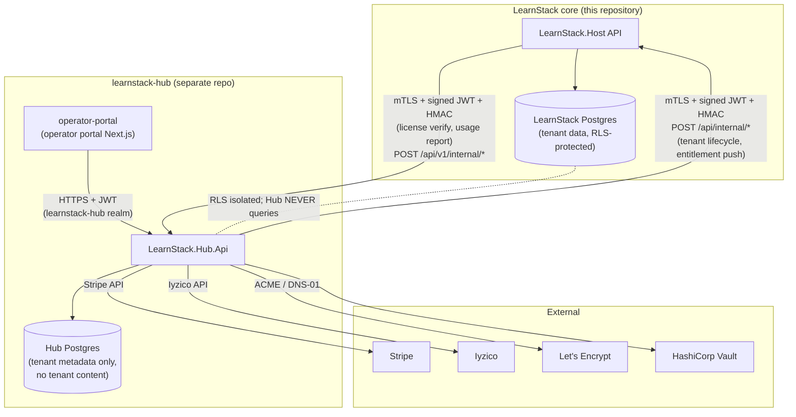
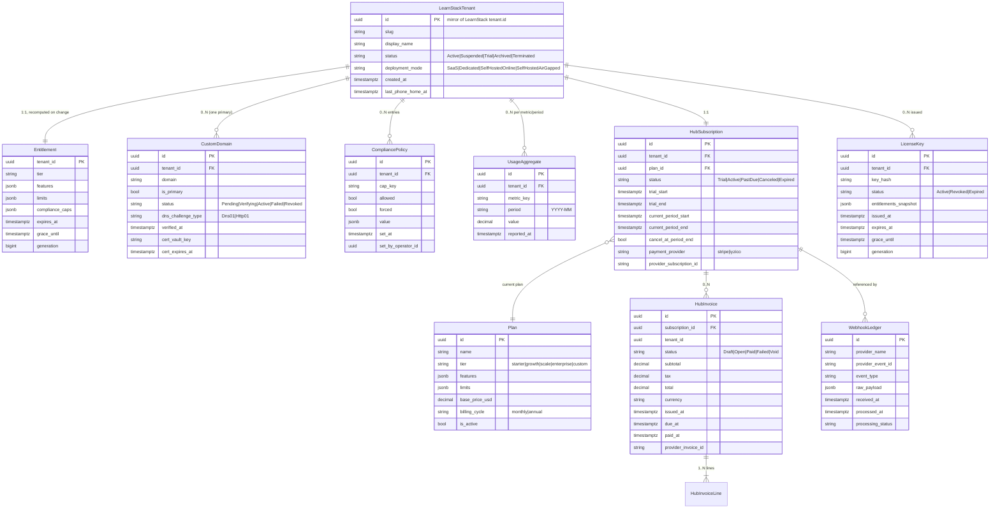
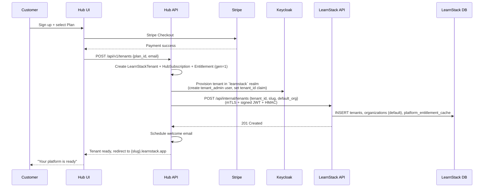
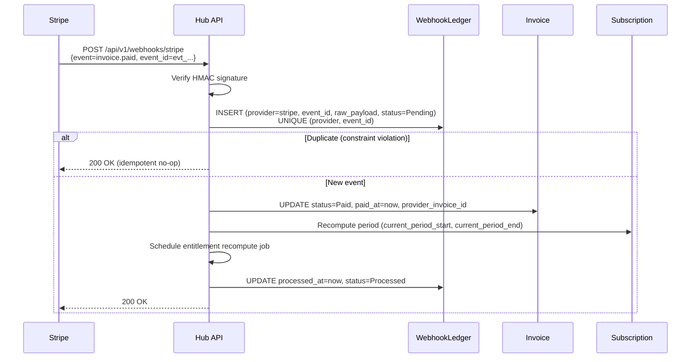

# LearnStack Hub

**Derives from:** [ADR-0019](../decisions/0019-learnstack-hub.md),
[ADR-0020](../decisions/0020-triple-deployment-hybrid-license.md),
[ADR-0021](../decisions/0021-feature-based-entitlement.md),
[ADR-0022](../decisions/0022-custom-domain-tls.md).

**Repository**: `learnstack-hub` (separate from this repo).
**Codebase summary**: `.NET 10` Hub API + Next.js 16 operator portal.
**Realm**: `learnstack-hub` (separate Keycloak realm from `learnstack` realm).
**Database**: PostgreSQL schema `hub` (separate from LearnStack tenant schemas).
**Purpose**: control plane for the LearnStack PaaS — tenant lifecycle, plans,
subscriptions, entitlements, custom domains, compliance caps, operator portal.

## 1. Why a separate codebase

ADR-0019 makes the case: separation of concerns, independent release cadence, data-
isolation guarantee (Hub never holds tenant content). The conceptual diagram:



Hub holds **metadata only**: `Tenant` (mirror), `Plan`, `HubSubscription`, `Entitlement`,
`HubInvoice`, `HubInvoiceLine`, `WebhookLedger`, `LicenseKey`, `CustomDomain`,
`CompliancePolicy`, `UsageAggregate`. It does **not** hold `Course`, `Lesson`, `User`,
`Enrollment`, `LiveSession`, etc. — those live in the LearnStack tenant schemas, RLS-
protected, never accessed by Hub.

## 2. Hub domain model



## 3. Communication contracts

### Contract surface — two invariants, not a count

Per [ADR-0034](../decisions/0034-hub-contract-surface-invariant.md), the Hub contract
surface is governed by two properties rather than by an endpoint count:

1. **The Hub stores no tenant content.** Courses, lessons, learners, enrollments,
   classroom sessions, media and content entries live exclusively in LearnStack. The
   Hub holds tenant *metadata*: plan, subscription, licence, custom domain, compliance
   caps, aggregated usage. Enforced by `Hub_NeverStores_TenantData`.
2. **Every crossing goes through a named adapter** — `IEntitlementProvider`,
   `IUsageReporter`, `IHubTenantSync`. No other type holds a Hub client, and nothing
   resolves a host by calling the Hub. Enforced by
   `LearnStack_Modules_DoNotReference_Hub` and
   `Hub_Client_Referenced_Only_By_Named_Adapters`.

This section previously declared the surface "closed at four" and then listed four
further endpoints as "specializations" that did not count. An HTTP endpoint is a path
plus a method; `DELETE /api/internal/tenants/{id}` is not `POST /api/internal/tenants`
because one is the inverse of the other. Worse, the pressure to keep the count at four
is what drove [ADR-0022](../decisions/0022-custom-domain-tls.md) Amendment 1 to tunnel
TLS private keys through the entitlement payload. The invariants above are what anyone
actually needed the count to stand for.

**Hub → LearnStack** (`/api/internal/*`, internal listener only):

| Method | Path | Purpose |
|--------|------|---------|
| `POST` | `/api/internal/tenants` | Create tenant + default organization |
| `PUT` | `/api/internal/tenants/{id}/entitlements` | Push the entitlement projection |
| `PUT` | `/api/internal/tenants/{id}/status` | Suspend / activate / archive |
| `DELETE` | `/api/internal/tenants/{id}` | Terminate |
| `GET` | `/api/internal/tenants/{id}/usage` | Pull aggregated usage |
| `PUT` | `/api/internal/tenants/{id}/host-mappings` | Push host → `(tenant_id, organization_id?)` mappings. Carries the tuple only — certificate material moves by secret-store replication and is referenced by path |

**LearnStack → Hub:**

| Method | Path | Purpose |
|--------|------|---------|
| `POST` | `/api/v1/internal/license/verify` | Verify / pull the entitlement projection |
| `POST` | `/api/v1/internal/license/refresh` | Scheduled phone-home refresh |
| `POST` | `/api/v1/usage/report` | Report a usage metric (idempotent) |

Every one of these carries the same auth chain: mTLS with LearnStack-internal CA-signed
client certificates, an RS256 JWT with `aud=learnstack-internal` and `exp ≤ 5min`
replay-protected on `jti`, and an HMAC-SHA256 body signature in `X-Signature`.

Adding an endpoint still requires an ADR — not because the count is sacred, but because
the surface is a cross-repository contract and both repositories have to agree.

The Hub's own tenant-facing and operator-facing APIs (`/api/v1/tenants/*`,
`/api/v1/subscriptions/*`, `/api/v1/webhooks/*`) are **not** part of this surface; they
are the Hub's public API, governed by the Hub repository.

### Authentication chain (applies to every endpoint above)

**Hub → LearnStack `/api/internal/*`:**
- mTLS with LearnStack-internal CA-signed client cert
- Signed JWT (RS256) from `learnstack-hub` realm; `aud=learnstack-internal`; `exp ≤ 5 min`
- HMAC-SHA256 body signature in `X-Signature` (per-deployment shared secret in Vault)
- Bound to internal listener; **never** proxied through APISIX

**LearnStack → Hub `/api/v1/internal/*` and `/api/v1/usage/*`:**
- The same three layers: mTLS client cert, RS256 JWT (`aud=learnstack-internal`,
  `exp ≤ 5 min`, `jti` replay-protected), HMAC-SHA256 body signature
- Scope strictly limited to license verification, phone-home refresh, and usage reporting
- The per-instance API key from [ADR-0019](../decisions/0019-learnstack-hub.md) is
  superseded by [ADR-0034](../decisions/0034-hub-contract-surface-invariant.md); rate
  limiting for this direction is enforced by the Hub's own gateway, not by the
  credential

### 3.3. Hub-internal: Stripe / Iyzico webhooks

Stripe and Iyzico POST webhooks to `https://hub.learnstack.dev/api/v1/webhooks/{provider}`.

- HMAC signature verified before any work.
- Deduplicated by `(provider_name, provider_event_id)` in `WebhookLedger`.
- 200 returned quickly; heavy work deferred to a Hangfire job.

## 4. Entitlement projection

The `Entitlement` row is a flattened projection of `Plan` + `HubSubscription` per tenant.
It is the **only** shape `NmpLicenseVerifier` returns to the LearnStack runtime.

> The `features` key strings follow the typed `FeatureKey` catalog in
> [21-feature-flags.md](21-feature-flags.md) and
> [ADR-0021 Amendment 1](../decisions/0021-feature-based-entitlement.md). The
> trailing `.enabled` suffix used in earlier drafts has been dropped — every
> `FeatureKey` is implicitly boolean. Compliance-cap keys
> (`gdpr.hard_delete.enabled`, …) follow a different convention: their `.enabled`
> portion is part of the cap name, not a redundant suffix, and the value is a
> `{ allowed, forced, value? }` object.

```json
{
  "tenant_id": "tenant-uuid",
  "tier": "growth",
  "features": {
    "classroom.recording": true,
    "tenancy.custom_domain": true,
    "tenancy.white_label_branding": true,
    "customization.unlimited_content_types": true,
    "identity.sso.saml": false,
    "analytics.advanced_reporting": false,
    "integrations.api_access": true,
    "integrations.webhooks": true,
    "audit.export": true
  },
  "limits": {
    "limits.max_users": 500,
    "limits.max_organizations": 10,
    "limits.classroom_minutes_per_month": 50000,
    "limits.recording_storage_gb": 500,
    "limits.media_storage_gb": 1000,
    "limits.media_bandwidth_gb_per_month": 1000,
    "limits.api_rate_per_minute": 6000,
    "limits.max_custom_content_types": -1,
    "limits.max_page_block_definitions": -1
  },
  "compliance": {
    "caps": {
      "gdpr.hard_delete.enabled": { "allowed": true,  "forced": false },
      "audit.retention.days":     { "allowed": true,  "forced": true, "value": 365 },
      "data.residency.region":    { "allowed": false, "forced": true, "value": "eu-west" }
    }
  },
  "expires_at": "2027-05-18T00:00:00Z",
  "grace_until": null,
  "generation": 42
}
```

### Recompute rule

Entitlement is recomputed (and `generation` incremented) on:

- `HubSubscription` state change (create, upgrade, downgrade, cancel, renew, trial→active,
  payment-failed dunning).
- `Plan` definition change.
- `CompliancePolicy` change (any cap added / removed / modified).
- `LicenseKey` re-issuance (Self-Hosted).

After recompute, Hub publishes `learnstack.hub.entitlement` integration event via Dapr
pub/sub carrying `{ tenant_id, generation, expires_at }`. LearnStack runtime receives the
event, invalidates `platform_entitlement_cache` for that tenant, re-fetches on next read.

### Cache TTL

LearnStack runtime caches the `Entitlement` for **15 minutes** via `ICacheService` (key
`hub:entitlement:{tenant_id}`). Beyond 15 minutes it re-fetches lazily. Eager invalidation
via Dapr pub/sub event (above) makes the cache TTL a worst-case bound, not a typical one.

## 5. Sequence diagrams

### Tenant provisioning



### Plan upgrade

```mermaid
sequenceDiagram
    participant Customer
    participant HubUI as Hub UI
    participant HubAPI as Hub API
    participant Stripe
    participant LSApi as LearnStack API

    Customer->>HubUI: Upgrade to Growth
    HubUI->>HubAPI: PUT /api/v1/subscriptions/{id} {plan_id=growth}
    HubAPI->>Stripe: Update subscription (proration)
    Stripe-->>HubAPI: Updated, next invoice item created
    HubAPI->>HubAPI: Recompute Entitlement (gen++)
    HubAPI->>LSApi: PUT /api/internal/tenants/{id}/entitlements<br/>(new projection)
    LSApi->>LSApi: Update platform_entitlement_cache; emit cache invalidation
    HubAPI->>HubAPI: Publish learnstack.hub.entitlement event via Dapr
    HubAPI-->>HubUI: Plan upgraded
    HubUI-->>Customer: "Plan upgraded; new features active"
```

### License verification (runtime — feature gate)

```mermaid
sequenceDiagram
    participant User
    participant LSApi as LearnStack API
    participant Cache as platform_entitlement_cache
    participant HubAPI as Hub API

    User->>LSApi: "Start recording" command
    LSApi->>LSApi: IFeatureFlags.IsEnabledAsync(FeatureKeys.ClassroomRecording)
    LSApi->>Cache: SELECT WHERE tenant_id = X
    alt Cache fresh (<15m)
        Cache-->>LSApi: Entitlement (gen=42)
    else Cache stale or miss
        LSApi->>HubAPI: POST /api/v1/internal/license/verify<br/>(mTLS + JWT + HMAC; tenant_id, feature_key)
        HubAPI-->>LSApi: Entitlement (gen=42)
        LSApi->>Cache: UPSERT
    end
    LSApi-->>User: feature enabled → start recording
```

### Phone-home refresh (Self-Hosted Online)

```mermaid
sequenceDiagram
    participant Cron as Hangfire (learnstack)
    participant LSApi as LearnStack API
    participant HubAPI as Hub API
    participant Cache as platform_entitlement_cache

    Cron->>LSApi: Phone-home job (daily, jitter 0-119min)
    loop per active tenant
        LSApi->>HubAPI: POST /api/v1/internal/license/refresh
        alt Hub reachable
            HubAPI-->>LSApi: Entitlement (latest gen)
            LSApi->>Cache: UPSERT; emit cache invalidation event
        else Hub unreachable
            LSApi->>LSApi: Log warning; cache stays; grace period continues
        end
    end
```

### Webhook ingestion (Stripe payment success)



## 6. Operator portal (frontend)

`operator-portal` is a separate Next.js 16 app deployed at `hub.learnstack.dev`.
Authenticates against `learnstack-hub` Keycloak realm. Operators see:

```
Operator Portal
├── Dashboard               ← KPIs: MRR, ARR, tenant count, churn, top issues
├── Tenants
│   ├── List                ← filterable: status, plan, MRR, last activity, deployment mode
│   ├── Detail              ← per-tenant info: subscription, entitlement, usage, custom domains, compliance, audit summary
│   └── Provisioning Queue  ← in-flight tenant create / suspend / terminate operations
├── Plans
│   ├── List                ← starter / growth / scale / enterprise / custom
│   └── Editor              ← feature toggles, limit inputs, price, billing cycle
├── Subscriptions
│   ├── List                ← all subscriptions across tenants
│   └── Invoice Viewer
├── Custom Domains
│   ├── Pending Queue       ← awaiting DNS verification
│   ├── Active List
│   └── Renewal Watch       ← certs expiring within 30 days
├── Compliance
│   ├── Caps Editor         ← per-tenant cap settings
│   └── Audit               ← operator action audit
├── Licenses (Self-Hosted)
│   ├── Active Keys
│   ├── Revocation List Generator
│   └── Phone-Home Activity
├── Usage Metrics
│   ├── Per-tenant
│   └── Per-metric          ← classroom minutes, recording storage, bandwidth, API rate
├── Audit Stream            ← Hub's own operator audit log
└── Support Tools
    ├── Tenant Search
    └── Read-only Tenant View   ← support read of tenant settings (audit-logged, no content)
```

## 7. Module structure (Hub-side modules)

The Hub follows the same modular monolith pattern as LearnStack core, but with Hub-
specific modules. Each module ships its own DbContext, EF entity configurations, MediatR
handlers, endpoints.

| Module | Domain |
|--------|--------|
| `LearnStack.Hub.Modules.TenantLifecycle` | Tenant CRUD, status transitions, provisioning orchestration |
| `LearnStack.Hub.Modules.Plans` | Plan catalog, plan editor |
| `LearnStack.Hub.Modules.Subscriptions` | HubSubscription lifecycle, Stripe/Iyzico integration |
| `LearnStack.Hub.Modules.Entitlements` | Entitlement projection recompute, cache, push to LearnStack |
| `LearnStack.Hub.Modules.Invoicing` | HubInvoice, HubInvoiceLine, WebhookLedger |
| `LearnStack.Hub.Modules.LicenseKeys` | RSA key generation, signing, revocation list |
| `LearnStack.Hub.Modules.CustomDomains` | Domain submission, DNS verification, TLS provisioning |
| `LearnStack.Hub.Modules.Compliance` | Compliance caps editor, audit |
| `LearnStack.Hub.Modules.Usage` | Usage aggregate ingest, dashboards |
| `LearnStack.Hub.Modules.Audit` | Hub-side audit stream (separate from tenant audit) |
| `LearnStack.Hub.Modules.Operators` | Operator identity, role/permission management |

Cross-module communication via the same four mechanisms (Application Contracts, Domain
Events, Integration Events via Dapr pub/sub, Read-Model Projections) — ADR-0010 applies
to Hub as well.

## 8. Plan tier examples (illustrative)

| Tier | Price | Features (sample) | Limits |
|------|-------|-------------------|--------|
| **Starter** | $49/mo | Subdomain, 1 org, no recording, no custom domain, no SSO | 25 users, 1 org, 0 classroom minutes |
| **Growth** | $199/mo | Custom domain, white-label, recording, API access | 500 users, 10 orgs, 50k classroom min/mo, 500 GB recording storage |
| **Scale** | $799/mo | Above + advanced analytics, webhook outbound, audit export | 5000 users, 100 orgs, 500k classroom min/mo, 5 TB storage |
| **Enterprise** | Custom | Above + SSO/SAML, SCIM, data residency, dedicated deployment | Unlimited (per contract) |

Plan rows live in Hub's `plans` table; operators edit via Hub UI; no LearnStack code
change to introduce a new plan.

## 9. Production deployment

Hub deploys as its own Kubernetes namespace, its own Helm chart:

```yaml
learnstack-hub/
├── deploy/helm/
│   ├── Chart.yaml
│   ├── values.yaml
│   └── templates/
│       ├── api-deployment.yaml      # Hub API
│       ├── web-deployment.yaml      # Operator portal
│       ├── postgres-statefulset.yaml
│       ├── dapr-components.yaml     # Hub's own Dapr components
│       └── secrets.yaml
```

Hub does NOT share Dapr instance with LearnStack — Hub has its own sidecar, its own
`pubsub` component, its own state store (Hub Valkey instance), its own secret store
namespace (`secret/learnstack-hub/*`).

**Kafka cluster topology:** Hub and LearnStack share the **same Kafka cluster** in
SaaS / Dedicated; isolation is at the **topic-name** level. Hub publishes under
the `learnstack.hub.*` prefix; LearnStack core publishes under
`learnstack.{module}.*`. Cross-side subscriptions are explicit: LearnStack core
consumes `learnstack.hub.entitlement`, `learnstack.hub.custom-domain.activated`,
`learnstack.hub.custom-domain.deactivated`; Hub consumes
`learnstack.tenancy.tenant.renamed` (and similar LS-emitted operational events).
Topic-level ACLs (Kafka ACL rules per principal) enforce that Hub cannot publish
into the LS-core prefix and vice versa.

In Self-Hosted (especially air-gapped) deployments, Hub may not exist at all; the
`learnstack.hub.*` topic family is absent and the LS-side consumers are no-ops
(no subscriber registers when `DeploymentMode = SelfHostedAirGapped`).

## 10. Architecture tests (Hub-side)

Hub's `LearnStack.Hub.Architecture.Tests` runs:

1. `Hub_NeverStores_TenantContent` — Hub DbContext does not contain `Course`, `Lesson`,
   `User`, `Enrollment`, `LiveSession`, `LessonItem` entities (or any LearnStack core
   aggregate). Migration scan asserts the absence.
2. `Hub_Modules_DoNotReference_LearnStack_Internals` — Hub modules reference only
   LearnStack `Application.Contracts` (DTOs); no Domain or Infrastructure types.
3. `Internal_API_Endpoints_AreNot_Public` — endpoints under `/api/internal/*` are
   registered on the internal listener only; integration test asserts external request
   returns 404.
4. `Stripe_SDK_Types_NotImportedOutsideInfrastructure` — `Stripe.*` types appear only in
   `LearnStack.Hub.Modules.Subscriptions.Infrastructure.Stripe`.
5. `Iyzico_SDK_Types_NotImportedOutsideInfrastructure` — same for `Iyzipay.*`.
6. `Hub_Operator_JWT_NeverAccepted_On_LearnStack_Routes` — integration test asserts a
   `learnstack-hub` realm JWT is rejected by any LearnStack tenant-facing endpoint.

## 11. Phasing

| Phase | Hub deliverable |
|-------|-----------------|
| 01 | Repository scaffold: `learnstack-hub` git repo created. Skeleton .NET solution + skeleton Next.js operator portal. Docker compose entry for Hub API + Hub DB schema initialised. |
| 02c (parallel track, runs alongside 02b) | Hub Foundation: domain model (LearnStackTenant, Plan, HubSubscription, Entitlement, CustomDomain, CompliancePolicy). Hub API skeleton: tenant lifecycle, plan management, entitlement projection, `POST /api/v1/internal/license/verify`. mTLS + signed JWT + HMAC chain wired between Hub and LearnStack. Keycloak `learnstack-hub` realm seeded. Operator portal: tenant list, plan editor scaffold. |
| 03 | Identity integration with Hub on the operator side; SSO between Hub UI and Hub API. |
| 09b (parallel track) | Hub Billing: Stripe + Iyzico integration via `IPaymentProvider`. HubInvoice, HubInvoiceLine, WebhookLedger. Operator UI for plan editor (full), invoice viewer, compliance caps editor, custom domain admin. |
| 11 | Production hardening: mTLS cert rotation procedure. Hub's own production Helm chart. Self-Hosted on-prem mode (LearnStack runs without Hub; signed license key from Hub-hosted-by-us covers entitlement). Hub HA pair behind L4 LB. Cert renewal job in production. |
| 12 (optional) | Hub Marketplace: theme marketplace, content template marketplace, integration adapter marketplace. 3rd-party developer onboarding. |

## 12. Non-goals

- **Tenant-facing billing UI inside Hub.** Tenants see their plan + invoices in their own
  LearnStack Admin Studio settings (under a "Subscription" tab). Hub UI is operator-only.
- **Hub stores tenant data.** Architecturally forbidden; architecture test asserts.
- **Hub is a CDN / edge cache.** Hub is a control plane; CDN concerns live elsewhere.
- **Hub orchestrates LearnStack deployments.** Helm + Argo CD / Flux handle deployment;
  Hub is not a deploy orchestrator.

## References

- ADR-0019 — LearnStack Hub.
- ADR-0020 — Triple Deployment + Hybrid License.
- ADR-0021 — Feature-Based Entitlement.
- ADR-0022 — Custom Domain & TLS.
- [28-platform-tenant-organization.md](28-platform-tenant-organization.md) — conceptual
  model.
- [25-deployment-models.md](25-deployment-models.md) — three-mode topology.
- [26-hybrid-license-model.md](26-hybrid-license-model.md) — license format + lifecycle.
- [27-custom-domain-tls.md](27-custom-domain-tls.md) — custom domain admin workflow.
- Nexora reference: `Nexora/docs/architecture/MANAGEMENT_PORTAL.md`,
  `Nexora/docs/decisions/0023-nmp-billing-model.md`,
  `Nexora/docs/roadmap/phases/phase-NMP-track.md`,
  `Nexora/docs/decisions/0030-license-hot-reload-mechanism.md`.
