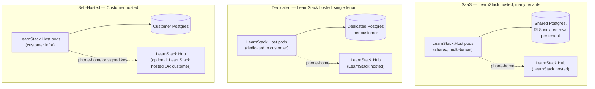

# Deployment Models

**Derives from:** [ADR-0020](../decisions/0020-triple-deployment-hybrid-license.md),
[ADR-0019](../decisions/0019-learnstack-hub.md).

LearnStack supports three deployment models from **one codebase, one Helm chart, one set
of container images**. The differentiator across modes is configuration + component
wiring + `IEntitlementProvider` implementation choice — never application code.

> **Support state (2026-08-08).** The `DeploymentMode` enum has five values and the
> composition root branches on all five. Only **`Development`** and **`SaaS`** are wired
> and tested end to end today. `Dedicated`, `SelfHostedOnline`, and
> `SelfHostedAirGapped` are **prepared seams, not supported deployments**, until
> [Phase 11](../roadmap/phase-11-production-hardening.md) builds their adapters and
> integration suites, per
> [ADR-0035](../decisions/0035-demand-gated-infrastructure.md). See
> [§ 5](#5-deploymentmode-configuration) for what "prepared seam" means concretely. The
> rest of this document describes the target topologies; it is a design document for all
> five, and a description of running systems for two.

## 1. The three modes



| Aspect | SaaS | Dedicated | Self-Hosted |
|--------|------|-----------|-------------|
| **Operator** | LearnStack | LearnStack | Customer |
| **Infrastructure** | LearnStack cloud | LearnStack cloud, customer-isolated | Customer's K8s / VMs |
| **Tenants per instance** | Many | One | One (or many, customer's choice) |
| **Database** | Shared Postgres, RLS-isolated | Dedicated Postgres per customer | Customer-owned Postgres |
| **Hub** | LearnStack-hosted central Hub | LearnStack-hosted central Hub | Customer-hosted OR LearnStack-hosted (with phone-home) OR signed license key (air-gapped) |
| **Entitlement** | `HubEntitlementProvider` (online) | `HubEntitlementProvider` (online) | `HubEntitlementProvider` (online) OR `SignedLicenseKeyEntitlementProvider` (air-gapped) |
| **Connectivity** | Always online | Always online | Online preferred; air-gapped supported |
| **Plan** | Starter / Growth / Scale | Enterprise (custom) | Enterprise (custom) |
| **Upgrade cadence** | LearnStack-controlled rolling | LearnStack-coordinated per customer | Customer-controlled (Helm upgrade window) |
| **Data residency** | Region per LearnStack offering | Customer-selected region | Customer-owned data sovereignty |
| **Compliance posture** | LearnStack-defined caps | Customer-negotiated caps | Customer-defined caps |

## 2. SaaS mode

**Topology:**

```
Internet
   │
   ▼
[ APISIX gateway pool (2+ replicas) ]
   │
   ▼ host: app.learnstack.dev | {tenant-custom-domain}
[ LearnStack.Host pods (auto-scaled 2-8) ]
   │
   ├──► PostgreSQL (managed, RLS policies enforced)
   ├──► Valkey (managed, multi-tenant via key prefix)
   ├──► SeaweedFS (multi-tenant via key prefix)
   ├──► Meilisearch (per-tenant filter + per-locale index)
   ├──► Keycloak (single realm with multi-tenant claims)
   ├──► LiveKit (shared SFU pool)
   └──► Dapr sidecars

   ▼ (separate gateway path) host: hub.learnstack.dev
[ LearnStack Hub pods ]
   │
   └──► Hub Postgres (separate from tenant DB)
```

- **Tenant onboarding**: Customer signs up at `hub.learnstack.dev`, picks plan, Stripe
  checkout, Hub provisions tenant in LearnStack via `POST /api/internal/tenants`. Total
  time: < 1 minute.
- **Tenant URL**: Starts on `{slug}.learnstack.app`; upgrades to custom domain on
  Growth+ tier.
- **Failure isolation**: two different problems, and only one of them is solved today.
  **Correctness** isolation — no tenant can read or write another tenant's rows — is
  covered by tenant context + EF query filters + Row Level Security + architecture tests
  ([ADR-0003 Amendment 3](../decisions/0003-tenant-isolation-defense-in-depth.md)).
  **Resource** isolation — no tenant can starve another of connections, CPU, or job
  workers — is **not** covered by any of those. Row Level Security is a visibility
  predicate: it filters rows, and a filtered query consumes exactly as much of the
  database as an unfiltered one. A single tenant running an unbounded report can hold a
  connection, saturate the pool, and degrade every other tenant on the instance while
  every isolation test stays green.

  What exists today: APISIX `limit-req` keyed on `remote_addr`, which throttles a noisy
  client but not a noisy tenant — one tenant behind many IPs is unaffected, and many
  tenants behind one NAT are punished together.

  What is required, and where it lives: **resource fairness is
  [Phase 11](../roadmap/phase-11-production-hardening.md)** — `statement_timeout` per
  connection class, per-tenant connection-pool partitioning, query cost ceilings on
  report and export paths, Hangfire queue fairness so one tenant's bulk import cannot
  monopolise the workers, and per-tenant rate limiting keyed on the resolved tenant
  rather than on the client address. No earlier phase owns this work, and until Phase 11
  ships it, SaaS multi-tenancy is protected against **leakage** but not against
  **contention**.

## 3. Dedicated mode

**Topology** — same as SaaS but isolated per customer:

```
[ LearnStack-managed Kubernetes namespace per customer ]
   │
   ├──► Dedicated PostgreSQL instance (no shared rows; still RLS-protected for org scope)
   ├──► Dedicated Valkey instance
   ├──► Dedicated SeaweedFS instance
   ├──► Dedicated Meilisearch
   ├──► Dedicated Keycloak realm (could be in shared Keycloak cluster with realm-per-tenant)
   ├──► Shared LiveKit pool (with per-tenant resource caps) OR dedicated SFU
   └──► Dapr sidecars
```

- **Tenant**: Exactly one. Domain model still includes `Tenant` aggregate with a default
  organization; tenant_id is fixed.
- **Use case**: Mid-to-large customers with data residency requirements, regulatory
  isolation, or volume that justifies dedicated infra.
- **Hub**: Same central LearnStack Hub manages the dedicated tenant; phone-home as
  normal.

## 4. Self-Hosted mode

**Topology**:

```
[ Customer-owned Kubernetes cluster, customer admin ]
   │
   ├──► PostgreSQL (customer-managed)
   ├──► Valkey (customer-managed)
   ├──► SeaweedFS or S3-compatible (customer-managed)
   ├──► Meilisearch (customer-managed)
   ├──► Keycloak (customer-managed; LearnStack ships pre-configured realm export)
   ├──► LiveKit (customer-managed OR fall back to LiveKit Cloud)
   ├──► Dapr sidecars (deployed by LearnStack Helm chart)
   └──► Optional: customer-hosted LearnStack Hub (rare; usually they consume LearnStack-
        hosted Hub via phone-home, or use signed license key air-gapped)
```

### 4a. Self-Hosted Online

- Customer's deployment phones home to LearnStack's Hub daily.
- `HubEntitlementProvider` registered; `Entitlement` projection refreshed via
  `POST /api/v1/internal/license/refresh`.
- 30-day grace period on phone-home failure.

### 4b. Self-Hosted Air-Gapped

- Customer's deployment has no outbound network access.
- `SignedLicenseKeyEntitlementProvider` registered; reads RSA-signed license key from a
  filesystem location (`/var/learnstack/license/current.lic`).
- License key embeds the entitlement projection; the key itself is the entitlement
  source.
- License updates via signed-file delivery (USB stick, secure email, customer's SFTP).
- SIGHUP to the LearnStack process triggers immediate re-read of the license file.
- Revocation list also delivered out-of-band when revocations occur.

**Tenant provisioning without Hub.** Hub is the canonical issuer of `tenant_id`
([28-platform-tenant-organization.md § Hub ↔ LearnStack ownership matrix](28-platform-tenant-organization.md)).
In air-gapped Self-Hosted mode there is no Hub at the customer's site, so the
**bootstrap rule** is:

1. The signed `.lic` file carries `tenant_id` (and a default `organization_id`) as
   claims. The LearnStack-side CLI (`learnstack tenant init`) reads the `.lic`,
   verifies the signature, and creates the `tenants` + `organizations` rows with
   the IDs from the license claims.
2. Subsequent tenants (rare in air-gapped enterprise) require a new `.lic`
   issued by the LearnStack-hosted Hub and delivered out-of-band — the customer
   never mints `tenant_id` themselves.
3. In `SelfHostedOnline` mode the CLI exists too, but defers to Hub via
   `POST /api/internal/tenants` so Hub remains authoritative.

Customer responsibilities (air-gapped):
- Customer manages their own TLS certs (cert-manager + local CA OR
  customer-provided certs).
- Customer manages their own Vault (or alternative secret store).
- Customer manages their own backups, DR, monitoring.

LearnStack ships:
- Helm chart with air-gapped mode pre-configured.
- Pre-signed license keys per agreement.
- Documentation runbook (`docs/operations/hub-on-prem-setup.md`).
- Optional: bundled container registry mirror script for air-gapped image pulls.

## 5. `DeploymentMode` configuration

The LearnStack process reads `Deployment:Mode` from configuration at startup. Five
values:

```csharp
public enum DeploymentMode
{
    Development,           // Local dev; NullEntitlementProvider
    SaaS,                  // LearnStack-hosted multi-tenant; HubEntitlementProvider
    Dedicated,             // LearnStack-hosted single-tenant; HubEntitlementProvider
    SelfHostedOnline,      // Customer-hosted, phone-home enabled; HubEntitlementProvider
    SelfHostedAirGapped    // Customer-hosted, no phone-home; SignedLicenseKeyEntitlementProvider
}
```

`Program.cs` wires the entitlement provider based on this value (see ADR-0020). Modules
never read the enum — `Modules_Do_Not_Reference_DeploymentMode` enforces that the
composition root branches once.

### Supported today versus prepared seam

| Value | State | What that means concretely |
|---|---|---|
| `Development` | **Supported** | Wired, run daily, covered by the integration suite |
| `SaaS` | **Supported** | Wired and covered end to end from [Phase 02c](../roadmap/phase-02c-hub-foundation.md) |
| `Dedicated` | Prepared seam | The branch exists and resolves to the default implementations; no dedicated-topology integration suite, no operational runbook |
| `SelfHostedOnline` | Prepared seam | Same; the phone-home path needs the Hub adapter and its failure-mode tests |
| `SelfHostedAirGapped` | Prepared seam | Same, plus a signed-licence provider and a no-egress telemetry target that do not exist yet |

A prepared seam is a **branch point with no adapter behind it**: the value is accepted,
the composition root routes it, and the implementations it selects are the same defaults
`Development` gets. It is honest to design for it; it is not honest to sell it. Each seam
becomes a supported mode in [Phase 11](../roadmap/phase-11-production-hardening.md) when
its trigger fires — for `SelfHostedAirGapped`, that trigger is a signed Self-Hosted
contract ([ADR-0035](../decisions/0035-demand-gated-infrastructure.md)).

The same ADR adds a rule that this document must obey: **a deployment mode without a
signed contract cannot be the deciding factor in a technical choice.** It may break a tie
between otherwise-equal options. It may not, on its own, reject a dependency or justify
an abstraction.

### Other config settings switched by mode

- **Hub URL** — pointed at LearnStack-hosted (SaaS / Dedicated / SelfHostedOnline) OR
  customer-hosted (rare) OR not set (SelfHostedAirGapped).
- **Secret store** — `ConfigurationSecretProvider` today in every mode; the Vault-backed
  provider is demand-gated to Phase 11 behind `ISecretProvider`, triggered when a
  production secret must rotate without a redeploy, or more than one operator needs
  access to production secrets.
- **Telemetry sink** — LearnStack OTel collector (SaaS / Dedicated) OR customer OTel
  (Self-Hosted). `SelfHostedAirGapped` wires no network exporter at all; its file target
  lands in Phase 11.
- **Event transport** — `InProcessEventBus` today in every mode; the Dapr pub/sub
  component and its Kafka backend land in Phase 11, triggered by a second process needing
  to consume an integration event. See
  [15-event-and-outbox.md](15-event-and-outbox.md).

## 6. Same Helm chart

The LearnStack Helm chart (`deploy/helm/`) supports all modes via `values.yaml`:

```yaml
# values-saas.yaml
deployment:
  mode: SaaS
  hub:
    url: https://hub.learnstack.dev
    # mTLS client cert + HMAC secret + JWT signing key; no API key (ADR-0034)
    credentialsRef: { name: hub-internal-api, key: bundle }
  postgres:
    managed: true
    connectionRef: { name: postgres-creds, key: connection-string }
  dapr:
    kafka:
      brokers: kafka-managed.example.com:9092
      auth: scram-sha-512
```

```yaml
# values-dedicated-acme-corp.yaml
deployment:
  mode: Dedicated
  hub:
    url: https://hub.learnstack.dev
  postgres:
    managed: true
    connectionRef: { name: postgres-acme, key: connection-string }
  customDomain:
    primary: learn.acmecorp.com
  dataResidency: eu-west
```

```yaml
# values-self-hosted-airgapped.yaml
deployment:
  mode: SelfHostedAirGapped
  hub: {}                       # no Hub
  licenseKey:
    path: /var/learnstack/license/current.lic
    revocationListPath: /var/learnstack/license/revocations.json
  postgres:
    managed: false
    customerProvidedSecret: postgres-creds
  imageRegistry: registry.customer.internal/learnstack
  telemetry:
    otlpEndpoint: otel-collector.customer.internal:4317
```

Same chart. Same templates. Different values.

## 7. Deployment-mode-conditional behaviour

A small list of behaviours change across modes. This is the **target** table; the two
supported modes reach it today and the three seams reach it in Phase 11.

| Behaviour | SaaS | Dedicated | Self-Hosted Online | Self-Hosted Air-Gapped |
|-----------|------|-----------|--------------------|------------------------|
| `IEntitlementProvider` | Hub | Hub | Hub | SignedLicenseKey |
| `ISecretProvider` (target) | Vault | Vault | Vault | Vault OR file |
| `ISecretProvider` (today) | `ConfigurationSecretProvider` in every mode — the Vault adapter is demand-gated to Phase 11 | ← | ← | ← |
| Phone-home enabled | Yes | Yes | Yes | No |
| Outbound HTTP to Hub | Yes | Yes | Yes | No |
| OTel collector endpoint | LearnStack-hosted | LearnStack-hosted | Customer-hosted | Customer-hosted |
| Cert provisioning | LearnStack-managed | LearnStack-managed | Hub-driven (online) | Customer-managed |
| Helm chart values file | `values-saas.yaml` | `values-dedicated-{customer}.yaml` | `values-self-hosted.yaml` | `values-self-hosted-airgapped.yaml` |

## 8. Migration between modes

Customer-driven path (rare but supported):

- **SaaS → Dedicated**: Hub-orchestrated. New dedicated cluster provisioned; customer's
  tenant data exported (RLS-scoped `pg_dump`), restored into dedicated Postgres; DNS
  cutover; tenant_id remains the same.
- **Dedicated → Self-Hosted**: Customer takes over operation. LearnStack provides
  customer with Helm chart values + Postgres dump + Keycloak realm export.
- **Self-Hosted → SaaS**: Reverse import. Less common; one-time engagement.

Cross-mode migration is engineering-assisted, not automated. The architecture supports
the move because the data model is consistent across modes.

## 9. Single container image

All LearnStack environments run the same container image
(`learnstack/learnstack-api:<git-sha>`). Dapr sidecar image
(`daprio/daprd:<version>`) is also identical across modes.

CI builds one image per merge to `main`; tags with the git sha and a SemVer release tag
when a release is cut. Helm chart references the image by tag.

```
ghcr.io/learnstack/learnstack-api:v1.0.0
ghcr.io/learnstack/learnstack-api:v1.0.1
ghcr.io/learnstack/learnstack-hub-api:v1.0.0
ghcr.io/learnstack/learnstack-hub-api:v1.0.1
ghcr.io/learnstack/learnstack-web:v1.0.0
ghcr.io/learnstack/learnstack-hub-operator-portal:v1.0.0
```

For Self-Hosted Air-Gapped, customers pull images into their own registry (script in
`tools/airgapped-image-bundle.sh`).

## 10. Release & upgrade cadence

| Mode | Cadence | Trigger |
|------|---------|---------|
| SaaS | Continuous (every merge to main becomes a deployable build) | Automated GitOps; staged rollout: dev → staging → 10% prod → 100% prod |
| Dedicated | Coordinated per customer; typically weekly | LearnStack-led upgrade window |
| Self-Hosted Online | Customer-controlled | Customer schedules Helm upgrade; can lag SaaS by months |
| Self-Hosted Air-Gapped | Customer-controlled, signed-bundle delivery | LearnStack signs and delivers bundle; customer applies |

## 11. Operational runbooks (Phase 11)

To be authored:

- `docs/operations/tenant-operations.md` — Tenant provisioning (per mode), suspend,
  archive, terminate.
- `docs/operations/helm-installation.md` — Self-Hosted Helm chart installation guide.
- `docs/operations/hub-on-prem-setup.md` — Optional customer-hosted Hub OR signed license
  key air-gapped setup.
- `docs/operations/license-key-management.md` — RSA key generation, distribution,
  revocation.
- `docs/operations/migration-orchestration.md` — Schema migration coordination.
- `docs/operations/security-incident.md` — Security incident response.
- `docs/operations/data-export-and-portability.md` — GDPR data export per tenant.
- `docs/operations/resource-fairness.md` — the SaaS contention controls named in
  [§ 2](#2-saas-mode): `statement_timeout` classes, pool partitioning, query cost
  ceilings, Hangfire queue fairness, per-tenant rate limits.

## 12. Non-goals

- **Multi-cloud abstraction.** LearnStack runs on Kubernetes; cloud-provider choice is
  customer's. We don't abstract over cloud APIs.
- **Sovereign-cloud parity.** LearnStack ships in the SaaS configuration aimed at major
  cloud regions; sovereign-cloud (Gaia-X, …) is in scope only via Self-Hosted.
- **Tenant migration tooling beyond mode-change paths.** Tenant CRUD belongs to Hub; cross-
  cluster tenant migration is a one-time engineering engagement, not a product feature.

## References

- ADR-0020 — Triple Deployment + Hybrid License.
- ADR-0019 — LearnStack Hub.
- [ADR-0003 Amendment 3](../decisions/0003-tenant-isolation-defense-in-depth.md) — what
  Row Level Security does and does not guarantee.
- [ADR-0035](../decisions/0035-demand-gated-infrastructure.md) — which modes are
  supported, which are seams, and what promotes a seam.
- [26-hybrid-license-model.md](26-hybrid-license-model.md) — license payload + lifecycle.
- [24-learnstack-hub.md](24-learnstack-hub.md) — Hub architecture.
- [04-technical-architecture.md](04-technical-architecture.md) — overall stack.
- [Phase 11: Production Hardening, Operations, and Scale](../roadmap/phase-11-production-hardening.md)
  — owns resource fairness and the three prepared seams.
