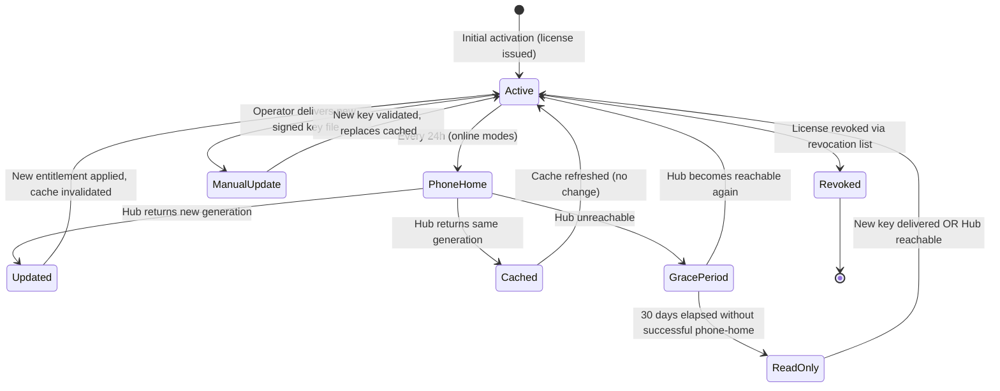

# Hybrid License Model

**Derives from:** [ADR-0020](../decisions/0020-triple-deployment-hybrid-license.md),
[ADR-0021](../decisions/0021-feature-based-entitlement.md),
[ADR-0019](../decisions/0019-learnstack-hub.md).

LearnStack uses a **hybrid license model** combining:

- **Phone-home** (default; online connectivity to Hub).
- **RSA-signed license key** (offline-capable; embeds entitlement projection).
- **30-day grace period** on expiry.
- **Revocation list** (signed bundle published by Hub; consumed by LearnStack runtime).

The model handles all three deployment modes (SaaS / Dedicated / Self-Hosted) with one
common implementation. This document describes the license payload, lifecycle, signing
procedure, refresh cadence, revocation flow, and operational runbook.

## 1. License key payload

The key is a JWT-style RS256-signed token with a custom header `typ: "LSL"`
("LearnStack License"). The embedded `entitlement.features` key strings follow
the typed `FeatureKey` catalog in
[21-feature-flags.md](21-feature-flags.md) and
[ADR-0021 Amendment 1](../decisions/0021-feature-based-entitlement.md) — the
trailing `.enabled` suffix used in earlier drafts has been dropped.

```json
{
  "header": {
    "alg": "RS256",
    "typ": "LSL",
    "kid": "lsl-signing-key-v1"
  },
  "payload": {
    "iss": "learnstack-hub",
    "sub": "tenant-uuid-here",
    "iat": 1747576800,
    "exp": 1779112800,
    "deployment_mode": "SelfHostedAirGapped",
    "entitlement": {
      "tier": "enterprise",
      "features": {
        "classroom.recording": true,
        "tenancy.custom_domain": true,
        "tenancy.white_label_branding": true,
        "customization.unlimited_content_types": true,
        "identity.sso.saml": true,
        "analytics.advanced_reporting": true,
        "integrations.api_access": true,
        "audit.export": true,
        "compliance.data_residency": true
      },
      "limits": {
        "limits.max_users": 50000,
        "limits.max_organizations": 100,
        "limits.classroom_minutes_per_month": -1,
        "limits.recording_storage_gb": 10000,
        "limits.media_storage_gb": 50000,
        "limits.media_bandwidth_gb_per_month": -1,
        "limits.api_rate_per_minute": 60000
      },
      "compliance": {
        "caps": {
          "audit.retention.days":  { "allowed": true,  "forced": true, "value": 2555 },
          "data.residency.region": { "allowed": false, "forced": true, "value": "eu-central" }
        }
      },
      "generation": 17
    },
    "issued_at": "2026-05-18T00:00:00Z",
    "expires_at": "2028-05-18T00:00:00Z",
    "grace_until": "2028-06-17T00:00:00Z",
    "phone_home_url": "https://hub.learnstack.dev/api/v1/internal/license/refresh",
    "revocation_list_url": "https://hub.learnstack.dev/api/v1/internal/license/revocations"
  },
  "signature": "base64url-encoded-RS256-signature-over-base64url(header).base64url(payload)"
}
```

Encoded as `<base64url(header)>.<base64url(payload)>.<base64url(signature)>` — same wire
format as JWT, distinguishable by the `typ: "LSL"` header.

## 2. Signing keys

LearnStack maintains an **RSA-2048 (minimum)** key pair for license signing:

- **Private key** in Vault: `secret/learnstack-hub/license-signing-key`.
- **Public key** bundled with every LearnStack release in
  `LearnStack.Infrastructure.Licensing.PublicKeys` (build-time embedded).
- **Key rotation**: a new `kid` is added; both keys remain valid for the deprecation
  window (default 1 year). Old keys eventually removed; revocation list takes precedence.

Multiple keys (JWKS-style):

```csharp
public sealed class LicenseSigningKeySet
{
    public required IReadOnlyList<LicenseSigningKey> Keys { get; init; }
}

public sealed class LicenseSigningKey
{
    public required string Kid { get; init; }
    public required RSAParameters PublicKey { get; init; }
    public required DateTimeOffset ValidFrom { get; init; }
    public DateTimeOffset? RetiredAt { get; init; }   // null = still valid
}
```

Verifier (in `SignedLicenseKeyEntitlementProvider`):

1. Parse JWT header; read `kid`.
2. Look up the key in the embedded key set.
3. Verify signature.
4. Reject if `kid` not found or signature invalid.
5. Reject if `kid` is in retired set AND token `iat` > `RetiredAt`.

## 3. Lifecycle



### State semantics

| State | Entitlement available | Writes allowed | Reads allowed |
|-------|----------------------|----------------|---------------|
| **Active** | Yes (current) | Yes | Yes |
| **PhoneHome** (transient) | Yes (cached) | Yes | Yes |
| **GracePeriod** | Yes (last-known cached, expired but within grace) | Yes (with warning banner) | Yes |
| **ReadOnly** | Yes (last-known cached, past grace) | **No** (returns "license expired" error) | Yes (read-only) |
| **ManualUpdate** (transient) | Yes (cached) | Yes (during update) | Yes |
| **Revoked** | No | No | No (returns 403 with license-revoked error) |

## 4. Phone-home refresh

`SelfHostedOnline` and SaaS / Dedicated all phone home daily. Hangfire recurring job:

```csharp
public sealed class LicenseRefreshJob : LearnStackJob<LicenseRefreshJobParams>
{
    protected override async Task ExecuteAsync(LicenseRefreshJobParams parameters, CancellationToken ct)
    {
        var current = await _entitlementCache.GetAsync(parameters.TenantId, ct);
        try
        {
            var refreshed = await _hubClient.RefreshAsync(parameters.TenantId, ct);
            if (refreshed.Generation > (current?.Generation ?? 0))
            {
                await _entitlementCache.SetAsync(parameters.TenantId, refreshed, ct);
                await _eventBus.PublishAsync(new EntitlementUpdatedIntegrationEvent
                {
                    TenantId = parameters.TenantId,
                    Generation = refreshed.Generation
                }, ct);
                _logger.LogInformation("Entitlement refreshed for tenant {TenantId} to gen {Gen}",
                    parameters.TenantId, refreshed.Generation);
            }
            await _entitlementCache.SetLastSuccessAsync(parameters.TenantId, DateTimeOffset.UtcNow, ct);
        }
        catch (HttpRequestException ex)
        {
            _logger.LogWarning(ex, "Phone-home failed for tenant {TenantId}; grace period continues",
                parameters.TenantId);
            // Grace period enforcement happens at read time in IEntitlementProvider.
        }
    }
}
```

**Jitter**: in a SaaS deployment with many tenants, the daily refresh would otherwise all
hit Hub at the same time. The job adds a random 0-119 minute offset per tenant when first
enqueued.

## 5. Grace period enforcement

`HubEntitlementProvider.GetAsync(tenantId)`:

```csharp
public async Task<Entitlement> GetAsync(Guid tenantId, CancellationToken ct)
{
    var cached = await _cache.GetAsync<Entitlement>(CacheKey(tenantId), ct);
    if (cached is null)
    {
        // First access; fetch from Hub
        cached = await _hubClient.VerifyAsync(tenantId, ct);
        await _cache.SetAsync(CacheKey(tenantId), cached, ct);
        return cached;
    }

    var now = _clock.UtcNow;
    if (now < cached.ExpiresAt)
    {
        return cached;                               // Fresh; serve as-is
    }

    if (cached.GraceUntil is not null && now < cached.GraceUntil)
    {
        _logger.LogWarning("Entitlement for {TenantId} in grace period (expired {Expiry}, grace until {Grace})",
            tenantId, cached.ExpiresAt, cached.GraceUntil);
        return cached with { InGracePeriod = true };   // Serve cached; flag for UI banner
    }

    // Past grace; read-only mode
    return Entitlement.ReadOnly(tenantId, cached.Generation);
}
```

When in grace, the Admin Studio surfaces a banner: "Your license is in a 30-day grace
period. Contact support / renew via Hub."

When past grace, every feature flag returns `false`; every limit returns `0`. Writes
return `Result.Failure("license.expired_read_only")`. Reads continue (so customers don't
lose access to their own data).

## 6. Signed-key delivery (air-gapped)

For `SelfHostedAirGapped`, LearnStack delivers the signed `.lic` file out-of-band:

1. Hub operator clicks "Generate License Key" on the tenant detail page.
2. Hub generates `Entitlement` snapshot from current `Plan` + `HubSubscription`.
3. Hub signs the payload with the active RSA private key (Vault-backed).
4. Hub returns the `.lic` file via download.
5. Operator delivers to customer via signed email / SFTP / USB / customer's secure
   channel.
6. Customer places at `/var/learnstack/license/current.lic`.
7. Customer sends `SIGHUP` to LearnStack pod (`kubectl exec ... -- kill -HUP 1`) OR waits
   for the 1-hour file-watch / poll cycle.
8. `SignedLicenseKeyEntitlementProvider` re-reads the file, verifies signature, populates
   cache.

Same pattern as Nexora's license hot-reload
(`Nexora/docs/decisions/0030-license-hot-reload-mechanism.md`,
`Nexora/docs/operations/license-and-helm-upgrade.md`).

## 7. Revocation

```
GET https://hub.learnstack.dev/api/v1/internal/license/revocations
```

Returns a signed bundle:

```json
{
  "payload": {
    "issued_at": "2026-05-18T00:00:00Z",
    "valid_until": "2026-05-19T00:00:00Z",
    "revoked_license_ids": [
      "license-uuid-1",
      "license-uuid-2"
    ]
  },
  "signature": "..."
}
```

LearnStack runtime (any deployment mode) fetches this bundle daily via a Hangfire job.
The signed bundle is cached locally; signature verified against the same key set.

License verification:

1. Verify signature (per `kid`).
2. Verify `exp` not passed.
3. Check `license_id` not in revocation set.

Air-gapped customers receive revocation-list updates out-of-band on the same channel as
license-key updates.

## 8. License key admin (Hub)

Hub operator portal exposes:

- **Issue License**: per-tenant, generates a new key, increments `generation`, records in
  `LicenseKey` table.
- **Revoke License**: marks `LicenseKey` row as revoked; adds to revocation bundle.
- **Resigning**: when a signing key rotates, all active licenses can be re-issued under
  the new key (operator-initiated bulk operation).
- **Phone-Home Activity**: per-tenant view of phone-home timestamps; alerts on tenants
  that haven't phoned home in > 24h.
- **Renewal Watch**: licenses expiring in next 30 days; operator-prompted renewal
  workflow.

## 9. Security considerations

| Threat | Mitigation |
|--------|------------|
| License-key forgery | RS256 signature; private key in Vault; public key embedded in binary |
| Replay (using an old license) | `iat` timestamp + revocation list |
| Key compromise | Key rotation procedure with grace window; revocation list as fail-safe |
| Air-gapped customer over-running expiry | 30-day grace + LearnStack-operator visibility for proactive renewal contact |
| Customer extending license offline | License is RSA-signed; customer cannot forge a new signature |
| Customer tampering with cached entitlement | Cache table protected by RLS + DB-level read-only role for non-admin paths |
| Stolen Hub API key | Per-tenant API key; rotatable; scope limited to license verify + usage report |
| Revoked license still cached | Cache TTL ≤ 15 min; eager invalidation via Dapr event when revoked online; revocation list pulled daily |

## 10. Architecture tests

1. `LicenseKey_Validation_RequiresRSA2048OrStronger` — verifier rejects RS128, none, weak
   algorithms.
2. `LicenseKey_Validation_ChecksRevocationList` — integration test: a license id in the
   revocation set is rejected.
3. `NullEntitlementProvider_RejectedInProduction` — runtime startup check: in any non-
   Development environment, `IEntitlementProvider` is `HubEntitlementProvider` or
   `SignedLicenseKeyEntitlementProvider`; never `NullEntitlementProvider`.
4. `LicenseKey_Payload_MatchesSchema` — `entitlement-v1.schema.json` snapshot test; any
   breaking change requires schema-version bump.

## 11. Phasing

| Phase | Deliverable |
|-------|-------------|
| 02 | `IEntitlementProvider` interface in SharedKernel. `NullEntitlementProvider` default. `platform_entitlement_cache` table. `DeploymentMode` config enum. |
| 02c | `HubEntitlementProvider` (calls Hub `/internal/license/verify`); Hub-side `Entitlement` recompute on subscription change. |
| 09b | License-key issuance UI in Hub operator portal. |
| 11 | `SignedLicenseKeyEntitlementProvider` (air-gapped). Revocation list signing + distribution. Phone-home retry / backoff tuning. Grace period enforcement integration tests. SIGHUP hot-reload. Key rotation procedure documented. |

## 12. Operational runbook (Phase 11)

- `docs/operations/license-key-management.md` — covers key generation, rotation, signing,
  delivery, revocation.
- `docs/operations/phone-home-troubleshooting.md` — diagnostics for tenants that stop
  phoning home (grace period banner, support actions).

## References

- ADR-0020 — Triple Deployment + Hybrid License.
- ADR-0021 — Feature-Based Entitlement.
- ADR-0019 — LearnStack Hub.
- [25-deployment-models.md](25-deployment-models.md) — three-mode topology.
- [24-learnstack-hub.md](24-learnstack-hub.md) — Hub architecture.
- Nexora reference: `Nexora/docs/decisions/0030-license-hot-reload-mechanism.md`,
  `Nexora/docs/operations/license-and-helm-upgrade.md`,
  `Nexora/docs/decisions/0023-nmp-billing-model.md`.
