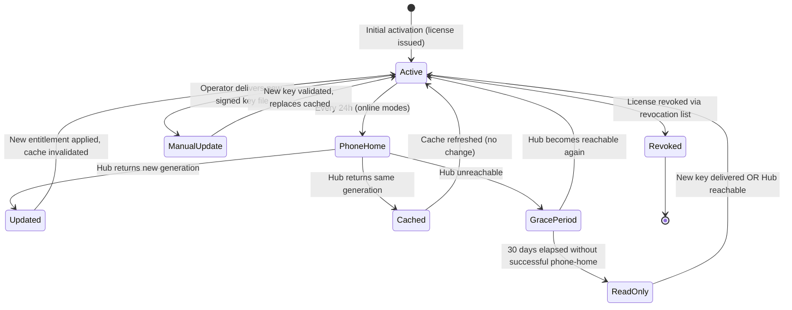

# Hybrid License Model

**Derives from:** [ADR-0020](../decisions/0020-triple-deployment-hybrid-license.md),
[ADR-0021](../decisions/0021-feature-based-entitlement.md),
[ADR-0019](../decisions/0019-learnstack-hub.md).

LearnStack uses a **hybrid license model** combining:

- **Phone-home** (default; online connectivity to Hub).
- **RSA-signed license key** (offline-capable; embeds entitlement projection).
- **30-day grace period** on expiry.
- **Revocation list** (signed bundle published by Hub; consumed by LearnStack runtime).

The model handles all three deployment modes (SaaS / Dedicated / Self-Hosted) with one
common implementation. This document describes the license payload, lifecycle, signing
procedure, refresh cadence, revocation flow, and operational runbook.

## 0. Canonical key vocabulary

The corpus has carried two incompatible spellings for the same cross-repository
projection: `classroom.recording` versus `classroom.recording.enabled`, and
`tenancy.max_learners` versus `limits.max_users` versus a bare `max_users`. Since the
payload is parsed by two repositories and cached in a third place, "close enough" means a
feature silently reads `false`.

**One form is canonical, and it is the one fixed by
[ADR-0021 Amendment 1 (2026-05-18)](../decisions/0021-feature-based-entitlement.md) and
[21-feature-flags.md](21-feature-flags.md):**

| Rule | Canonical | Not canonical |
|---|---|---|
| Every key is `{area}.{name}`, lowercase, dot-separated, `snake_case` within a segment | `classroom.recording` | `recording`, `Classroom.Recording` |
| Feature keys carry **no** `.enabled` suffix — a `FeatureKey` is boolean by construction | `classroom.recording` | `classroom.recording.enabled` |
| Limit keys are prefixed by their **subject area**, never by the word `limits` | `tenancy.max_learners` | `limits.max_users`, `max_users` |
| The area is the capability's owner, not the payload section it appears in | `media.storage_gb` | `limits.media_storage_gb` |

Two further rules make the vocabulary enforceable rather than aspirational:

- **A key that is not in `FeatureKeys` / `LimitKeys` may not appear in a payload.** The
  registries in [21-feature-flags.md](21-feature-flags.md) are the closed set; adding a
  key is a code change in both repositories plus a plan-editor update, not a Hub-side
  string.
- **`FeatureKey_AllReferences_AreInRegistry`** (catalogued in
  [Architecture Tests Catalogue](../standards/21-architecture-tests-catalogue.md)) fails
  the build on a free-form string, and the schema snapshot test in
  [§ 5](#5-entitlement-read-path-and-grace-enforcement) fails on a payload that carries
  an unregistered key.

Every older spelling elsewhere in the corpus is superseded by this table. Where a
document still shows `limits.max_users`, it is stale, not an alternative.

## 1. License key payload

The key is a JWT-style RS256-signed token with a custom header `typ: "LSL"`
("LearnStack License"). Its `entitlement` object is the **same shape** the Hub pushes
over `PUT /api/internal/tenants/{id}/entitlements` and the same shape
`platform_entitlement_cache` stores — one wire contract, three carriers — and it is
pinned by `entitlement-v1.schema.json` (see [§ 5](#5-entitlement-read-path-and-grace-enforcement)).

```json
{
  "header": {
    "alg": "RS256",
    "typ": "LSL",
    "kid": "lsl-signing-key-v1"
  },
  "payload": {
    "iss": "learnstack-hub",
    "sub": "tenant-uuid-here",
    "iat": 1747576800,
    "exp": 1779112800,
    "deployment_mode": "SelfHostedAirGapped",
    "entitlement": {
      "tier": "enterprise",
      "features": {
        "classroom.recording": true,
        "tenancy.custom_domain": true,
        "tenancy.white_label_branding": true,
        "customization.unlimited_content_types": true,
        "identity.sso.saml": true,
        "analytics.advanced_reporting": true,
        "integrations.api_access": true,
        "audit.export": true,
        "compliance.data_residency": true
      },
      "limits": {
        "tenancy.max_learners": 50000,
        "tenancy.max_organizations": 100,
        "classroom.minutes_per_month": -1,
        "classroom.recording_storage_gb": 10000,
        "media.storage_gb": 50000,
        "media.bandwidth_gb_per_month": -1,
        "integrations.api_rate": 60000
      },
      "compliance": {
        "caps": {
          "audit.retention.days":  { "allowed": true,  "forced": true, "value": 2555 },
          "data.residency.region": { "allowed": false, "forced": true, "value": "eu-central" }
        }
      },
      "generation": 17
    },
    "issued_at": "2026-05-18T00:00:00Z",
    "expires_at": "2028-05-18T00:00:00Z",
    "grace_until": "2028-06-17T00:00:00Z",
    "phone_home_url": "https://hub.learnstack.dev/api/v1/internal/license/refresh",
    "revocation_list_url": "https://hub.learnstack.dev/api/v1/internal/license/revocations"
  },
  "signature": "base64url-encoded-RS256-signature-over-base64url(header).base64url(payload)"
}
```

Encoded as `<base64url(header)>.<base64url(payload)>.<base64url(signature)>` — same wire
format as JWT, distinguishable by the `typ: "LSL"` header.

## 2. Signing keys

LearnStack maintains an **RSA-2048 (minimum)** key pair for license signing:

- **Private key** in Vault: `secret/learnstack-hub/license-signing-key`.
- **Public key** bundled with every LearnStack release in
  `LearnStack.Infrastructure.Licensing.PublicKeys` (build-time embedded).
- **Key rotation**: a new `kid` is added; both keys remain valid for the deprecation
  window (default 1 year). Old keys eventually removed; revocation list takes precedence.

Multiple keys (JWKS-style):

```csharp
public sealed class LicenseSigningKeySet
{
    public required IReadOnlyList<LicenseSigningKey> Keys { get; init; }
}

public sealed class LicenseSigningKey
{
    public required string Kid { get; init; }
    public required RSAParameters PublicKey { get; init; }
    public required DateTimeOffset ValidFrom { get; init; }
    public DateTimeOffset? RetiredAt { get; init; }   // null = still valid
}
```

Verifier (in `SignedLicenseKeyEntitlementProvider`):

1. Parse JWT header; read `kid`.
2. Look up the key in the embedded key set.
3. Verify signature.
4. Reject if `kid` not found or signature invalid.
5. Reject if `kid` is in retired set AND token `iat` > `RetiredAt`.

## 3. Lifecycle



### State semantics

| State | Entitlement available | Writes allowed | Reads allowed |
|-------|----------------------|----------------|---------------|
| **Active** | Yes (current) | Yes | Yes |
| **PhoneHome** (transient) | Yes (cached) | Yes | Yes |
| **GracePeriod** | Yes (last-known cached, expired but within grace) | Yes (with warning banner) | Yes |
| **ReadOnly** | Yes (last-known cached, past grace) | **No** (returns "license expired" error) | Yes (read-only) |
| **ManualUpdate** (transient) | Yes (cached) | Yes (during update) | Yes |
| **Revoked** | No | No | No (returns 403 with license-revoked error) |

## 4. Phone-home refresh

`SelfHostedOnline` and SaaS / Dedicated all phone home daily. Hangfire recurring job:

```csharp
public sealed class LicenseRefreshJob : LearnStackJob<LicenseRefreshJobParams>
{
    protected override async Task ExecuteAsync(LicenseRefreshJobParams parameters, CancellationToken ct)
    {
        var current = await _entitlementCache.GetAsync(parameters.TenantId, ct);
        try
        {
            var refreshed = await _hubClient.RefreshAsync(parameters.TenantId, ct);
            if (refreshed.Generation > (current?.Generation ?? 0))
            {
                await _entitlementCache.SetAsync(parameters.TenantId, refreshed, ct);
                await _eventBus.PublishAsync(new EntitlementUpdatedIntegrationEvent
                {
                    TenantId = parameters.TenantId,
                    Generation = refreshed.Generation
                }, ct);
                _logger.LogInformation("Entitlement refreshed for tenant {TenantId} to gen {Gen}",
                    parameters.TenantId, refreshed.Generation);
            }
            await _entitlementCache.SetLastSuccessAsync(parameters.TenantId, DateTimeOffset.UtcNow, ct);
        }
        catch (HttpRequestException ex)
        {
            _logger.LogWarning(ex, "Phone-home failed for tenant {TenantId}; grace period continues",
                parameters.TenantId);
            // Grace period enforcement happens at read time in IEntitlementProvider.
        }
    }
}
```

**Jitter**: in a SaaS deployment with many tenants, the daily refresh would otherwise all
hit Hub at the same time. The job adds a random 0-119 minute offset per tenant when first
enqueued.

## 5. Entitlement read path and grace enforcement

### What was wrong

The earlier `HubEntitlementProvider.GetAsync` had two defects that cancelled out the
guarantee this whole document exists to provide:

1. **No cold-start fallback.** On a cache miss it called the Hub unguarded. A Hub outage
   therefore threw a transport exception **out of a feature-flag check** — so a pod
   restart during a Hub incident turned "is recording enabled?" into a 500 on an
   unrelated request path.
2. **The durable table was never read.** `platform_entitlement_cache` — the table that
   carries `valid_until` and `grace_until` — did not appear anywhere in the read path.
   Grace was evaluated against whatever happened to be in the distributed cache, whose
   TTL is ≤ 15 minutes. The advertised **30-day grace period was, in practice, a 15-minute
   cache TTL**: on eviction, the only source left was the Hub, which was the thing that
   was down.

Those are the same defect seen twice: a *freshness* mechanism (cache TTL) was being used
as an *authorisation* mechanism (grace window). They are different clocks and they need
different storage.

### The normative order

[ADR-0034 § The entitlement read path](../decisions/0034-hub-contract-surface-invariant.md)
fixes the order, and the order is normative — an implementation may not skip a layer:

```text
L1 in-process cache                 (per pod; seconds)
  → L2 distributed cache             (ICacheService; ≤ 15 min TTL — freshness only)
    → platform_entitlement_cache     (durable table; carries valid_until + grace_until)
      → Hub  POST /api/v1/internal/license/verify   (last resort, always guarded)
```

```csharp
public async Task<EntitlementLookup> GetAsync(TenantId tenantId, CancellationToken ct)
{
    // 1-2. L1 → L2, both pure freshness layers.
    if (await _cache.GetAsync<Entitlement>(CacheKey(tenantId), ct) is { } cached)
        return Evaluate(cached, source: EntitlementSource.Cache);

    // 3. Durable projection. This is the layer that makes grace real: it survives pod
    //    restarts, cache flushes and Hub outages, and it is the only place valid_until /
    //    grace_until are authoritative.
    var durable = await _entitlementCacheStore.FindAsync(tenantId, ct);

    // 4. Hub — only when the durable row is missing or stale, and never unguarded.
    if (durable is null || _clock.UtcNow >= durable.ValidUntil)
    {
        try
        {
            var refreshed = await _hubClient.VerifyAsync(tenantId, ct);
            await _entitlementCacheStore.UpsertAsync(refreshed, ct);   // durable first
            await _cache.SetAsync(CacheKey(tenantId), refreshed, ct);  // then fast layers
            return Evaluate(refreshed, source: EntitlementSource.Hub);
        }
        catch (Exception ex) when (ex is not OperationCanceledException)
        {
            // A control-plane outage must not throw out of a feature-flag check.
            _logger.LogWarning(ex, "Hub verify failed for {TenantId}; falling back", tenantId);
            _metrics.HubVerifyFailed();
            if (durable is null)
                return EntitlementLookup.Unresolved(tenantId);   // policy table below decides
        }
    }

    await _cache.SetAsync(CacheKey(tenantId), durable!, ct);
    return Evaluate(durable!, source: EntitlementSource.Durable);
}
```

`Evaluate` applies the lifecycle from [§ 3](#3-lifecycle): fresh → serve; past
`valid_until` but within `grace_until` → serve with `InGracePeriod = true`; past
`grace_until` → read-only.

The provider **never throws** out of a feature-flag or limit check. Every path returns an
`EntitlementLookup` carrying the values, the source, and whether the answer is degraded.

### Failure policy by key class

`EntitlementLookup.Unresolved` — no cache, no durable row, no Hub — is the only genuinely
hard case, and one blanket answer is wrong for it. Each key class declares its posture
**explicitly in the registry**, so the behaviour is a property of the key rather than of
the call site:

| Key class | Posture when unresolved | Why |
|---|---|---|
| Compliance caps (`compliance.*`, `audit.retention.days`, `data.residency.region`) | **Fail closed** — reject the operation that depends on the cap | An unknown residency or retention cap must never be read as permissive; a wrong answer here is a regulatory finding |
| Security-surface features (`identity.sso.saml`, `identity.scim`, `audit.export`, `integrations.api_access`) | **Fail closed** — treat as disabled | An unknown answer must not open an export or an API surface |
| Product capability features (`classroom.recording`, `classroom.breakout_rooms`, `tenancy.custom_domain`, `analytics.advanced_reporting`) | **Fail closed on a cold start, fail open to the last known value otherwise** | A paying tenant mid-class should not lose recording because the Hub is down — but the platform must not invent an entitlement it has never seen |
| Numeric limits (`tenancy.*`, `classroom.*`, `media.*`, `integrations.api_rate`) | **Fall back to the built-in floor** — the Starter-tier defaults compiled into the binary. Never `-1`, never `0` | Unlimited is a gift; zero is an outage. The floor keeps a tenant working at the smallest plan's ceiling until the answer arrives |

Two consequences worth naming:

- Cold-start-unresolved is **rare and loud**: it requires an empty L1, an empty L2, no
  durable row, and an unreachable Hub. It is alerted on
  `learnstack_entitlement_unresolved_total{tenant_id}`, not silently absorbed.
- The source of every answer is observable —
  `learnstack_entitlement_source_total{source}` over `cache | durable | hub | floor`. A
  rising `durable` share means the Hub is degraded; a non-zero `floor` share means
  tenants are being served the fallback and someone must know.

### The wire contract is pinned

The projection's shape is checked into **both** repositories as
`entitlement-v1.schema.json`, and a snapshot test in each fails the build when the
serialised payload drifts from it. This is what makes the read path above safe to
evolve: a Hub-side field rename that LearnStack cannot parse breaks a test in the Hub
repository, not a tenant's feature flag in production.

The schema also encodes the vocabulary from [§ 0](#0-canonical-key-vocabulary) —
`features` and `limits` keys are validated against the registry — so an unregistered key
cannot reach a payload that LearnStack will cache.

### UI surface

When in grace, Admin Studio surfaces a banner: "Your license is in a 30-day grace period.
Contact support / renew via Hub." When past grace, every feature flag returns `false` and
every limit returns `0`; writes return `Result.Fail("license.expired_read_only")` and
reads continue, so customers never lose access to their own data.

## 6. Signed-key delivery (air-gapped)

For `SelfHostedAirGapped`, LearnStack delivers the signed `.lic` file out-of-band:

1. Hub operator clicks "Generate License Key" on the tenant detail page.
2. Hub generates `Entitlement` snapshot from current `Plan` + `HubSubscription`.
3. Hub signs the payload with the active RSA private key (Vault-backed).
4. Hub returns the `.lic` file via download.
5. Operator delivers to customer via signed email / SFTP / USB / customer's secure
   channel.
6. Customer places at `/var/learnstack/license/current.lic`.
7. Customer sends `SIGHUP` to LearnStack pod (`kubectl exec ... -- kill -HUP 1`) OR waits
   for the 1-hour file-watch / poll cycle.
8. `SignedLicenseKeyEntitlementProvider` re-reads the file, verifies signature, populates
   cache.

Same pattern as Nexora's license hot-reload
(`Nexora/docs/decisions/0030-license-hot-reload-mechanism.md`,
`Nexora/docs/operations/license-and-helm-upgrade.md`).

## 7. Revocation

```
GET https://hub.learnstack.dev/api/v1/internal/license/revocations
```

Returns a signed bundle:

```json
{
  "payload": {
    "issued_at": "2026-05-18T00:00:00Z",
    "valid_until": "2026-05-19T00:00:00Z",
    "revoked_license_ids": [
      "license-uuid-1",
      "license-uuid-2"
    ]
  },
  "signature": "..."
}
```

LearnStack runtime (any deployment mode) fetches this bundle daily via a Hangfire job.
The signed bundle is cached locally; signature verified against the same key set.

License verification:

1. Verify signature (per `kid`).
2. Verify `exp` not passed.
3. Check `license_id` not in revocation set.

Air-gapped customers receive revocation-list updates out-of-band on the same channel as
license-key updates.

## 8. License key admin (Hub)

Hub operator portal exposes:

- **Issue License**: per-tenant, generates a new key, increments `generation`, records in
  `LicenseKey` table.
- **Revoke License**: marks `LicenseKey` row as revoked; adds to revocation bundle.
- **Resigning**: when a signing key rotates, all active licenses can be re-issued under
  the new key (operator-initiated bulk operation).
- **Phone-Home Activity**: per-tenant view of phone-home timestamps; alerts on tenants
  that haven't phoned home in > 24h.
- **Renewal Watch**: licenses expiring in next 30 days; operator-prompted renewal
  workflow.

## 9. Security considerations

| Threat | Mitigation |
|--------|------------|
| License-key forgery | RS256 signature; private key in Vault; public key embedded in binary |
| Replay (using an old license) | `iat` timestamp + revocation list |
| Key compromise | Key rotation procedure with grace window; revocation list as fail-safe |
| Air-gapped customer over-running expiry | 30-day grace + LearnStack-operator visibility for proactive renewal contact |
| Customer extending license offline | License is RSA-signed; customer cannot forge a new signature |
| Customer tampering with cached entitlement | Cache table protected by RLS + DB-level read-only role for non-admin paths |
| Stolen Hub API key | Per-tenant API key; rotatable; scope limited to license verify + usage report |
| Revoked license still cached | Revocation invalidates **all four** layers, in the order that closes the window: `platform_entitlement_cache` row first, then L2, then L1 via the invalidation event. Invalidating only the fast layers leaves the durable row to re-serve the revoked entitlement on the next miss. Cache TTL ≤ 15 min and the daily revocation-list pull are the backstops, not the mechanism |
| Grace window silently collapsing to a cache TTL | `valid_until` / `grace_until` are read from `platform_entitlement_cache`, never from a cache entry. An integration test flushes both cache layers, stops the Hub, and asserts the tenant still resolves through the durable row for the full grace window |

## 10. Architecture tests

1. `LicenseKey_Validation_RequiresRSA2048OrStronger` — verifier rejects RS128, none, weak
   algorithms.
2. `LicenseKey_Validation_ChecksRevocationList` — integration test: a license id in the
   revocation set is rejected.
3. `NullEntitlementProvider_RejectedInProduction` — runtime startup check: in any non-
   Development environment, `IEntitlementProvider` is `HubEntitlementProvider` or
   `SignedLicenseKeyEntitlementProvider`; never `NullEntitlementProvider`.
4. `LicenseKey_Payload_MatchesSchema` — `entitlement-v1.schema.json` snapshot test, run
   in **both** repositories against the same checked-in schema; any breaking change
   requires a schema-version bump and a coordinated change in both. A snapshot test in
   only one repository proves only that that repository is self-consistent.
5. `Entitlement_Read_Path_Falls_Through_To_Durable_Row` — integration test: flush L1 and
   L2, make the Hub unreachable, assert the tenant resolves from
   `platform_entitlement_cache` and that no exception escapes the feature-flag call.
6. `FeatureKey_AllReferences_AreInRegistry` — catalogued in
   [Architecture Tests Catalogue](../standards/21-architecture-tests-catalogue.md);
   backs the vocabulary rule in [§ 0](#0-canonical-key-vocabulary).

## 11. Phasing

Per [ADR-0035](../decisions/0035-demand-gated-infrastructure.md), the port ships early
and each implementation ships against a written trigger.

| Phase | Deliverable | Trigger |
|-------|-------------|---------|
| [02a Packet 6](../roadmap/phase-02a-kernel-tenancy.md) | `platform_entitlement_cache` table; `DeploymentMode` config enum | One-way door — the durable projection's schema and ownership |
| [02a Packet 9](../roadmap/phase-02a-kernel-tenancy.md) | `IEntitlementProvider` socket; `NullEntitlementProvider` (all features enabled, no limits) as the **only** implementation | — |
| [02c](../roadmap/phase-02c-hub-foundation.md) | `HubEntitlementProvider` with the four-layer read path above; `entitlement-v1.schema.json` in both repositories; Hub-side `Entitlement` recompute on subscription change | A tenant must be billed or plan-gated |
| [09b](../roadmap/phase-09b-hub-billing.md) | License-key issuance UI in the Hub operator portal | Commercial billing needed |
| [11](../roadmap/phase-11-production-hardening.md) | `SignedLicenseKeyEntitlementProvider` (air-gapped); revocation-list signing + distribution; phone-home retry / backoff tuning; grace-period integration tests; SIGHUP hot-reload; key-rotation procedure | A Self-Hosted contract is signed |

`NullEntitlementProvider` must not be registered outside `Development` once Phase 02c
lands (`NullEntitlementProvider_NotRegistered_OutsideDevelopment`).

## 12. Operational runbook (Phase 11)

- `docs/operations/license-key-management.md` — covers key generation, rotation, signing,
  delivery, revocation.
- `docs/operations/phone-home-troubleshooting.md` — diagnostics for tenants that stop
  phoning home (grace period banner, support actions).

## References

- ADR-0020 — Triple Deployment + Hybrid License.
- ADR-0021 (Amendment 1) — Feature-Based Entitlement; the canonical key vocabulary.
- ADR-0019 — LearnStack Hub.
- [ADR-0034](../decisions/0034-hub-contract-surface-invariant.md) — the normative
  entitlement read path and the Hub contract surface invariants.
- [ADR-0035](../decisions/0035-demand-gated-infrastructure.md) — which entitlement
  implementation ships when.
- [21-feature-flags.md](21-feature-flags.md) — the `FeatureKeys` / `LimitKeys` registries.
- [25-deployment-models.md](25-deployment-models.md) — three-mode topology.
- [24-learnstack-hub.md](24-learnstack-hub.md) — Hub architecture.
- Nexora reference: `Nexora/docs/decisions/0030-license-hot-reload-mechanism.md`,
  `Nexora/docs/operations/license-and-helm-upgrade.md`,
  `Nexora/docs/decisions/0023-nmp-billing-model.md`.
