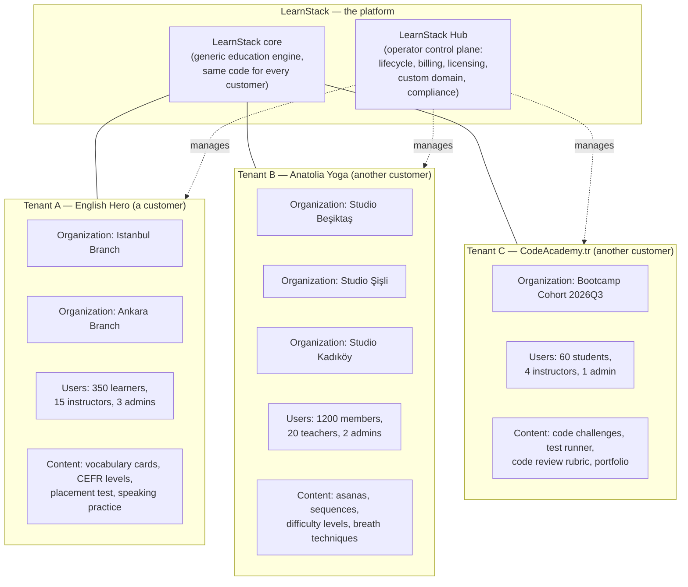
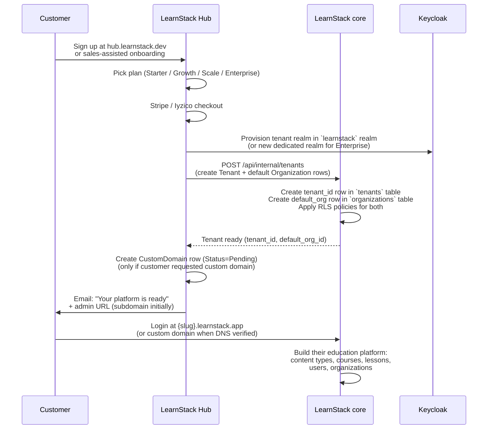
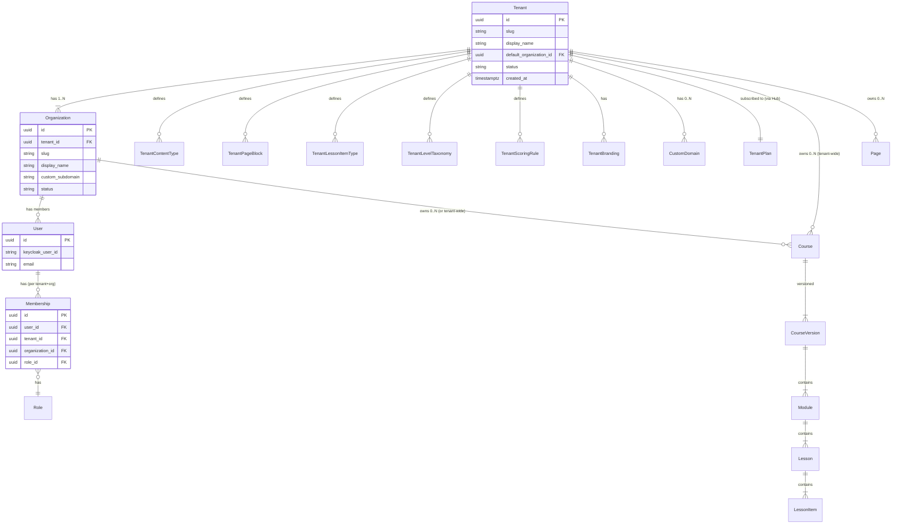

# Platform, Tenant, Organization — Conceptual Model

**Derives from:** [ADR-0017](../decisions/0017-tenant-organization-hierarchy.md),
[ADR-0018](../decisions/0018-tenant-driven-customization-model.md),
[ADR-0019](../decisions/0019-learnstack-hub.md),
[ADR-0020](../decisions/0020-triple-deployment-hybrid-license.md).

LearnStack is a **platform for building education platforms**. This document defines the
three layers of the platform: who builds what, who owns what, who pays for what.

## 1. The three layers

### Layer 1 — LearnStack (platform owner)

**LearnStack** is the company / team that builds and runs the platform. LearnStack ships:

- **LearnStack core** — a single .NET 10 application (codebase: this repository) with
  identity, tenancy, organization, content, catalog, enrollment, progress, classroom,
  scheduling, media, notification, audit, reporting modules. Every tenant gets the same
  code.
- **LearnStack Hub** — a separate application (codebase: `learnstack-hub`) where
  LearnStack operators manage tenant lifecycle, plans, subscriptions, license issuance,
  custom domain admin, compliance caps.

LearnStack operators authenticate against the `learnstack-hub` Keycloak realm. They do
**not** have tenant data access; Hub holds tenant metadata only (ADR-0019).

### Layer 2 — Tenant (LearnStack's customer)

A **tenant** is an independent education platform built on LearnStack. Each tenant is:

- A separate business / brand / organization that uses LearnStack to run their own
  education product.
- Fully isolated from every other tenant at every layer: database rows (RLS), storage
  prefixes, search indexes, cache keys, identity realm mapping, audit rows.
- Owner of their domain (`englishhero.com`, `anatoliayoga.com`, `codeacademy.tr`).
- Owner of their brand (logo, colours, typography, content).
- Owner of their content (courses, lessons, materials, recordings).
- Owner of their users (learners, instructors, parents, guardians).
- Subscribed to a LearnStack plan (Starter, Growth, Scale, Enterprise) that determines
  their entitlements (features and limits).

Tenants do not see each other; tenants do not see Hub; LearnStack operators do not see
tenant content.

### Layer 3 — Organization (sub-unit within a tenant)

An **organization** is a sub-unit *inside* a tenant. Use cases:

- **Multi-branch operations** — Anatolia Yoga runs three studios (Beşiktaş, Şişli,
  Kadıköy); each studio is an organization. Users (instructors, members) belong to one
  or more organizations.
- **Multi-cohort programs** — CodeAcademy.tr runs separate bootcamp cohorts (Q3 2026, Q1
  2027, …); each cohort is an organization with its own enrolment, schedule, and lifecycle.
- **Multi-department institutions** — A university runs separate extension programs
  (Engineering Ed, Business Ed, Music Ed); each program is an organization sharing the
  university's brand and content catalog.
- **Multi-region operations** — A language school chain has separate orgs for Türkiye,
  Germany, and the UK — each with its own compliance posture (KVKK, GDPR, ICO) and its
  own admin team.

Organizations share the tenant's content catalog, brand identity (unless overridden), and
plan. They do **not** share user rosters by default — each org has its own member list and
role assignments. Cross-org reporting is available to tenant-admins.

A tenant without explicit organizations has **one default org** auto-created at
provisioning. Single-org tenants experience no UX difference (org switcher hidden).

## 2. Customer journey

How a customer becomes a tenant:

## 3. Domain model (high level)

## 4. What customers can do — what LearnStack core does for them

LearnStack core provides the **same set of generic capabilities** to every tenant. The
domain-specific shape comes from the tenant's customization data (ADR-0018).

| Capability | LearnStack core provides | Tenant customizes |
|------------|--------------------------|-------------------|
| **User management** | Identity, authentication, MFA, federation, RBAC | Roles & their permission mix, invitation flow copy |
| **Organization** | Org aggregate, org-scoped permissions, default-org auto-create | Org names, branding overrides per org |
| **Content catalog** | Course / CourseVersion / Module / Lesson / LessonItem aggregates with publish workflow | Content types, custom fields, page blocks |
| **Enrollment & progress** | Enrollment, entitlement, cohort, progress aggregates | Completion rules (DSL), grading scales |
| **Live classroom** | LiveKit-backed sessions, scheduling, attendance, recording metadata | Roles, classroom layout, materials types |
| **Assessment** | Question banks, attempts, scoring engine | Question types (custom content), scoring rules (DSL), level taxonomies |
| **Notifications** | Email / SMS / WhatsApp / in-app channels, template engine | Templates, trigger workflows, sender identity |
| **Media** | Upload, transcoding (image variants, HLS), CDN delivery, signed URLs | Allowed formats, storage caps (entitlement-gated) |
| **Reporting** | Per-aggregate metrics, dashboards, exports | Custom report definitions |
| **Audit** | Audit trail of every command + sensitive read | Retention policy (within plan limits) |
| **Search** | Meilisearch tenant-scoped indexes per locale | Search-indexed content types (registered as data) |
| **Domain** | Tenant subdomain (`{slug}.learnstack.app`) always | Custom domain (paid feature) via Hub admin |
| **Branding** | Tenant brand tokens applied as CSS variables | Logo, colours, typography, custom CSS overrides (plan-gated) |
| **Localization** | Multi-locale per tenant; en + tr baseline | Adding/removing enabled locales |
| **Integrations** | Webhook engine, OAuth client manager | Webhook subscriptions, OAuth client definitions |

## 5. Hub responsibilities (what LearnStack operators do)

Operators (LearnStack staff) work through Hub. They do **not** access tenant data; they
manage:

- **Tenant lifecycle**: provision, suspend, archive, terminate.
- **Plans & subscriptions**: define plans (features + limits + price), assign to tenants,
  upgrade / downgrade, cancel.
- **Billing**: Stripe + Iyzico integration; invoice ingestion via webhooks; dunning;
  proration.
- **License issuance**: phone-home-capable license cache for SaaS; RSA-signed key
  generation for Self-Hosted (ADR-0020).
- **Custom domain admin**: DNS verification, TLS provisioning, cert renewal, revocation
  (ADR-0022).
- **Compliance caps**: per-tenant policy ceilings (`audit.retention.days.forced=true
  value=365`, `data.residency.region.forced=true value=eu-west`).
- **Usage metering**: classroom minutes, recording storage, media bandwidth, API rate —
  collected from LearnStack and consumed for billing dimension.
- **Support**: read-only support tools (with audit trail) to assist tenants without
  accessing their content.

## 6. Hard architectural invariants

The following invariants are enforced by architecture tests, integration tests, and
operational discipline:

1. **No two tenants share a row.** Every tenant-owned table has `tenant_id` + EF query
   filter + RLS policy. Architecture test `Every_TenantOwned_Entity_Has_TenantId` fails
   the build on violation. (ADR-0003)
2. **No two organizations in the same tenant share a row when org-scoped.** Same shape,
   one extra column. (ADR-0017)
3. **Hub never stores tenant content.** Hub DB schema is forbidden to contain `course`,
   `lesson`, `user`, `enrollment`, `live_session`, etc. — only metadata mirrors. Migration
   scan asserts. (ADR-0019)
4. **No domain-specific names in LearnStack modules.** `Cefr`, `Asana`, `CodeChallenge`,
   etc. do not appear in any LearnStack module type / namespace / file. (ADR-0018)
5. **Single binary, multi deployment.** SaaS, Dedicated, Self-Hosted all run the same
   container images. The differentiator is configuration + Dapr component YAML. (ADR-0020)
6. **Hub-LearnStack communication is mTLS-only on `/api/internal/*`.** This path is
   internal-listener-bound and never proxied through APISIX or exposed to the internet.
   (ADR-0019)
7. **Operator credentials cannot authenticate against tenant routes.** The
   `learnstack-hub` realm rejects authentication for tenant-bearing endpoints; the
   `learnstack` realm rejects platform-scope tokens. (ADR-0004 Amendment 1)

## 6a. Hub ↔ LearnStack ownership matrix

Both repositories carry a row for a tenant. Each field belongs to **exactly one** of
the two as the source of truth; the other side mirrors read-only and is invalidated
by integration events. The Hub HTTPS contract surface
([ADR-0034](../decisions/0034-hub-contract-surface-invariant.md)) means the only
legitimate cross-system writes flow through one of its enumerated endpoints, and every
one of them goes through a named adapter — `IEntitlementProvider`, `IUsageReporter` or
`IHubTenantSync`.

| Field | Authoritative side | Mirrored side | Sync direction & event |
|-------|--------------------|---------------|------------------------|
| `tenant_id` (UUID) | Hub (issued on tenant create) | LearnStack | One-time push at provisioning via `POST /api/internal/tenants` |
| `slug` (handle) | Hub | LearnStack | `POST /api/internal/tenants` at create; renames require an ADR (none today) |
| `display_name` | **LearnStack** | Hub | LearnStack publishes `learnstack.tenancy.tenant.renamed`; Hub consumer updates its mirror |
| `status` (Trial/Active/Suspended/Archived) | Hub | LearnStack | `PUT /api/internal/tenants/{id}/status` |
| `plan_code` | Hub | LearnStack | Carried inside entitlement projection (`PUT /api/internal/tenants/{id}/entitlements`) |
| `features` / `limits` / `compliance` | Hub | LearnStack (`platform_entitlement_cache`) | `PUT /api/internal/tenants/{id}/entitlements`; eagerly invalidated by Dapr event `learnstack.hub.entitlement` |
| Custom-domain `host → tenant` mapping | Hub | LearnStack (`platform_host_to_tenant`) | Hub pushes after DNS / TLS verification via `PUT /api/internal/tenants/{id}/host-mappings`, which carries the tuple only — certificate material moves by secret-store replication and is referenced by path. LearnStack resolves hosts from `platform_host_to_tenant` and **never** calls the Hub |
| Branding (logo, colours, typography) | **LearnStack** | Hub (denormalised summary only, optional) | LearnStack-side write only; no sync needed today |
| Organizations + memberships | **LearnStack** | — | Hub does not mirror; tenant-internal shape |
| Course / content / lesson / enrollment / progress data | **LearnStack** | — | Hub never stores tenant content (invariant #3 above) |
| Usage signals (concurrent sessions, classroom minutes, storage GB, learner count) | **LearnStack** emits | Hub aggregates | `POST /api/v1/usage/report` (LearnStack → Hub); Hub rolls up in `UsageAggregate` |
| License key (Self-Hosted) | Hub | Self-Hosted instance reads `.lic` file | `POST /api/v1/internal/license/verify` for phone-home; signed file otherwise |
| Audit log | **LearnStack** | — | LearnStack-only; Hub has its own operator-action audit log keyed by `actor.hubOperator = true` |

**Rename rule.** The two fields that can change after provisioning
(`display_name`, branding) are LearnStack-authoritative — there is no Hub endpoint to
write them, only a LearnStack-published event the Hub consumer mirrors. Adding a
Hub-side write for `display_name` would require a new ADR, because the contract surface
is a cross-repository agreement.

**Mirror staleness budget.** The entitlement projection is **eagerly** invalidated via
Dapr and otherwise has a 15-min TTL. The host → tenant mapping is invalidated by Dapr
on activate/deactivate; the TTL fallback is 60s. Usage aggregates roll up daily on
the Hub side. Anything outside these windows is a Hub-side incident, not a normal
operating condition.

## 7. Customer profile examples

### Customer profile A — Solo founder running a niche language platform

- **Plan**: Starter
- **Organizations**: 1 (default)
- **Users**: ~50 learners, 1-2 instructors
- **Domain**: `mynichelanguage.com` (or starts on `mynichelanguage.learnstack.app` and
  upgrades to custom domain on Growth tier)
- **Content shape**: Standard vocabulary cards + grammar points; off-the-shelf templates
  loaded from a future content marketplace (Phase 12).
- **Hub touchpoints**: Stripe Checkout for monthly plan; occasional support tickets.

### Customer profile B — Yoga chain with 3 studios

- **Plan**: Growth Annual
- **Organizations**: 3 (Beşiktaş, Şişli, Kadıköy); plus a default org for tenant-wide
  content.
- **Users**: ~1200 members across studios; ~20 teachers; 2 tenant admins; 3 org admins
  (one per studio).
- **Domain**: `anatoliayoga.com` with subdomain mapping `besiktas.anatoliayoga.com` per
  org.
- **Content shape**: Custom content types (Asana, BreathTechnique, Sequence); difficulty
  taxonomy.
- **Hub touchpoints**: Annual invoice; custom domain admin; KVKK retention cap (1 year)
  set via compliance caps.

### Customer profile C — Corporate L&D for a multinational

- **Plan**: Enterprise (with Dedicated deployment)
- **Organizations**: ~30 (one per regional office; reporting parent for "EMEA", "APAC",
  "AMERICAS")
- **Users**: ~15,000 employees as learners; ~200 instructors; ~50 LMS administrators
- **Domain**: `learn.bigcorp.com`
- **Content shape**: Mostly off-the-shelf compliance training + custom-built leadership
  modules; some content types extended (e.g. "SkillCertification" with expiry tracking).
- **Hub touchpoints**: Annual contract; Dedicated deployment infrastructure managed by
  LearnStack; SSO/SAML federation; data residency cap (`eu-west`); audit retention 7
  years.

### Customer profile D — University with air-gapped on-prem deployment

- **Plan**: Enterprise (Self-Hosted, air-gapped)
- **Organizations**: 8 (one per faculty)
- **Users**: ~50,000 students; ~5,000 faculty
- **Domain**: `learn.university.edu` on customer's own infrastructure
- **License**: RSA-signed license key with 2-year validity; phone-home disabled (air-gapped).
- **Hub touchpoints**: None online; LearnStack support provides license key updates via
  signed file delivery.
- **Deployment**: Customer-managed Kubernetes cluster; LearnStack ships Helm chart;
  customer-provided cert (Option B from ADR-0022) since no Let's Encrypt access.

## 8. Decision sequence (what happens when)

| Decision | When | By whom |
|----------|------|---------|
| Plan & price | Customer signup or upgrade | Customer (in Hub UI) |
| Tenant provisioning | Plan activation | Hub (automated) |
| Default org creation | Tenant provisioning | LearnStack (automated) |
| Custom domain submission | Customer-initiated in tenant Admin Studio | Tenant admin |
| Custom domain verification + cert | DNS confirms ownership | Hub (automated) |
| Org creation (additional) | Customer-initiated in tenant Admin Studio | Tenant admin |
| Org-admin role assignment | Per-org, by tenant admin or org admin | Tenant admin / org admin |
| Content type definition | Per tenant, by tenant admin or content engineer | Tenant admin (in Admin Studio) |
| Course / lesson authoring | By instructors or content editors | Tenant content editors |
| Enrollment | Manual by admin or automated via integration | Tenant admin / system |
| Compliance cap change | Per tenant, by LearnStack operator | Hub operator (audit-logged) |
| Plan change | Customer self-service in Hub UI | Customer |
| Tenant suspension | Non-payment or policy violation | Hub operator (audit-logged) |
| Tenant termination | Customer cancellation | Hub operator + customer confirmation |

## 9. What this document does **not** define

- **Specific schema** of `Tenant`, `Organization`, `User`, `Membership`, `Course`, etc. —
  see [02-domain-model.md](02-domain-model.md).
- **RLS policy SQL templates** — see [09-tenant-isolation.md](09-tenant-isolation.md).
- **Hub API contract** — see [24-learnstack-hub.md](24-learnstack-hub.md).
- **Customization data shape** — see [32-tenant-customization-model.md](32-tenant-customization-model.md).
- **Deployment topology per mode** — see [25-deployment-models.md](25-deployment-models.md).
- **Custom domain workflow** — see [27-custom-domain-tls.md](27-custom-domain-tls.md).

## References

- ADR-0003 (Tenant Isolation, Amendment 1 for organization scope).
- ADR-0017 (Tenant + Organization Two-Level Hierarchy).
- ADR-0018 (Tenant-Driven Customization Model).
- ADR-0019 (LearnStack Hub).
- ADR-0020 (Triple Deployment + Hybrid License).
- ADR-0022 (Custom Domain & TLS).
- [02-domain-model.md](02-domain-model.md) — aggregate schemas.
- [09-tenant-isolation.md](09-tenant-isolation.md) — defense-in-depth.
- [24-learnstack-hub.md](24-learnstack-hub.md) — Hub architecture.
