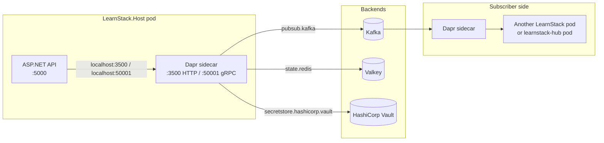

# Dapr Integration

**Derives from:** [ADR-0014](../decisions/0014-adopt-dapr.md),
[ADR-0006](../decisions/0006-events-and-outbox.md),
[ADR-0010](../decisions/0010-cross-module-communication.md).

> **Read this first.** This document describes Dapr in the present tense as the **target
> design**. Per [ADR-0035](../decisions/0035-demand-gated-infrastructure.md) no Dapr
> component is wired today. Of the three ports, only `ISecretProvider` has shipped —
> `ConfigurationSecretProvider`, in Packet 3. `IEventBus` and `ICacheService` land with
> their in-process defaults (`InProcessEventBus`, `InMemoryCacheService`) in
> [Phase 02a Packet 5](../roadmap/phase-02a-kernel-tenancy.md); from then on those
> defaults are the only registrations in every deployment mode. The three Dapr adapters
> land in
> [Phase 11](../roadmap/phase-11-production-hardening.md) against written triggers — a
> second process consuming an integration event, a second application instance, and
> secrets needing rotation without a redeploy. Nothing below is wrong; none of it is
> running.

LearnStack uses **Dapr** (Distributed Application Runtime) for three building blocks:
**pub/sub** (Kafka), **state store** (Valkey), **secret store** (Vault). Application code
interacts with Dapr only through SharedKernel abstractions (`IEventBus`, `ICacheService`,
`ISecretProvider`) — never via `DaprClient` directly.

## 1. Topology



The sidecar shares the network namespace of the app pod (Docker compose
`network_mode: "service:learnstack-api"`; Kubernetes via `dapr.io/enabled` annotation).
The app talks to the sidecar via `localhost`, never directly to Kafka / Valkey / Vault.

## 2. Components

Component YAML files live in `dapr/components/`. They are tracked in git as deployment
artifacts.

### `pubsub.yaml` — Kafka pub/sub

```yaml
apiVersion: dapr.io/v1alpha1
kind: Component
metadata:
  name: pubsub
  namespace: default
spec:
  type: pubsub.kafka
  version: v1
  metadata:
    - name: brokers
      value: kafka:29092
    - name: authType
      value: none                # production: SASL_SSL with TLS + SCRAM creds via Vault
    - name: consumeRetryInterval
      value: "200ms"
    - name: maxMessageBytes
      value: "1048576"           # 1MB
    - name: consumerID
      value: "learnstack-api"    # one per app id; isolates consumer groups
```

Topics follow the convention `learnstack.{module}.{aggregate}`. Examples:
- `learnstack.identity.user`
- `learnstack.tenancy.tenant`
- `learnstack.tenancy.organization`
- `learnstack.enrollment.enrollment`
- `learnstack.classroom.session`
- `learnstack.hub.entitlement`        (Hub-side)
- `learnstack.cache.invalidation`     (cross-instance L1 cache invalidation)

### `statestore.yaml` — Valkey state store

> The component below uses `spec.type: state.redis` and `redisHost` metadata —
> these are **Dapr provider-type / RESP-protocol identifiers**, NOT vendor
> brand markers. The actual backend is Valkey 8.x per
> [ADR-0030](../decisions/0030-redis-compatible-store-valkey.md); Valkey is
> drop-in compatible on the RESP wire protocol so the Dapr `state.redis`
> adapter consumes it unchanged. Operators read `redisHost` as "where to
> reach the RESP-compatible store"; in dev compose the value points at the
> `valkey` service (`infra/dapr/components/statestore-redis.yaml`).

```yaml
apiVersion: dapr.io/v1alpha1
kind: Component
metadata:
  name: statestore
  namespace: default
spec:
  type: state.redis
  version: v1
  metadata:
    - name: redisHost
      value: redis:6379
    - name: redisPassword
      secretKeyRef:
        name: redis-password
        key: redis-password
    - name: actorStateStore
      value: "false"             # we don't use actors
auth:
  secretStore: secretstore-vault
```

Used as L2 cache. Modules call `ICacheService.GetOrSetAsync(...)`; the implementation
wraps state-store calls plus an L1 in-memory cache plus tenant-aware key prefixing.

### `secretstore-vault.yaml` — Vault secret store

```yaml
apiVersion: dapr.io/v1alpha1
kind: Component
metadata:
  name: secretstore-vault
  namespace: default
spec:
  type: secretstores.hashicorp.vault
  version: v1
  metadata:
    - name: vaultAddr
      value: "https://vault:8200"
    - name: vaultToken
      value: "${VAULT_TOKEN}"   # dev only; production uses AppRole or Kubernetes auth
    - name: vaultKVPrefix
      value: "learnstack"
    - name: vaultKVUsePrefix
      value: "true"
    - name: enginePath
      value: "secret"
```

Secret path schema:

```
secret/learnstack/postgres            connection-string, ssl-cert
secret/learnstack/redis               password
secret/learnstack/keycloak            base-url, admin-username, admin-password
secret/learnstack/seaweedfs               endpoint, access-key, secret-key
secret/learnstack/meilisearch         master-key, public-key
secret/learnstack/livekit             api-key, api-secret, ws-url
secret/learnstack/coturn              shared-secret
secret/learnstack/hub                 internal-api-hmac-key, internal-api-mtls-cert,
                                      internal-api-mtls-key, internal-api-jwt-signing-key
```

In `Development` the **primary** `ISecretProvider` implementation is
`ConfigurationSecretProvider` (reads `IConfiguration`, which already merges environment
variables, user secrets and `appsettings.{env}.json`; matches the composition-root table in
[20-infrastructure-stack.md § Composition Root and Deployment Mode](../standards/20-infrastructure-stack.md)).
For dev workflows that prefer Dapr-shaped secrets (e.g. exercising the
`DaprSecretProvider` code path locally), an optional
`secretstore-local-file.yaml` reading from `dapr/components/secrets.json` is
**available** but not the default; the composition root picks one based on
`Deployment:Secrets:Provider` config (`env` | `dapr-file`). Both paths produce
the same observable behaviour through `ISecretProvider`.

### `secretstore-local-file.yaml` — optional dev variant

```yaml
apiVersion: dapr.io/v1alpha1
kind: Component
metadata:
  name: secretstore
  namespace: default
scopes:
  - environment: Development
spec:
  type: secretstores.local.file
  version: v1
  metadata:
    - name: secretsFile
      value: /components/secrets.json
    - name: nestedSeparator
      value: "/"
```

`secrets.json` is git-ignored; a `secrets.json.template` is committed.

## 3. SharedKernel abstractions

Application code interacts with Dapr exclusively through three interfaces in
`LearnStack.SharedKernel`:

```csharp
// LearnStack.SharedKernel.Messaging
public interface IEventBus
{
    Task PublishAsync(IIntegrationEvent @event, string partitionKey, CancellationToken ct = default);
}

// LearnStack.SharedKernel.Caching
public interface ICacheService
{
    Task<T?> GetAsync<T>(string key, CancellationToken ct = default);
    Task<T> GetOrSetAsync<T>(string key, Func<CancellationToken, Task<T>> factory,
        CacheOptions? options = null, CancellationToken ct = default);
    Task SetAsync<T>(string key, T value, CacheOptions? options = null, CancellationToken ct = default);
    Task RemoveAsync(string key, CancellationToken ct = default);
}

public sealed record CacheOptions(TimeSpan? L1Ttl = null, TimeSpan? L2Ttl = null);

// LearnStack.SharedKernel.Secrets
public interface ISecretProvider
{
    Task<string> GetSecretAsync(string key, CancellationToken ct = default);
    Task<T> GetSecretAsync<T>(string key, CancellationToken ct = default);
    Task<IReadOnlyDictionary<string, string>> GetSecretsAsync(string prefix, CancellationToken ct = default);
}
```

`IEventBus.PublishAsync` is **not generic** and `ICacheService` has **no
`RemoveByPrefixAsync`**; `CacheOptions` carries **no `Tags`**. All three were settled by
[ADR-0014 Amendment 2](../decisions/0014-adopt-dapr.md) — see
[15-event-and-outbox.md](15-event-and-outbox.md) for why a generic publish reaches zero
handlers at the only call site that matters, and § 4 below for why a prefix removal
cannot be honoured across instances.

**Keys are composed by the caller, not by the adapter.** `CacheKey.For(tenantId, module,
name)` — or `ForOrganization(...)` — produces the key and `CacheKey.EnsureValid` guards
its shape, so an adapter that also prefixed would emit `{tenant}:{tenant}:{module}:{name}`.
[Standards 20 § `ICacheService`](../standards/20-infrastructure-stack.md) fixes the
shape; every implementation validates, none rewrites.

Concrete implementations (`DaprEventBus`, `DaprCacheService`, `DaprSecretProvider`) live
in `LearnStack.Infrastructure.{Messaging, Caching, Secrets}`. They are the **only**
Dapr-aware code in the codebase.

### Development fallback: `InProcessEventBus`

When the Dapr sidecar is not running, the composition root registers
`InProcessEventBus : IEventBus`. It is a **transport, not a stub**: it resolves
`IIntegrationEventHandler<T>` by the event's runtime type, restores tenant context from
`@event.TenantId` into the handler's scope and puts the publisher's own back afterwards,
leaves `IInboxGuard` deduplication to the handler exactly as the durable path does, and
preserves per-partition-key ordering. A dev path that skipped those is a dev path where
the isolation code is never exercised — see
[15-event-and-outbox.md](15-event-and-outbox.md), which owns the implementation, and
[ADR-0035](../decisions/0035-demand-gated-infrastructure.md), which makes the four
obligations a condition of the gating.

## 4. Cache implementation (DaprCacheService)

L1 in-memory + L2 Dapr state store. The default implementation shipped in Packet 5 is
`InMemoryCacheService` (L1 only); this adapter lands on
[ADR-0035](../decisions/0035-demand-gated-infrastructure.md)'s trigger — more than one
application instance running concurrently.

```csharp
internal sealed class DaprCacheService : ICacheService
{
    private readonly DaprClient _dapr;
    private readonly IMemoryCache _memoryCache;
    private const string StateStoreName = "statestore";

    public async Task<T> GetOrSetAsync<T>(string key, Func<CancellationToken, Task<T>> factory,
        CacheOptions? options = null, CancellationToken ct = default)
    {
        // The key already carries its tenant — CacheKey composed it. Validate,
        // never re-prefix.
        CacheKey.EnsureValid(key);

        if (_memoryCache.TryGetValue(key, out T? cached) && cached is not null) return cached;

        var (state, etag) = await _dapr.GetStateAndETagAsync<T?>(StateStoreName, key, cancellationToken: ct);
        if (!string.IsNullOrEmpty(etag) && state is not null)
        {
            _memoryCache.Set(key, state, options?.L1Ttl ?? TimeSpan.FromMinutes(2));
            return state;
        }

        var value = await factory(ct);
        await SetAsync(key, value, options, ct);
        return value;
    }

    public Task SetAsync<T>(string key, T value, CacheOptions? options = null, CancellationToken ct = default)
    {
        CacheKey.EnsureValid(key);
        _memoryCache.Set(key, value, options?.L1Ttl ?? TimeSpan.FromMinutes(2));

        var metadata = new Dictionary<string, string>
        {
            ["ttlInSeconds"] = ((int)(options?.L2Ttl ?? TimeSpan.FromMinutes(15)).TotalSeconds).ToString()
        };
        return _dapr.SaveStateAsync(StateStoreName, key, value, metadata: metadata, cancellationToken: ct);
    }
}
```

### Why there is no prefix removal, and no invalidation topic

An earlier version of this document carried a `RemoveByPrefixAsync` backed by an
instance-local `_trackedKeys` dictionary, whose subscriber cleared *prefix-matching* L1
entries on every other pod. That is superseded by
[ADR-0014 Amendment 2](../decisions/0014-adopt-dapr.md).

The `learnstack.cache.invalidation` topic itself survives, and it is worth being precise
about what changed: the topic carries a `(tenant_id, cache_key)` payload and evicts **one
named key** across instances, which is enumerable by construction. What died is
invalidating a *set* the caller cannot enumerate. The topic is owned by
[Phase 11](../roadmap/phase-11-production-hardening.md), which lands the Dapr and Valkey
adapters and tests it under a broker partition — before that there is one instance and
one cache, so there is nothing to invalidate across.

The tracked-key set is the defect: it holds only what *this* instance wrote, so keys
written by another pod were never evicted — a method whose name promised a global effect
while delivering a local one, and which under-invalidated the moment a second instance
ran. That is precisely the condition under which the Dapr adapter exists at all.

What replaces it is a tenant-scoped **generation counter** embedded in the key template:
a durable value bumped inside the business transaction, so a write makes every stale key
unreachable at once without enumerating or deleting any of them, and without a
topic on the write path. It is a caller-side convention rather than a member of
`ICacheService`. See
[32-tenant-customization-model.md § 8.2](32-tenant-customization-model.md).

## 5. Sidecar deployment

### Docker Compose (development)

```yaml
services:
  learnstack-api:
    build: .
    ports: ["5100:5000"]
    depends_on:
      postgres:  { condition: service_healthy }
      redis:     { condition: service_healthy }
      kafka:     { condition: service_healthy }
      vault:     { condition: service_healthy }

  learnstack-api-dapr:
    image: daprio/daprd:1.14
    network_mode: "service:learnstack-api"
    command:
      - "./daprd"
      - "--app-id=learnstack-api"
      - "--app-port=5000"
      - "--dapr-http-port=3500"
      - "--dapr-grpc-port=50001"
      - "--resources-path=/components"
      - "--placement-host-address=dapr-placement:50006"
      - "--log-level=info"
    volumes:
      - ./dapr/components:/components:ro
    depends_on:
      - learnstack-api

  dapr-placement:
    image: daprio/placement:1.14
    command: ["./placement", "-port", "50006"]
    ports: ["50006:50006"]
```

### Kubernetes (production)

```yaml
apiVersion: apps/v1
kind: Deployment
metadata:
  name: learnstack-api
  annotations:
    dapr.io/enabled: "true"
    dapr.io/app-id: "learnstack-api"
    dapr.io/app-port: "5000"
    dapr.io/config: "learnstack-config"
    dapr.io/log-level: "info"
```

Components are deployed as `Component` Custom Resources via Helm; the Dapr operator
hot-loads them.

## 6. Resilience policies

`config/resiliency.yaml` (Dapr Resiliency CR) defines retry / circuit-breaker / timeout
policies referenced by component metadata:

```yaml
apiVersion: dapr.io/v1alpha1
kind: Resiliency
metadata:
  name: learnstack-resiliency
spec:
  policies:
    timeouts:
      pubsubTimeout: 30s
      stateTimeout: 5s
      secretTimeout: 5s
    retries:
      pubsubRetry:
        policy: exponential
        duration: 200ms
        maxInterval: 30s
        maxRetries: 5
    circuitBreakers:
      pubsubCB:
        maxRequests: 10
        interval: 60s
        timeout: 30s
        trip: consecutiveFailures >= 5
  targets:
    components:
      pubsub:
        outbound:
          timeout: pubsubTimeout
          retry: pubsubRetry
          circuitBreaker: pubsubCB
      statestore:
        outbound:
          timeout: stateTimeout
      secretstore-vault:
        outbound:
          timeout: secretTimeout
```

## 7. Observability

Dapr emits OTLP traces and Prometheus metrics by default. Both are routed to the same
collector LearnStack uses (`otel-collector` service in compose; OTel Collector in K8s).

Traces:
- Every pub/sub publish gets a span (`<topic> publish`).
- Every state store call gets a span (`<store> get` / `<store> save`).
- Every secret store fetch gets a span (`<store> get`).
- W3C trace context propagated from app → sidecar → backend automatically.

Metrics (Prometheus):
- `dapr_component_pubsub_egress_count{component, topic}` — publish count per topic.
- `dapr_component_pubsub_ingress_count{component, topic, status}` — consume count + outcome.
- `dapr_state_<op>_count{component, status}` — state ops.
- `dapr_resiliency_count{name, policy, target_type}` — circuit-breaker / retry triggers.

## 8. Architecture tests

Three blocker-level tests (added in Phase 02):

1. `Dapr_SDK_Types_NotImportedOutsideInfrastructure` — `Dapr.Client.*` types appear only
   in `LearnStack.Infrastructure.{Caching, Messaging, Secrets}` namespaces. Roslyn-based
   source scan.
2. `Modules_DoNotReference_DaprPackage` — module csproj files have no `<PackageReference
   Include="Dapr.*" />` entries.
3. `ICacheService_Is_OnlyCacheAbstraction` — no module imports
   `Microsoft.Extensions.Caching.Distributed`, `Microsoft.Extensions.Caching.Memory`,
   `StackExchange.Redis`, or `Dapr.Client` directly. Same for `IEventBus` and
   `ISecretProvider`.

## 9. Migration / rollback

If Dapr proves unfit for a particular deployment, only the Infrastructure layer changes:

- Replace `DaprEventBus` with `KafkaEventBus` (`Confluent.Kafka` direct producer).
- Replace `DaprCacheService` with `RedisCacheService` (`StackExchange.Redis` direct).
- Replace `DaprSecretProvider` with `VaultSecretProvider` (`VaultSharp` direct).

Module code is unaffected because module code references only the interfaces. Migration
window: one release.

## 10. Non-goals (deliberately not adopted)

- **Service invocation** — modular monolith doesn't need cross-app HTTP via Dapr; modules
  call each other via `Application.Contracts` interfaces in-process.
- **Workflow** — Hangfire (ADR-0002) is the background-job runtime.
- **Bindings** — modules ship their own adapters for email, SMS, payment, etc. Bindings is
  reconsidered if adapter portability becomes problematic.
- **Actors** — domain model has no need for actors.
- **Configuration** — `IConfiguration` + `IOptions<T>` + database-backed
  `ITenantConfiguration` covers LearnStack.
- **Distributed lock** — `pg_try_advisory_lock` is the LearnStack pattern (Nexora-proven).

If any of these become needed, a new ADR scopes the change.

## References

- ADR-0014 — Adopt Dapr.
- ADR-0006 Amendment 1 — Dapr pub/sub dispatch transport.
- ADR-0010 Amendment 1 — Outbox dispatch via Dapr.
- [20-infrastructure-stack.md](../standards/20-infrastructure-stack.md) — usage rules.
- Nexora reference:
  `Nexora/docs/decisions/0013-cache-cross-instance-invalidation.md` (cross-instance
  caching),
  `Nexora/docs/decisions/0005-transactional-outbox.md` +
  `Nexora/docs/decisions/0010-notification-delivery-kafka.md` (messaging),
  `Nexora/docs/architecture/COMMUNICATION_FLOW.md`.
