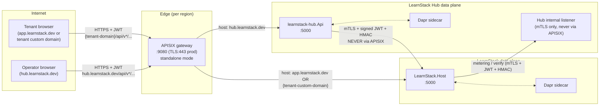

# API Gateway with APISIX

**Derives from:** [ADR-0015](../decisions/0015-api-gateway-apisix.md),
[ADR-0004](../decisions/0004-authentication-strategy.md),
[ADR-0011 (security standard)](../standards/11-security.md).

LearnStack uses **Apache APISIX** in standalone mode as the API gateway in front of both
the LearnStack core API and the LearnStack Hub API.

> **Status (2026-08-08).** APISIX is **demand-gated to
> [Phase 11](../roadmap/phase-11-production-hardening.md)** per
> [ADR-0035](../decisions/0035-demand-gated-infrastructure.md); its trigger is a non-development
> deployment that needs edge rate limiting, host routing, or JWT pre-validation. Until
> then the same responsibilities are carried by ASP.NET middleware inside the API
> process: correlation-id assignment, CORS, JWT bearer validation, rate limiting, and
> header normalisation. [ADR-0015](../decisions/0015-api-gateway-apisix.md) stands as the
> decision that APISIX is the gateway LearnStack uses; ADR-0035 decides when.
>
> **A gap worth naming rather than discovering.** In the shipped
> `infra/apisix/apisix.yaml`, route 100's `openid-connect` block is **commented out**, so
> today every `/api/v*` request reaches the backend unauthenticated **at the gateway**.
> **Neither layer authenticates today.** The backend does not re-validate, because there
> is nothing yet to re-validate against: `grep AddAuthentication\|UseAuthentication` over
> `backend/src` returns no registration, and `AuthorizationBehavior.Handle` is
> `return next()` with a Phase 03 TODO. Authentication lands in
> [Phase 02b](../roadmap/phase-02b-events-auth.md) and authorization in
> [Phase 03](../roadmap/phase-03-identity-admin.md); until then every `/api/v*` route is
> open, which is survivable only because no tenant-owned table and no protected endpoint
> exists yet. The "validated twice" property in § 5 describes the Phase 11 target, not
> the running system — and the first half of it arrives well before the gateway half.
> The block is uncommented in
> [Phase 11](../roadmap/phase-11-production-hardening.md), with the rest of APISIX:
> [ADR-0035](../decisions/0035-demand-gated-infrastructure.md) demand-gates the gateway,
> so [Phase 03](../roadmap/phase-03-identity-admin.md) delivers authorization in ASP.NET
> middleware and corrects this route table, but does not stand APISIX up in front of it.

## 1. Topology



Two hosts on the same APISIX instance:
- `app.learnstack.dev` and tenant custom domains → LearnStack core API.
- `hub.learnstack.dev` → Hub API.

Tenant ↔ LearnStack internal API (`/api/internal/*`) is bound to a different listener
inside the LearnStack pod, accessible only via mTLS from Hub; **not** proxied by APISIX.

## 2. Deployment mode

**Standalone mode** (no etcd). Routes loaded from YAML files mounted into the APISIX
container; APISIX hot-reloads on file change.

```text
infra/apisix/
├── config.yaml         # APISIX core config: deployment role, plugin list, observability
├── apisix.yaml         # Static route definitions (priority bands)
└── partials/
    ├── routes-custom-domains.yaml   # Generated by Hub; updated on CustomDomainActivated event
    └── ssl.yaml                     # SNI certs; cert/key referenced via Vault Agent sidecar
```

`apisix.yaml` is reloadable; the gateway watches the file for changes. Hub publishes
updates to `routes-custom-domains.yaml` via Kubernetes ConfigMap rolling update (or
direct file mount in dev).

When dynamic operator-driven config becomes a hard requirement (Phase 11+), we revisit
**etcd-backed mode** + APISIX Admin API — out of scope for now.

## 3. Plugin chain

Every request flows through this chain (in order):

```
Client request
  │
  ▼
1. real-ip          ─── trust X-Forwarded-For from L4 load balancer; reject if origin not allow-listed
  │
  ▼
2. cors             ─── handle preflight (OPTIONS) for allowed origins; inject Access-Control-* headers
  │
  ▼
3. request-id       ─── inject X-Correlation-Id (or echo if present)
  │
  ▼
4. openid-connect   ─── JWT validation against Keycloak realm (signature, expiry, issuer, audience)
  │                       only on authenticated routes
  │
  ▼
5. limit-req        ─── leaky-bucket rate limit per route + per remote-addr (or per consumer when authenticated)
  │
  ▼
6. limit-count      ─── per-window count limit for write endpoints (60/min/token)
  │
  ▼
6b. basic-auth      ─── consumer credentials from the secret store; used only by the
  │                       `/admin/hangfire*` infrastructure route, never on `/api/v*`
  │
  ▼
7. proxy-rewrite    ─── header normalisation; strip Authorization-Internal if leaked
  │
  ▼
Upstream backend (LearnStack.Host or learnstack-hub)
  │
  ▼
8. response-rewrite ─── strip internal headers from response (e.g. X-Internal-Trace)
  │
  ▼
9. prometheus       ─── /apisix/prometheus/metrics endpoint scraped by OTel collector
  │
  ▼
10. gzip            ─── compress response if Accept-Encoding allows
  │
  ▼
Client response
```

`config.yaml` declares the global plugin list:

```yaml
deployment:
  role: data_plane
  role_data_plane:
    config_provider: yaml

plugins:
  - real-ip
  - cors
  - request-id
  - openid-connect
  - limit-req
  - limit-count
  - basic-auth        # /admin/hangfire* only; a route may not use an undeclared plugin
  - proxy-rewrite
  - response-rewrite
  - prometheus
  - gzip
```

## 4. Route table

Three rules govern this table, and each exists because its violation has already been
found in the corpus.

### Rule 1 — the URI wildcard is a single trailing `*`

`lua-resty-radixtree`, the matcher APISIX uses, supports **one** wildcard and only at the
**end** of the path. There is no `**` form, and a `*` in the middle of a path is not a
wildcard — it is a literal asterisk. A route declared as `/api/v*/**` therefore does not
mean "any version, any sub-path"; it means something no client will ever send.

Because [ADR-0024](../decisions/0024-api-versioning-policy.md) puts the version in the
URL and the version set is small and enumerable, the correct spelling is one route per
live version:

| Wrong | Right |
|---|---|
| `/api/v*/**` | `/api/v1/*` (and `/api/v2/*` when v2 ships) |
| `/api/v*/localization/*` | `/api/v1/localization/*` |

Adding a version adds routes. That is the intended cost of URL versioning, and it keeps
the deprecation window in ADR-0024 visible in the gateway config rather than hidden
behind a wildcard.

### Rule 2 — every route declares an explicit `priority`

APISIX resolves overlapping routes by `priority`, **higher wins**, and an omitted
`priority` defaults to `0`. The `id` field is an identifier, not an ordering — a fact the
earlier version of this table obscured by using `id` values that looked like priority
bands.

The consequence of that confusion was concrete: the public `GET /api/v*/localization/*`
route carried no `priority` (so `0`) while the authenticated catch-all carried
`priority: 100`. Both matched a localization request, the catch-all won, and **a route
documented as public anonymous would have demanded a bearer token** — an anonymous
learner loading a public page would have received 401 from the gateway.

The banding is therefore **specific-beats-general, written down**:

| Band | Priority | Contents |
|---|---|---|
| Infrastructure | 400 | `/healthz`, `/openapi/*` and `/docs*` (environment-gated), `/admin/hangfire*` |
| Public anonymous | 300 | Named public paths: localization, public catalog reads, auth endpoints with their own strict limits |
| CORS preflight | 200 | `OPTIONS` on the versioned prefix — must beat the authenticated band so preflight never reaches `openid-connect` |
| Authenticated catch-all | 100 | Everything else under the versioned prefix |

**A public route always outranks the catch-all.** The invariant is **not** asserted in CI
today — there is no route-table lint, and calling a rule enforced when the check does not
exist is precisely the failure
[Standards 21](../standards/21-architecture-tests-catalogue.md) is written against. The
lint ships with APISIX itself in
[Phase 11](../roadmap/phase-11-production-hardening.md). It will fail when any route omits
`priority`, and when any route whose plugin
set lacks `openid-connect` shares a path prefix with a higher-or-equal-priority route
that has it.

### Rule 3 — one trust domain per credential

Route 100 previously carried
`client_secret_ref: vault://learnstack/hub/internal-api-hmac-key`. That path is the
**Hub internal API HMAC body-signing key** — a credential from an entirely different
trust domain, whose possession lets the holder forge a signed entitlement push for **any
tenant**. Handing it to the edge gateway as an OIDC client secret placed the platform's
highest-value secret on its most exposed component.

The line is **deleted**, and no substitute is needed: the route is `bearer_only: true`,
which means APISIX validates a presented bearer token against the realm's public JWKS and
never performs a code exchange. A `bearer_only` OIDC route has no use for a client
secret at all.

```yaml
routes:
  # ---- Infrastructure band — priority 400 -------------------------------
  - id: 1
    uri: /healthz
    methods: [GET]
    priority: 400
    plugins:
      limit-req: { rate: 10, burst: 5, key: remote_addr, rejected_code: 429 }
    upstream: { type: roundrobin, nodes: { "learnstack-api:5000": 1 } }

  - id: 2
    uris: ["/openapi/*", "/docs", "/docs/*"]
    priority: 400
    upstream: { type: roundrobin, nodes: { "learnstack-api:5000": 1 } }
    # The document and the reference console are separate paths on purpose:
    # Scalar mounts a `{documentName?}` catch-all inside whatever prefix it is
    # given, and under /openapi that shadowed the document namespace. Gating is
    # a per-environment decision here; the application serves both everywhere,
    # because the document is the contract the SDK generates from.

  # Hangfire dashboard — defense-in-depth: gateway BasicAuth + backend role check
  - id: 3
    uri: /admin/hangfire*
    priority: 400
    plugins:
      basic-auth: {}             # consumer credentials from the secret store
    upstream: { type: roundrobin, nodes: { "learnstack-api:5000": 1 } }

  # ---- Public anonymous band — priority 300 -----------------------------
  # MUST outrank the authenticated catch-all, or these become 401s.
  - id: 10
    uri: /api/v1/localization/*
    methods: [GET]
    priority: 300
    plugins:
      cors: { allow_origins: "https://app.learnstack.dev,https://hub.learnstack.dev" }
      limit-req: { rate: 50, burst: 20, key: remote_addr, rejected_code: 429 }
    upstream: { type: roundrobin, nodes: { "learnstack-api:5000": 1 } }

  - id: 11
    uri: /api/v1/auth/*
    methods: [POST]
    priority: 300
    plugins:
      # allow_origins takes EXACT origins or `**`. It has no `*.domain` wildcard —
      # `*.learnstack.app` matches nothing and silently blocks every tenant origin.
      # Subdomain patterns go through allow_origins_by_regex, anchored at both ends.
      cors:
        allow_origins: "https://app.learnstack.dev"
        allow_origins_by_regex: ["^https://[a-z0-9-]+\\.learnstack\\.app$"]
      limit-count: { count: 5, time_window: 60, key: remote_addr, rejected_code: 429 }
    upstream: { type: roundrobin, nodes: { "learnstack-api:5000": 1 } }

  # ---- CORS preflight band — priority 200 -------------------------------
  # OPTIONS carries no Authorization header; openid-connect would reject it.
  - id: 20
    uri: /api/v1/*
    methods: [OPTIONS]
    priority: 200
    plugins:
      cors:
        allow_origins: "https://app.learnstack.dev"
        allow_origins_by_regex: ["^https://[a-z0-9-]+\\.learnstack\\.app$"]
        allow_methods: "GET,POST,PUT,PATCH,DELETE,OPTIONS"
        allow_headers: "Authorization,Content-Type,X-Tenant-Id,X-Organization-Id,X-Correlation-Id"
        max_age: 3600

  # ---- Authenticated catch-all — priority 100 ---------------------------
  - id: 100
    uri: /api/v1/*
    methods: [GET, POST, PUT, PATCH, DELETE]
    priority: 100
    plugins:
      openid-connect:
        client_id: learnstack-gateway
        discovery: http://keycloak:8080/realms/learnstack/.well-known/openid-configuration
        bearer_only: true          # validates a presented token; no code exchange,
        realm: learnstack          # therefore no client secret — see Rule 3
        scope: openid
        set_access_token_header: true
        access_token_in_authorization_header: true
      cors:
        allow_origins: "https://app.learnstack.dev"
        allow_origins_by_regex: ["^https://[a-z0-9-]+\\.learnstack\\.app$"]
      limit-req: { rate: 100, burst: 50, key: remote_addr, rejected_code: 429 }
      request-id: { include_in_response: true }
    upstream: { type: roundrobin, nodes: { "learnstack-api:5000": 1 } }

  # ---- Hub host — same banding, scoped by host --------------------------
  - id: 200
    host: hub.learnstack.dev
    uri: /api/v1/*
    methods: [OPTIONS]
    priority: 200
    plugins:
      cors:
        allow_origins: "https://hub.learnstack.dev"
        allow_methods: "GET,POST,PUT,PATCH,DELETE,OPTIONS"
        allow_headers: "Authorization,Content-Type,X-Correlation-Id"

  - id: 201
    host: hub.learnstack.dev
    uri: /api/v1/*
    methods: [GET, POST, PUT, PATCH, DELETE]
    priority: 100
    plugins:
      openid-connect:
        client_id: learnstack-hub-gateway
        discovery: http://keycloak:8080/realms/learnstack-hub/.well-known/openid-configuration
        bearer_only: true
        realm: learnstack-hub
      cors: { allow_origins: "https://hub.learnstack.dev" }
      limit-req: { rate: 60, burst: 30, key: remote_addr, rejected_code: 429 }   # stricter on Hub
      request-id: { include_in_response: true }
    upstream: { type: roundrobin, nodes: { "learnstack-hub:5000": 1 } }
```

The corrections in Rules 1–3 land in the shipped `infra/apisix/apisix.yaml` in
[Phase 03](../roadmap/phase-03-identity-admin.md), alongside uncommenting the
`openid-connect` block against the realm that exists by then. APISIX becomes a real
gateway — TLS termination, consumer-keyed limits, WAF — in
[Phase 11](../roadmap/phase-11-production-hardening.md).

## 5. Defense-in-depth: JWT validated twice

**Why validate JWT both at APISIX and at the backend?**

1. **At APISIX**: signature, expiry, audience, issuer. Failure → 401 returned by gateway
   before any backend roundtrip. This is the cheap, fast first line.
2. **At LearnStack backend (`AddJwtBearer` middleware)**: same checks again **+** tenant
   context resolution **+** organization context resolution **+** permission policy
   evaluation. The backend never trusts the gateway alone.

If APISIX is misconfigured, bypassed (someone hits the backend directly on the internal
network), or compromised, the backend still rejects unauthenticated requests. This is
non-negotiable.

That property is what makes today's state a gap rather than a breach: with route 100's
`openid-connect` block commented out, layer 1 is absent and layer 2 carries the whole
load. The system is not open — it is running on one line of defense where the design
calls for two, and the cheap fast rejection at the edge is not happening. Restoring
layer 1 is [Phase 03](../roadmap/phase-03-identity-admin.md) work; nothing about the
backend's obligations changes when it lands.

```csharp
// LearnStack.Host/Program.cs
builder.Services.AddAuthentication(JwtBearerDefaults.AuthenticationScheme)
    .AddJwtBearer(options =>
    {
        options.Authority = "http://keycloak:8080/realms/learnstack";
        options.Audience = "learnstack-api";
        options.RequireHttpsMetadata = !builder.Environment.IsDevelopment();
        options.MapInboundClaims = false;
        options.TokenValidationParameters = new TokenValidationParameters
        {
            ValidateIssuer = true,
            ValidateAudience = true,
            ValidateLifetime = true,
            ValidateIssuerSigningKey = true,
            ValidIssuer = "https://auth.learnstack.dev/realms/learnstack",  // PUBLIC issuer
            // Authority above is the INTERNAL URL for JWKS fetch; ValidIssuer is what's
            // in the JWT `iss` claim (set by Keycloak's KC_HOSTNAME).
            // Documented in 13-identity-and-auth.md.
        };
    });
```

## 6. Rate limit policy

This is the **edge** policy: it limits a noisy client to protect the platform, and
it is keyed on the remote address. It is deliberately looser per second than the
per-principal fair-use policy in
[Standards 11 § Rate Limiting](../standards/11-security.md), which is keyed on the
token and is the only one that can express a plan limit. The two are not competing
statements of one number — a request passes both or neither.

| Surface | Rate | Burst | Key |
|---------|------|-------|-----|
| `/healthz` | 10/s | 5 | remote_addr |
| `/api/v1/localization/*` | 50/s | 20 | remote_addr |
| `/api/v1/auth/*` (login, password reset) | 5/min | 0 | remote_addr |
| Authenticated GET/POST/PUT/PATCH/DELETE (main API) | 100/s | 50 | remote_addr |
| Hub authenticated API | 60/s | 30 | remote_addr |
| Write endpoints (POST/PUT/PATCH/DELETE) on authenticated routes | 60/min/token | — | consumer (when consumer-key authn is wired, Phase 11) |

`remote_addr` keying limits a noisy **client**, not a noisy **tenant**: one tenant behind
many addresses is unaffected, and many tenants behind one NAT are throttled together.
Per-tenant fairness — at the gateway and inside the database — is
[Phase 11](../roadmap/phase-11-production-hardening.md) work, described in
[25-deployment-models.md § 2](25-deployment-models.md). Consumer-key-keyed limits require
etcd-backed mode for dynamic consumer issuance and land in the same phase.

## 7. CORS preflight separation

The `openid-connect` plugin **rejects OPTIONS requests** because they don't carry an
`Authorization` header. This breaks browser CORS preflight unless OPTIONS is handled
separately.

Solution: an OPTIONS-only route in the **preflight band (priority 200)** carries the
`cors` plugin without `openid-connect`. Because 200 outranks the authenticated
catch-all's 100, the browser's preflight succeeds; the subsequent actual request, with
its `Authorization` header and a non-OPTIONS method, falls through to the authenticated
route.

Nexora pattern verbatim (see `Nexora/docs/decisions/0003-deployment-strategy.md` and
`Nexora/docs/operations/HELM_INSTALLATION.md`).

## 8. Correlation ID

APISIX `request-id` plugin injects `X-Correlation-Id` on every request (or echoes the
client's value if present and validated as UUID-shaped). The same header propagates
through:

- The backend's `Activity.Current?.TraceId` (via `ASP.NET Core RequestId middleware`).
- The audit log entry's `correlation_id` column (ADR-0016).
- Every emitted log line (via Serilog `LogContext`).
- Every outbound HTTP call (via `HttpClient` interceptor).
- Every Dapr pub/sub event (`metadata.correlationId`).
- Every Hangfire job parameter.

End-to-end observability: a `correlation_id` traces a request from browser through
gateway, backend, Dapr, Kafka topic, consumer module, Hangfire job, audit log row.

## 9. TLS

**Production**: APISIX terminates TLS. Certs:
- `app.learnstack.dev` and `*.learnstack.app` — wildcard cert from Let's Encrypt or a
  commercial CA.
- Tenant custom domains — per-domain certs via cert-manager + Let's Encrypt DNS-01
  (ADR-0022).
- `hub.learnstack.dev` — wildcard or dedicated cert.

Certs are stored in Vault (`secret/learnstack/certs/<domain>`); APISIX SSL resources are
hot-loaded via Vault Agent sidecar.

**Backend (LearnStack.Host)**: HTTP only on the internal network; Kestrel TLS off. The
internal mTLS listener for `/api/internal/*` uses a separate cert (mutual TLS with Hub
client cert).

## 10. Production hardening checklist

Phase 11 deliverables:

- [ ] TLS termination at APISIX with Let's Encrypt or commercial CA.
- [ ] HSTS header injection (`max-age=31536000; includeSubDomains; preload`).
- [ ] Strict CSP header via `response-rewrite` plugin (production only).
- [ ] Per-tenant rate-limit override (consumer keys; requires etcd mode).
- [ ] `KC_HOSTNAME_BACKCHANNEL_DYNAMIC=true` for Keycloak issuer split (Docker network vs
      browser); document in 13-identity-and-auth.md.
- [ ] Hangfire dashboard route gated by both BasicAuth (gateway) and `IsInRole("platform-admin")`
      (backend).
- [ ] Production CORS allow-list (no `localhost`).
- [ ] OpenAPI dev route gated by environment (404 in prod).
- [ ] Real client IP forwarding via `real-ip` configured with trusted L4 LB ranges only.
- [ ] APISIX runtime metrics scraped by OTel collector.
- [ ] APISIX access log shipped to Loki.
- [ ] Hot-reload smoke test in CI: malformed YAML push must fail before the file lands.

## 11. Architecture tests

- `Apisix_RouteYaml_IsValid` — CI step running `apisix test` against `apisix.yaml`.
- `Apisix_Routes_Declare_Explicit_Priority` — route-table lint: every route sets
  `priority`; a default-`0` route is a latent ordering bug (Rule 2).
- `Apisix_Public_Routes_Outrank_Authenticated_Catchall` — route-table lint: no route
  lacking `openid-connect` shares a path prefix with a higher-or-equal-priority route
  that has it (Rule 2).
- `Apisix_Uri_Patterns_Are_RadixtreeValid` — route-table lint: at most one `*`, and only
  as the final path segment (Rule 1).
- `Apisix_NeverFronts_InternalApi` — integration test asserts requests to
  `app.learnstack.dev/api/internal/*` return 404 from APISIX (route not defined).
- `Backend_RequiresJwt_OnAllAuthenticatedRoutes` — `WebApplicationFactory` integration
  test: every endpoint outside the public allow-list returns 401 without a bearer token.
  This is the test that holds the line while the gateway's OIDC block is commented out.

## 12. Non-goals

- **Service mesh.** APISIX is an edge gateway, not Istio / Linkerd. Modular monolith has
  one process per pod; no east-west service mesh needed.
- **API key management for tenants.** Tenant-facing API keys (Phase 11) live in
  LearnStack's own auth surface — not in APISIX as a consumer system.
- **L7 WAF rules.** Phase 11+ may add ModSecurity via APISIX `waf` plugin; out of scope
  for initial release.

## References

- ADR-0015 — API Gateway with APISIX (what).
- [ADR-0035](../decisions/0035-demand-gated-infrastructure.md) — Demand-gated
  infrastructure (when), and what carries the gateway's responsibilities until then.
- [ADR-0024](../decisions/0024-api-versioning-policy.md) — URL versioning; why the route
  table enumerates versions instead of wildcarding them.
- ADR-0004 Amendment 1 — `learnstack-hub` realm.
- [11-security.md](../standards/11-security.md) — defense-in-depth.
- [13-identity-and-auth.md](13-identity-and-auth.md) — Keycloak realm
  topology.
- [29-dapr-integration.md](29-dapr-integration.md) — pub/sub and state transports.
- Nexora reference: `Nexora/docs/decisions/0003-deployment-strategy.md`,
  `Nexora/docs/operations/HELM_INSTALLATION.md`,
  `Nexora/docs/auth/IDENTITY.md`.
