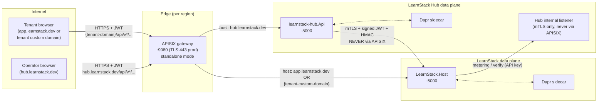

# API Gateway with APISIX

**Derives from:** [ADR-0015](../decisions/0015-api-gateway-apisix.md),
[ADR-0004](../decisions/0004-authentication-strategy.md),
[ADR-0011 (security standard)](../standards/11-security.md).

LearnStack uses **Apache APISIX** in standalone mode as the API gateway in front of both
the LearnStack core API and the LearnStack Hub API.

## 1. Topology



Two hosts on the same APISIX instance:
- `app.learnstack.dev` and tenant custom domains → LearnStack core API.
- `hub.learnstack.dev` → Hub API.

Tenant ↔ LearnStack internal API (`/api/internal/*`) is bound to a different listener
inside the LearnStack pod, accessible only via mTLS from Hub; **not** proxied by APISIX.

## 2. Deployment mode

**Standalone mode** (no etcd). Routes loaded from YAML files mounted into the APISIX
container; APISIX hot-reloads on file change.

```text
infra/apisix/
├── config.yaml         # APISIX core config: deployment role, plugin list, observability
├── apisix.yaml         # Static route definitions (priority bands)
└── partials/
    ├── routes-custom-domains.yaml   # Generated by Hub; updated on CustomDomainActivated event
    └── ssl.yaml                     # SNI certs; cert/key referenced via Vault Agent sidecar
```

`apisix.yaml` is reloadable; the gateway watches the file for changes. Hub publishes
updates to `routes-custom-domains.yaml` via Kubernetes ConfigMap rolling update (or
direct file mount in dev).

When dynamic operator-driven config becomes a hard requirement (Phase 11+), we revisit
**etcd-backed mode** + APISIX Admin API — out of scope for now.

## 3. Plugin chain

Every request flows through this chain (in order):

```
Client request
  │
  ▼
1. real-ip          ─── trust X-Forwarded-For from L4 load balancer; reject if origin not allow-listed
  │
  ▼
2. cors             ─── handle preflight (OPTIONS) for allowed origins; inject Access-Control-* headers
  │
  ▼
3. request-id       ─── inject X-Correlation-Id (or echo if present)
  │
  ▼
4. openid-connect   ─── JWT validation against Keycloak realm (signature, expiry, issuer, audience)
  │                       only on authenticated routes
  │
  ▼
5. limit-req        ─── leaky-bucket rate limit per route + per remote-addr (or per consumer when authenticated)
  │
  ▼
6. limit-count      ─── per-window count limit for write endpoints (60/min/token)
  │
  ▼
7. proxy-rewrite    ─── header normalisation; strip Authorization-Internal if leaked
  │
  ▼
Upstream backend (LearnStack.Host or learnstack-hub)
  │
  ▼
8. response-rewrite ─── strip internal headers from response (e.g. X-Internal-Trace)
  │
  ▼
9. prometheus       ─── /apisix/prometheus/metrics endpoint scraped by OTel collector
  │
  ▼
10. gzip            ─── compress response if Accept-Encoding allows
  │
  ▼
Client response
```

`config.yaml` declares the global plugin list:

```yaml
deployment:
  role: data_plane
  role_data_plane:
    config_provider: yaml

plugins:
  - real-ip
  - cors
  - request-id
  - openid-connect
  - limit-req
  - limit-count
  - proxy-rewrite
  - response-rewrite
  - prometheus
  - gzip
```

## 4. Route table

`apisix.yaml` declares routes with priority bands:

```yaml
routes:
  # Public anonymous — priority 1
  - id: 1
    uri: /health
    plugins:
      limit-req:
        rate: 10
        burst: 5
        rejected_code: 429
        key: remote_addr
    upstream: { type: roundrobin, nodes: { "learnstack-api:5000": 1 } }

  - id: 2
    uri: /api/v*/localization/*
    methods: [GET]
    plugins:
      cors:
        allow_origins: "https://app.learnstack.dev,https://hub.learnstack.dev"
      limit-req: { rate: 50, burst: 20, key: remote_addr }
    upstream: { type: roundrobin, nodes: { "learnstack-api:5000": 1 } }

  - id: 3
    uri: /openapi/*
    upstream: { type: roundrobin, nodes: { "learnstack-api:5000": 1 } }
    # Dev-only; rejected by environment-gated NGINX rule in production.

  # CORS preflight separation — priority 99 (just above main authenticated band)
  # OPTIONS bypasses openid-connect (which would reject preflight without Authorization header).
  - id: 99
    uri: /api/v*/**
    methods: [OPTIONS]
    plugins:
      cors:
        allow_origins: "https://app.learnstack.dev,*.learnstack.app"
        allow_methods: "GET,POST,PUT,PATCH,DELETE,OPTIONS"
        allow_headers: "Authorization,Content-Type,X-Tenant-Id,X-Correlation-Id"
        max_age: 3600

  # Authenticated band — priority 100
  - id: 100
    uri: /api/v*/**
    methods: [GET, POST, PUT, PATCH, DELETE]
    plugins:
      openid-connect:
        client_id: learnstack-gateway
        client_secret_ref: vault://learnstack/hub/internal-api-hmac-key   # via Vault Agent sidecar
        discovery: http://keycloak:8080/realms/learnstack/.well-known/openid-configuration
        bearer_only: true
        realm: learnstack
        scope: openid
        set_access_token_header: true
        access_token_in_authorization_header: true
      cors:
        allow_origins: "https://app.learnstack.dev,*.learnstack.app"
      limit-req: { rate: 100, burst: 50, key: remote_addr }
      request-id: { include_in_response: true }
    upstream: { type: roundrobin, nodes: { "learnstack-api:5000": 1 } }

  # Hub host band — priority 200
  - id: 200
    host: hub.learnstack.dev
    uri: /api/v*/**
    methods: [OPTIONS]
    plugins:
      cors:
        allow_origins: "https://hub.learnstack.dev"
        allow_methods: "GET,POST,PUT,PATCH,DELETE,OPTIONS"
        allow_headers: "Authorization,Content-Type,X-Correlation-Id"

  - id: 201
    host: hub.learnstack.dev
    uri: /api/v*/**
    methods: [GET, POST, PUT, PATCH, DELETE]
    plugins:
      openid-connect:
        client_id: learnstack-hub-gateway
        discovery: http://keycloak:8080/realms/learnstack-hub/.well-known/openid-configuration
        bearer_only: true
        realm: learnstack-hub
      cors:
        allow_origins: "https://hub.learnstack.dev"
      limit-req: { rate: 60, burst: 30, key: remote_addr }   # stricter on Hub
      request-id: { include_in_response: true }
    upstream: { type: roundrobin, nodes: { "learnstack-hub:5000": 1 } }

  # Hangfire dashboard — defense-in-depth: gateway BasicAuth + backend role check
  - id: 300
    uri: /admin/hangfire*
    plugins:
      basic-auth: {}             # consumer credentials in Vault
    upstream: { type: roundrobin, nodes: { "learnstack-api:5000": 1 } }
```

## 5. Defense-in-depth: JWT validated twice

**Why validate JWT both at APISIX and at the backend?**

1. **At APISIX**: signature, expiry, audience, issuer. Failure → 401 returned by gateway
   before any backend roundtrip. This is the cheap, fast first line.
2. **At LearnStack backend (`AddJwtBearer` middleware)**: same checks again **+** tenant
   context resolution **+** organization context resolution **+** permission policy
   evaluation. The backend never trusts the gateway alone.

If APISIX is misconfigured, bypassed (someone hits the backend directly on the internal
network), or compromised, the backend still rejects unauthenticated requests. This is
non-negotiable.

```csharp
// LearnStack.Host/Program.cs
builder.Services.AddAuthentication(JwtBearerDefaults.AuthenticationScheme)
    .AddJwtBearer(options =>
    {
        options.Authority = "http://keycloak:8080/realms/learnstack";
        options.Audience = "learnstack-api";
        options.RequireHttpsMetadata = !builder.Environment.IsDevelopment();
        options.MapInboundClaims = false;
        options.TokenValidationParameters = new TokenValidationParameters
        {
            ValidateIssuer = true,
            ValidateAudience = true,
            ValidateLifetime = true,
            ValidateIssuerSigningKey = true,
            ValidIssuer = "https://auth.learnstack.dev/realms/learnstack",  // PUBLIC issuer
            // Authority above is the INTERNAL URL for JWKS fetch; ValidIssuer is what's
            // in the JWT `iss` claim (set by Keycloak's KC_HOSTNAME).
            // Documented in 13-identity-and-auth.md.
        };
    });
```

## 6. Rate limit policy

| Surface | Rate | Burst | Key |
|---------|------|-------|-----|
| `/health` | 10/s | 5 | remote_addr |
| `/api/v*/localization/*` | 50/s | 20 | remote_addr |
| Authenticated GET/POST/PUT/PATCH/DELETE (main API) | 100/s | 50 | remote_addr |
| Hub authenticated API | 60/s | 30 | remote_addr |
| `/api/v*/auth/*` (login, password reset) | 5/min | 0 | remote_addr |
| Write endpoints (POST/PUT/PATCH/DELETE) on authenticated routes | 60/min/token | — | consumer (when consumer-key authn enabled, Phase 11) |

Phase 11+ moves from `remote_addr`-keyed limits to consumer-key-keyed limits when APISIX
consumer support is wired (etcd-backed mode required for dynamic consumer issuance).

## 7. CORS preflight separation

The `openid-connect` plugin **rejects OPTIONS requests** because they don't carry an
`Authorization` header. This breaks browser CORS preflight unless OPTIONS is handled
separately.

Solution: a higher-priority OPTIONS-only route (id 99 / 200) carries the `cors` plugin
without `openid-connect`. The browser's preflight succeeds; the subsequent actual
request (with the `Authorization` header) hits the authenticated route.

Nexora pattern verbatim (see `Nexora/docs/decisions/0003-deployment-strategy.md` and
`Nexora/docs/operations/HELM_INSTALLATION.md`).

## 8. Correlation ID

APISIX `request-id` plugin injects `X-Correlation-Id` on every request (or echoes the
client's value if present and validated as UUID-shaped). The same header propagates
through:

- The backend's `Activity.Current?.TraceId` (via `ASP.NET Core RequestId middleware`).
- The audit log entry's `correlation_id` column (ADR-0016).
- Every emitted log line (via Serilog `LogContext`).
- Every outbound HTTP call (via `HttpClient` interceptor).
- Every Dapr pub/sub event (`metadata.correlationId`).
- Every Hangfire job parameter.

End-to-end observability: a `correlation_id` traces a request from browser through
gateway, backend, Dapr, Kafka topic, consumer module, Hangfire job, audit log row.

## 9. TLS

**Production**: APISIX terminates TLS. Certs:
- `app.learnstack.dev` and `*.learnstack.app` — wildcard cert from Let's Encrypt or a
  commercial CA.
- Tenant custom domains — per-domain certs via cert-manager + Let's Encrypt DNS-01
  (ADR-0022).
- `hub.learnstack.dev` — wildcard or dedicated cert.

Certs are stored in Vault (`secret/learnstack/certs/<domain>`); APISIX SSL resources are
hot-loaded via Vault Agent sidecar.

**Backend (LearnStack.Host)**: HTTP only on the internal network; Kestrel TLS off. The
internal mTLS listener for `/api/internal/*` uses a separate cert (mutual TLS with Hub
client cert).

## 10. Production hardening checklist

Phase 11 deliverables:

- [ ] TLS termination at APISIX with Let's Encrypt or commercial CA.
- [ ] HSTS header injection (`max-age=31536000; includeSubDomains; preload`).
- [ ] Strict CSP header via `response-rewrite` plugin (production only).
- [ ] Per-tenant rate-limit override (consumer keys; requires etcd mode).
- [ ] `KC_HOSTNAME_BACKCHANNEL_DYNAMIC=true` for Keycloak issuer split (Docker network vs
      browser); document in 13-identity-and-auth.md.
- [ ] Hangfire dashboard route gated by both BasicAuth (gateway) and `IsInRole("platform-admin")`
      (backend).
- [ ] Production CORS allow-list (no `localhost`).
- [ ] OpenAPI dev route gated by environment (404 in prod).
- [ ] Real client IP forwarding via `real-ip` configured with trusted L4 LB ranges only.
- [ ] APISIX runtime metrics scraped by OTel collector.
- [ ] APISIX access log shipped to Loki.
- [ ] Hot-reload smoke test in CI: malformed YAML push must fail before the file lands.

## 11. Architecture tests

- `Apisix_RouteYaml_IsValid` — CI step running `apisix test` against `apisix.yaml`.
- `Apisix_NeverFronts_InternalApi` — integration test asserts requests to
  `app.learnstack.dev/api/internal/*` return 404 from APISIX (route not defined).
- `Backend_RequiresJwt_OnAllAuthenticatedRoutes` — `WebApplicationFactory` integration
  test: every endpoint outside the public allow-list returns 401 without a bearer token.

## 12. Non-goals

- **Service mesh.** APISIX is an edge gateway, not Istio / Linkerd. Modular monolith has
  one process per pod; no east-west service mesh needed.
- **API key management for tenants.** Tenant-facing API keys (Phase 11) live in
  LearnStack's own auth surface — not in APISIX as a consumer system.
- **L7 WAF rules.** Phase 11+ may add ModSecurity via APISIX `waf` plugin; out of scope
  for initial release.

## References

- ADR-0015 — API Gateway with APISIX.
- ADR-0004 Amendment 1 — `learnstack-hub` realm.
- [11-security.md](../standards/11-security.md) — defense-in-depth.
- [13-identity-and-auth.md](13-identity-and-auth.md) — Keycloak realm
  topology.
- [29-dapr-integration.md](29-dapr-integration.md) — pub/sub and state transports.
- Nexora reference: `Nexora/docs/decisions/0003-deployment-strategy.md`,
  `Nexora/docs/operations/HELM_INSTALLATION.md`,
  `Nexora/docs/auth/IDENTITY.md`.
