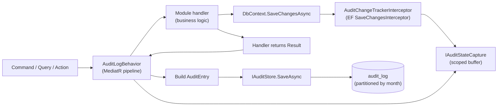

# Audit Subsystem

**Derives from:** [ADR-0016](../decisions/0016-audit-log-subsystem.md),
[ADR-0017 (Tenant + Organization)](../decisions/0017-tenant-organization-hierarchy.md),
[18-audit-coverage.md](../standards/18-audit-coverage.md).

The audit subsystem captures and persists an append-only history of security- and
compliance-relevant operations across every LearnStack module. This document describes
the three-piece pipeline, data model, retention, redaction, and operational concerns.

## 1. Pipeline overview



Three pieces, separated concerns:

1. **`AuditChangeTrackerInterceptor`** — runs inside `DbContext.SaveChangesAsync`,
   walks the ChangeTracker, snapshots state for every entity inheriting `AuditableEntity<T>`.
2. **`IAuditStateCapture`** — a scoped (per-request) buffer that holds entity snapshots
   until the MediatR behavior reads them.
3. **`AuditLogBehavior<TRequest, TResponse>`** — wraps the handler, awaits it (catching
   exceptions to still audit failed operations), reads the buffer, builds one `AuditEntry`
   per request, writes via `IAuditStore.SaveAsync`. Failure to write never blocks the
   business response.

## 2. The interceptor

```csharp
namespace LearnStack.Infrastructure.Audit;

public sealed class AuditChangeTrackerInterceptor : ISaveChangesInterceptor
{
    private readonly IAuditStateCapture _capture;

    public AuditChangeTrackerInterceptor(IAuditStateCapture capture) => _capture = capture;

    public ValueTask<InterceptionResult<int>> SavingChangesAsync(
        DbContextEventData eventData, InterceptionResult<int> result, CancellationToken ct = default)
    {
        var ctx = eventData.Context;
        if (ctx is null) return ValueTask.FromResult(result);

        foreach (var entry in ctx.ChangeTracker.Entries())
        {
            if (!ShouldCapture(entry)) continue;
            _capture.Add(BuildChange(entry));
        }
        return ValueTask.FromResult(result);
    }

    private static bool ShouldCapture(EntityEntry entry)
    {
        if (entry.State is not (EntityState.Added or EntityState.Modified or EntityState.Deleted))
            return false;
        var type = entry.Entity.GetType();
        while (type is not null)
        {
            if (type.IsGenericType &&
                type.GetGenericTypeDefinition() == typeof(AuditableEntity<>))
                return true;
            type = type.BaseType;
        }
        return false;
    }

    private static CapturedEntityChange BuildChange(EntityEntry entry)
    {
        // Build Before/After/Delta snapshots; exclude TenantId, CreatedAt, UpdatedAt, etc.
        // Unwrap strongly-typed IDs to their underlying Guid for readable JSON.
        // ... (~50 LOC, mirrors Nexora docs/modules/tier-1-core/audit/SPEC.md
        // + docs/decisions/0009-audit-repository-pattern.md)
    }
}
```

Pattern explicitly mirrors Nexora's `AuditChangeTrackerInterceptor` (see
`Nexora/docs/modules/tier-1-core/audit/SPEC.md` and
`Nexora/docs/decisions/0009-audit-repository-pattern.md`) — verbatim port to
LearnStack naming.

## 3. The scoped buffer

```csharp
namespace LearnStack.SharedKernel.Abstractions.Audit;

public interface IAuditStateCapture
{
    IReadOnlyList<CapturedEntityChange> Changes { get; }
    void Add(CapturedEntityChange change);
    void Clear();
}
```

```csharp
namespace LearnStack.Infrastructure.Audit;

public sealed class AuditStateCapture : IAuditStateCapture
{
    private readonly List<CapturedEntityChange> _changes = new();
    public IReadOnlyList<CapturedEntityChange> Changes => _changes;
    public void Add(CapturedEntityChange change) => _changes.Add(change);
    public void Clear() => _changes.Clear();
}
```

Registered as **scoped** in DI (per-request lifetime). Cleared at the end of every
request to prevent cross-request bleed (architecture test enforces this).

## 4. The MediatR behavior

```csharp
namespace LearnStack.Infrastructure.Behaviors;

public sealed class AuditLogBehavior<TRequest, TResponse>(
    IAuditContext auditContext,
    IAuditConfigService configService,
    IAuditStore auditStore,
    IAuditStateCapture stateCapture,
    ITenantContextAccessor tenantAccessor,
    ILogger<AuditLogBehavior<TRequest, TResponse>> logger)
    : IPipelineBehavior<TRequest, TResponse>
    where TRequest : IRequest<TResponse>
{
    public async Task<TResponse> Handle(TRequest request,
        RequestHandlerDelegate<TResponse> next, CancellationToken ct)
    {
        var requestKind = ClassifyRequest();   // Command | Query | Other
        if (requestKind == RequestKind.Other) return await next();

        var (module, operation) = ExtractModuleAndOperation(request, requestKind);
        var defaultEnabled = requestKind == RequestKind.Command;

        bool auditEnabled;
        try
        {
            auditEnabled = await configService.IsEnabledAsync(module, operation, ct, defaultEnabled);
        }
        catch (Exception ex)
        {
            // Audit config check failed → skip audit; never block business write.
            logger.LogError(ex, "Audit config check failed for {Module}.{Operation}",
                module, operation);
            return await next();
        }

        if (!auditEnabled) return await next();

        TResponse response;
        bool handlerFailed = false;
        Exception? handlerException = null;

        try
        {
            response = await next();
        }
        catch (Exception ex)
        {
            handlerFailed = true;
            handlerException = ex;
            response = default!;
        }

        try
        {
            var (isSuccess, errorKey) = handlerFailed
                ? (false, (string?)"audit.handler_exception")
                : DetermineOutcome(response);

            var entry = new AuditEntry(
                Id: AuditEntryId.New(),
                TenantId: tenantAccessor.Current?.TenantId ?? Guid.Empty,
                OrganizationId: tenantAccessor.Current?.OrganizationId,
                Module: module,
                Operation: operation,
                OperationType: DeriveOperationType(operation),
                OperationClass: DeriveOperationClass(module, operation),
                ActorUserId: auditContext.UserId,
                ActorEmail: auditContext.UserEmail,
                CorrelationId: auditContext.CorrelationId,
                IpAddress: auditContext.IpAddress,
                UserAgent: auditContext.UserAgent,
                IsSuccess: isSuccess,
                ErrorKey: errorKey,
                EntityType: stateCapture.Changes.Count == 1 ? stateCapture.Changes[0].EntityType : null,
                EntityId:   stateCapture.Changes.Count == 1 ? stateCapture.Changes[0].EntityId : null,
                BeforeState: SerializeBefore(stateCapture.Changes),
                AfterState:  SerializeAfter(stateCapture.Changes),
                Changes:     SerializeChanges(stateCapture.Changes),
                Timestamp:   DateTimeOffset.UtcNow);

            await auditStore.SaveAsync(entry, ct);
        }
        catch (Exception ex)
        {
            // Audit save failed → log, never block business write.
            logger.LogError(ex, "Audit save failed for {Module}.{Operation}", module, operation);
        }
        finally
        {
            stateCapture.Clear();
        }

        if (handlerFailed)
            ExceptionDispatchInfo.Capture(handlerException!).Throw();

        return response;
    }

    // ClassifyRequest, ExtractModuleAndOperation, DetermineOutcome, DeriveOperationType,
    // DeriveOperationClass, SerializeBefore/After/Changes are private static helpers.
}
```

Key invariants enforced by this behavior:

- **Audit failure never blocks business write.** The `try { auditStore.SaveAsync(...) }
  catch { log }` and the surrounding `finally { stateCapture.Clear(); }` guarantee that
  even a totally broken audit store doesn't reject business commands.
- **Failed handlers still get audited.** The behavior catches the handler exception,
  writes an audit entry with `IsSuccess=false`, then re-throws via `ExceptionDispatchInfo`
  to preserve the original stack trace.
- **Per-(module, operation) toggling.** `IAuditConfigService.IsEnabledAsync` reads from
  per-tenant config (`audit_config` table) with module-declared defaults.

## 5. Pipeline order

MediatR pipeline behaviors are registered in this order in
`LearnStack.Infrastructure.DependencyInjection`:

```csharp
services.AddTransient(typeof(IPipelineBehavior<,>), typeof(ValidationBehavior<,>));
services.AddTransient(typeof(IPipelineBehavior<,>), typeof(LoggingBehavior<,>));
services.AddTransient(typeof(IPipelineBehavior<,>), typeof(AuditLogBehavior<,>));
services.AddTransient(typeof(IPipelineBehavior<,>), typeof(TenantContextCheckBehavior<,>));
services.AddTransient(typeof(IPipelineBehavior<,>), typeof(AuthorizationBehavior<,>));
services.AddTransient(typeof(IPipelineBehavior<,>), typeof(TransactionBehavior<,>));
services.AddTransient(typeof(IPipelineBehavior<,>), typeof(OutboxFlushBehavior<,>));
```

Effective execution order (outer → inner):

```
Request
  → Validation        (reject before any work; FluentValidation)
  → Logging           (request scope; correlation id)
  → AuditLog          (wraps the rest; audit failure never blocks)
  → TenantContextCheck (assert tenant_id resolved)
  → Authorization     (resource-scoped checks beyond endpoint-level [Authorize])
  → Transaction       (begin transaction; commit/rollback on outcome)
  → OutboxFlush       (flush outbox writes to DbContext before commit)
  → Handler           (business logic)
```

## 6. Data model

### `AuditEntry` aggregate

```csharp
namespace LearnStack.Modules.Audit.Domain.Entities;

public sealed class AuditEntry : Entity<AuditEntryId>   // NOT AuditableEntity — append-only
{
    public Guid TenantId { get; private set; }
    public Guid? OrganizationId { get; private set; }

    public Guid? ActorUserId { get; private set; }
    public string? ActorEmail { get; private set; }

    public string Module { get; private set; } = default!;
    public string Operation { get; private set; } = default!;
    public OperationType OperationType { get; private set; }
    public OperationClass OperationClass { get; private set; }

    public string? EntityType { get; private set; }
    public string? EntityId { get; private set; }

    public bool IsSuccess { get; private set; }
    public string? ErrorKey { get; private set; }

    public string? BeforeState { get; private set; }
    public string? AfterState { get; private set; }
    public string? Changes { get; private set; }

    public string? CorrelationId { get; private set; }
    public string? IpAddress { get; private set; }
    public string? UserAgent { get; private set; }

    public DateTimeOffset Timestamp { get; private set; }
    public string? MetadataJson { get; private set; }

    private AuditEntry() { }

    public static AuditEntry Create(/* every field via parameters */)
    {
        // Validation guards; no public mutators.
    }
}

public enum OperationType
{
    Create,
    Update,
    Delete,
    ReadSensitive,
    SecurityEvent,
    PlatformAdmin,   // cross-tenant operator action — see ADR-0016 Amendment 1
    Action,          // generic non-CRUD action that doesn't fit above
}

public enum OperationClass { Must, Should, May }
```

### `audit_log` table

```sql
CREATE TABLE audit_log (
    id               uuid NOT NULL,
    tenant_id        uuid NOT NULL,
    organization_id  uuid NULL,
    actor_user_id    uuid NULL,
    actor_email      text NULL,
    module           text NOT NULL,
    operation        text NOT NULL,
    operation_type   text NOT NULL,
    operation_class  text NOT NULL,
    entity_type      text NULL,
    entity_id        text NULL,
    is_success       boolean NOT NULL,
    error_key        text NULL,
    before_state     jsonb NULL,
    after_state      jsonb NULL,
    changes          jsonb NULL,
    correlation_id   text NULL,
    ip_address       inet NULL,
    user_agent       text NULL,
    timestamp        timestamptz NOT NULL DEFAULT now(),
    metadata         jsonb NULL,
    PRIMARY KEY (id, timestamp)
) PARTITION BY RANGE (timestamp);

CREATE TABLE audit_log_2026_05 PARTITION OF audit_log
    FOR VALUES FROM ('2026-05-01') TO ('2026-06-01');
CREATE TABLE audit_log_2026_06 PARTITION OF audit_log
    FOR VALUES FROM ('2026-06-01') TO ('2026-07-01');
-- ... auto-created monthly by a Hangfire recurring job (LearnStackJob)

CREATE INDEX ix_audit_log_tenant_timestamp
    ON audit_log (tenant_id, timestamp DESC);
CREATE INDEX ix_audit_log_actor_timestamp
    ON audit_log (actor_user_id, timestamp DESC)
    WHERE actor_user_id IS NOT NULL;
CREATE INDEX ix_audit_log_correlation
    ON audit_log (correlation_id)
    WHERE correlation_id IS NOT NULL;
CREATE INDEX ix_audit_log_module_operation_timestamp
    ON audit_log (module, operation, timestamp DESC);

-- RLS
ALTER TABLE audit_log ENABLE ROW LEVEL SECURITY;
CREATE POLICY audit_log_tenant_isolation ON audit_log
    USING (tenant_id = current_setting('app.tenant_id', true)::uuid);
-- Platform admin role bypasses RLS via SET role learnstack_audit_admin (audited).
```

### `audit_config` table

```sql
CREATE TABLE audit_config (
    id                uuid PRIMARY KEY,
    tenant_id         uuid NOT NULL,
    module            text NOT NULL,
    operation         text NOT NULL,
    is_enabled        boolean NOT NULL,
    created_at        timestamptz NOT NULL DEFAULT now(),
    updated_at        timestamptz NOT NULL DEFAULT now(),
    UNIQUE (tenant_id, module, operation)
);
ALTER TABLE audit_config ENABLE ROW LEVEL SECURITY;
CREATE POLICY audit_config_tenant_isolation ON audit_config
    USING (tenant_id = current_setting('app.tenant_id', true)::uuid);
```

Defaults declared in each module via `IModule.RegisterAuditDefaults()`; the table holds
per-tenant overrides only.

## 7. Per-module coverage matrix (baseline)

Standard 18 defines the MUST / SHOULD / MAY matrix per module. Excerpt for Tier-1 core
modules:

| Module | create | update | delete | read-sensitive | security-event |
|--------|:------:|:------:|:------:|:-------------:|:--------------:|
| Identity | MUST | MUST | MUST | MUST (export users) | MUST (login, logout, MFA, permission change, role change, impersonation) |
| Tenancy | MUST | MUST | MUST | MUST (export tenant settings) | MUST (tenant create/suspend/terminate, custom-domain change) |
| Organization | MUST | MUST | MUST | SHOULD (export members) | MUST (org admin role assignment) |
| Content | SHOULD | SHOULD | SHOULD | MAY | MAY |
| Catalog | MUST | MUST | MUST | SHOULD (bulk export) | MUST (publish, unpublish) |
| Enrollment | MUST | MUST | MUST | MUST (export enrollments / progress) | MUST (manual override of progress) |
| Classroom | MUST | MUST | MUST | SHOULD (recording download) | MUST (recording start/stop, consent change, instructor change) |
| Notifications | SHOULD | SHOULD | SHOULD | MAY | MUST (template change affecting recipients) |
| Audit | n/a | n/a | n/a | MUST (any read of audit log) | MUST (retention purge, admin query) |
| Media | SHOULD | SHOULD | MUST (especially recordings) | SHOULD (download of restricted asset) | MAY |

Hub-side modules audit to **Hub's own audit stream**, separate from LearnStack's; same
shape, different table.

## 8. Retention

Default retention by operation class (per-tenant overridable within plan limits):

| Class | Default | Override range |
|-------|---------|----------------|
| SecurityEvent | **7 years** | 1–10 years |
| Create / Update / Delete on financial / identity / enrollment data | **7 years** | 1–10 years |
| Create / Update / Delete on content / scheduling | **2 years** | 6 months – 5 years |
| ReadSensitive | **2 years** | 6 months – 5 years |
| Other Action | **1 year** | 3 months – 3 years |

Retention purge runs as a Hangfire recurring job (`LearnStackJob` analog):

- `learnstack:audit:partition-management` — runs daily; creates next month's partition
  (if not exists); drops partitions older than max retention window across all tenants
  (10y for safety; tenant-specific retention enforced by row-level deletes within
  partition).
- `learnstack:audit:retention-purge` — runs weekly; deletes individual rows per tenant's
  configured retention. Uses tenant-config retention values; bypasses RLS via
  `learnstack_audit_admin` role; the purge itself emits a `SecurityEvent` audit row
  summarising what was deleted.

## 9. GDPR / PII redaction

When a user is GDPR-erased (`UserGdprDeletedIntegrationEvent` published), audit rows
containing that user's PII are **redacted in place** (not deleted — the audit row's
existence must remain auditable):

```csharp
// LearnStack.Modules.Audit.Infrastructure.IntegrationEvents
public sealed class UserGdprDeletedIntegrationEventHandler(
    AuditDbContext db, ILogger<UserGdprDeletedIntegrationEventHandler> logger)
    : IIntegrationEventHandler<UserGdprDeletedIntegrationEvent>
{
    public async Task HandleAsync(UserGdprDeletedIntegrationEvent @event, CancellationToken ct)
    {
        // 1. Idempotent: inbox guard
        if (await _inboxGuard.IsAlreadyProcessedAsync(@event.EventId, ct)) return;

        // 2. Redact rows where actor_user_id == @event.UserId
        await db.Database.ExecuteSqlInterpolatedAsync($@"
            UPDATE audit_log
            SET actor_email = '[REDACTED]',
                ip_address = NULL,
                user_agent = '[REDACTED]',
                before_state = jsonb_set(before_state, '{{redacted}}', 'true'),
                after_state  = jsonb_set(after_state,  '{{redacted}}', 'true'),
                changes      = jsonb_set(changes,      '{{redacted}}', 'true')
            WHERE actor_user_id = {@event.UserId}
              AND tenant_id = {@event.TenantId}", ct);

        // 3. Redact rows where entity references this user (via per-module IUserReferenceLocator)
        foreach (var locator in _userReferenceLocators)
            await locator.RedactReferencesAsync(@event.UserId, ct);

        // 4. Inbox: mark processed; SaveChanges
        _inboxGuard.MarkAsProcessed(@event.EventId, @event.GetType().Name);
        await db.SaveChangesAsync(ct);

        // 5. Audit the redaction itself as a SecurityEvent (meta-audit)
        logger.LogInformation("GDPR redaction applied for User {UserId} in Tenant {TenantId}",
            @event.UserId, @event.TenantId);
    }
}
```

Every module that stores user references in audit payloads must register an
`IUserReferenceLocator` implementation (architecture test enforces this — same shape as
Nexora's `IContactReferenceLocator`).

## 10. Querying audit log

The Audit module's admin API exposes:

```
GET    /api/v1/audit/events                        — paged list with filters
GET    /api/v1/audit/events/{id}                   — single entry
GET    /api/v1/audit/events?correlationId=<id>     — trace by correlation
GET    /api/v1/audit/events?actorId=<userId>       — by actor
GET    /api/v1/audit/events?module=identity&operationType=SecurityEvent
                                                   — filtered

POST   /api/v1/audit/events/export                 — CSV / JSON export job (async)
GET    /api/v1/audit/exports/{exportId}            — download URL when ready
```

Required permission: `audit.events.read` (tenant scope).
Required for export: `audit.events.export`.
Required for cross-tenant query (platform admin only): `platform.audit.events.read`.

## 11. Hub-side audit stream

Hub maintains a parallel audit stream in its own database (`hub_audit_log`), capturing
operator actions:

- Tenant create / suspend / terminate.
- Plan create / update / assign.
- Compliance cap change.
- Custom domain approval / revocation.
- License key issue / revoke.
- Cross-tenant query by operator.

Cross-stream correlation by `correlation_id`. A regulatory inquiry covering "what
happened to tenant X on date Y" pulls from both streams and joins by correlation.

## 12. Architecture tests

Five blocker-level tests added in Phase 02:

1. `Every_Command_HasAuditCoverage` — auto-discovers commands by interface
   (`ICommand<TResponse>`); for each, asserts the (module, operation) appears in
   `IAuditConfigService.GetCoverageMatrix()` with at least SHOULD classification.
2. `AuditEntry_Is_AppendOnly` — `AuditEntry` does not implement `ISoftDeletable`; has no
   `Update*` public methods; reflection assertion.
3. `AuditLogBehavior_NeverBlocks_BusinessWrites` — integration test asserts that when
   `IAuditStore.SaveAsync` throws, the command result is still returned (handler success
   path).
4. `AuditStateCapture_ClearedPerRequest` — integration test asserts that after a request
   completes (success or failure), the scoped `IAuditStateCapture.Changes` collection is
   empty for the next request.
5. `Every_PII_Module_RegistersUserReferenceLocator` — modules storing user references in
   audit payloads (declared via `[StoresUserReference]` attribute or
   `IModule.RegisterUserReferences()`) must register an `IUserReferenceLocator` impl.

## 13. Phasing

| Phase | Deliverable |
|-------|-------------|
| 02 | Infrastructure: `AuditChangeTrackerInterceptor`, `IAuditStateCapture` + impl, `AuditLogBehavior`, `IAuditStore` + `PostgresAuditStore`, `audit_log` table + first month partition, `LearnStackJob` for partition management. |
| 03 | `LearnStack.Modules.Audit`: `AuditEntry` aggregate, repository, admin API endpoints. `UserGdprDeletedIntegrationEventHandler` + per-module `IUserReferenceLocator`. |
| 06+ | Admin Studio audit UI: timeline view, filter by user/module/operation/operation_class/timestamp, diff viewer, CSV / JSON export. |
| 09 | Hub-side `hub_audit_log` + cross-stream correlation query. |
| 11 | Production: long-term partition lifecycle automation, off-archive policy for partitions > 1 year (e.g. move to cheaper storage tier), per-tenant retention enforcement under plan limits. |

## References

- ADR-0016 — Audit Log Subsystem.
- ADR-0003 Amendment 1 — Organization scope (audit row carries organization_id).
- [18-audit-coverage.md](../standards/18-audit-coverage.md) — MUST/SHOULD/MAY matrix
  (standard).
- [29-dapr-integration.md](29-dapr-integration.md) — `UserGdprDeletedIntegrationEvent`
  arrives via Dapr pub/sub.
- Nexora reference: `Nexora/docs/modules/tier-1-core/audit/SPEC.md`,
  `Nexora/docs/decisions/0009-audit-repository-pattern.md`,
  `Nexora/docs/standards/audit-coverage.md`.
