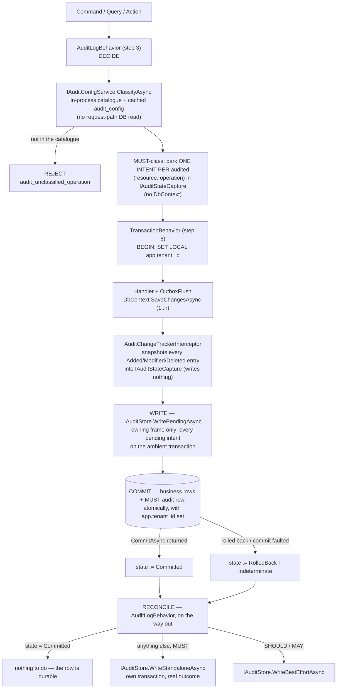

# Audit Subsystem

**Derives from:** [ADR-0033](../decisions/0033-audit-durability-model.md)
(supersedes [ADR-0016](../decisions/0016-audit-log-subsystem.md)),
[ADR-0044 (The Audit Write Path)](../decisions/0044-audit-write-path.md),
[ADR-0017 (Tenant + Organization)](../decisions/0017-tenant-organization-hierarchy.md),
[18-audit-coverage.md](../standards/18-audit-coverage.md).

The audit subsystem captures and persists an append-only history of security- and
compliance-relevant operations across every LearnStack module. This document describes
the pipeline, the durability model, the data model, retention, redaction, and operational
concerns.

## 1. Two durability classes

The single most important thing to understand about this subsystem is that **audit is not
one mechanism**. ADR-0016 treated it as one and inherited a contradiction: Standards 18
required MUST-class rows to be written in the same transaction as the change they record,
while ADR-0016 required that audit never block business logic. Under the shipped MediatR
order — `Validation → Logging → AuditLog → TenantContext → Authorization → Transaction →
OutboxFlush → Handler` — `AuditLogBehavior` wraps `TransactionBehavior` from the outside,
so its write lands **after** the business transaction has already committed or rolled
back. Both requirements could not hold.

Worse, once the corrected Row Level Security template from
[ADR-0003 Amendment 3](../decisions/0003-tenant-isolation-defense-in-depth.md) lands, an
audit insert executed outside that transaction runs with no `app.tenant_id` set. The
policy's `WITH CHECK` rejects the row, and a catch-and-log posture swallows the
rejection: the audit log would record nothing while reporting success. A silent, complete
audit failure is strictly worse than a loud one.

[ADR-0033](../decisions/0033-audit-durability-model.md) resolves it by splitting the
classes rather than reordering the pipeline:

| Class | Where the row is written | On failure | Rationale |
|---|---|---|---|
| **MUST**, with a business transaction — security, compliance, privileged access | **Inside the business transaction**, as one parameterised `INSERT` issued by `IAuditStore.WritePendingAsync` immediately before `COMMIT` | **Fail closed** — the transaction rolls back and the caller receives `503 audit_unavailable` | For these events the audit row *is* part of the operation's contract. "Platform admin read tenant B's learner records" with no audit row is an audit finding |
| **MUST**, with no committed business transaction — `denied` outcomes, security events raised outside MediatR, **and any request whose transaction rolled back or whose commit outcome is unknown** | **Standalone**, through `IAuditStore.WriteStandaloneAsync`, on a connection outside the business transaction: `BEGIN;` `set_config('app.tenant_id', …)` **and** `set_config('app.organization_id', …)`; `INSERT; COMMIT` | **Fail closed only where there is something to fail closed on.** The `503 audit_unavailable` replaces the response when the operation would otherwise have **succeeded**; a row recording an operation that is already being **refused** keeps its own 403 / 404 ([ADR-0033 Amendment 1](../decisions/0033-audit-durability-model.md)). Either way the failure logs at `Critical`, increments the standalone-write-failure counter and marks the audit health check unhealthy | There is no business transaction to ride, or the one that existed is gone. The row must still satisfy `audit_log`'s `WITH CHECK` — **both** halves of it, since the table is org-scoped — so it announces both session variables on its own terms. Reusing the *business* connection here would be a defect: a row written inside a transaction that is about to roll back rolls back with it |
| **SHOULD / MAY** — operational, diagnostic | Outside any business transaction, best-effort, same standalone shape | Logged and dropped; the accepted loss is written down in the module's matrix, not assumed | Losing "course renamed" costs a support conversation |

**A granted read-sensitive query rides the first row, not the second.** It used to sit
in the standalone class, on the reasoning that a read opens no transaction. Packet 6
shipped `TransactionBehavior` without a request-kind gate — it opens the ambient
transaction for everything that reaches step 6, reads included, because a read needs the
`SET LOCAL` as much as a write does — so the durable path is the one a granted read takes
([ADR-0033 Amendment 2 § 7](../decisions/0033-audit-durability-model.md)).
`WriteStandaloneAsync` is reached by three shapes and only these: a short-circuit at step
1, 4 or 5; a non-MediatR caller, of which `TenantAssertionMiddleware` is the one Packet 9
ships; and the reconcile step after a `RolledBack` or `Indeterminate` outcome.
`EnterPlatformAdminScope(reason)` is **not** among them: its row takes the fourth write
method, `IAuditStore.WritePlatformScopeAsync`, on the scope's own platform-role connection
and **before** the operation runs — so an operation that later fails is still recorded
([ADR-0044 § 10](../decisions/0044-audit-write-path.md),
[ADR-0033 Amendment 2 § 6](../decisions/0033-audit-durability-model.md)). None of the
other three could serve it: the row runs on a connection the request path does not own, as
a role the other three never use, and ahead of what it describes. A step-4
short-circuit reaches it only when a tenant is decidable — the ceiling refusal on a
*resolved* context does, the `tenant_mismatch` refusal of an unresolved one does not,
because § 7's fourth case leaves it with no tenant to write under.

The single most important consequence: **"written" is not "committed".** The
in-transaction `INSERT` at step 6 becomes durable only when `COMMIT` returns. Between the
two, a constraint violation, a lost connection, or — far more commonly — a handler that
calls `SaveChanges` and then returns `Result.Fail(...)` takes the audit row away with the
business row. A per-request "consumed" flag cannot observe that: the flag lives in a DI
scope and a database rollback does not touch it. `TransactionBehavior` therefore reports
the commit boundary explicitly — `Committed`, `RolledBack` or `Indeterminate` — and
`AuditLogBehavior`, on the **owning** unit-of-work frame only, re-writes every pending
intent standalone for anything that is not `Committed`.

Redaction, projection and external fan-out happen after the commit, reading the committed
row; none of them updates it. ADR-0016's "audit never blocks business logic" is preserved
for that second stage and withdrawn for the first.

## 2. Pipeline overview



Read as text — **decide → write → reconcile**. At step 3 the behavior classifies the
request from in-process state and, for MUST, parks one intent per audited
`(resource, operation)` in the scoped `IAuditStateCapture`; it opens no transaction and
touches no `DbContext`. The handler runs inside the transaction `TransactionBehavior`
opened, which issued `SET LOCAL app.tenant_id` as its first statement; the interceptor
snapshots each flush's ChangeTracker into the same buffer and writes nothing. Immediately
before `COMMIT`, and only on the frame it owns, `TransactionBehavior` calls
`IAuditStore.WritePendingAsync`, which composes every pending intent and inserts them on
that transaction — so they commit with the business write or not at all, and Row Level
Security accepts them. `TransactionBehavior` then records the commit boundary. On the way
out, the owning behavior reconciles: `Committed` means there is nothing to do, and
anything else means each row is re-written standalone with the real outcome. SHOULD/MAY
rows and all fan-out are written on that same outbound pass, best-effort.

Four components, separated concerns:

1. **`AuditChangeTrackerInterceptor`** — runs inside `DbContext.SaveChangesAsync`, walks
   the ChangeTracker, snapshots every entry in state `Added`, `Modified` or `Deleted`
   minus a named exclusion list (§ 3) into `IAuditStateCapture`. It **never** constructs
   an `AuditEntry` and never inserts one. Making it the writer would work in EF Core terms
   but would leave two questions unanswerable: which of several flushes in one transaction
   owns the row, and how the audit type gets mapped into every module's `DbContext`
   without inverting the dependency direction (see § 7 and
   [ADR-0033 § Implementation Notes](../decisions/0033-audit-durability-model.md)).
2. **`IAuditStateCapture`** — the scoped (per-request) audit state: the entity snapshots,
   the ordered list of pending MUST-class intents, and the ambient transaction's
   lifecycle state.
3. **`TransactionBehavior`** — owns the commit boundary on the frame it owns, and
   therefore owns both the durable audit write (immediately before `COMMIT`) and the
   `Committed` / `RolledBack` / `Indeterminate` signal the reconcile step reads.
4. **`AuditLogBehavior<TRequest, TResponse>`** — keeps its shipped position and its
   shipped exception responsibility: catch handler exceptions, record the outcome,
   rethrow via `ExceptionDispatchInfo`. It decides on the way in and, on the owning frame,
   reconciles on the way out; it no longer writes the MUST-class rows itself except in the
   standalone case.

## 3. The interceptor

```csharp
namespace LearnStack.Infrastructure.Audit;

public sealed class AuditChangeTrackerInterceptor : ISaveChangesInterceptor
{
    private readonly IAuditStateCapture _capture;

    public AuditChangeTrackerInterceptor(IAuditStateCapture capture) => _capture = capture;

    public ValueTask<InterceptionResult<int>> SavingChangesAsync(
        DbContextEventData eventData, InterceptionResult<int> result, CancellationToken ct = default)
    {
        var ctx = eventData.Context;
        if (ctx is null) return ValueTask.FromResult(result);

        foreach (var entry in ctx.ChangeTracker.Entries())
        {
            if (!ShouldCapture(entry)) continue;
            _capture.Add(BuildChange(entry));
        }
        return ValueTask.FromResult(result);
    }

    // EVERY tracked write, minus a closed exclusion list. NOT "AuditableEntity<>
    // descendants": that predicate is withdrawn by ADR-0044 § 7, because six shipped
    // entities carry no such base class — PlatformHostMapping, TenantLocale,
    // TenantFeatureFlag, PlatformEntitlement, CustomizationGeneration and
    // TenantLevelTaxonomyItem. The MUST rows the two shipped matrices do classify among
    // them — the host mapping, the feature flag and the entitlement-cache refresh —
    // would have carried empty snapshots, and the host mapping is the one the Tenancy
    // matrix singles out as mattering most.
    //
    // Excluded BY NAME, not by type: LearnStack.Infrastructure.Audit may not reference a
    // module assembly (CoreInfrastructure_DoesNotDependOn_AnyModule), and two of the four
    // names are module types.
    private static readonly HashSet<string> Excluded =
    [
        "OutboxMessage",   // its payload IS the audited event; the row is machinery
        "IdempotencyKey",  // request plumbing
        "AuditEntry",      // the audit tables themselves — unreachable anyway, since the
        "AuditConfig",     //   store writes parameterised SQL and never a DbContext
    ];

    private static bool ShouldCapture(EntityEntry entry) =>
        entry.State is EntityState.Added or EntityState.Modified or EntityState.Deleted
        && !Excluded.Contains(entry.Entity.GetType().Name);

    private static CapturedEntityChange BuildChange(EntityEntry entry)
    {
        // Build Before/After snapshots and the per-property diff; exclude the bookkeeping
        // columns (TenantId, CreatedAt, UpdatedAt, Version). Unwrap strongly-typed IDs to
        // their underlying Guid for readable JSON. Run the PII gate and the size gate
        // below on every value emitted.
    }
}
```

The interceptor's job is **capture only**. It returns the unmodified
`InterceptionResult`, adds nothing to the context, and issues no SQL. It runs once per
flush, and a MUST-class command may flush more than once inside one transaction — which
is precisely why the audit rows are not built here. `TransactionBehavior` composes them
once, after the last flush and before `COMMIT`, so the snapshots are complete regardless
of how many times the handler saved.

### Two gates run inside the capture

Both run before anything reaches `IAuditStateCapture`
([ADR-0044 § 8](../decisions/0044-audit-write-path.md)); after the buffer there is no
second place to catch either.

- **PII.** A property carrying the SharedKernel `[PiiSensitive]` attribute, or whose name
  matches the shipped `SensitiveTokenCatalog`, has its **value** replaced with
  `SensitiveTokenCatalog.RedactedValue` in `before`, `after` and `changes`. The corpus
  names the constant and never the string, because the shipped value is `***REDACTED***`
  and a second literal would make a log line and an audit snapshot disagree about what a
  redacted value looks like. The property is **not dropped**: the
  diff must still record *that* it changed.
- **Size.** Each of `before_state`, `after_state` and `changes` is capped by Packet 8's
  `JsonValue.MaxRowBytes` (256 KiB). Above the cap the value becomes an explicit elision
  record — `{"_elided": true, "bytes": <n>, "sha256": "<hex>"}` — never an empty object
  and never a silent truncation. **The elision preserves the column's JSON type.**
  `changes` is an array on both sides of the cap, so an elided `changes` is
  `[{"_elided": …}]` and not a bare object; `before_state` and `after_state` are objects
  on both sides, so theirs is the object form. A reader that has to branch on the shape
  before it can tell whether it is looking at a diff is a reader that gets it wrong once,
  and the Phase 06 diff viewer and the per-module `IUserReferenceLocator` (§ 10) both
  parse this column.

`audit_blob_id` is **struck from the corpus.** It exists in no DDL, names no blob store,
and the elision record is what the one sentence that mentioned it was reaching for.

### The `changes` shape

`changes` serialises as a JSON **array** of `{ path, before, after }`, `path` being an
entity-qualified RFC 6901 pointer — never the polymorphic object-or-array shape ADR-0016
described. One shape, for every entity kind, on both sides of the size cap.

### Where it is attached

`AddModuleDbContext` is the wiring site: it resolves
`IEnumerable<ISaveChangesInterceptor>` from the provider and passes them to
`AddInterceptors` beside the shipped `TenantContextGuardInterceptor`, which is what
reaches every module `DbContext` from one place rather than from each module's
registration. **Registering an `ISaveChangesInterceptor` in DI does not attach it** —
measured against this repository's hand-built options shape, for both interceptor kinds
and whether registered as `IInterceptor` or by its own type.

## 4. The scoped buffer

```csharp
namespace LearnStack.SharedKernel.Audit;

public enum AuditIntentState
{
    None,                  // no MUST-class intent for this request
    Pending,               // declared at step 3; nothing written yet
    WrittenInTransaction,  // INSERTed on the ambient transaction — NOT yet durable
    Committed,             // the ambient transaction committed; the rows are durable
    RolledBack,            // the ambient transaction rolled back; the rows are gone
    Indeterminate,         // COMMIT faulted; the server-side outcome is unknown
}

public interface IAuditStateCapture
{
    IReadOnlyList<CapturedEntityChange> Changes { get; }
    void Add(CapturedEntityChange change);

    // ONE INTENT PER audited (resource, operation), in declaration order — not one per
    // request. ProvisionTenantCommand declares two, tenancy.tenant.create and
    // tenancy.organization.create, and the Tenancy matrix classifies both MUST.
    IReadOnlyList<AuditIntent> Intents { get; }

    // The commit boundary is one fact about one transaction, so one State serves however
    // many intents the scope holds.
    AuditIntentState State { get; }

    void DeclareIntent(AuditIntent intent); // AuditLogBehavior, step 3; appends
    void MarkWrittenInTransaction();        // IAuditStore.WritePendingAsync
    void MarkCommitted();                   // TransactionBehavior, OWNING FRAME ONLY
    void MarkRolledBack();                  // TransactionBehavior, OWNING FRAME ONLY
    void MarkIndeterminate(Exception cause);// TransactionBehavior, OWNING FRAME ONLY

    void Clear();                           // the outermost behavior's finally, once
}

// The unit of declaration: minted at step 3, drained at step 6, and re-written standalone
// by the reconcile step. TenantId is NON-NULLABLE and OrganizationId is the organization
// the ambient transaction announces — both resolved by AuditLogBehavior at step 3, which
// is the only place all four of § 7's cases are decidable, and carried here because
// WritePendingAsync takes only the unit of work and the store never resolves a tenant
// itself ([ADR-0044 Amendment 3 § 2](../decisions/0044-audit-write-path.md)). A request
// with no decidable tenant declares no intent, which is how § 7's fourth case — "no row"
// — is enforced before anything can be written rather than after.
//
// EntityType is the aggregate the row is about, from the catalogue entry, and is what
// fills entity_type / entity_id. The store selects every CapturedEntityChange whose
// EntityType matches its name and merges them: the EARLIEST such capture's BeforeJson,
// the LATEST one's AfterJson, and their Fields concatenated in capture order. The merge
// is not hypothetical — ProvisionTenantCommand saves three times and captures Tenant
// twice, so picking one arbitrarily records half of what happened
// ([ADR-0044 Amendment 5 § 2](../decisions/0044-audit-write-path.md)).
public sealed record AuditIntent(
    AuditEntryId Id,
    TenantId TenantId,
    OrganizationId? OrganizationId,
    string ModuleName,
    string Operation,                       // {module}.{resource}.{verb}
    OperationType OperationType,
    OperationClass OperationClass,
    Type? EntityType,                       // the aggregate the row is about, or null
    DateTimeOffset DeclaredAt);

// The interceptor's unit of capture, declared beside the buffer that holds it.
// `Fields` is what the audit row's `changes` column serialises to: a JSON ARRAY of
// { path, before, after }, `Path` an entity-qualified RFC 6901 pointer (§ 3).
//
// EVERY VALUE SLOT HERE HOLDS JSON TEXT, which is why each is named `…Json`. It is not
// cosmetic: 42 and "42" are different values, a C# null is the JSON null rather than an
// absent key, and the redaction sentinel therefore enters quoted. A slot holding a
// rendered value would make `changes` unparseable by the two readers that consume it.
public sealed record CapturedEntityChange(
    string EntityType,
    string? EntityId,
    string? BeforeJson,                     // object, or the elision record
    string? AfterJson,                      // object, or the elision record
    IReadOnlyList<CapturedFieldChange> Fields);

public sealed record CapturedFieldChange(string Path, string? BeforeJson, string? AfterJson);
```

`State` is the only durability signal in the system, and it is deliberately **not**
a "consumed" flag. `WrittenInTransaction` is not durable; only `Committed` is. This
interface is a `SharedKernel` abstraction and names no EF Core type — it lives in
`LearnStack.SharedKernel.Audit` beside the other four ports, `IAuditStore`,
`AuditEntryDraft`, `AuditIntent` and `AuditEntryId`
([ADR-0044 § 11](../decisions/0044-audit-write-path.md)).

**The value types those ports carry live there too**, not in the Audit module:
`OperationType`, `OperationClass`, `AuditOutcome`, `AuditClassification`,
`AuditIntentState` and `CapturedEntityChange`
([ADR-0044 Amendment 3 § 3](../decisions/0044-audit-write-path.md)). `AuditIntent` and
`AuditEntryDraft` name the first three by value, every module's `IAuditCatalogSource`
names the first two, and `LearnStack.Modules.Audit.Domain` already references
SharedKernel — so declaring them in the module would need SharedKernel to reference it
back, which is the project cycle
[ADR-0023 Amendment 9](../decisions/0023-strongly-typed-id-source-generator.md) resolves
for `AuditEntryId`, resolved the same way. The Audit module's `AuditEntry` consumes them
(§ 7); it does not declare them.

**Only the owning unit-of-work frame touches the lifecycle.** `IUnitOfWorkScope.IsOwner`
is the gate. The owner calls `IAuditStore.WritePendingAsync` and drains **every** intent
in the scope, not only the ones its own frame declared, and it is the only caller of
`MarkCommitted` / `MarkRolledBack` / `MarkIndeterminate`. A joiner — the nested dispatch
[ADR-0040 § Nesting](../decisions/0040-ambient-unit-of-work.md) sanctions — writes
nothing, signals nothing, does not reconcile, and does not call `Clear()`. A joiner that
signalled `Committed` would claim durability for a row nothing has committed, and if the
outer transaction then rolled back the MUST row would be gone; a joiner that cleared would
erase the outer request's intents and every snapshot before the owner committed.

```csharp
namespace LearnStack.Infrastructure.Audit;

public sealed class AuditStateCapture : IAuditStateCapture
{
    private readonly List<CapturedEntityChange> _changes = new();
    private readonly List<AuditIntent> _intents = new();

    public IReadOnlyList<CapturedEntityChange> Changes => _changes;
    public IReadOnlyList<AuditIntent> Intents => _intents;

    public AuditIntentState State { get; private set; } = AuditIntentState.None;

    public void Add(CapturedEntityChange change) => _changes.Add(change);
    public void DeclareIntent(AuditIntent intent)
    {
        _intents.Add(intent);
        State = AuditIntentState.Pending;
    }

    // Set by the frame that owns the commit, and by nothing else. A joiner's
    // CompleteAsync commits nothing, so a joiner calling MarkCommitted would claim a
    // durability no transaction has (ADR-0033 Amendment 2 § 2).
    public void MarkWrittenInTransaction() => State = AuditIntentState.WrittenInTransaction;
    public void MarkCommitted() => State = AuditIntentState.Committed;
    public void MarkRolledBack() => State = AuditIntentState.RolledBack;
    public void MarkIndeterminate(Exception cause) => State = AuditIntentState.Indeterminate;

    public void Clear()
    {
        _changes.Clear();
        _intents.Clear();
        State = AuditIntentState.None;
    }
}
```

Registered as **scoped** in DI (per-request lifetime). Cleared once per request, by the
outermost behavior, to prevent cross-request bleed
([`AuditStateCapture_ClearedPerRequest`](../standards/21-architecture-tests-catalogue.md)
enforces this). Because the lifetime is the DI scope and not the database transaction, a
rollback leaves every field of this object intact — which is exactly why `State` must be
set by the component that owns the commit, and never inferred.

## 5. The MediatR behavior

```csharp
namespace LearnStack.Application.Pipeline;

public sealed class AuditLogBehavior<TRequest, TResponse>(
    IAuditCatalog catalog,
    IAuditConfigService configService,
    IAuditStore auditStore,
    IAuditStateCapture stateCapture,
    IUnitOfWork unitOfWork,
    ITenantContextAccessor tenantAccessor,
    IClock clock,
    IGuidFactory guidFactory,
    ILogger<AuditLogBehavior<TRequest, TResponse>> logger)
    : IPipelineBehavior<TRequest, TResponse>
    where TRequest : notnull
    where TResponse : IResultBase
{
    public async Task<TResponse> Handle(TRequest request,
        RequestHandlerDelegate<TResponse> next, CancellationToken ct)
    {
        // DECIDE. The catalogue is keyed by REQUEST TYPE and built in code, from each
        // module's IAuditCatalogSource.Describe(IAuditCatalogBuilder) discovered from DI.
        // There is NO RequestKind.Other and no command/query discriminator — this codebase
        // has none. Every IRequest<Result<T>> reaching step 3 must be classified, `Off`
        // included; an unregistered one is a deployment defect, test-only request types
        // included, and they register through the same builder in their fixture.
        // TryGet, not a count: `Off` and `Unclassified` are different answers and a
        // zero-length descriptor list cannot tell them apart. A registered-and-silent
        // request — the eight test-only types among them — returns true with
        // WritesNoRow; an unregistered one returns false and is refused.
        if (!catalog.TryGet(typeof(TRequest), out var registration))
            return Result.FailFor<TResponse>(AuditErrors.UnclassifiedOperation);

        if (registration.WritesNoRow) return await next();

        var descriptors = registration.Entries;                 // 1..n per request

        // WHICH TENANT the rows carry, decided ONCE and here, because step 3 is the only
        // place all four of § 7's cases are decidable and is where the intent that carries
        // them is minted (ADR-0044 Amendment 3 § 2). The store composes from the intent and
        // never resolves a tenant itself. Reading TenantId on an unresolved context THROWS,
        // so the gate is IsResolved and never a null check.
        var context = tenantAccessor.Current;
        (TenantId Tenant, OrganizationId? Organization)? owner = null;

        if (context.IsResolved)
            owner = (context.TenantId, context.OrganizationId);
        else if (request is IProvisionsTenant provisioning)
            // The organization stays null, and that is binding rather than stylistic:
            // SetProvisioningTenantContextAsync announces app.organization_id as the EMPTY
            // STRING, so a non-null organization on the tenancy.organization.create row
            // would fail audit_log's org-scoped WITH CHECK on the very transaction the row
            // has to ride.
            owner = (provisioning.ProvisioningTenantId, null);

        // The third case — TenantId.PlatformSentinel — is off this path by construction:
        // EnterPlatformAdminScope is not a MediatR request and writes its own row (§ 7).

        // ClassifyAsync reads the in-process catalogue plus the tenant's cached
        // audit_config overrides. It issues NO query on the request path, and that is a
        // correctness requirement, not an optimisation: at step 3 no transaction is open,
        // app.tenant_id is unset, and audit_config carries ENABLE + FORCE row level
        // security (§ 7). A read here would return ZERO ROWS SILENTLY — indistinguishable
        // from "this tenant has no overrides" — so no catch could ever fire. On a cache
        // miss the loader opens its OWN short transaction and sets app.tenant_id itself.
        var classified = new List<(AuditCatalogEntry Descriptor, AuditClassification Class)>();

        foreach (var descriptor in descriptors)
        {
            // § 7's FOURTH case: an unresolved context that is not provisioning has no
            // tenant whose admin could read the row, and ADR-0036 forbids inventing one.
            // The question is per REQUEST, not per intent, and it is settled before any
            // intent exists — which is why AuditIntent's TenantId is non-nullable, and
            // why ClassifyAsync is never asked for the overrides of a tenant there is
            // none of.
            if (owner is null) continue;

            var classification = await configService.ClassifyAsync(descriptor, ct);
            if (classification == AuditClassification.Off) continue;
            classified.Add((descriptor, classification));

            // MUST-class: declare the intent — ONE PER (resource, operation), so
            // ProvisionTenantCommand declares two. The id is minted app-side here so the
            // in-transaction row and any standalone replacement carry the same identity
            // (ADR-0023 Amendment 9). Nothing is written yet; no DbContext is touched.
            if (classification == AuditClassification.Must)
                stateCapture.DeclareIntent(new AuditIntent(
                    Id:             AuditEntryId.From(guidFactory.NewUuidV7()),
                    TenantId:       owner.Value.Tenant,
                    OrganizationId: owner.Value.Organization,
                    ModuleName:     descriptor.ModuleName,
                    Operation:      descriptor.Operation,   // {module}.{resource}.{verb}
                    OperationType:  descriptor.OperationType,
                    OperationClass: OperationClass.Must,
                    EntityType:     descriptor.EntityType,  // fills entity_type / entity_id
                    DeclaredAt:     clock.UtcNow));
        }

        // Only the OWNING unit-of-work frame reconciles, signals or clears. A joiner — a
        // nested dispatch inside a transaction another request opened — declares into the
        // same buffer and leaves the draining to the owner. IUnitOfWorkScope.IsOwner is
        // the gate at step 6; the equivalent question here, before any frame is open, is
        // whether one already is.
        var ownsTheUnit = unitOfWork.Transaction is null;

        TResponse response;
        Exception? handlerException = null;

        try
        {
            response = await next();
        }
        catch (Exception ex) when (ex is not OperationCanceledException)
        {
            handlerException = ex;
            response = default!;
        }

        if (!ownsTheUnit)
        {
            if (handlerException is not null)
                ExceptionDispatchInfo.Capture(handlerException).Throw();
            return response;                  // writes nothing, signals nothing, clears nothing
        }

        // RECONCILE. TransactionBehavior already wrote every pending MUST-class row on the
        // ambient transaction and already reported the commit boundary. The only question
        // left is whether that transaction COMMITTED — "written" is not "committed", and a
        // per-request flag cannot observe a rollback.
        try
        {
            try
            {
                if (stateCapture.State != AuditIntentState.Committed)
                {
                    foreach (var intent in stateCapture.Intents)   // N, not one
                        await auditStore.WriteStandaloneAsync(
                            BuildDraft(intent, response, handlerException, stateCapture), ct);
                }
            }
            catch (Exception ex)
            {
                // MUST-class, and even the standalone write failed. Loud, always:
                // Critical, the standalone-write-failure counter, and the audit health
                // check goes unhealthy — past a configured unhealthy window the
                // deployment stops serving rather than serving unaudited.
                logger.LogCritical(ex,
                    "MUST-class audit could not be written for {Request}", typeof(TRequest).Name);

                // ADR-0033 Amendment 1: the 503 replaces the response only when the
                // operation would otherwise have SUCCEEDED. A standalone row recording an
                // operation that is ALREADY being refused — a `denied` outcome, a rejected
                // tenant assertion — keeps its own 403 / 404. Downgrading a refusal to a
                // 503 tells the caller more, not less, and on a path an anonymous client
                // can drive it turns audit-store pressure into an availability signal that
                // same client controls.
                if (handlerException is null && response.IsSuccess)
                    return Result.FailFor<TResponse>(AuditErrors.Unavailable);
            }

            try
            {
                foreach (var (descriptor, classification) in classified)
                {
                    if (classification == AuditClassification.Must) continue;
                    // owner is non-null wherever `classified` is non-empty: the tenant
                    // gate at step 3 is what fills the list.
                    await auditStore.WriteBestEffortAsync(
                        BuildDraft(descriptor, classification, owner!.Value, response,
                                   handlerException, stateCapture), ct);
                }
            }
            catch (Exception ex)
            {
                // SHOULD/MAY only: log and drop. The accepted loss is written down in the
                // module's audit-coverage matrix, not assumed.
                logger.LogError(ex, "Best-effort audit save failed for {Request}",
                    typeof(TRequest).Name);
            }
        }
        finally
        {
            stateCapture.Clear();             // once, and only on the owning frame
        }

        if (handlerException is not null)
            ExceptionDispatchInfo.Capture(handlerException).Throw();

        return response;
    }

    // The two BuildDraft overloads are private helpers. They resolve the outcome:
    //   Denied        — the Result carries `forbidden`
    //   Failed        — any other failure Result, or a handler exception, or
    //                   stateCapture.State == RolledBack
    //   Indeterminate — stateCapture.State == Indeterminate
    //   Success       — otherwise
    // Tenant and organization come from the INTENT for a MUST-class row and from the
    // resolved `owner` above for a SHOULD/MAY one — never re-read from the accessor here,
    // which throws on the provisioning case and knows nothing of the sentinel one.
    // Actor and correlation come from ITenantContext's UserId and CorrelationId, which
    // are ordinary nullable members and readable on an unresolved context; the snapshots
    // come from stateCapture.Changes.
}
```

### The two catalogue faces, and the three columns nothing fills yet

**A module writes a source; the behavior reads a catalogue.** A module owns an
`IAuditCatalogSource` and describes its request types into an `IAuditCatalogBuilder`
([ADR-0044 § 6](../decisions/0044-audit-write-path.md)); the composition root merges every
source **once at startup** into the `IAuditCatalog` this behavior injects, so
`TryGet(typeof(TRequest), out …)` is a dictionary lookup returning an `AuditRegistration`
— a `WritesNoRow` flag and its `AuditCatalogEntry` entries,
`(ModuleName, Operation, OperationType, OperationClass, EntityType)` — with no merge, no
allocation and no query on the request path.
`IAuditConfigService.ClassifyAsync(AuditCatalogEntry, …)` is the second face:
it applies the tenant's cached `audit_config` override to a descriptor and re-applies the
MUST floor, returning the `AuditClassification` the loop branches on. The merged catalogue
is composition-root machinery a module author never writes.

All five — `IAuditCatalog`, `IAuditCatalogSource`, `IAuditCatalogBuilder`,
`AuditCatalogEntry` and `IAuditConfigService` — live in `LearnStack.SharedKernel.Audit` for
the reason [ADR-0044 Amendment 3 § 3](../decisions/0044-audit-write-path.md) gives for the
value types: `LearnStack.Application` references only `LearnStack.SharedKernel`,
`LearnStack.Domain` and `LearnStack.Application.Contracts`, and a module's `Application`
project references only SharedKernel plus its own Domain and Contracts, so SharedKernel is
the one assembly the behavior and every module source share. Four of the five ship with
the ports; `IAuditConfigService` lands with `AuditLogBehavior`, which is its only caller.

**Three of `audit_log`'s columns have no source in Packet 9, and the document says so
rather than implying one.** `actor_user_id` and `correlation_id` come from
`ITenantContext` — `UserId` and `CorrelationId`, on the accessor the behavior already
injects. `actor_email` stays `NULL` until the `users` table lands in
[Phase 03](../roadmap/phase-03-identity-admin.md); there is no `users` row to read it from
and `actor_user_id` carries no foreign key. `ip_address` and `user_agent` need HTTP-layer
enrichment `LearnStack.Application` cannot see — that project references no
`Microsoft.AspNetCore.*` package, and must not begin to — so they stay `NULL` until
[Phase 03](../roadmap/phase-03-identity-admin.md) adds the request-context port that
carries them — as `System.Net.IPAddress`, not `string`: the column is `inet`, Npgsql maps
that type onto it with no configuration, and a `string` maps onto `text`, which
PostgreSQL will not assign to `inet`. When it does, that port's population sites are enumerated and counted the
way [ADR-0036 Amendment 2](../decisions/0036-tenant-resolution-trusted-inputs.md) counts
the ambient tenant context's four, and for the same reason: an ambient value anyone may
write is an ambient value nobody can reason about.

Key invariants enforced by this behavior:

- **One intent per audited `(resource, operation)`, not one per request.**
  `ProvisionTenantCommand` writes `Tenant` and `Organization` on the one transaction
  [ADR-0042](../decisions/0042-tenant-provisioning-cross-aggregate-transaction.md)
  sanctions, and [the Tenancy matrix](../modules/tenancy/audit.md) classifies both MUST.
  Under the singular reading the `Organization | create` row it requires would never be
  written and the matrix would be wrong the day it was implemented.
- **Only the owning frame acts.** A joiner declares and returns: it writes nothing,
  signals nothing, and never calls `Clear()` (§ 4).
- **Only `Committed` counts.** The reconcile step branches on
  `IAuditStateCapture.State`, never on a "consumed" flag. **Any** state other than
  `Committed` produces standalone rows — `Pending` included, which is the state a
  short-circuit at step 4 or 5 leaves behind, and which the three-shapes sentence in § 1
  already routes to `WriteStandaloneAsync`. A MUST-class row that was inserted and then
  rolled back is re-written with outcome `failed`, so a rolled-back privileged operation
  is still on the record.
- **No decidable tenant, no row — and the decision is made before the intent exists.**
  `AuditIntent.TenantId` is non-nullable, so § 7's fourth case cannot be reached by a
  reconcile loop that has already declared something: an unresolved, non-provisioning
  request declares no intent and adds nothing to `classified`, writes zero rows, logs
  nothing at `Critical`, and leaves the audit health check where it found it
  ([ADR-0044 § 2](../decisions/0044-audit-write-path.md)). Deciding it at reconcile time
  instead would make an audit-store failure reachable from a request that was never
  entitled to a row.
- **An unclassified request is rejected.** The in-process catalogue cannot be
  unavailable, so "proceeding unaudited" is not a reachable state; what is reachable is a
  request type nobody registered, and that fails with `audit_unclassified_operation`
  (HTTP **500** — a deployment defect the caller cannot act on).
- **A tenant-override read failure does not reject.** Classification falls back to the
  in-process catalogue, which carries the MUST floor, and the failure is logged at `Error`
  and surfaced on the audit health check. Rejecting every request platform-wide because a
  cache is unavailable is a worse compliance outcome than losing one tenant's voluntary
  SHOULD→MUST elevation; the property ADR-0016 lost — silently switching auditing *off* —
  is impossible here either way.
- **An in-transaction MUST-class audit failure fails the operation, as an exception.**
  `IAuditStore.WritePendingAsync` throws
  `AuditWriteFailedException : InfrastructureException` carrying the `audit_unavailable`
  `Error`; `TransactionBehavior` rolls back and rethrows, and
  `HttpStatusMap.For(Exception)`'s existing `LearnStackException known => For(known.Error)`
  branch answers **503** with a matching body. This behavior's shipped
  catch-and-rethrow-via-`ExceptionDispatchInfo` contract is untouched.
- **A standalone MUST-class failure is narrower.** It replaces the response only when the
  operation would otherwise have succeeded; a row recording a refusal keeps the refusal's
  own status ([ADR-0033 Amendment 1](../decisions/0033-audit-durability-model.md)). This
  is a real availability trade-off, stated in
  [ADR-0033 § Consequences](../decisions/0033-audit-durability-model.md) and required to
  be visible in the operational runbooks.
- **SHOULD/MAY audit failure never blocks the business write.** The cheap path stays
  cheap; the platform does not pay compliance-grade cost for "a course was renamed".
- **Failed handlers still get audited.** The behavior catches the handler exception,
  writes the `failed` outcome through the standalone path — the business transaction has
  rolled back, so there is no transaction left to ride — then rethrows via
  `ExceptionDispatchInfo` so the original stack trace survives.
- **`Indeterminate` prefers a duplicate to a loss.** When `CommitAsync` faults, the rows'
  fate is genuinely unknown, so each standalone row is written anyway, carrying the same
  `AuditEntryId` as the in-transaction attempt and outcome `indeterminate`. The pair is
  legal under the composite primary key because `PostgresAuditStore` supplies a **fresh**
  `IClock` reading for the re-write (§ 7). A `23505` there is instead positive evidence
  that the `COMMIT` landed — logged at `Warning`, counted, and swallowed; it is not an
  audit failure and must not produce `audit_unavailable`. Two rows with one id is the
  recorded signature of a commit-in-doubt event; the audit read model groups by id and
  flags it.
- **A tenant override cannot remove MUST coverage.** `IAuditConfigService.ClassifyAsync`
  applies the per-tenant `audit_config` override and then re-applies the catalogue's MUST
  floor. A tenant may audit *more* than the baseline, never less.

## 6. Pipeline order

MediatR pipeline behaviors are registered in this order by
`LearnStack.Application.Pipeline.MediatRPipelineRegistration`, which feeds the list below
to MediatR one `AddBehavior` at a time and which
`MediatR_Pipeline_Order_Matches_Canonical_Sequence` reflects on:

```csharp
public static IReadOnlyList<Type> CanonicalBehaviorOrder { get; } =
[
    typeof(ValidationBehavior<,>),
    typeof(LoggingBehavior<,>),
    typeof(AuditLogBehavior<,>),
    typeof(TenantContextBehavior<,>),
    typeof(AuthorizationBehavior<,>),
    typeof(TransactionBehavior<,>),
    typeof(OutboxFlushBehavior<,>),
    // Step 8 (the handler) is resolved by MediatR itself.
];
```

Effective execution order (outer → inner):

```
Request
  → Validation        (reject before any work; FluentValidation)
  → Logging           (request scope; correlation id)
  → AuditLog          (classifies; rejects an unclassified operation)
  → TenantContext     (assert tenant_id resolved)
  → Authorization     (resource-scoped checks beyond endpoint-level [Authorize])
  → Transaction       (begin transaction; SET LOCAL app.tenant_id; commit/rollback)
  → OutboxFlush       (flush outbox writes to DbContext before commit)
  → Handler           (business logic)
```

**The order did not change, and does not need to.** `AuditLogBehavior` still sits outside
`TransactionBehavior`, which is exactly why its *own* write cannot be the durable one. The
durable MUST-class row is written by `TransactionBehavior` — the behavior that owns the
commit boundary — from the intent the outer behavior declared. The decision travels inward
through the pipeline; the commit outcome travels back out.

```csharp
// LearnStack.Application.Pipeline.TransactionBehavior — step 6. The commit boundary owns
// the durable audit write AND the durability signal, because they are the same fact.
public async Task<TResponse> Handle(TRequest request,
    RequestHandlerDelegate<TResponse> next, CancellationToken ct)
{
    // No gate. Everything that reaches step 6 needs a transaction, because the
    // requests that must not open one have already short-circuited: validation
    // failure at step 1, an unresolved tenant at step 4 (tenant_mismatch), and
    // authorization denial at step 5. Reads included — which is why a granted
    // MUST-class read-sensitive query rides the in-transaction path (§ 1).
    await using var scope = await unitOfWork.BeginTransactionAsync(ct);

    // First statement inside the transaction, per ADR-0003 Amendment 3. The provisioning
    // arm announces IProvisionsTenant.ProvisioningTenantId instead, and that is also the
    // tenant its MUST-class rows carry (§ 7).
    await unitOfWork.SetTenantContextAsync(tenantContext, ct);

    var committing = false;

    try
    {
        var response = await next();

        if (response.IsFailure)
        {
            await scope.FailAsync(CancellationToken.None);
            if (scope.IsOwner) stateCapture.MarkRolledBack();
            return response;                       // audited standalone, outcome = failed
        }

        // WRITE — OWNER ONLY, and it drains EVERY intent in the scope, not only the ones
        // this frame declared. A joiner writes nothing and signals nothing: CompleteAsync
        // is a documented no-op on it, so a joiner reporting Committed would claim
        // durability for a row nothing has committed. No-op when no MUST-class intent is
        // pending. Throws AuditWriteFailedException on failure, which reaches the catch
        // below and rolls the business write back — fail closed.
        if (scope.IsOwner)
            await auditStore.WritePendingAsync(unitOfWork, ct);

        committing = true;

        try
        {
            await scope.CompleteAsync(ct);
            if (scope.IsOwner)
                stateCapture.MarkCommitted();      // the ONLY place durability is claimed
        }
        catch (Exception ex)
        {
            // A faulted COMMIT leaves the server-side outcome genuinely unknown.
            if (scope.IsOwner) stateCapture.MarkIndeterminate(ex);
            throw;
        }

        return response;
    }
    catch when (!committing)
    {
        unitOfWork.MarkRollbackOnly();
        await scope.FailAsync(CancellationToken.None);
        if (scope.IsOwner) stateCapture.MarkRolledBack();

        // Rethrown, never converted to a Result. audit_unavailable travels as
        // AuditWriteFailedException : InfrastructureException carrying the Error, and
        // HttpStatusMap.For(Exception)'s existing `LearnStackException known =>
        // For(known.Error)` branch is what makes it a 503 with a matching body.
        throw;
    }
}
```

`IUnitOfWork` is the seam that lets this generic behavior open and commit a transaction
without naming any module's `DbContext`, and through which `IAuditStore` reaches the
ambient connection. It **shipped** in
[Phase 02a Packet 6](../roadmap/phase-02a-kernel-tenancy.md) step 6, together with the
`TransactionBehavior` body — everything above except the `auditStore` and `stateCapture`
lines, which land with `IAuditStore` in Packet 9.

Only the `auditStore.WritePendingAsync` line has a slot waiting for it, marked by a dated
TODO immediately before the commit. The `stateCapture` calls do not, and one of them needs
more than a line: the shipped body's catch is filtered `when (!committing)` precisely so it
does **not** run after a faulted commit, so there is no reachable branch for
`MarkIndeterminate` to go in. `MarkCommitted` and `MarkRolledBack` drop into the existing
success and failure paths; `MarkIndeterminate` requires Packet 9 to add a `try`/`catch`
around the commit call itself, which is what the block above shows and what the filter
stands in for until then.

The block above is written on the shipped frame handling, which
[ADR-0040 Amendment 2](../decisions/0040-ambient-unit-of-work.md) settled after an earlier
draft of this section. The behavior resolves its frame through the `IUnitOfWorkScope`
handle (`CompleteAsync` / `FailAsync`) rather than through the frame-blind
`unitOfWork.CommitAsync` / `RollbackAsync`, because a nested frame nobody resolved
otherwise turns the outer commit into a silent no-op. It marks the unit rollback-only on
the exception path only: an inner `Result.Fail` an outer handler absorbs is not a failure
of the unit, per ADR-0040 § Nesting. And the `committing` flag is what keeps a faulted
`COMMIT` from being followed by a rollback attempt.

That same handle carries `IsOwner`, which is why the audit gating above is a property of
the seam ADR-0040 already ships rather than a second mechanism invented for audit.

The alternative — moving `TransactionBehavior` outward so it wraps `AuditLogBehavior` —
was considered and rejected in
[ADR-0033 § Considered Options](../decisions/0033-audit-durability-model.md): it would
also drag `TenantContext` and `Authorization` inside the transaction and open the
transaction before validation has finished, changing a shipped, test-asserted global
ordering (`MediatR_Pipeline_Order_Matches_Canonical_Sequence`) to solve a problem
belonging to one behavior.

## 7. Data model

### `AuditEntry` aggregate

```csharp
namespace LearnStack.Modules.Audit.Domain;

[TenantOwned]
[OrganizationScoped]
public sealed class AuditEntry            // NOT AuditableEntity — append-only
    : Entity<AuditEntryId>, IOrganizationScoped, IAggregateRoot<AuditEntryId>
{
    public TenantId TenantId { get; private set; }
    public OrganizationId? OrganizationId { get; private set; }

    public UserId? ActorUserId { get; private set; }
    public string? ActorEmail { get; private set; }

    // ModuleName, not Module: CA1716 flags `Module` as colliding with a Visual Basic
    // keyword and the solution builds with TreatWarningsAsErrors. The COLUMN stays
    // `module` through an explicit HasColumnName — see below.
    public string ModuleName { get; private set; } = default!;
    public string Operation { get; private set; } = default!;   // {module}.{resource}.{verb}
    public OperationType OperationType { get; private set; }
    public OperationClass OperationClass { get; private set; }

    public string? EntityType { get; private set; }
    public string? EntityId { get; private set; }

    public AuditOutcome Outcome { get; private set; }
    public string? Reason { get; private set; }
    public string? ErrorKey { get; private set; }

    public string? BeforeState { get; private set; }
    public string? AfterState { get; private set; }
    public string? Changes { get; private set; }

    public string? CorrelationId { get; private set; }
    public IPAddress? IpAddress { get; private set; }   // System.Net; the column is inet
    public string? UserAgent { get; private set; }

    public DateTimeOffset Timestamp { get; private set; }
    public string? Metadata { get; private set; }

    // EF materialization, and the only way an instance comes to exist. There is NO
    // factory and no mutator: rows are written by PostgresAuditStore as one
    // parameterised INSERT from an AuditEntryDraft, never through this type, because
    // mapping it into every module's DbContext would need SharedKernel to reference the
    // Audit module (ADR-0033 § Implementation Notes). What the type is for is the model —
    // the query filter, the isolation sweep and the migration — and the read side the
    // Phase 03 admin API projects from.
    private AuditEntry() { }
}
```

The enums the aggregate reads are **not** declared beside it — they are SharedKernel
types the aggregate takes a `using` on:

```csharp
namespace LearnStack.SharedKernel.Audit;

public enum AuditOutcome { Success, Denied, Failed, Indeterminate }

public enum OperationType
{
    Create,
    Update,
    Delete,
    ReadSensitive,
    SecurityEvent,
    PlatformAdmin,   // cross-tenant operator action — ADR-0016, 2026-05-19
    Action,          // generic non-CRUD action that doesn't fit above
}

// What the catalogue and the module matrix DECLARE. Three members, and no fourth:
// OperationClass is persisted on audit_log, and a value no row can legally hold would
// need a CHECK to exclude it.
public enum OperationClass { Must, Should, May }

// What IAuditConfigService.ClassifyAsync RETURNS, after the tenant's audit_config
// override and the MUST floor. `Off` is how a request that writes no row is registered —
// the test-only request types among them — and `Unclassified` is the rejection that
// answers audit_unclassified_operation. Never persisted
// (ADR-0044 Amendment 3 § 4).
public enum AuditClassification { Off, May, Should, Must, Unclassified }
```

Five things about those declarations are decided rather than stylistic:

- **The class is tenant-owned, org-scoped.** `audit_log` carries `organization_id`, and
  under [Database Standards § Table classes](../standards/05-database.md) the class
  follows the column — so the entity carries both markers, implements
  `IOrganizationScoped`, and takes the canonical template with both `AS RESTRICTIVE`
  write guards.
- **The identifiers are the typed ones, and so are the enums.** `AuditEntryId` is a
  **SharedKernel** identifier, not a module-local one
  ([ADR-0023 Amendment 9](../decisions/0023-strongly-typed-id-source-generator.md)):
  three SharedKernel types name it — `AuditIntent`, `IAuditStateCapture` and
  `AuditEntryDraft` — so a module-local id would require SharedKernel to reference the
  Audit module back, which is a project cycle rather than a style preference. The same
  argument reaches one type further than Amendment 9 followed it: `AuditIntent` and
  `AuditEntryDraft` carry `OperationType`, `OperationClass` and `AuditOutcome` by value,
  and every module's `IAuditCatalogSource` names the first two from a project that
  references only SharedKernel — so the enums are SharedKernel types too, and the
  aggregate above consumes them
  ([ADR-0044 Amendment 3 § 3](../decisions/0044-audit-write-path.md)). Duplicating them
  in the module would give the schema sweep two `OperationType`s to choose between.
- **`Outcome` replaces ADR-0016's `bool IsSuccess`.** A boolean cannot carry `denied`,
  which [Audit Coverage Standards](../standards/18-audit-coverage.md) requires in order
  to detect probing, nor `indeterminate`, which a reader has to be able to filter on.
- **`Reason` is a first-class column.** It carries `EnterPlatformAdminScope(reason)` and
  the cause of a denial — the two facts a compliance reviewer asks for and neither
  `ErrorKey` nor `Metadata` answers.
- **The property name *is* the column name.** `SnakeCaseNaming.ApplySnakeCaseNames`
  rewrites every mapped property with no per-property `HasColumnName`, deliberately, so
  that a forgotten one cannot stay silently `PascalCase`. `Metadata` is therefore the
  property behind `metadata` and `MetadataJson` would have produced `metadata_json` — a
  column the DDL below does not declare and which `EveryMappedIdentifierIsSnakeCase`
  would pass, since it is valid snake_case. `IpAddress` is `System.Net.IPAddress?` for
  the mirror-image reason: Npgsql maps that type onto `inet` with no configuration,
  where a `string` maps onto `text`.

### `audit_log` table

`audit_log` ships in [Phase 02a Packet 9](../roadmap/phase-02a-kernel-tenancy.md) as a
**single, plain, unpartitioned table**, in a **fourth migration chain** owned by
`LearnStack.Modules.Audit.Infrastructure`'s `AuditDbContext`, on the pattern Packet 8 set
for Customization. Monthly partitioning, the partition-management job, and the retention
purge from [ADR-0028](../decisions/0028-audit-log-partition-management.md) move to
[Phase 11](../roadmap/phase-11-production-hardening.md) per
[ADR-0035](../decisions/0035-demand-gated-infrastructure.md), against the trigger
"measured `audit_log` growth justifies partition maintenance". Nothing in ADR-0028 is
executed by the Packet 9 migration
([its 2026-09-07 amendment](../decisions/0028-audit-log-partition-management.md)). Audit
**correctness** cannot be added later; audit **scale** can, and the platform has no rows
yet to scale.

Two details that a partition-ready design gets wrong if it is copied carelessly:

- The primary key is the **composite** `(id, timestamp)`. ADR-0016's DDL declared a
  primary key twice — inline on `id` and again as a table constraint on `(id, timestamp)`
  — and PostgreSQL rejects that table outright. When partitioning arrives, a partitioned
  table must include every partition-key column in its primary key, so the composite is
  the correct one and the inline declaration was the error. Shipping the composite now
  means Phase 11 adds `PARTITION BY RANGE (timestamp)` without a key migration.
- Cross-tenant reads use **`learnstack_platform`**, entered through the audited
  `EnterPlatformAdminScope(reason)` path. There is no separate `learnstack_audit_admin`
  role: the database role model fixed by
  [ADR-0003 Amendment 3](../decisions/0003-tenant-isolation-defense-in-depth.md) has
  exactly four roles, and every additional `BYPASSRLS` role is a hole in the isolation
  model that would need its own ADR.

```sql
CREATE TABLE audit_log (
    -- Both id paths, which is what makes audit_log the written exception in
    -- Database Standards § Identifiers: every row PostgresAuditStore writes carries an
    -- id minted app-side at step 3, because the Indeterminate pair needs one identity
    -- across two connections, and the DEFAULT is the backstop for a row inserted by
    -- something other than the store (ADR-0023 Amendment 9).
    id               uuid NOT NULL DEFAULT uuidv7(),
    tenant_id        uuid NOT NULL,
    organization_id  uuid NULL,
    actor_user_id    uuid NULL,
    actor_email      text NULL,
    module           text NOT NULL,
    operation        text NOT NULL,
    operation_type   text NOT NULL,
    operation_class  text NOT NULL,
    entity_type      text NULL,
    entity_id        text NULL,
    outcome          text NOT NULL,     -- see the CHECK below
    error_key        text NULL,
    reason           text NULL,          -- EnterPlatformAdminScope(reason), denial cause
    before_state     jsonb NULL,
    after_state      jsonb NULL,
    changes          jsonb NULL,
    correlation_id   text NULL,
    ip_address       inet NULL,
    user_agent       text NULL,
    timestamp        timestamptz NOT NULL DEFAULT now(),
    metadata         jsonb NULL,
    CONSTRAINT audit_log_pkey PRIMARY KEY (id, timestamp),
    -- Four values, not three. `indeterminate` is the commit-in-doubt row of
    -- ADR-0033 § Decision; a three-value CHECK would reject it at insert, and the
    -- caller would then be told `audit_unavailable` for an operation that in fact
    -- committed. Closed-set text columns carry a CHECK per Database Standards
    -- § Constraints.
    CONSTRAINT ck_audit_log_outcome
        CHECK (outcome IN ('success', 'denied', 'failed', 'indeterminate')),
    -- The other two closed-set text columns take the same rule, and the value lists
    -- below ARE the stored rendering: the C# enum member name unchanged, on the
    -- ck_tenants_status precedent, so EF's HasConversion<string>() needs no custom
    -- converter and § 11's ?operationType=SecurityEvent filter is the same string.
    CONSTRAINT ck_audit_log_operation_type
        CHECK (operation_type IN ('Create', 'Update', 'Delete', 'ReadSensitive',
                                  'SecurityEvent', 'PlatformAdmin', 'Action')),
    CONSTRAINT ck_audit_log_operation_class
        CHECK (operation_class IN ('Must', 'Should', 'May'))
);
-- Phase 11 does NOT alter this table in place: PostgreSQL has no
-- ALTER TABLE ... PARTITION BY. It creates a partitioned parent, attaches this
-- table to it, and recreates the indexes and the policy on the parent, under a
-- lock. The composite key above is what keeps that a data operation rather than
-- a key migration (ADR-0033 § Corrected audit_log DDL).

CREATE INDEX ix_audit_log_tenant_id_timestamp
    ON audit_log (tenant_id, timestamp DESC);
CREATE INDEX ix_audit_log_actor_user_id_timestamp
    ON audit_log (actor_user_id, timestamp DESC)
    WHERE actor_user_id IS NOT NULL;
CREATE INDEX ix_audit_log_correlation_id
    ON audit_log (correlation_id)
    WHERE correlation_id IS NOT NULL;
CREATE INDEX ix_audit_log_module_operation_timestamp
    ON audit_log (module, operation, timestamp DESC);

-- Row security is NOT written here. audit_log carries organization_id, so it is a
-- tenant-owned, ORG-SCOPED table and takes the canonical template unmodified: ENABLE
-- *and* FORCE, one AND-ed permissive policy with an explicit WITH CHECK, and the two
-- AS RESTRICTIVE write guards. That template lives in exactly one document —
-- Database Standards § Tenant-Owned and Organization-Scoped Tables — and the last
-- time it was copied it shipped broken into four files at once.
-- Cross-tenant reads run as learnstack_platform, entered through the audited
-- EnterPlatformAdminScope(reason) path.
```

**Four indexes, and deliberately not the org-scoped template's fifth.** The canonical
template carries `ix_<table>_tenant_id_organization_id` so the organization arm of the
policy has an index to read. This table does not take it. Every read the admin API
issues is tenant-scope — `audit.event.read` is a Tenant-scope permission
([§ 11](#11-querying-audit-log)) — so the arm that fires is
`current_setting('app.scope') = 'tenant'`, which no index serves, and the four above all
lead with a column those queries filter on. A fifth index on a high-volume append-only
table is a write cost paid on every row for a predicate arm the shipped readers do not
take. Phase 03's admin API is the place to revisit it, against a measured plan rather
than this paragraph.

**`module` is the column; `ModuleName` is the CLR property.** The names differ in exactly
one direction and for one reason: `CA1716` flags `Module` as an identifier that collides
with a Visual Basic keyword, and the solution builds with `TreatWarningsAsErrors` under
CI. An analyzer rule about C# identifiers is not a reason to rename a database column, so
the mapping carries an explicit `HasColumnName("module")` and the catalogue key
[ADR-0044 § 6](../decisions/0044-audit-write-path.md) fixes — `(module, operation)` —
reads the same in SQL as it does in the record. `audit_config` takes the same pair for
the same reason.

**One constraint name diverges from
[Database Standards § Naming](../standards/05-database.md), and it is not a precedent.**
The primary key is `audit_log_pkey` rather than `pk_audit_log`, because
[ADR-0033](../decisions/0033-audit-durability-model.md) and
[ADR-0016](../decisions/0016-audit-log-subsystem.md) both write it that way and two
Accepted records fix a name. The three `CHECK`s and the four indexes take the standard's
`ck_<table>_<rule>` and `ix_<table>_<columns>` forms, and so does the `TRUNCATE` trigger;
the only other divergence on this table is `audit_log_append_only_guard`, which two
Accepted records fix in the same way.

The policy shape is [Database Standards § Table classes](../standards/05-database.md)'s,
which also carries `audit_log`'s GRANT-matrix row and the class it belongs to. Two
departures from the surrounding tables are stated there and repeated here because a
reader of this section will look for them: `audit_log` carries **no foreign key** to
`tenants` — the platform-scope row's sentinel tenant deliberately has no `tenants` row,
and a foreign key is a constraint no role and no `BYPASSRLS` moves — and an audit log
that cascaded on tenant deletion would lose the record of what happened to the tenant,
which is the case a regulator asks about most often.

The `WITH CHECK` clause is the reason a MUST-class audit row must be written either inside
the business transaction or inside a short transaction that sets the GUC itself. With
neither, `app.tenant_id` is unset or reset to `''`, `NULLIF(current_setting(…), '')`
yields `NULL`, the predicate is false, and the insert is rejected — which the old
catch-and-log posture would have swallowed. Note honestly what this clause does and does
not buy: because the standalone writer derives both GUCs and the row's own `tenant_id` and
`organization_id` from one source — the draft it was handed — `WITH CHECK` is vacuous for
that write. The guard that matters is the table below: both values are decided once, at
pipeline step 3, from the tenant context and the provisioning marker, and an audit row is
never *authorised by* the payload it describes. See
[Database Standards](../standards/05-database.md) for the template and
[ADR-0033](../decisions/0033-audit-durability-model.md) for the durability rule.

**Which tenant and organization a row carries**, per
[ADR-0044 § 2](../decisions/0044-audit-write-path.md) and
[Amendment 3 § 2](../decisions/0044-audit-write-path.md). The values are always the ones
the ambient transaction **announced**, because those are the only ones its own `WITH CHECK`
accepts, and they travel on the `AuditIntent` (§ 4) so that the in-transaction write and
its standalone replacement cannot disagree:

| Request shape | `tenant_id` on the row | `organization_id` on the row |
|---|---|---|
| Resolved context | `ITenantContext.TenantId` | `ITenantContext.OrganizationId` — `NULL` when the request targets a tenant-wide resource, which is what makes the row's scope follow the resource's |
| `IProvisionsTenant` under an unresolved context | `IProvisionsTenant.ProvisioningTenantId` — the value `TransactionBehavior` announced | `NULL`, and not by choice: `SetProvisioningTenantContextAsync` announces `app.organization_id` as the empty string, so any other value fails the org-scoped `WITH CHECK` |
| No transaction and no resolvable tenant (`EnterPlatformAdminScope`) | `TenantId.PlatformSentinel` | `NULL` — the sentinel has no organizations |
| Unresolved context, not provisioning | no row — there is no tenant whose admin could read it | — |

**The third row has exactly one user in Packet 9**: entry into
`EnterPlatformAdminScope(reason)` itself, which is not a MediatR request and writes its own
row through the fourth write path. `tenancy.killswitch.toggle` — the operation
[ADR-0044 § 1](../decisions/0044-audit-write-path.md) names as the first to be performed
*inside* that scope — ships no writer here: the registered gate is
`DenyAllPlatformAdminGate` and the Platform-scope permission arrives with the registry in
[Phase 03](../roadmap/phase-03-identity-admin.md), which owns the toggle command
([ADR-0045 Amendment 1 § 4](../decisions/0045-entitlement-and-feature-flag-socket.md)).
[The Tenancy matrix](../modules/tenancy/audit.md) classifies it MUST and marks it
**both** `(off-path)` and `(planned)`: off-path because the scope is entered by a service
method rather than by a MediatR request, so there is no request type to key a catalogue
entry on (§ 13); planned because no writer performs it in this packet. A cell carries
every marker that applies, and this is the row that carries two.

The organization column is decided from the same source as the tenant and at the same
moment, which is what keeps the two paths agreeing. On the in-transaction path the
`WITH CHECK` bounds the value to `NULL`-or-the-announced-organization anyway; on the
standalone path it does not, because that writer announces both GUCs from the draft — so
the rule has to be the writer's discipline rather than the database's. Getting it wrong is
a one-way door: `organization_id` sits outside `learnstack_platform`'s column-restricted
`UPDATE` grant, so an existing row's scope cannot be corrected.

`TenantId.PlatformSentinel` is the reserved constant
`00000000-0000-7000-8000-000000000002`, UUIDv7-shaped on the precedent `UserId.SystemActor`
already sets, and **not** the nil UUID: all-zero is what three shipped mechanisms read as
*no tenant* — `NpgsqlUnitOfWork.SetTenantContextAsync` maps it to the empty string,
`SetProvisioningTenantContextAsync` throws on it, and `TenantOwnership.EnsureRealTenant`
refuses it in every aggregate factory — and `StronglyTypedId.IsAssigned` reports it
unassigned. Its rows are invisible to every tenant policy and readable only through
`learnstack_platform`.

**The sentinel's invariant has an enforcer, and it is not the CHECK.** Packet 9 puts the
guard where the value enters: `SetProvisioningTenantContextAsync` refuses
`TenantId.PlatformSentinel` exactly as it already refuses `Guid.Empty`, and `Tenant.Create`
refuses it in the factory. `tenants` still carries
`ck_tenants_not_platform_sentinel`, so no tenant can be provisioned under the sentinel —
but a constraint is the **backstop**, not the control, because it cannot stop a GUC from
being announced ([ADR-0044 Amendment 3 § 5](../decisions/0044-audit-write-path.md)).

**The row's identity and its clock.** `AuditEntryId` is minted **app-side** by
`AuditLogBehavior` at pipeline step 3 — the one high-volume append-only table whose id is
([ADR-0023 Amendment 9](../decisions/0023-strongly-typed-id-source-generator.md)) —
because the `Indeterminate` pair has to carry a single identity across two connections and
a server-generated default would give the two inserts two. `PostgresAuditStore` likewise
always supplies `timestamp` from `IClock`: the intent's `DeclaredAt` for the in-transaction
row, a **fresh** reading for a standalone re-write, which is what keeps that pair legal
under the composite primary key instead of raising `23505`. `DEFAULT uuidv7()` and
`DEFAULT now()` both stay on their columns for the same narrow purpose — a backstop for a
row inserted by something other than the store — which is why the fence above carries both
and Database Standards § Identifiers names `audit_log` as the table that takes **both** id
paths.

### Append-only enforcement

Append-only is enforced in **three layers**, and each stops a different actor — not by
convention and not by an architecture test alone. Measured on PostgreSQL 18.6. The third
layer needs **two** triggers, because a row trigger cannot see the one statement that
empties a table without touching a row.

```sql
-- Layer 1. The runtime role may only add rows and read them back, so the ordinary
-- path fails with 42501 before any trigger runs. The grant matrix in Database
-- Standards is the authority for this row.
GRANT SELECT, INSERT ON audit_log TO learnstack_app;

-- Layer 2. The platform role's UPDATE is restricted BY COLUMN, so an UPDATE touching
-- anything but the six redactable columns is refused by the privilege system — again
-- before the trigger. The outbox row is the existing precedent for a column grant.
GRANT SELECT, INSERT, DELETE ON audit_log TO learnstack_platform;
GRANT UPDATE (actor_email, ip_address, user_agent, before_state, after_state, changes)
    ON audit_log TO learnstack_platform;

-- Exactly two mutating paths exist. Both are owned by the Audit module and both run as
-- learnstack_platform through the audited EnterPlatformAdminScope(reason) path:
--   1. GDPR redaction  — UPDATE, restricted to the redactable columns (§ 10).
--   2. Retention purge — DELETE of rows past retention (§ 9). After Phase 11
--      partitioning this becomes DETACH + DROP PARTITION and issues no DELETE at all.
CREATE FUNCTION fn_audit_log_append_only()
RETURNS trigger
LANGUAGE plpgsql
AS $$
BEGIN
    IF current_user <> 'learnstack_platform' THEN
        RAISE EXCEPTION 'audit_log is append-only (attempted % as %)', TG_OP, current_user
            USING ERRCODE = 'insufficient_privilege';
    END IF;

    IF TG_OP = 'DELETE' THEN
        RETURN OLD;   -- allow the purge; returning NULL here would cancel it
    END IF;

    -- UPDATE: every column except the six redactable ones must be unchanged. Expressed
    -- as a jsonb difference rather than a column list so the guard survives every future
    -- column addition — including is_success -> outcome — without an edit here.
    IF (to_jsonb(NEW) - 'actor_email' - 'ip_address' - 'user_agent'
                      - 'before_state' - 'after_state' - 'changes')
       IS DISTINCT FROM
       (to_jsonb(OLD) - 'actor_email' - 'ip_address' - 'user_agent'
                      - 'before_state' - 'after_state' - 'changes')
    THEN
        RAISE EXCEPTION 'audit_log UPDATE may only redact actor_email, ip_address, user_agent, before_state, after_state, changes'
            USING ERRCODE = 'insufficient_privilege';
    END IF;

    RETURN NEW;
END;
$$;

CREATE TRIGGER audit_log_append_only_guard
    BEFORE UPDATE OR DELETE ON audit_log
    FOR EACH ROW EXECUTE FUNCTION fn_audit_log_append_only();

-- The second half of layer 3. TRUNCATE fires neither an UPDATE nor a DELETE trigger,
-- and row security does not apply to it at all, so the guard above never sees it. No
-- role in the GRANT matrix holds TRUNCATE on audit_log — learnstack_platform included,
-- whose retention purge is a per-tenant, per-retention-class DELETE and needs none — so
-- this guard takes no current_user test and admits no exception: it is unconditional.
CREATE FUNCTION fn_audit_log_no_truncate()
RETURNS trigger
LANGUAGE plpgsql
AS $$
BEGIN
    RAISE EXCEPTION 'audit_log is append-only (TRUNCATE attempted as %)', current_user
        USING ERRCODE = 'insufficient_privilege';
END;
$$;

CREATE TRIGGER tg_audit_log_no_truncate
    BEFORE TRUNCATE ON audit_log
    FOR EACH STATEMENT EXECUTE FUNCTION fn_audit_log_no_truncate();
```

Four properties worth stating, because a careless copy loses each of them:

- **`actor_user_id` is deliberately immutable.** Once the `users` row is erased it is an
  orphan surrogate key with no path back to a natural person, which is what keeps the
  audit row's existence auditable after erasure. Redacting it would collapse every erased
  user's history into one indistinguishable bucket and make the probe-detection queries
  [Audit Coverage Standards](../standards/18-audit-coverage.md) justifies the whole
  `denied` class with unanswerable.
- **`BEFORE` row triggers on partitioned tables are supported from PostgreSQL 13**, and
  LearnStack runs 18+ ([ADR-0031](../decisions/0031-postgresql-major-version.md)). The
  row trigger is inherited by partitions created later, so Phase 11 partitioning remains
  additive — no re-creation, no gap.
- **The `TRUNCATE` guard is not inherited, and Phase 11 has to carry it.** A `TRUNCATE`
  trigger is a **statement** trigger on the table it was created on: the parent's guard
  answers `TRUNCATE audit_log`, and nothing answers `TRUNCATE audit_log_2027_03`. Phase
  11's `learnstack:audit:partition-management` job therefore creates
  `tg_audit_log_no_truncate` on every partition it creates, which is the one place
  partitioning is not additive for this table.
- **The triggers are the third layer, and they are the only one that binds the table
  owner.** `learnstack_app` is stopped by the absent privilege and a stray
  `learnstack_platform` `UPDATE` by the column grant, both before any trigger runs. What
  neither reaches is `learnstack_migration`: it owns the table, so it holds every
  privilege implicitly, and under `FORCE` the policy constrains it by **tenant**, not
  by immutability. Measured: an owner's `UPDATE` returns `UPDATE 0` with no tenant
  announced, and `UPDATE 1` with one — so once a tenant is announced nothing but these
  functions stands between the owner and a rewritten or emptied table.
  They are therefore not redundant with the grants; they are the layer that exists for
  the actor the grants cannot describe. State the bound honestly: what they do **not**
  stop is an owner who first runs `ALTER TABLE audit_log DISABLE TRIGGER`. No layer
  inside the database stops that one, which is why `learnstack_migration` is a migration
  credential rather than a runtime one — the guarantee is that nothing the platform runs
  day to day holds it.

### `audit_config` table

```sql
CREATE TABLE audit_config (
    id                uuid PRIMARY KEY,
    tenant_id         uuid NOT NULL,
    module            text NOT NULL,
    operation         text NOT NULL,
    is_enabled        boolean NOT NULL,
    -- The seven audit columns, unconditionally: AuditConfig derives from
    -- AuditableEntity<TId>, so EF maps the full set and a table that carried only
    -- created_at / updated_at would fail to materialize its own entity
    -- (Database Standards § Audit Columns). updated_at is NULL until the first
    -- change — MarkCreated stamps only the created pair — so NOT NULL DEFAULT now()
    -- would be wrong here as well as unnecessary.
    created_at        timestamptz NOT NULL,
    created_by        uuid NOT NULL,
    updated_at        timestamptz NULL,
    updated_by        uuid NULL,
    deleted_at        timestamptz NULL,
    deleted_by        uuid NULL,
    row_version       bigint NOT NULL DEFAULT 0,
    CONSTRAINT ux_audit_config_tenant_id_module_operation
        UNIQUE (tenant_id, module, operation),
    -- Unlike audit_log this table keeps its foreign key: it is live configuration rather
    -- than history, and a row is meaningless without the tenant it configures. RESTRICT,
    -- because the standing cascade exception is a child inside an aggregate boundary and
    -- audit_config is not inside the Tenant aggregate. Single-column is correct under the
    -- standard's one written exception, the self-keyed parent: the referencing column IS
    -- tenant_id, so it cannot point at another tenant by construction.
    -- The UNIQUE above leads with tenant_id, so the supporting-index rule is already met.
    CONSTRAINT fk_audit_config_tenant FOREIGN KEY (tenant_id)
        REFERENCES tenants (id) ON DELETE RESTRICT
);
-- This is the schema's ONLY foreign key crossing two migration chains: `tenants` belongs
-- to the Tenancy chain and this table to the Audit chain. Chain application order is
-- therefore load-bearing and the Tenancy chain applies first — the rule, the recipe and
-- the test that keeps it honest are in Database Standards § Migrations.
--
-- Row security, again, from the one document that owns it. audit_config is
-- tenant-owned and TENANT-WIDE — it has no organization_id, so it takes the tenant
-- term only and carries no restrictive write guards; there is no organization to
-- guard. audit_log, which does carry organization_id, is the org-scoped one of the
-- pair (ADR-0044 Amendment 1). See Database Standards § Table classes.
```

Defaults are declared **in code**, per module, through
`IAuditCatalogSource.Describe(IAuditCatalogBuilder)` discovered from DI and keyed by
request type — [§ 5](#5-the-mediatr-behavior) is the authority and
[ADR-0044 § 6](../decisions/0044-audit-write-path.md) is the deciding record. This table
holds per-tenant overrides only, and holds none in Packet 9: both runtime roles hold
`SELECT` and nothing more, so the only writer is the table owner. The editor that authors
a row lands with the Studio tenant-settings screens in
[Phase 06](../roadmap/phase-06-renderer-admin-studio.md), and the
`INSERT, UPDATE, DELETE` grant for `learnstack_app` lands in that phase's migration
alongside the command — never ahead of its caller. Packet 9's own test of the override
branch seeds the row as the migration role.

`is_enabled` is deliberately **not** the whole story. A row here can narrow SHOULD/MAY
coverage; it cannot switch off an operation the catalogue classifies MUST.
`ClassifyAsync` applies the override and then re-applies the MUST floor, and a read
failure against this table falls back to the in-process catalogue — which carries that
same MUST floor — logged at `Error` and surfaced on the audit health check, rather than
rejecting the operation. Rejecting would turn a cache outage into a platform-wide denial
of service; see [§ 5](#5-the-mediatr-behavior), which is the authority.

## 8. Per-module coverage matrix (baseline)

Standard 18 defines the MUST / SHOULD / MAY matrix per module. Excerpt for Tier-1 core
modules:

| Module | create | update | delete | read-sensitive | security-event |
|--------|:------:|:------:|:------:|:-------------:|:--------------:|
| Identity | MUST | MUST | MUST | MUST (export users) | MUST (login, logout, MFA, permission change, role change, impersonation) |
| Tenancy | MUST | MUST | MUST | MUST (export tenant settings) | MUST (tenant create/suspend/terminate, custom-domain change) |
| Organization | MUST | MUST | MUST | SHOULD (export members) | MUST (org admin role assignment) |
| Content | SHOULD | SHOULD | SHOULD | MAY | MAY |
| Catalog | MUST | MUST | MUST | SHOULD (bulk export) | MUST (publish, unpublish) |
| Enrollment | MUST | MUST | MUST | MUST (export enrollments / progress) | MUST (manual override of progress) |
| Classroom | MUST | MUST | MUST | SHOULD (recording download) | MUST (recording start/stop, consent change, instructor change) |
| Notifications | SHOULD | SHOULD | SHOULD | MAY | MUST (template change affecting recipients) |
| Audit | n/a | n/a | n/a | MUST (any read of audit log) | MUST (retention purge, admin query) |
| Media | SHOULD | SHOULD | MUST (especially recordings) | SHOULD (download of restricted asset) | MAY |

Hub-side modules audit to **Hub's own audit stream**, separate from LearnStack's; same
shape, different table.

## 9. Retention

Default retention by operation class (per-tenant overridable within plan limits):

| Class | Default | Override range |
|-------|---------|----------------|
| SecurityEvent | **7 years** | 1–10 years |
| Create / Update / Delete on financial / identity / enrollment data | **7 years** | 1–10 years |
| Create / Update / Delete on content / scheduling | **2 years** | 6 months – 5 years |
| ReadSensitive | **2 years** | 6 months – 5 years |
| Other Action | **1 year** | 3 months – 3 years |

Both retention jobs run **daily**. Three documents previously disagreed — daily in
[Audit Coverage Standards](../standards/18-audit-coverage.md) and
[ADR-0028](../decisions/0028-audit-log-partition-management.md), weekly here — and this
document was the outlier. Daily is correct: a weekly purge means a tenant's stated
retention can be exceeded by up to six days, which is a compliance answer nobody wants to
give.

Both jobs land in [Phase 11](../roadmap/phase-11-production-hardening.md) alongside
partitioning; until then `audit_log` is a single table and nothing purges it.

| Hangfire recurring job | Cadence | What it does |
|---|---|---|
| `learnstack:audit:partition-management` | Daily | Creates next month's partition if absent; drops partitions older than the maximum retention window across all tenants (10y for safety) |
| `learnstack:audit:retention-purge` | **Daily** | Deletes individual rows per the tenant's configured retention, in batches. Runs as `learnstack_platform` through the audited platform-admin scope. The purge itself emits a `SecurityEvent` audit row summarising what was deleted |

## 10. GDPR / PII redaction

When a user is GDPR-erased (`UserGdprDeletedIntegrationEvent` published), audit rows
containing that user's PII are **redacted in place** (not deleted — the audit row's
existence must remain auditable):

Redaction is one of exactly **two** sanctioned mutations of `audit_log` (the other is the
retention purge, § 9). It is not an exception carved out of the append-only rule by
convention — it is the shape the `audit_log_append_only_guard` trigger in § 7 was written
to permit, and nothing else.

```csharp
// LearnStack.Modules.Audit.Infrastructure.IntegrationEvents
public sealed class UserGdprDeletedIntegrationEventHandler(
    AuditDbContext db,
    IPlatformAdminScope platformScope,
    IAuditStore auditStore,
    IInboxGuard inboxGuard,
    IClock clock,                    // the draft's Timestamp; the column's DEFAULT is a backstop
    IGuidFactory guidFactory,        // AuditEntryId has no New() (ADR-0023 Amendment 9)
    IEnumerable<IUserReferenceLocator> userReferenceLocators)
    : IIntegrationEventHandler<UserGdprDeletedIntegrationEvent>
{
    public async Task HandleAsync(UserGdprDeletedIntegrationEvent @event, CancellationToken ct)
    {
        // 1. Idempotent: inbox guard.
        if (await inboxGuard.IsAlreadyProcessedAsync(@event.EventId, ct)) return;

        // 2. learnstack_app holds no UPDATE privilege on audit_log, so the redaction runs
        //    as learnstack_platform — on the HANDLE's connection. The injected
        //    AuditDbContext is bound to IUnitOfWork.Connection (ADR-0040) and stays on
        //    the request's learnstack_app connection whatever scope surrounds it, so
        //    issuing the UPDATE through `db` would raise 42501 rather than redact
        //    anything. Entering the scope is recorded: at Warning today, as a
        //    SecurityEvent row once Packet 9 ships audit_log.
        await using var handle = await platformScope.EnterAsync(
            reason: $"gdpr-redaction:{@event.UserId}", ct);

        // 3. Actor PII only. The payload columns are NOT touched here. A blanket
        //    jsonb_set('{redacted}', 'true') would (a) not redact anything — it adds a
        //    flag and leaves the PII in place — and (b) raise
        //    'cannot set path in scalar' on any snapshot that is a JSON scalar or
        //    array. Payload redaction belongs to the per-module locator below, which
        //    knows which JSON paths in its own snapshots reference a user.
        await using (var redact = handle.Connection.CreateCommand())
        {
            redact.Transaction = handle.Transaction;
            redact.CommandText = @"
                UPDATE audit_log
                SET actor_email = '***REDACTED***',   -- SensitiveTokenCatalog.RedactedValue
                    ip_address  = NULL,
                    user_agent  = '***REDACTED***'
                WHERE actor_user_id = @actor
                  AND tenant_id     = @tenant";
            redact.Parameters.Add(new NpgsqlParameter("actor", @event.UserId));
            redact.Parameters.Add(new NpgsqlParameter("tenant", @event.TenantId));
            await redact.ExecuteNonQueryAsync(ct);
        }

        // 4. Payload references, per module. Each locator issues column-restricted
        //    UPDATEs against before_state / after_state / changes only — on the same
        //    handle, because they need the same privilege for the same reason.
        foreach (var locator in userReferenceLocators)
            await locator.RedactReferencesAsync(handle, @event.UserId, @event.TenantId, ct);

        await handle.CommitAsync(ct);

        // 5. Inbox: mark processed; SaveChanges. Ordinary learnstack_app work on the
        //    ambient transaction, deliberately outside the scope block — it is not part
        //    of the cross-tenant unit and must not read as though it rides it.
        inboxGuard.MarkAsProcessed(@event.EventId, @event.GetType().Name);
        await db.SaveChangesAsync(ct);

        // 6. Meta-audit. The redaction is itself a MUST-class security event, and a log
        //    line is not an audit row — the previous version of this handler logged and
        //    called it audited.
        //
        //    Constructed explicitly rather than through the five-argument factory an
        //    earlier draft of this document showed. That shorthand could not be written:
        //    AuditEntryDraft has no factory, AuditEntryId has no New() (ADR-0023
        //    Amendment 9), and Timestamp comes from IClock — so a call omitting all
        //    three had nothing to bind to. If Phase 03 wants a factory it adds one
        //    there, taking the id and the clock.
        //
        //    Every member is `required`, so the compiler refuses a construction that
        //    omits one and every value arrives under its own name. That is a
        //    correctness property, not a style: ten of the twenty-two fields are
        //    string?, eight in one run, and a transposition among them lands in the one
        //    table whose rows nothing can correct.
        await auditStore.WriteStandaloneAsync(
            new AuditEntryDraft
            {
                Id              = AuditEntryId.From(guidFactory.NewUuidV7()),
                TenantId        = TenantId.From(@event.TenantId),
                OrganizationId  = null,
                ActorUserId     = null,
                ActorEmail      = null,
                ModuleName      = "audit",
                Operation       = "audit.redaction.apply",
                OperationType   = OperationType.SecurityEvent,
                OperationClass  = OperationClass.Must,
                EntityType      = null,
                EntityId        = null,
                Outcome         = AuditOutcome.Success,
                ErrorKey        = null,
                Reason          = $"gdpr-redaction:{@event.UserId}",
                BeforeState     = null,
                AfterState      = null,
                Changes         = null,
                CorrelationId   = null,
                IpAddress       = null,
                UserAgent       = null,
                Timestamp       = clock.UtcNow,
                Metadata        = JsonSerializer.Serialize(
                                      new { subjectUserId = @event.UserId }),
            },
            ct);
    }
}
```

`actor_user_id`, `module`, `operation`, `operation_type`, `operation_class`, `outcome`,
`correlation_id` and `timestamp` are **never** redacted; the trigger rejects an `UPDATE`
that changes any of them. What survives erasure is a pseudonymous record that a regulator
can still reconstruct "who did what, when, with what outcome" from — which is the point of
redacting in place rather than deleting.

Every module that stores user references in audit payloads registers an
`IUserReferenceLocator`. It lands in [Phase 03](../roadmap/phase-03-identity-admin.md)
with the handler above and the `users` table both depend on, and
`Every_PII_Module_RegistersUserReferenceLocator` is registered in
[the catalogue](../standards/21-architecture-tests-catalogue.md) against that phase —
unasserted until then, because a rule naming a phase's absent types would only fail.

## 11. Querying audit log

The Audit module's admin API exposes:

```
GET    /api/v1/audit/events                        — paged list with filters
GET    /api/v1/audit/events/{id}                   — single entry
GET    /api/v1/audit/events?correlationId=<id>     — trace by correlation
GET    /api/v1/audit/events?actorId=<userId>       — by actor
GET    /api/v1/audit/events?module=identity&operationType=SecurityEvent
                                                   — filtered

POST   /api/v1/audit/events/export                 — CSV / JSON export job (async)
GET    /api/v1/audit/exports/{exportId}            — download URL when ready
```

Permission keys, in [Permission Standards](../standards/19-permissions.md)' three-part
`{module}.{resource}.{action}` form — lowercase, **singular** resource, and an action from
the closed set `read | write | delete | admin`. `export` is not in that set, so the export
job is modelled as a sub-resource rather than as a verb:

| Key | Scope | Governs |
|---|---|---|
| `audit.event.read` | Tenant | The list and single-entry queries above |
| `audit.event_export.write` | Tenant | Creating the async export job |
| `audit.event_export.read` | Tenant | Fetching the export's download URL |
| `platform.audit.read` | Platform | The cross-tenant query |

Three more gate the override table rather than the query API, so they are listed with
the module's own matrix rather than here: `audit.config.read`, `audit.config.write` and
`audit.config.delete`, which
[Phase 06](../roadmap/phase-06-renderer-admin-studio.md)'s Studio editor needs and which
narrow a SHOULD or a MAY without ever removing a MUST.

The registry that makes all of these enforceable lands with the Identity module in
[Phase 03](../roadmap/phase-03-identity-admin.md); Packet 9 forward-declares them in
[docs/modules/audit/permissions.md](../modules/audit/permissions.md), which is the
module's authoritative matrix.

## 12. Hub-side audit stream

Hub maintains a parallel audit stream in its own database (`hub_audit_log`), capturing
operator actions:

- Tenant create / suspend / terminate.
- Plan create / update / assign.
- Compliance cap change.
- Custom domain approval / revocation.
- License key issue / revoke.
- Cross-tenant query by operator.

Cross-stream correlation by `correlation_id`. A regulatory inquiry covering "what
happened to tenant X on date Y" pulls from both streams and joins by correlation.

## 13. Architecture tests

Blocker-level rules, registered by
[Phase 02a Packet 9](../roadmap/phase-02a-kernel-tenancy.md) in
[Architecture Tests Catalogue](../standards/21-architecture-tests-catalogue.md), which is
authoritative for each rule's canonical name, **assembly and kind**. Four of them are not
architecture tests at all: they need a live PostgreSQL and run as `learnstack_app` under
`[Trait(RequiresDocker…)]`, because an architecture test cannot observe a transaction.

**Structural** — `LearnStack.Tests.Architecture`:

1. `Every_TenantOwned_Command_HasAuditCoverage` — the join between the module's **in-code**
   catalogue (`IAuditCatalogSource`) and the `Operation` column of
   `docs/modules/<module>/audit.md`. The key is declared in code and not parsed from
   Markdown ([ADR-0044 § 6](../decisions/0044-audit-write-path.md)). **It runs in two
   directions with two different domains**
   ([Amendment 3 § 1](../decisions/0044-audit-write-path.md)), because both matrices were
   written ahead of the commands they classify and the standard asks them to be:
   - *Catalogue → matrix is total.* Every entry a module's source registers has a matrix
     row carrying the same slug. No exemption.
   - *Matrix → catalogue binds only to what exists.* A matrix row fails when a request
     type that raises it **exists** and no catalogue entry names it. A row classified
     ahead of its command carries `(planned)` and is outside this direction — and a
     `(planned)` row whose command has since shipped **fails**, which is what stops the
     marker from becoming an escape.
   - *Off the request path.* Operations that are not MediatR requests at all —
     `platform.admin_scope.enter`, `tenancy.killswitch.toggle`,
     `tenancy.entitlement.refresh` and
     [ADR-0036](../decisions/0036-tenant-resolution-trusted-inputs.md)'s
     `tenancy.tenant_assertion.reject` and `tenancy.tenant_assertion.anonymous_burst` —
     carry `(off-path)` and are outside both directions; their catalogue entries are
     registered by slug rather than by request type.
   - *An `Off` registration carries no slug*, so it raises no matrix row and is outside
     both directions too (§ 5).
2. `AuditEntry_Inherits_Entity_Not_AuditableEntity` — append-only by construction: an
   audit row that carries `UpdatedAt` / `DeletedAt` is a contradiction.
3. `AuditEntry_Is_AppendOnly` — no `UPDATE` or `DELETE` against `audit_log` outside the
   closed exception list in `LearnStack.Modules.Audit.Infrastructure`, and `IAuditStore`
   exposes no update method.
4. `Modules_Do_Not_Write_AuditLog_Directly` — no module assembly outside
   `LearnStack.Modules.Audit.*` names `audit_log` or `AuditEntry`; `IAuditStore` is every
   other module's only write path.
5. `OperationType_Enum_Matches_Catalog` — the `OperationType` enum and § Operation Types
   in [Audit Coverage Standards](../standards/18-audit-coverage.md) carry the same seven
   members.
6. `AuditStateCapture_ClearedPerRequest` — after a request completes, success or failure,
   the scoped `IAuditStateCapture` holds no changes, no intents, and `State == None` for
   the next request.
7. `Every_Module_Has_An_AuditCoverage_Matrix` — a module without a matrix cannot classify
   its operations, and under ADR-0033 classification is functional, not documentary.

**Runtime** — `LearnStack.Tests.Integration/Database`, Testcontainers, connected as
`learnstack_app` (`NOBYPASSRLS`):

8. `MustClass_Audit_Writes_Share_The_Business_Transaction` — the binding test for
   [ADR-0033](../decisions/0033-audit-durability-model.md). A MUST-class command produces
   exactly one `audit_log` row **per declared intent**, all inserted on the same
   transaction as the business write — so the command that audits two resources produces
   two ([ADR-0033 Amendment 2](../decisions/0033-audit-durability-model.md)); a command
   whose durable audit write is forced to fail produces **zero** business rows and returns
   `503 audit_unavailable`. The zero-intent boundary belongs to this rule too, because it
   is the same count asserted at its lower end: a MUST-classified request under an
   unresolved, non-provisioning context declares no intent (§ 7's fourth case), so it
   writes **zero** `audit_log` rows and logs nothing at `Critical` — while the same
   request carrying `[AllowsUnresolvedTenantContext]` and `IProvisionsTenant` writes one
   row per intent under `ProvisioningTenantId` with a `NULL` `organization_id`. The pair
   is what stops the gate from being widened into the provisioning case by accident.
9. `Audit_Survives_Transaction_Rollback` — the test that closes the gap a "consumed" flag
   would have left open. A MUST-class command whose transaction is forced to roll back
   produces zero business rows and one `failed` row per declared intent. A companion case
   covers the ordinary path: a handler that calls `SaveChanges` and then returns
   `Result.Fail(...)` produces the same pair. A **faulted** `COMMIT` is the third case and
   its outcome is `indeterminate`, not `failed`: the row is re-written standalone under
   the same `AuditEntryId` with a fresh `timestamp`, and a `23505` there is evidence the
   commit landed rather than an audit failure.
10. `Audit_Classification_Does_Not_Read_The_Database_On_The_Request_Path` — with the
   `audit_config` table made unreadable, a MUST-class command still completes and still
   writes its row at the catalogue classification; an operation absent from the catalogue
   is rejected with `audit_unclassified_operation`. Without this, a silent RLS-filtered
   empty read is indistinguishable from "this tenant has no overrides".
11. `AuditLog_Update_Is_Column_Restricted` — as `learnstack_app`, any `UPDATE` or
    `DELETE` on `audit_log` raises `42501`. As `learnstack_platform`, an `UPDATE`
    touching only the six redactable columns succeeds, one touching any other column is
    refused by the **column grant**, a `DELETE` succeeds (the retention purge), and a
    `TRUNCATE` raises `42501` for want of the grant. The third case is the table
    **owner**, whom only the two triggers stop — `UPDATE` by the row guard and `TRUNCATE`
    by the statement guard.

`Every_PII_Module_RegistersUserReferenceLocator` is registered in the catalogue against
[Phase 03](../roadmap/phase-03-identity-admin.md) and is deliberately **unasserted** until
then: `IUserReferenceLocator` and the `users` table land there with the erasure handler,
and a rule naming types no phase has built could only fail. It is absent from the Packet 9
list above for that reason and no other — the catalogue row, not this list, is where its
status lives.

`Audit_Config_Failure_Rejects_Operation` from the earlier draft is **withdrawn**, not
renamed: under ADR-0033 as settled, a tenant-override read failure falls back to the
in-process catalogue rather than rejecting, so the assertion would have locked in a
platform-wide denial of service triggered by a cache outage. Entry 10 above —
`Audit_Classification_Does_Not_Read_The_Database_On_The_Request_Path` — asserts the
property that actually matters.

`AuditLogBehavior_NeverBlocks_BusinessWrites` from the ADR-0016 era is **replaced**: the
property it asserted is now true only for SHOULD/MAY-class operations, and asserting it
for MUST-class would lock in exactly the defect ADR-0033 removes.

## 14. Phasing

| Phase | Deliverable |
|-------|-------------|
| [02a Packet 9](../roadmap/phase-02a-kernel-tenancy.md) | `AuditChangeTrackerInterceptor` with the broad capture predicate, the `[PiiSensitive]` redaction gate and the size cap; `IAuditStateCapture` + impl, holding an **ordered list** of intents; `AuditLogBehavior` lit up per ADR-0033 as amended; `IAuditStore` + `PostgresAuditStore` with **four** write methods, the fourth serving `EnterPlatformAdminScope`; the classification catalogue as a **pair** — the module-owned `IAuditCatalogSource` / `IAuditCatalogBuilder` and the `IAuditCatalog` the composition root merges them into once at startup — with the six value types beside the five ports in `LearnStack.SharedKernel.Audit`; `TenantId.PlatformSentinel` and the **four** guards that enforce its invariant — `SetProvisioningTenantContextAsync`, `TenantOwnership.EnsureRealTenant`, `EventTenantContext.FromEnvelope` and, deliberately redundant at the one site every announcement passes, `SetTenantContextAsync`; `AuditEntry` aggregate and `AuditConfig` with the fail-closed MUST floor; `audit_log` as a **single plain table** with the composite primary key, org-scoped, in a fourth migration chain, with its append-only grants and its two triggers; and the named `audit` health check §§ 1, 5 and 7 read, registered through `AddHealthChecks()` at the `LearnStack.Api` composition root. |
| [03](../roadmap/phase-03-identity-admin.md) | Admin API endpoints over the audit stream; `UserGdprDeletedIntegrationEventHandler` + per-module `IUserReferenceLocator`. |
| [06](../roadmap/phase-06-renderer-admin-studio.md) | Admin Studio audit UI: timeline view, filters, diff viewer, CSV / JSON export. |
| [09](../roadmap/phase-09-billing-integrations-analytics.md) | Hub-side `hub_audit_log` + cross-stream correlation query. |
| [11](../roadmap/phase-11-production-hardening.md) | **Scale, not correctness**, and nothing in [ADR-0028](../decisions/0028-audit-log-partition-management.md) is executed by the Packet 9 migration ([its 2026-09-07 amendment](../decisions/0028-audit-log-partition-management.md)): `PARTITION BY RANGE (timestamp)` plus monthly partitions, the daily partition-management job, the daily retention purge, off-archive policy for partitions older than a year, per-tenant retention enforcement under plan limits. Trigger: measured `audit_log` growth ([ADR-0035](../decisions/0035-demand-gated-infrastructure.md)). |

## References

- [ADR-0033](../decisions/0033-audit-durability-model.md) — Audit Durability Model
  (supersedes ADR-0016); the two durability classes, the fail-closed rules, and the
  corrected `audit_log` primary key.
- [ADR-0016](../decisions/0016-audit-log-subsystem.md) — Audit Log Subsystem
  (**superseded**; retained for its data model and coverage rationale).
- [ADR-0003 Amendment 1 + Amendment 3](../decisions/0003-tenant-isolation-defense-in-depth.md)
  — organization scope on the audit row; the corrected RLS template and four-role model.
- [ADR-0028](../decisions/0028-audit-log-partition-management.md) — partition management
  via Hangfire; lands in Phase 11.
- [ADR-0035](../decisions/0035-demand-gated-infrastructure.md) — why partitioning is
  demand-gated and correctness is not.
- [Database Standards](../standards/05-database.md) — the canonical RLS template.
- [18-audit-coverage.md](../standards/18-audit-coverage.md) — MUST/SHOULD/MAY matrix
  (standard).
- [15-event-and-outbox.md](15-event-and-outbox.md) — audit fan-out to external sinks
  rides the outbox; MUST-class audit does not.
- [29-dapr-integration.md](29-dapr-integration.md) — `UserGdprDeletedIntegrationEvent`
  transport.
