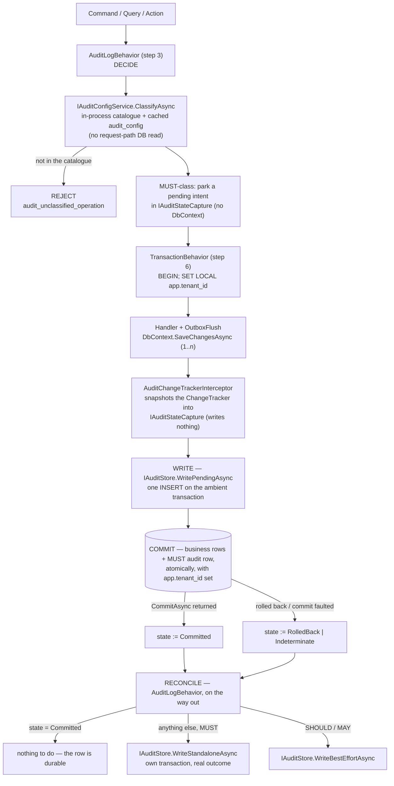

# Audit Subsystem

**Derives from:** [ADR-0033](../decisions/0033-audit-durability-model.md)
(supersedes [ADR-0016](../decisions/0016-audit-log-subsystem.md)),
[ADR-0017 (Tenant + Organization)](../decisions/0017-tenant-organization-hierarchy.md),
[18-audit-coverage.md](../standards/18-audit-coverage.md).

The audit subsystem captures and persists an append-only history of security- and
compliance-relevant operations across every LearnStack module. This document describes
the pipeline, the durability model, the data model, retention, redaction, and operational
concerns.

## 1. Two durability classes

The single most important thing to understand about this subsystem is that **audit is not
one mechanism**. ADR-0016 treated it as one and inherited a contradiction: Standards 18
required MUST-class rows to be written in the same transaction as the change they record,
while ADR-0016 required that audit never block business logic. Under the shipped MediatR
order — `Validation → Logging → AuditLog → TenantContext → Authorization → Transaction →
OutboxFlush → Handler` — `AuditLogBehavior` wraps `TransactionBehavior` from the outside,
so its write lands **after** the business transaction has already committed or rolled
back. Both requirements could not hold.

Worse, once the corrected Row Level Security template from
[ADR-0003 Amendment 3](../decisions/0003-tenant-isolation-defense-in-depth.md) lands, an
audit insert executed outside that transaction runs with no `app.tenant_id` set. The
policy's `WITH CHECK` rejects the row, and a catch-and-log posture swallows the
rejection: the audit log would record nothing while reporting success. A silent, complete
audit failure is strictly worse than a loud one.

[ADR-0033](../decisions/0033-audit-durability-model.md) resolves it by splitting the
classes rather than reordering the pipeline:

| Class | Where the row is written | On failure | Rationale |
|---|---|---|---|
| **MUST**, with a business transaction — security, compliance, privileged access | **Inside the business transaction**, as one parameterised `INSERT` issued by `IAuditStore.WritePendingAsync` immediately before `COMMIT` | **Fail closed** — the transaction rolls back and the caller receives `503 audit_unavailable` | For these events the audit row *is* part of the operation's contract. "Platform admin read tenant B's learner records" with no audit row is an audit finding |
| **MUST**, with no committed business transaction — `denied` outcomes, read-sensitive queries, non-mutating security events, **and any request whose transaction rolled back or whose commit outcome is unknown** | **Standalone**, through `IAuditStore.WriteStandaloneAsync`, on a connection outside the business transaction: `BEGIN; SET LOCAL app.tenant_id; INSERT; COMMIT` | **Fail closed** — the caller receives `503 audit_unavailable` instead of the original result, never a propagated exception | There is no business transaction to ride, or the one that existed is gone. The row must still satisfy `audit_log`'s `WITH CHECK`, so it sets the GUC on its own terms. Reusing the *business* connection here would be a defect: a row written inside a transaction that is about to roll back rolls back with it |
| **SHOULD / MAY** — operational, diagnostic | Outside any business transaction, best-effort, same standalone shape | Logged and dropped; the accepted loss is written down in the module's matrix, not assumed | Losing "course renamed" costs a support conversation |

The single most important consequence: **"written" is not "committed".** The
in-transaction `INSERT` at step 6 becomes durable only when `COMMIT` returns. Between the
two, a constraint violation, a lost connection, or — far more commonly — a handler that
calls `SaveChanges` and then returns `Result.Fail(...)` takes the audit row away with the
business row. A per-request "consumed" flag cannot observe that: the flag lives in a DI
scope and a database rollback does not touch it. `TransactionBehavior` therefore reports
the commit boundary explicitly — `Committed`, `RolledBack` or `Indeterminate` — and
`AuditLogBehavior` re-writes the row standalone for anything that is not `Committed`.

Redaction, projection and external fan-out happen after the commit, reading the committed
row; none of them updates it. ADR-0016's "audit never blocks business logic" is preserved
for that second stage and withdrawn for the first.

## 2. Pipeline overview



Read as text — **decide → write → reconcile**. At step 3 the behavior classifies the
operation from in-process state and, for MUST, parks a pending intent in the scoped
`IAuditStateCapture`; it opens no transaction and touches no `DbContext`. The handler
runs inside the transaction `TransactionBehavior` opened, which issued
`SET LOCAL app.tenant_id` as its first statement; the interceptor snapshots each flush's
ChangeTracker into the same buffer and writes nothing. Immediately before `COMMIT`,
`TransactionBehavior` calls `IAuditStore.WritePendingAsync`, which composes the complete
row and inserts it on that transaction — so it commits with the business write or not at
all, and Row Level Security accepts it. `TransactionBehavior` then records the commit
boundary. On the way out, the behavior reconciles: `Committed` means there is nothing to
do, and anything else means the row is re-written standalone with the real outcome.
SHOULD/MAY rows and all fan-out are written on that same outbound pass, best-effort.

Four components, separated concerns:

1. **`AuditChangeTrackerInterceptor`** — runs inside `DbContext.SaveChangesAsync`, walks
   the ChangeTracker, snapshots state for every entity inheriting `AuditableEntity<T>`
   into `IAuditStateCapture`. It **never** constructs an `AuditEntry` and never inserts
   one. Making it the writer would work in EF Core terms but would leave two questions
   unanswerable: which of several flushes in one transaction owns the row, and how the
   audit type gets mapped into every module's `DbContext` without inverting the
   dependency direction (see § 7 and [ADR-0033 § Implementation Notes](../decisions/0033-audit-durability-model.md)).
2. **`IAuditStateCapture`** — the scoped (per-request) audit state: the entity snapshots,
   the pending MUST-class intent, and the intent's lifecycle state.
3. **`TransactionBehavior`** — owns the commit boundary, and therefore owns both the
   durable audit write (immediately before `COMMIT`) and the `Committed` / `RolledBack` /
   `Indeterminate` signal the reconcile step reads.
4. **`AuditLogBehavior<TRequest, TResponse>`** — keeps its shipped position and its
   shipped exception responsibility: catch handler exceptions, record the outcome,
   rethrow via `ExceptionDispatchInfo`. It decides on the way in and reconciles on the
   way out; it no longer writes the MUST-class row itself except in the standalone case.

## 3. The interceptor

```csharp
namespace LearnStack.Infrastructure.Audit;

public sealed class AuditChangeTrackerInterceptor : ISaveChangesInterceptor
{
    private readonly IAuditStateCapture _capture;

    public AuditChangeTrackerInterceptor(IAuditStateCapture capture) => _capture = capture;

    public ValueTask<InterceptionResult<int>> SavingChangesAsync(
        DbContextEventData eventData, InterceptionResult<int> result, CancellationToken ct = default)
    {
        var ctx = eventData.Context;
        if (ctx is null) return ValueTask.FromResult(result);

        foreach (var entry in ctx.ChangeTracker.Entries())
        {
            if (!ShouldCapture(entry)) continue;
            _capture.Add(BuildChange(entry));
        }
        return ValueTask.FromResult(result);
    }

    private static bool ShouldCapture(EntityEntry entry)
    {
        if (entry.State is not (EntityState.Added or EntityState.Modified or EntityState.Deleted))
            return false;
        var type = entry.Entity.GetType();
        while (type is not null)
        {
            if (type.IsGenericType &&
                type.GetGenericTypeDefinition() == typeof(AuditableEntity<>))
                return true;
            type = type.BaseType;
        }
        return false;
    }

    private static CapturedEntityChange BuildChange(EntityEntry entry)
    {
        // Build Before/After/Delta snapshots; exclude TenantId, CreatedAt, UpdatedAt, etc.
        // Unwrap strongly-typed IDs to their underlying Guid for readable JSON.
        // ... (~50 LOC, mirrors Nexora docs/modules/tier-1-core/audit/SPEC.md
        // + docs/decisions/0009-audit-repository-pattern.md)
    }
}
```

The interceptor's job is **capture only**. It returns the unmodified
`InterceptionResult`, adds nothing to the context, and issues no SQL. It runs once per
flush, and a MUST-class command may flush more than once inside one transaction — which
is precisely why the audit row is not built here. `TransactionBehavior` composes it once,
after the last flush and before `COMMIT`, so the snapshots are complete regardless of how
many times the handler saved.

Pattern explicitly mirrors Nexora's `AuditChangeTrackerInterceptor` (see
`Nexora/docs/modules/tier-1-core/audit/SPEC.md` and
`Nexora/docs/decisions/0009-audit-repository-pattern.md`) — verbatim port to
LearnStack naming.

## 4. The scoped buffer

```csharp
namespace LearnStack.SharedKernel.Abstractions.Audit;

public enum AuditIntentState
{
    None,                  // no MUST-class intent for this request
    Pending,               // declared at step 3; nothing written yet
    WrittenInTransaction,  // INSERTed on the ambient transaction — NOT yet durable
    Committed,             // the ambient transaction committed; the row is durable
    RolledBack,            // the ambient transaction rolled back; the row is gone
    Indeterminate,         // COMMIT faulted; the server-side outcome is unknown
}

public interface IAuditStateCapture
{
    IReadOnlyList<CapturedEntityChange> Changes { get; }
    void Add(CapturedEntityChange change);

    // The MUST-class intent and its lifecycle. Exactly one intent per request.
    AuditIntent? Intent { get; }
    AuditIntentState State { get; }

    void Declare(AuditIntent intent);       // AuditLogBehavior, step 3
    void MarkWrittenInTransaction();        // IAuditStore.WritePendingAsync
    void MarkCommitted();                   // TransactionBehavior, after CommitAsync
    void MarkRolledBack();                  // TransactionBehavior, after RollbackAsync
    void MarkIndeterminate(Exception cause);// TransactionBehavior, CommitAsync faulted

    void Clear();
}
```

`State` is the only durability signal in the system, and it is deliberately **not**
a "consumed" flag. `WrittenInTransaction` is not durable; only `Committed` is. This
interface is a `SharedKernel` abstraction and names no EF Core type.

```csharp
namespace LearnStack.Infrastructure.Audit;

public sealed class AuditStateCapture : IAuditStateCapture
{
    private readonly List<CapturedEntityChange> _changes = new();
    public IReadOnlyList<CapturedEntityChange> Changes => _changes;
    public void Add(CapturedEntityChange change) => _changes.Add(change);
    public void Clear() => _changes.Clear();
}
```

Registered as **scoped** in DI (per-request lifetime). Cleared at the end of every
request to prevent cross-request bleed
([`AuditStateCapture_ClearedPerRequest`](../standards/21-architecture-tests-catalogue.md)
enforces this). Because the lifetime is the DI scope and not the database transaction, a
rollback leaves every field of this object intact — which is exactly why `State` must be
set by the component that owns the commit, and never inferred.

## 5. The MediatR behavior

```csharp
namespace LearnStack.Infrastructure.Behaviors;

public sealed class AuditLogBehavior<TRequest, TResponse>(
    IAuditContext auditContext,
    IAuditConfigService configService,
    IAuditStore auditStore,
    IAuditStateCapture stateCapture,
    ITenantContextAccessor tenantAccessor,
    IClock clock,
    ILogger<AuditLogBehavior<TRequest, TResponse>> logger)
    : IPipelineBehavior<TRequest, TResponse>
    where TRequest : notnull
    where TResponse : IResultBase
{
    public async Task<TResponse> Handle(TRequest request,
        RequestHandlerDelegate<TResponse> next, CancellationToken ct)
    {
        var requestKind = ClassifyRequest();   // Command | Query | Other
        if (requestKind == RequestKind.Other) return await next();

        var (module, operation) = ExtractModuleAndOperation(request, requestKind);

        // DECIDE. ClassifyAsync reads the in-process catalogue plus the tenant's cached
        // audit_config overrides. It issues NO query on the request path, and that is a
        // correctness requirement, not an optimisation: at step 3 no transaction is open,
        // app.tenant_id is unset, and audit_config carries ENABLE + FORCE row level
        // security (§ 7). A read here would return ZERO ROWS SILENTLY — indistinguishable
        // from "this tenant has no overrides" — so no catch could ever fire. On a cache
        // miss the loader opens its OWN short transaction and sets app.tenant_id itself.
        var classification = await configService.ClassifyAsync(module, operation, ct);

        // The catalogue is in-process and cannot be unavailable, so "proceeding
        // unaudited" is impossible by construction. What can happen is an operation
        // nobody classified — that is rejected, loudly.
        if (classification == AuditClassification.Unclassified)
            return Result.FailFor<TResponse>(AuditErrors.UnclassifiedOperation);

        if (classification == AuditClassification.Off) return await next();

        // MUST-class: declare the intent. The id is minted here so the in-transaction row
        // and any standalone replacement carry the same identity. Nothing is written yet
        // and no DbContext is touched.
        if (classification == AuditClassification.Must)
            stateCapture.Declare(new AuditIntent(
                AuditEntryId:   AuditEntryId.New(),
                Module:         module,
                Operation:      operation,
                OperationType:  DeriveOperationType(operation),
                OperationClass: OperationClass.Must,
                DeclaredAt:     clock.UtcNow));

        TResponse response;
        Exception? handlerException = null;

        try
        {
            response = await next();
        }
        catch (Exception ex) when (ex is not OperationCanceledException)
        {
            handlerException = ex;
            response = default!;
        }

        // RECONCILE. TransactionBehavior already wrote the MUST-class row on the ambient
        // transaction and already reported the commit boundary. The only question left is
        // whether that transaction COMMITTED — "written" is not "committed", and a
        // per-request flag cannot observe a rollback.
        try
        {
            if (stateCapture.Intent is { } intent)
            {
                if (stateCapture.State != AuditIntentState.Committed)
                    await auditStore.WriteStandaloneAsync(
                        BuildDraft(intent, response, handlerException, stateCapture), ct);
            }
            else
            {
                await auditStore.WriteBestEffortAsync(
                    BuildDraft(module, operation, classification, response,
                               handlerException, stateCapture), ct);
            }
        }
        catch (Exception ex) when (classification != AuditClassification.Must)
        {
            // SHOULD/MAY only: log and drop. The accepted loss is written down in the
            // module's audit-coverage matrix, not assumed.
            logger.LogError(ex, "Best-effort audit save failed for {Module}.{Operation}",
                module, operation);
        }
        catch (Exception ex)
        {
            // MUST-class, and even the standalone write failed. End of the line: the
            // platform cannot reach PostgreSQL at all. Report loudly and return
            // audit_unavailable — never a silent success.
            logger.LogCritical(ex,
                "MUST-class audit could not be written for {Module}.{Operation}; rejecting",
                module, operation);
            return Result.FailFor<TResponse>(AuditErrors.Unavailable);
        }
        finally
        {
            stateCapture.Clear();
        }

        if (handlerException is not null)
            ExceptionDispatchInfo.Capture(handlerException).Throw();

        return response;
    }

    // ClassifyRequest, ExtractModuleAndOperation, DeriveOperationType and the two
    // BuildDraft overloads are private helpers. BuildDraft resolves the outcome:
    //   Denied        — the Result carries `forbidden`
    //   Failed        — any other failure Result, or a handler exception, or
    //                   stateCapture.State == RolledBack
    //   Indeterminate — stateCapture.State == Indeterminate
    //   Success       — otherwise
    // and fills tenant / organization from ITenantContextAccessor, actor + correlation
    // from IAuditContext, and the snapshots from stateCapture.Changes.
}
```

Key invariants enforced by this behavior:

- **Only `Committed` counts.** The reconcile step branches on
  `IAuditStateCapture.State`, never on a "consumed" flag. `WrittenInTransaction`,
  `RolledBack` and `Indeterminate` all produce a standalone row. A MUST-class row that
  was inserted and then rolled back is re-written with outcome `failed`, so a rolled-back
  privileged operation is still on the record.
- **An unclassified operation is rejected.** The in-process catalogue cannot be
  unavailable, so "proceeding unaudited" is not a reachable state; what is reachable is an
  operation nobody classified, and that fails with `audit_unclassified_operation`.
- **A tenant-override read failure does not reject.** Classification falls back to the
  in-process catalogue, which carries the MUST floor, and the failure is logged at `Error`
  and surfaced on the audit health check. Rejecting every request platform-wide because a
  cache is unavailable is a worse compliance outcome than losing one tenant's voluntary
  SHOULD→MUST elevation; the property ADR-0016 lost — silently switching auditing *off* —
  is impossible here either way.
- **MUST-class audit failure fails the operation.** The durable write throws and
  `TransactionBehavior` rolls back; if even the standalone write fails, the unfiltered
  `catch` returns `audit_unavailable` (HTTP 503). This is a real availability trade-off,
  stated in [ADR-0033 § Consequences](../decisions/0033-audit-durability-model.md) and
  required to be visible in the operational runbooks.
- **SHOULD/MAY audit failure never blocks the business write.** The cheap path stays
  cheap; the platform does not pay compliance-grade cost for "a course was renamed".
- **Failed handlers still get audited.** The behavior catches the handler exception,
  writes the `failed` outcome through the standalone path — the business transaction has
  rolled back, so there is no transaction left to ride — then rethrows via
  `ExceptionDispatchInfo` so the original stack trace survives.
- **`Indeterminate` prefers a duplicate to a loss.** When `CommitAsync` faults, the row's
  fate is genuinely unknown, so the standalone row is written anyway, carrying the same
  `AuditEntryId` as the in-transaction attempt and outcome `indeterminate`. Two rows with
  one id is the recorded signature of a commit-in-doubt event; the audit read model groups
  by id and flags it. Losing the audit for a possibly-committed privileged operation is
  the failure this whole ADR exists to prevent.
- **A tenant override cannot remove MUST coverage.** `IAuditConfigService.ClassifyAsync`
  applies the per-tenant `audit_config` override and then re-applies the catalogue's MUST
  floor. A tenant may audit *more* than the baseline, never less.

## 6. Pipeline order

MediatR pipeline behaviors are registered in this order in
`LearnStack.Infrastructure.DependencyInjection`:

```csharp
services.AddTransient(typeof(IPipelineBehavior<,>), typeof(ValidationBehavior<,>));
services.AddTransient(typeof(IPipelineBehavior<,>), typeof(LoggingBehavior<,>));
services.AddTransient(typeof(IPipelineBehavior<,>), typeof(AuditLogBehavior<,>));
services.AddTransient(typeof(IPipelineBehavior<,>), typeof(TenantContextBehavior<,>));
services.AddTransient(typeof(IPipelineBehavior<,>), typeof(AuthorizationBehavior<,>));
services.AddTransient(typeof(IPipelineBehavior<,>), typeof(TransactionBehavior<,>));
services.AddTransient(typeof(IPipelineBehavior<,>), typeof(OutboxFlushBehavior<,>));
```

Effective execution order (outer → inner):

```
Request
  → Validation        (reject before any work; FluentValidation)
  → Logging           (request scope; correlation id)
  → AuditLog          (classifies; rejects an unclassified operation)
  → TenantContext     (assert tenant_id resolved)
  → Authorization     (resource-scoped checks beyond endpoint-level [Authorize])
  → Transaction       (begin transaction; SET LOCAL app.tenant_id; commit/rollback)
  → OutboxFlush       (flush outbox writes to DbContext before commit)
  → Handler           (business logic)
```

**The order did not change, and does not need to.** `AuditLogBehavior` still sits outside
`TransactionBehavior`, which is exactly why its *own* write cannot be the durable one. The
durable MUST-class row is written by `TransactionBehavior` — the behavior that owns the
commit boundary — from the intent the outer behavior declared. The decision travels inward
through the pipeline; the commit outcome travels back out.

```csharp
// LearnStack.Application.Pipeline.TransactionBehavior — step 6. The commit boundary owns
// the durable audit write AND the durability signal, because they are the same fact.
public async Task<TResponse> Handle(TRequest request,
    RequestHandlerDelegate<TResponse> next, CancellationToken ct)
{
    // No gate. Everything that reaches step 6 needs a transaction, because the
    // requests that must not open one have already short-circuited: validation
    // failure at step 1, an unresolved tenant at step 4 (tenant_mismatch), and
    // authorization denial at step 5. An earlier draft called a
    // RequiresTransaction(request) predicate that is defined nowhere and would
    // have been a fourth exemption if it were.
    await unitOfWork.BeginTransactionAsync(ct);
    // First statement inside the transaction, per ADR-0003 Amendment 3.
    await unitOfWork.SetTenantContextAsync(tenantContext, ct);

    try
    {
        var response = await next();

        if (!response.IsSuccess)
        {
            await unitOfWork.RollbackAsync(CancellationToken.None);
            stateCapture.MarkRolledBack();
            return response;                       // audited standalone, outcome = failed
        }

        // WRITE. No-op unless a MUST-class intent is pending. Throws on failure, which
        // reaches the catch below and rolls the business write back — fail closed.
        await auditStore.WritePendingAsync(unitOfWork, ct);

        try
        {
            await unitOfWork.CommitAsync(ct);
            stateCapture.MarkCommitted();          // the ONLY place durability is claimed
        }
        catch (Exception ex)
        {
            // A faulted COMMIT leaves the server-side outcome genuinely unknown.
            stateCapture.MarkIndeterminate(ex);
            throw;
        }

        return response;
    }
    catch (Exception ex) when (stateCapture.State != AuditIntentState.Indeterminate)
    {
        await unitOfWork.RollbackAsync(CancellationToken.None);
        stateCapture.MarkRolledBack();

        if (ex is AuditWriteFailedException)
            return Result.FailFor<TResponse>(AuditErrors.Unavailable);

        throw;
    }
}
```

`IUnitOfWork` is the seam that lets this generic behavior open and commit a transaction
without naming any module's `DbContext`, and through which `IAuditStore` reaches the
ambient connection. It **shipped** in
[Phase 02a Packet 6](../roadmap/phase-02a-kernel-tenancy.md) step 6, together with the
`TransactionBehavior` body — everything above except the `auditStore` and `stateCapture`
lines, which land with `IAuditStore` in Packet 9.

Only the `auditStore.WritePendingAsync` line has a slot waiting for it, marked by a dated
TODO immediately before the commit. The `stateCapture` calls do not, and one of them needs
more than a line: the shipped body's catch is filtered `when (!committing)` precisely so it
does **not** run after a faulted commit, so there is no reachable branch for
`MarkIndeterminate` to go in. `MarkCommitted` and `MarkRolledBack` drop into the existing
success and failure paths; `MarkIndeterminate` requires Packet 9 to add a `try`/`catch`
around the commit call itself, which is what the block above shows and what the filter
stands in for until then.

Two differences between the block above and what shipped, both decided by
[ADR-0040 Amendment 2](../decisions/0040-ambient-unit-of-work.md) after this block was
written. The shipped behavior resolves its frame through the `IUnitOfWorkScope` handle
(`CompleteAsync` / `FailAsync`) rather than through the frame-blind
`unitOfWork.CommitAsync` / `RollbackAsync`, because a nested frame nobody resolved
otherwise turns the outer commit into a silent no-op. And it marks the unit
rollback-only on the exception path only: an inner `Result.Fail` an outer handler
absorbs is not a failure of the unit, per ADR-0040 § Nesting. The `stateCapture` guard
on the outer catch is what the shipped body writes as a `committing` flag, and it does
the same job — a faulted `COMMIT` must not be followed by a rollback attempt.

The alternative — moving `TransactionBehavior` outward so it wraps `AuditLogBehavior` —
was considered and rejected in
[ADR-0033 § Considered Options](../decisions/0033-audit-durability-model.md): it would
also drag `TenantContext` and `Authorization` inside the transaction and open the
transaction before validation has finished, changing a shipped, test-asserted global
ordering (`MediatR_Pipeline_Order_Matches_Canonical_Sequence`) to solve a problem
belonging to one behavior.

## 7. Data model

### `AuditEntry` aggregate

```csharp
namespace LearnStack.Modules.Audit.Domain.Entities;

public sealed class AuditEntry : Entity<AuditEntryId>   // NOT AuditableEntity — append-only
{
    public Guid TenantId { get; private set; }
    public Guid? OrganizationId { get; private set; }

    public Guid? ActorUserId { get; private set; }
    public string? ActorEmail { get; private set; }

    public string Module { get; private set; } = default!;
    public string Operation { get; private set; } = default!;
    public OperationType OperationType { get; private set; }
    public OperationClass OperationClass { get; private set; }

    public string? EntityType { get; private set; }
    public string? EntityId { get; private set; }

    public bool IsSuccess { get; private set; }
    public string? ErrorKey { get; private set; }

    public string? BeforeState { get; private set; }
    public string? AfterState { get; private set; }
    public string? Changes { get; private set; }

    public string? CorrelationId { get; private set; }
    public string? IpAddress { get; private set; }
    public string? UserAgent { get; private set; }

    public DateTimeOffset Timestamp { get; private set; }
    public string? MetadataJson { get; private set; }

    private AuditEntry() { }

    public static AuditEntry Create(/* every field via parameters */)
    {
        // Validation guards; no public mutators.
    }
}

public enum OperationType
{
    Create,
    Update,
    Delete,
    ReadSensitive,
    SecurityEvent,
    PlatformAdmin,   // cross-tenant operator action — see ADR-0016 Amendment 1
    Action,          // generic non-CRUD action that doesn't fit above
}

public enum OperationClass { Must, Should, May }
```

### `audit_log` table

`audit_log` ships in [Phase 02a Packet 9](../roadmap/phase-02a-kernel-tenancy.md) as a
**single, plain, correct table**. Monthly partitioning, the partition-management job, and
the retention purge from [ADR-0028](../decisions/0028-audit-log-partition-management.md)
move to [Phase 11](../roadmap/phase-11-production-hardening.md) per
[ADR-0035](../decisions/0035-demand-gated-infrastructure.md), against the trigger
"measured `audit_log` growth justifies partition maintenance". Audit **correctness**
cannot be added later; audit **scale** can, and the platform has no rows yet to scale.

Two details that a partition-ready design gets wrong if it is copied carelessly:

- The primary key is the **composite** `(id, timestamp)`. ADR-0016's DDL declared a
  primary key twice — inline on `id` and again as a table constraint on `(id, timestamp)`
  — and PostgreSQL rejects that table outright. When partitioning arrives, a partitioned
  table must include every partition-key column in its primary key, so the composite is
  the correct one and the inline declaration was the error. Shipping the composite now
  means Phase 11 adds `PARTITION BY RANGE (timestamp)` without a key migration.
- Cross-tenant reads use **`learnstack_platform`**, entered through the audited
  `EnterPlatformAdminScope(reason)` path. There is no separate `learnstack_audit_admin`
  role: the database role model fixed by
  [ADR-0003 Amendment 3](../decisions/0003-tenant-isolation-defense-in-depth.md) has
  exactly four roles, and every additional `BYPASSRLS` role is a hole in the isolation
  model that would need its own ADR.

```sql
CREATE TABLE audit_log (
    id               uuid NOT NULL,
    tenant_id        uuid NOT NULL,
    organization_id  uuid NULL,
    actor_user_id    uuid NULL,
    actor_email      text NULL,
    module           text NOT NULL,
    operation        text NOT NULL,
    operation_type   text NOT NULL,
    operation_class  text NOT NULL,
    entity_type      text NULL,
    entity_id        text NULL,
    outcome          text NOT NULL,     -- 'success' | 'denied' | 'failed'
    error_key        text NULL,
    reason           text NULL,          -- EnterPlatformAdminScope(reason), denial cause
    before_state     jsonb NULL,
    after_state      jsonb NULL,
    changes          jsonb NULL,
    correlation_id   text NULL,
    ip_address       inet NULL,
    user_agent       text NULL,
    timestamp        timestamptz NOT NULL DEFAULT now(),
    metadata         jsonb NULL,
    CONSTRAINT audit_log_pkey PRIMARY KEY (id, timestamp)
);
-- Phase 11 does NOT alter this table in place: PostgreSQL has no
-- ALTER TABLE ... PARTITION BY. It creates a partitioned parent, attaches this
-- table to it, and recreates the indexes and the policy on the parent, under a
-- lock. The composite key above is what keeps that a data operation rather than
-- a key migration (ADR-0033 § Corrected audit_log DDL).
-- The composite key above is already partition-compatible, so that change is
-- additive rather than a key migration.

CREATE INDEX ix_audit_log_tenant_timestamp
    ON audit_log (tenant_id, timestamp DESC);
CREATE INDEX ix_audit_log_actor_timestamp
    ON audit_log (actor_user_id, timestamp DESC)
    WHERE actor_user_id IS NOT NULL;
CREATE INDEX ix_audit_log_correlation
    ON audit_log (correlation_id)
    WHERE correlation_id IS NOT NULL;
CREATE INDEX ix_audit_log_module_operation_timestamp
    ON audit_log (module, operation, timestamp DESC);

-- RLS: built from the canonical template in Database Standards § Tenant-Owned and
-- Organization-Scoped Tables — one AND-ed policy, ENABLE *and* FORCE, explicit
-- WITH CHECK. Do not hand-write it here; the template is the single source of truth.
ALTER TABLE audit_log ENABLE ROW LEVEL SECURITY;
ALTER TABLE audit_log FORCE  ROW LEVEL SECURITY;
CREATE POLICY audit_log_isolation ON audit_log
    USING      (tenant_id = NULLIF(current_setting('app.tenant_id', true), '')::uuid)
    WITH CHECK (tenant_id = NULLIF(current_setting('app.tenant_id', true), '')::uuid);
-- Cross-tenant reads run as learnstack_platform, entered through the audited
-- EnterPlatformAdminScope(reason) path.
```

The `WITH CHECK` clause is the reason a MUST-class audit row must be written either inside
the business transaction or inside a short transaction that sets the GUC itself. With
neither, `app.tenant_id` is unset or reset to `''`, `NULLIF(current_setting(…), '')`
yields `NULL`, the predicate is false, and the insert is rejected — which the old
catch-and-log posture would have swallowed. Note honestly what this clause does and does
not buy: because the standalone writer derives both the GUC and the row's `tenant_id` from
the same `ITenantContext`, `WITH CHECK` is vacuous for that write. The guard that matters
is that `tenant_id` on an audit row comes from `ITenantContext` and **never** from the
request payload. See [Database Standards](../standards/05-database.md) for the template
and [ADR-0033](../decisions/0033-audit-durability-model.md) for the durability rule.

Platform-scope events with no resolved tenant (provisioning, Hub-operator actions) are
written with the reserved nil UUID `00000000-0000-0000-0000-000000000000` as `tenant_id`,
and the standalone writer sets `app.tenant_id` to the same value. No tenant may ever be
provisioned with the nil UUID, so those rows are invisible to every tenant policy and
readable only through `learnstack_platform`.

### Append-only enforcement

Append-only is enforced by **privilege first, trigger second** — not by convention and
not by an architecture test alone.

```sql
-- The runtime role may only add rows and read them back.
REVOKE UPDATE, DELETE ON audit_log FROM learnstack_app;

-- Exactly two mutating paths exist. Both are owned by the Audit module and both run as
-- learnstack_platform through the audited EnterPlatformAdminScope(reason) path:
--   1. GDPR redaction  — UPDATE, restricted to the redactable columns (§ 10).
--   2. Retention purge — DELETE of rows past retention (§ 9). After Phase 11
--      partitioning this becomes DETACH + DROP PARTITION and issues no DELETE at all.
CREATE OR REPLACE FUNCTION audit_log_append_only()
RETURNS trigger
LANGUAGE plpgsql
AS $$
BEGIN
    IF current_user <> 'learnstack_platform' THEN
        RAISE EXCEPTION 'audit_log is append-only (attempted % as %)', TG_OP, current_user
            USING ERRCODE = 'insufficient_privilege';
    END IF;

    IF TG_OP = 'DELETE' THEN
        RETURN OLD;   -- allow the purge; returning NULL here would cancel it
    END IF;

    -- UPDATE: every column except the six redactable ones must be unchanged. Expressed
    -- as a jsonb difference rather than a column list so the guard survives every future
    -- column addition — including is_success -> outcome — without an edit here.
    IF (to_jsonb(NEW) - 'actor_email' - 'ip_address' - 'user_agent'
                      - 'before_state' - 'after_state' - 'changes')
       IS DISTINCT FROM
       (to_jsonb(OLD) - 'actor_email' - 'ip_address' - 'user_agent'
                      - 'before_state' - 'after_state' - 'changes')
    THEN
        RAISE EXCEPTION 'audit_log UPDATE may only redact actor_email, ip_address, user_agent, before_state, after_state, changes'
            USING ERRCODE = 'insufficient_privilege';
    END IF;

    RETURN NEW;
END;
$$;

CREATE TRIGGER audit_log_append_only_guard
    BEFORE UPDATE OR DELETE ON audit_log
    FOR EACH ROW EXECUTE FUNCTION audit_log_append_only();
```

Three properties worth stating, because a careless copy loses each of them:

- **`actor_user_id` is deliberately immutable.** Once the `users` row is erased it is an
  orphan surrogate key with no path back to a natural person, which is what keeps the
  audit row's existence auditable after erasure. Redacting it would collapse every erased
  user's history into one indistinguishable bucket and make the probe-detection queries
  [Audit Coverage Standards](../standards/18-audit-coverage.md) justifies the whole
  `denied` class with unanswerable.
- **`BEFORE` row triggers on partitioned tables are supported from PostgreSQL 13**, and
  LearnStack runs 18+ ([ADR-0031](../decisions/0031-postgresql-major-version.md)). The
  trigger is inherited by partitions created later, so Phase 11 partitioning remains
  additive — no re-creation, no gap.
- **The trigger is the second layer, not the first.** `learnstack_app` holds no `UPDATE`
  or `DELETE` privilege at all, so the ordinary path fails with `42501` before the trigger
  is reached. The trigger's job is to constrain `learnstack_platform`, the one role that
  can mutate.

### `audit_config` table

```sql
CREATE TABLE audit_config (
    id                uuid PRIMARY KEY,
    tenant_id         uuid NOT NULL,
    module            text NOT NULL,
    operation         text NOT NULL,
    is_enabled        boolean NOT NULL,
    created_at        timestamptz NOT NULL DEFAULT now(),
    updated_at        timestamptz NOT NULL DEFAULT now(),
    UNIQUE (tenant_id, module, operation)
);
ALTER TABLE audit_config ENABLE ROW LEVEL SECURITY;
ALTER TABLE audit_config FORCE  ROW LEVEL SECURITY;
CREATE POLICY audit_config_isolation ON audit_config
    USING      (tenant_id = NULLIF(current_setting('app.tenant_id', true), '')::uuid)
    WITH CHECK (tenant_id = NULLIF(current_setting('app.tenant_id', true), '')::uuid);
```

Defaults declared in each module via `IModule.RegisterAuditDefaults()`; the table holds
per-tenant overrides only.

`is_enabled` is deliberately **not** the whole story. A row here can narrow SHOULD/MAY
coverage; it cannot switch off an operation the catalogue classifies MUST.
`ClassifyAsync` applies the override and then re-applies the MUST floor, and a read
failure against this table falls back to the in-process catalogue — which carries that
same MUST floor — logged at `Error` and surfaced on the audit health check, rather than
rejecting the operation. Rejecting would turn a cache outage into a platform-wide denial
of service; see [§ 5](#5-the-mediatr-behavior), which is the authority.

## 8. Per-module coverage matrix (baseline)

Standard 18 defines the MUST / SHOULD / MAY matrix per module. Excerpt for Tier-1 core
modules:

| Module | create | update | delete | read-sensitive | security-event |
|--------|:------:|:------:|:------:|:-------------:|:--------------:|
| Identity | MUST | MUST | MUST | MUST (export users) | MUST (login, logout, MFA, permission change, role change, impersonation) |
| Tenancy | MUST | MUST | MUST | MUST (export tenant settings) | MUST (tenant create/suspend/terminate, custom-domain change) |
| Organization | MUST | MUST | MUST | SHOULD (export members) | MUST (org admin role assignment) |
| Content | SHOULD | SHOULD | SHOULD | MAY | MAY |
| Catalog | MUST | MUST | MUST | SHOULD (bulk export) | MUST (publish, unpublish) |
| Enrollment | MUST | MUST | MUST | MUST (export enrollments / progress) | MUST (manual override of progress) |
| Classroom | MUST | MUST | MUST | SHOULD (recording download) | MUST (recording start/stop, consent change, instructor change) |
| Notifications | SHOULD | SHOULD | SHOULD | MAY | MUST (template change affecting recipients) |
| Audit | n/a | n/a | n/a | MUST (any read of audit log) | MUST (retention purge, admin query) |
| Media | SHOULD | SHOULD | MUST (especially recordings) | SHOULD (download of restricted asset) | MAY |

Hub-side modules audit to **Hub's own audit stream**, separate from LearnStack's; same
shape, different table.

## 9. Retention

Default retention by operation class (per-tenant overridable within plan limits):

| Class | Default | Override range |
|-------|---------|----------------|
| SecurityEvent | **7 years** | 1–10 years |
| Create / Update / Delete on financial / identity / enrollment data | **7 years** | 1–10 years |
| Create / Update / Delete on content / scheduling | **2 years** | 6 months – 5 years |
| ReadSensitive | **2 years** | 6 months – 5 years |
| Other Action | **1 year** | 3 months – 3 years |

Both retention jobs run **daily**. Three documents previously disagreed — daily in
[Audit Coverage Standards](../standards/18-audit-coverage.md) and
[ADR-0028](../decisions/0028-audit-log-partition-management.md), weekly here — and this
document was the outlier. Daily is correct: a weekly purge means a tenant's stated
retention can be exceeded by up to six days, which is a compliance answer nobody wants to
give.

Both jobs land in [Phase 11](../roadmap/phase-11-production-hardening.md) alongside
partitioning; until then `audit_log` is a single table and nothing purges it.

| Hangfire recurring job | Cadence | What it does |
|---|---|---|
| `learnstack:audit:partition-management` | Daily | Creates next month's partition if absent; drops partitions older than the maximum retention window across all tenants (10y for safety) |
| `learnstack:audit:retention-purge` | **Daily** | Deletes individual rows per the tenant's configured retention, in batches. Runs as `learnstack_platform` through the audited platform-admin scope. The purge itself emits a `SecurityEvent` audit row summarising what was deleted |

## 10. GDPR / PII redaction

When a user is GDPR-erased (`UserGdprDeletedIntegrationEvent` published), audit rows
containing that user's PII are **redacted in place** (not deleted — the audit row's
existence must remain auditable):

Redaction is one of exactly **two** sanctioned mutations of `audit_log` (the other is the
retention purge, § 9). It is not an exception carved out of the append-only rule by
convention — it is the shape the `audit_log_append_only_guard` trigger in § 7 was written
to permit, and nothing else.

```csharp
// LearnStack.Modules.Audit.Infrastructure.IntegrationEvents
public sealed class UserGdprDeletedIntegrationEventHandler(
    AuditDbContext db,
    IPlatformAdminScope platformScope,
    IAuditStore auditStore,
    IInboxGuard inboxGuard,
    IEnumerable<IUserReferenceLocator> userReferenceLocators)
    : IIntegrationEventHandler<UserGdprDeletedIntegrationEvent>
{
    public async Task HandleAsync(UserGdprDeletedIntegrationEvent @event, CancellationToken ct)
    {
        // 1. Idempotent: inbox guard.
        if (await inboxGuard.IsAlreadyProcessedAsync(@event.EventId, ct)) return;

        // 2. learnstack_app holds no UPDATE privilege on audit_log, so the redaction runs
        //    as learnstack_platform — on the HANDLE's connection. The injected
        //    AuditDbContext is bound to IUnitOfWork.Connection (ADR-0040) and stays on
        //    the request's learnstack_app connection whatever scope surrounds it, so
        //    issuing the UPDATE through `db` would raise 42501 rather than redact
        //    anything. Entering the scope is recorded: at Warning today, as a
        //    SecurityEvent row once Packet 9 ships audit_log.
        await using var handle = await platformScope.EnterAsync(
            reason: $"gdpr-redaction:{@event.UserId}", ct);

        // 3. Actor PII only. The payload columns are NOT touched here. A blanket
        //    jsonb_set('{redacted}', 'true') would (a) not redact anything — it adds a
        //    flag and leaves the PII in place — and (b) raise
        //    'cannot set path in scalar' on any snapshot that is a JSON scalar or
        //    array. Payload redaction belongs to the per-module locator below, which
        //    knows which JSON paths in its own snapshots reference a user.
        await using (var redact = handle.Connection.CreateCommand())
        {
            redact.Transaction = handle.Transaction;
            redact.CommandText = @"
                UPDATE audit_log
                SET actor_email = '[REDACTED]',
                    ip_address  = NULL,
                    user_agent  = '[REDACTED]'
                WHERE actor_user_id = @actor
                  AND tenant_id     = @tenant";
            redact.Parameters.Add(new NpgsqlParameter("actor", @event.UserId));
            redact.Parameters.Add(new NpgsqlParameter("tenant", @event.TenantId));
            await redact.ExecuteNonQueryAsync(ct);
        }

        // 4. Payload references, per module. Each locator issues column-restricted
        //    UPDATEs against before_state / after_state / changes only — on the same
        //    handle, because they need the same privilege for the same reason.
        foreach (var locator in userReferenceLocators)
            await locator.RedactReferencesAsync(handle, @event.UserId, @event.TenantId, ct);

        await handle.CommitAsync(ct);

        // 5. Inbox: mark processed; SaveChanges. Ordinary learnstack_app work on the
        //    ambient transaction, deliberately outside the scope block — it is not part
        //    of the cross-tenant unit and must not read as though it rides it.
        inboxGuard.MarkAsProcessed(@event.EventId, @event.GetType().Name);
        await db.SaveChangesAsync(ct);

        // 6. Meta-audit. The redaction is itself a MUST-class security event, and a log
        //    line is not an audit row — the previous version of this handler logged and
        //    called it audited.
        await auditStore.WriteStandaloneAsync(
            AuditEntryDraft.SecurityEvent(
                tenantId:  @event.TenantId,
                module:    "audit",
                operation: "audit.redaction.apply",
                outcome:   AuditOutcome.Success,
                metadata:  new { subjectUserId = @event.UserId }),
            ct);
    }
}
```

`actor_user_id`, `module`, `operation`, `operation_type`, `operation_class`, `outcome`,
`correlation_id` and `timestamp` are **never** redacted; the trigger rejects an `UPDATE`
that changes any of them. What survives erasure is a pseudonymous record that a regulator
can still reconstruct "who did what, when, with what outcome" from — which is the point of
redacting in place rather than deleting.

Every module that stores user references in audit payloads must register an
`IUserReferenceLocator` implementation (architecture test enforces this — same shape as
Nexora's `IContactReferenceLocator`).

## 11. Querying audit log

The Audit module's admin API exposes:

```
GET    /api/v1/audit/events                        — paged list with filters
GET    /api/v1/audit/events/{id}                   — single entry
GET    /api/v1/audit/events?correlationId=<id>     — trace by correlation
GET    /api/v1/audit/events?actorId=<userId>       — by actor
GET    /api/v1/audit/events?module=identity&operationType=SecurityEvent
                                                   — filtered

POST   /api/v1/audit/events/export                 — CSV / JSON export job (async)
GET    /api/v1/audit/exports/{exportId}            — download URL when ready
```

Required permission: `audit.events.read` (tenant scope).
Required for export: `audit.events.export`.
Required for cross-tenant query (platform admin only): `platform.audit.events.read`.

## 12. Hub-side audit stream

Hub maintains a parallel audit stream in its own database (`hub_audit_log`), capturing
operator actions:

- Tenant create / suspend / terminate.
- Plan create / update / assign.
- Compliance cap change.
- Custom domain approval / revocation.
- License key issue / revoke.
- Cross-tenant query by operator.

Cross-stream correlation by `correlation_id`. A regulatory inquiry covering "what
happened to tenant X on date Y" pulls from both streams and joins by correlation.

## 13. Architecture tests

Blocker-level tests, registered in
[Architecture Tests Catalogue](../standards/21-architecture-tests-catalogue.md) by
[Phase 02a Packet 9](../roadmap/phase-02a-kernel-tenancy.md):

1. `Every_TenantOwned_Command_HasAuditCoverage` — auto-discovers commands by interface;
   for each, asserts the (module, operation) appears in the coverage matrix with at least
   a SHOULD classification.
2. `AuditEntry_Inherits_Entity_Not_AuditableEntity` — append-only by construction: an
   audit row that carries `UpdatedAt` / `DeletedAt` is a contradiction.
3. `MustClass_Audit_Writes_Share_The_Business_Transaction` — the binding test for
   [ADR-0033](../decisions/0033-audit-durability-model.md). One MUST-class command
   produces exactly one `audit_log` row, inserted on the same transaction as the business
   write; a command whose durable audit write is forced to fail produces **zero** business
   rows and returns `503 audit_unavailable`. Runs as `learnstack_app` (`NOBYPASSRLS`).
4. `Audit_Survives_Transaction_Rollback` — the test that closes the gap a "consumed" flag
   would have left open. A MUST-class command whose transaction is forced to roll back at
   `COMMIT` produces zero business rows and **exactly one** `audit_log` row with outcome
   `failed`. A companion case covers the ordinary path: a handler that calls `SaveChanges`
   and then returns `Result.Fail(...)` produces the same pair.
5. `Audit_Classification_Does_Not_Read_The_Database_On_The_Request_Path` — with the
   `audit_config` table made unreadable, a MUST-class command still completes and still
   writes its row at the catalogue classification; an operation absent from the catalogue
   is rejected with `audit_unclassified_operation`. Without this, a silent RLS-filtered
   empty read is indistinguishable from "this tenant has no overrides".
6. `AuditLog_Update_Is_Column_Restricted` — as `learnstack_app`, any `UPDATE` or `DELETE`
   on `audit_log` raises `42501`. As `learnstack_platform`, an `UPDATE` touching only the
   six redactable columns succeeds, an `UPDATE` touching any other column raises, and a
   `DELETE` succeeds (the retention purge).
7. `AuditStateCapture_ClearedPerRequest` — after a request completes, success or failure,
   the scoped `IAuditStateCapture` holds no changes, no intent, and `State == None` for
   the next request.
8. `Every_Module_Has_An_AuditCoverage_Matrix` — a module without a matrix cannot classify
   its operations, and under ADR-0033 classification is functional, not documentary.
9. `Every_PII_Module_RegistersUserReferenceLocator` — modules storing user references in
   audit payloads must register an `IUserReferenceLocator`.

`Audit_Config_Failure_Rejects_Operation` from the earlier draft is **withdrawn**, not
renamed: under ADR-0033 as settled, a tenant-override read failure falls back to the
in-process catalogue rather than rejecting, so the assertion would have locked in a
platform-wide denial of service triggered by a cache outage. Entry 5 above asserts the
property that actually matters.

`AuditLogBehavior_NeverBlocks_BusinessWrites` from the ADR-0016 era is **replaced**: the
property it asserted is now true only for SHOULD/MAY-class operations, and asserting it
for MUST-class would lock in exactly the defect ADR-0033 removes.

## 14. Phasing

| Phase | Deliverable |
|-------|-------------|
| [02a Packet 9](../roadmap/phase-02a-kernel-tenancy.md) | `AuditChangeTrackerInterceptor`, `IAuditStateCapture` + impl, `AuditLogBehavior` lit up per ADR-0033, `IAuditStore` + `PostgresAuditStore`, `AuditEntry` aggregate, `AuditConfig` with the fail-closed MUST floor, `audit_log` as a **single plain table** with the composite primary key. |
| [03](../roadmap/phase-03-identity-admin.md) | Admin API endpoints over the audit stream; `UserGdprDeletedIntegrationEventHandler` + per-module `IUserReferenceLocator`. |
| [06](../roadmap/phase-06-renderer-admin-studio.md) | Admin Studio audit UI: timeline view, filters, diff viewer, CSV / JSON export. |
| [09](../roadmap/phase-09-billing-integrations-analytics.md) | Hub-side `hub_audit_log` + cross-stream correlation query. |
| [11](../roadmap/phase-11-production-hardening.md) | **Scale, not correctness**: `PARTITION BY RANGE (timestamp)` plus monthly partitions, the daily partition-management job, the daily retention purge, off-archive policy for partitions older than a year, per-tenant retention enforcement under plan limits. Trigger: measured `audit_log` growth ([ADR-0035](../decisions/0035-demand-gated-infrastructure.md)). |

## References

- [ADR-0033](../decisions/0033-audit-durability-model.md) — Audit Durability Model
  (supersedes ADR-0016); the two durability classes, the fail-closed rules, and the
  corrected `audit_log` primary key.
- [ADR-0016](../decisions/0016-audit-log-subsystem.md) — Audit Log Subsystem
  (**superseded**; retained for its data model and coverage rationale).
- [ADR-0003 Amendment 1 + Amendment 3](../decisions/0003-tenant-isolation-defense-in-depth.md)
  — organization scope on the audit row; the corrected RLS template and four-role model.
- [ADR-0028](../decisions/0028-audit-log-partition-management.md) — partition management
  via Hangfire; lands in Phase 11.
- [ADR-0035](../decisions/0035-demand-gated-infrastructure.md) — why partitioning is
  demand-gated and correctness is not.
- [Database Standards](../standards/05-database.md) — the canonical RLS template.
- [18-audit-coverage.md](../standards/18-audit-coverage.md) — MUST/SHOULD/MAY matrix
  (standard).
- [15-event-and-outbox.md](15-event-and-outbox.md) — audit fan-out to external sinks
  rides the outbox; MUST-class audit does not.
- [29-dapr-integration.md](29-dapr-integration.md) — `UserGdprDeletedIntegrationEvent`
  transport.
- Nexora reference: `Nexora/docs/modules/tier-1-core/audit/SPEC.md`,
  `Nexora/docs/decisions/0009-audit-repository-pattern.md`,
  `Nexora/docs/standards/audit-coverage.md`.
