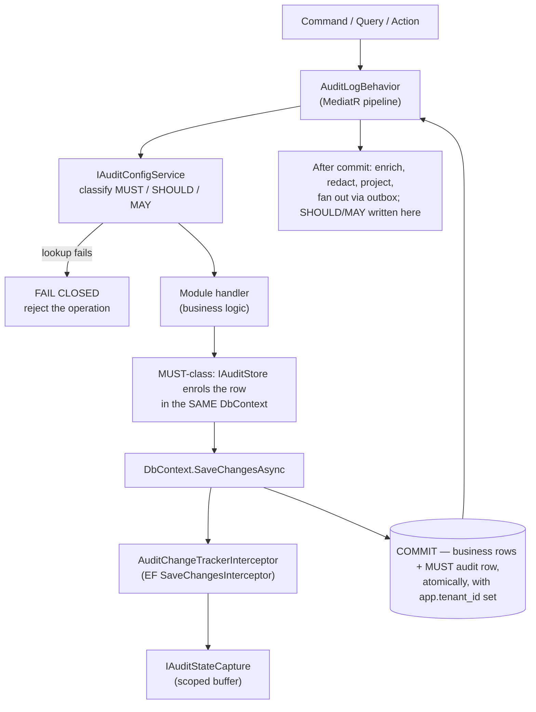

# Audit Subsystem

**Derives from:** [ADR-0033](../decisions/0033-audit-durability-model.md)
(supersedes [ADR-0016](../decisions/0016-audit-log-subsystem.md)),
[ADR-0017 (Tenant + Organization)](../decisions/0017-tenant-organization-hierarchy.md),
[18-audit-coverage.md](../standards/18-audit-coverage.md).

The audit subsystem captures and persists an append-only history of security- and
compliance-relevant operations across every LearnStack module. This document describes
the pipeline, the durability model, the data model, retention, redaction, and operational
concerns.

## 1. Two durability classes

The single most important thing to understand about this subsystem is that **audit is not
one mechanism**. ADR-0016 treated it as one and inherited a contradiction: Standards 18
required MUST-class rows to be written in the same transaction as the change they record,
while ADR-0016 required that audit never block business logic. Under the shipped MediatR
order — `Validation → Logging → AuditLog → TenantContext → Authorization → Transaction →
OutboxFlush → Handler` — `AuditLogBehavior` wraps `TransactionBehavior` from the outside,
so its write lands **after** the business transaction has already committed or rolled
back. Both requirements could not hold.

Worse, once the corrected Row Level Security template from
[ADR-0003 Amendment 3](../decisions/0003-tenant-isolation-defense-in-depth.md) lands, an
audit insert executed outside that transaction runs with no `app.tenant_id` set. The
policy's `WITH CHECK` rejects the row, and a catch-and-log posture swallows the
rejection: the audit log would record nothing while reporting success. A silent, complete
audit failure is strictly worse than a loud one.

[ADR-0033](../decisions/0033-audit-durability-model.md) resolves it by splitting the
classes rather than reordering the pipeline:

| Class | Where the row is written | On failure | Rationale |
|---|---|---|---|
| **MUST** — security, compliance, privileged access | **Inside the business transaction**, enrolled in the same `DbContext.SaveChanges` as the state change | **Fail closed** — the business operation is rejected | For these events the audit row *is* part of the operation's contract. "Platform admin read tenant B's learner records" with no audit row is an audit finding |
| **SHOULD / MAY** — operational, diagnostic | Outside the transaction, best-effort | Logged and dropped; the accepted loss is written down, not assumed | Losing "course renamed" costs a support conversation |

Enrichment, redaction, projection and external fan-out always happen **after** the
commit, reading the durable row. ADR-0016's "audit never blocks business logic" is
preserved for that second stage and withdrawn for the first.

## 2. Pipeline overview



Read as text: the behavior classifies the operation; a configuration-read failure rejects
the operation rather than proceeding unaudited. The handler runs, and for a MUST-class
operation the audit row is enrolled in the same `SaveChanges` as the business write — so
it commits with it or not at all, and so it executes while `app.tenant_id` is set and Row
Level Security accepts it. Everything after the commit — enrichment, redaction, external
fan-out, and SHOULD/MAY rows — is best-effort and never blocks.

Three components, separated concerns:

1. **`AuditChangeTrackerInterceptor`** — runs inside `DbContext.SaveChangesAsync`, walks
   the ChangeTracker, snapshots state for every entity inheriting `AuditableEntity<T>`.
2. **`IAuditStateCapture`** — a scoped (per-request) buffer holding entity snapshots
   until the MediatR behavior reads them.
3. **`AuditLogBehavior<TRequest, TResponse>`** — keeps its shipped position and its
   shipped responsibility: catch handler exceptions, record the outcome, rethrow via
   `ExceptionDispatchInfo`. What changed is that the MUST-class row it records is
   **already durable** by the time it runs.

## 3. The interceptor

```csharp
namespace LearnStack.Infrastructure.Audit;

public sealed class AuditChangeTrackerInterceptor : ISaveChangesInterceptor
{
    private readonly IAuditStateCapture _capture;

    public AuditChangeTrackerInterceptor(IAuditStateCapture capture) => _capture = capture;

    public ValueTask<InterceptionResult<int>> SavingChangesAsync(
        DbContextEventData eventData, InterceptionResult<int> result, CancellationToken ct = default)
    {
        var ctx = eventData.Context;
        if (ctx is null) return ValueTask.FromResult(result);

        foreach (var entry in ctx.ChangeTracker.Entries())
        {
            if (!ShouldCapture(entry)) continue;
            _capture.Add(BuildChange(entry));
        }
        return ValueTask.FromResult(result);
    }

    private static bool ShouldCapture(EntityEntry entry)
    {
        if (entry.State is not (EntityState.Added or EntityState.Modified or EntityState.Deleted))
            return false;
        var type = entry.Entity.GetType();
        while (type is not null)
        {
            if (type.IsGenericType &&
                type.GetGenericTypeDefinition() == typeof(AuditableEntity<>))
                return true;
            type = type.BaseType;
        }
        return false;
    }

    private static CapturedEntityChange BuildChange(EntityEntry entry)
    {
        // Build Before/After/Delta snapshots; exclude TenantId, CreatedAt, UpdatedAt, etc.
        // Unwrap strongly-typed IDs to their underlying Guid for readable JSON.
        // ... (~50 LOC, mirrors Nexora docs/modules/tier-1-core/audit/SPEC.md
        // + docs/decisions/0009-audit-repository-pattern.md)
    }
}
```

Pattern explicitly mirrors Nexora's `AuditChangeTrackerInterceptor` (see
`Nexora/docs/modules/tier-1-core/audit/SPEC.md` and
`Nexora/docs/decisions/0009-audit-repository-pattern.md`) — verbatim port to
LearnStack naming.

## 4. The scoped buffer

```csharp
namespace LearnStack.SharedKernel.Abstractions.Audit;

public interface IAuditStateCapture
{
    IReadOnlyList<CapturedEntityChange> Changes { get; }
    void Add(CapturedEntityChange change);
    void Clear();
}
```

```csharp
namespace LearnStack.Infrastructure.Audit;

public sealed class AuditStateCapture : IAuditStateCapture
{
    private readonly List<CapturedEntityChange> _changes = new();
    public IReadOnlyList<CapturedEntityChange> Changes => _changes;
    public void Add(CapturedEntityChange change) => _changes.Add(change);
    public void Clear() => _changes.Clear();
}
```

Registered as **scoped** in DI (per-request lifetime). Cleared at the end of every
request to prevent cross-request bleed (architecture test enforces this).

## 5. The MediatR behavior

```csharp
namespace LearnStack.Infrastructure.Behaviors;

public sealed class AuditLogBehavior<TRequest, TResponse>(
    IAuditContext auditContext,
    IAuditConfigService configService,
    IAuditStore auditStore,
    IAuditStateCapture stateCapture,
    ITenantContextAccessor tenantAccessor,
    ILogger<AuditLogBehavior<TRequest, TResponse>> logger)
    : IPipelineBehavior<TRequest, TResponse>
    where TRequest : IRequest<TResponse>
{
    public async Task<TResponse> Handle(TRequest request,
        RequestHandlerDelegate<TResponse> next, CancellationToken ct)
    {
        var requestKind = ClassifyRequest();   // Command | Query | Other
        if (requestKind == RequestKind.Other) return await next();

        var (module, operation) = ExtractModuleAndOperation(request, requestKind);

        // Classification is a decision, not a toggle: it returns Must | Should | May | Off.
        // A tenant AuditConfig override may narrow Should/May. It can never remove
        // baseline Must coverage — the catalogue's Must floor is applied after the
        // override, not before it.
        AuditClassification classification;
        try
        {
            classification = await configService.ClassifyAsync(module, operation, ct);
        }
        catch (Exception ex)
        {
            // FAIL CLOSED. A single unreadable config row, or a config-store outage,
            // must not silently switch off mandatory security auditing. Rejecting the
            // operation is loud, recoverable, and visible; proceeding unaudited is none
            // of those. Per ADR-0033.
            logger.LogError(ex, "Audit classification unavailable for {Module}.{Operation}; rejecting",
                module, operation);
            return Result.FailFor<TResponse>(AuditErrors.ConfigurationUnavailable);
        }

        if (classification == AuditClassification.Off) return await next();

        // MUST-class: the audit row is enrolled by IAuditStore into the SAME DbContext
        // the handler writes through, so it commits with the business write or not at
        // all — and so it executes with app.tenant_id set. If the enrolment or the
        // commit fails, the whole operation fails; that is the point.
        if (classification == AuditClassification.Must)
            auditStore.EnrolDurableIntent(BuildIntent(module, operation, request));

        TResponse response;
        bool handlerFailed = false;
        Exception? handlerException = null;

        try
        {
            response = await next();
        }
        catch (Exception ex)
        {
            handlerFailed = true;
            handlerException = ex;
            response = default!;
        }

        try
        {
            var (isSuccess, errorKey) = handlerFailed
                ? (false, (string?)"audit.handler_exception")
                : DetermineOutcome(response);

            var entry = new AuditEntry(
                Id: AuditEntryId.New(),
                TenantId: tenantAccessor.Current?.TenantId ?? Guid.Empty,
                OrganizationId: tenantAccessor.Current?.OrganizationId,
                Module: module,
                Operation: operation,
                OperationType: DeriveOperationType(operation),
                OperationClass: DeriveOperationClass(module, operation),
                ActorUserId: auditContext.UserId,
                ActorEmail: auditContext.UserEmail,
                CorrelationId: auditContext.CorrelationId,
                IpAddress: auditContext.IpAddress,
                UserAgent: auditContext.UserAgent,
                IsSuccess: isSuccess,
                ErrorKey: errorKey,
                EntityType: stateCapture.Changes.Count == 1 ? stateCapture.Changes[0].EntityType : null,
                EntityId:   stateCapture.Changes.Count == 1 ? stateCapture.Changes[0].EntityId : null,
                BeforeState: SerializeBefore(stateCapture.Changes),
                AfterState:  SerializeAfter(stateCapture.Changes),
                Changes:     SerializeChanges(stateCapture.Changes),
                Timestamp:   DateTimeOffset.UtcNow);

            // MUST-class: completes the already-durable row (enrichment only — the row's
            // existence is not in question here). SHOULD/MAY-class: writes it now,
            // outside the transaction, best-effort.
            await auditStore.CompleteOrSaveAsync(entry, classification, ct);
        }
        catch (Exception ex) when (classification != AuditClassification.Must)
        {
            // SHOULD/MAY only: log and drop. The accepted loss is written down in the
            // module's audit-coverage matrix, not assumed.
            logger.LogError(ex, "Best-effort audit save failed for {Module}.{Operation}",
                module, operation);
        }
        finally
        {
            stateCapture.Clear();
        }

        if (handlerFailed)
            ExceptionDispatchInfo.Capture(handlerException!).Throw();

        return response;
    }

    // ClassifyRequest, ExtractModuleAndOperation, DetermineOutcome, DeriveOperationType,
    // BuildIntent, SerializeBefore/After/Changes are private helpers.
}
```

Key invariants enforced by this behavior:

- **Audit configuration failure fails closed.** A configuration-store outage, or a single
  unreadable `audit_config` row, rejects the operation. It does not switch off mandatory
  security auditing — which is exactly what the previous `catch → return await next()`
  did, and what made a config-store incident indistinguishable from a period of clean
  behaviour in the log.
- **MUST-class audit failure fails the operation.** The exception filter above
  deliberately excludes `Must`, so a MUST-class audit problem propagates. This is a real
  availability trade-off, stated in
  [ADR-0033 § Consequences](../decisions/0033-audit-durability-model.md) and required to
  be visible in the operational runbooks.
- **SHOULD/MAY audit failure never blocks the business write.** The cheap path stays
  cheap; the platform does not pay compliance-grade cost for "a course was renamed".
- **Failed handlers still get audited.** The behavior catches the handler exception,
  records `IsSuccess=false`, then rethrows via `ExceptionDispatchInfo` so the original
  stack trace survives.
- **A tenant override cannot remove MUST coverage.** `IAuditConfigService.ClassifyAsync`
  applies the per-tenant `audit_config` override and then re-applies the catalogue's MUST
  floor. A tenant may audit *more* than the baseline, never less.

## 6. Pipeline order

MediatR pipeline behaviors are registered in this order in
`LearnStack.Infrastructure.DependencyInjection`:

```csharp
services.AddTransient(typeof(IPipelineBehavior<,>), typeof(ValidationBehavior<,>));
services.AddTransient(typeof(IPipelineBehavior<,>), typeof(LoggingBehavior<,>));
services.AddTransient(typeof(IPipelineBehavior<,>), typeof(AuditLogBehavior<,>));
services.AddTransient(typeof(IPipelineBehavior<,>), typeof(TenantContextBehavior<,>));
services.AddTransient(typeof(IPipelineBehavior<,>), typeof(AuthorizationBehavior<,>));
services.AddTransient(typeof(IPipelineBehavior<,>), typeof(TransactionBehavior<,>));
services.AddTransient(typeof(IPipelineBehavior<,>), typeof(OutboxFlushBehavior<,>));
```

Effective execution order (outer → inner):

```
Request
  → Validation        (reject before any work; FluentValidation)
  → Logging           (request scope; correlation id)
  → AuditLog          (classifies; fails closed on config failure)
  → TenantContext     (assert tenant_id resolved)
  → Authorization     (resource-scoped checks beyond endpoint-level [Authorize])
  → Transaction       (begin transaction; SET LOCAL app.tenant_id; commit/rollback)
  → OutboxFlush       (flush outbox writes to DbContext before commit)
  → Handler           (business logic)
```

**The order did not change, and does not need to.** `AuditLogBehavior` still sits outside
`TransactionBehavior`, which is exactly why its *own* write cannot be the durable one.
The durable MUST-class row is enrolled through `IAuditStore` into the `DbContext` that
`TransactionBehavior` owns, so it is flushed and committed by that inner behavior — the
row travels inward through the pipeline even though the behavior that decided on it sits
outward. `AuditLogBehavior` then completes the row's enrichment on the way back out.

The alternative — moving `TransactionBehavior` outward so it wraps `AuditLogBehavior` —
was considered and rejected in
[ADR-0033 § Considered Options](../decisions/0033-audit-durability-model.md): it would
also drag `TenantContext` and `Authorization` inside the transaction and open the
transaction before validation has finished, changing a shipped, test-asserted global
ordering (`MediatR_Pipeline_Order_Matches_Canonical_Sequence`) to solve a problem
belonging to one behavior.

## 7. Data model

### `AuditEntry` aggregate

```csharp
namespace LearnStack.Modules.Audit.Domain.Entities;

public sealed class AuditEntry : Entity<AuditEntryId>   // NOT AuditableEntity — append-only
{
    public Guid TenantId { get; private set; }
    public Guid? OrganizationId { get; private set; }

    public Guid? ActorUserId { get; private set; }
    public string? ActorEmail { get; private set; }

    public string Module { get; private set; } = default!;
    public string Operation { get; private set; } = default!;
    public OperationType OperationType { get; private set; }
    public OperationClass OperationClass { get; private set; }

    public string? EntityType { get; private set; }
    public string? EntityId { get; private set; }

    public bool IsSuccess { get; private set; }
    public string? ErrorKey { get; private set; }

    public string? BeforeState { get; private set; }
    public string? AfterState { get; private set; }
    public string? Changes { get; private set; }

    public string? CorrelationId { get; private set; }
    public string? IpAddress { get; private set; }
    public string? UserAgent { get; private set; }

    public DateTimeOffset Timestamp { get; private set; }
    public string? MetadataJson { get; private set; }

    private AuditEntry() { }

    public static AuditEntry Create(/* every field via parameters */)
    {
        // Validation guards; no public mutators.
    }
}

public enum OperationType
{
    Create,
    Update,
    Delete,
    ReadSensitive,
    SecurityEvent,
    PlatformAdmin,   // cross-tenant operator action — see ADR-0016 Amendment 1
    Action,          // generic non-CRUD action that doesn't fit above
}

public enum OperationClass { Must, Should, May }
```

### `audit_log` table

`audit_log` ships in [Phase 02a Packet 9](../roadmap/phase-02a-kernel-tenancy.md) as a
**single, plain, correct table**. Monthly partitioning, the partition-management job, and
the retention purge from [ADR-0028](../decisions/0028-audit-log-partition-management.md)
move to [Phase 11](../roadmap/phase-11-production-hardening.md) per
[ADR-0035](../decisions/0035-demand-gated-infrastructure.md), against the trigger
"measured `audit_log` growth justifies partition maintenance". Audit **correctness**
cannot be added later; audit **scale** can, and the platform has no rows yet to scale.

Two details that a partition-ready design gets wrong if it is copied carelessly:

- The primary key is the **composite** `(id, timestamp)`. ADR-0016's DDL declared a
  primary key twice — inline on `id` and again as a table constraint on `(id, timestamp)`
  — and PostgreSQL rejects that table outright. When partitioning arrives, a partitioned
  table must include every partition-key column in its primary key, so the composite is
  the correct one and the inline declaration was the error. Shipping the composite now
  means Phase 11 adds `PARTITION BY RANGE (timestamp)` without a key migration.
- Cross-tenant reads use **`learnstack_platform`**, entered through the audited
  `EnterPlatformAdminScope(reason)` path. There is no separate `learnstack_audit_admin`
  role: the database role model fixed by
  [ADR-0003 Amendment 3](../decisions/0003-tenant-isolation-defense-in-depth.md) has
  exactly four roles, and every additional `BYPASSRLS` role is a hole in the isolation
  model that would need its own ADR.

```sql
CREATE TABLE audit_log (
    id               uuid NOT NULL,
    tenant_id        uuid NOT NULL,
    organization_id  uuid NULL,
    actor_user_id    uuid NULL,
    actor_email      text NULL,
    module           text NOT NULL,
    operation        text NOT NULL,
    operation_type   text NOT NULL,
    operation_class  text NOT NULL,
    entity_type      text NULL,
    entity_id        text NULL,
    is_success       boolean NOT NULL,
    error_key        text NULL,
    before_state     jsonb NULL,
    after_state      jsonb NULL,
    changes          jsonb NULL,
    correlation_id   text NULL,
    ip_address       inet NULL,
    user_agent       text NULL,
    timestamp        timestamptz NOT NULL DEFAULT now(),
    metadata         jsonb NULL,
    CONSTRAINT audit_log_pkey PRIMARY KEY (id, timestamp)
);
-- Phase 11 adds PARTITION BY RANGE (timestamp) and the monthly partitions.
-- The composite key above is already partition-compatible, so that change is
-- additive rather than a key migration.

CREATE INDEX ix_audit_log_tenant_timestamp
    ON audit_log (tenant_id, timestamp DESC);
CREATE INDEX ix_audit_log_actor_timestamp
    ON audit_log (actor_user_id, timestamp DESC)
    WHERE actor_user_id IS NOT NULL;
CREATE INDEX ix_audit_log_correlation
    ON audit_log (correlation_id)
    WHERE correlation_id IS NOT NULL;
CREATE INDEX ix_audit_log_module_operation_timestamp
    ON audit_log (module, operation, timestamp DESC);

-- RLS: built from the canonical template in Database Standards § Tenant-Owned and
-- Organization-Scoped Tables — one AND-ed policy, ENABLE *and* FORCE, explicit
-- WITH CHECK. Do not hand-write it here; the template is the single source of truth.
ALTER TABLE audit_log ENABLE ROW LEVEL SECURITY;
ALTER TABLE audit_log FORCE  ROW LEVEL SECURITY;
CREATE POLICY audit_log_isolation ON audit_log
    USING      (tenant_id = current_setting('app.tenant_id', true)::uuid)
    WITH CHECK (tenant_id = current_setting('app.tenant_id', true)::uuid);
-- Cross-tenant reads run as learnstack_platform, entered through the audited
-- EnterPlatformAdminScope(reason) path.
```

The `WITH CHECK` clause is the reason MUST-class audit **has** to be written inside the
business transaction. Outside it, `app.tenant_id` is unset, `current_setting` returns
null, the predicate fails, and the insert is rejected — which the old catch-and-log
posture would have swallowed. See
[Database Standards](../standards/05-database.md) for the template and
[ADR-0033](../decisions/0033-audit-durability-model.md) for the durability rule.

### `audit_config` table

```sql
CREATE TABLE audit_config (
    id                uuid PRIMARY KEY,
    tenant_id         uuid NOT NULL,
    module            text NOT NULL,
    operation         text NOT NULL,
    is_enabled        boolean NOT NULL,
    created_at        timestamptz NOT NULL DEFAULT now(),
    updated_at        timestamptz NOT NULL DEFAULT now(),
    UNIQUE (tenant_id, module, operation)
);
ALTER TABLE audit_config ENABLE ROW LEVEL SECURITY;
ALTER TABLE audit_config FORCE  ROW LEVEL SECURITY;
CREATE POLICY audit_config_isolation ON audit_config
    USING      (tenant_id = current_setting('app.tenant_id', true)::uuid)
    WITH CHECK (tenant_id = current_setting('app.tenant_id', true)::uuid);
```

Defaults declared in each module via `IModule.RegisterAuditDefaults()`; the table holds
per-tenant overrides only.

`is_enabled` is deliberately **not** the whole story. A row here can narrow SHOULD/MAY
coverage; it cannot switch off an operation the catalogue classifies MUST.
`ClassifyAsync` applies the override and then re-applies the MUST floor, and a read
failure against this table rejects the operation rather than defaulting it — see
[§ 5](#5-the-mediatr-behavior).

## 8. Per-module coverage matrix (baseline)

Standard 18 defines the MUST / SHOULD / MAY matrix per module. Excerpt for Tier-1 core
modules:

| Module | create | update | delete | read-sensitive | security-event |
|--------|:------:|:------:|:------:|:-------------:|:--------------:|
| Identity | MUST | MUST | MUST | MUST (export users) | MUST (login, logout, MFA, permission change, role change, impersonation) |
| Tenancy | MUST | MUST | MUST | MUST (export tenant settings) | MUST (tenant create/suspend/terminate, custom-domain change) |
| Organization | MUST | MUST | MUST | SHOULD (export members) | MUST (org admin role assignment) |
| Content | SHOULD | SHOULD | SHOULD | MAY | MAY |
| Catalog | MUST | MUST | MUST | SHOULD (bulk export) | MUST (publish, unpublish) |
| Enrollment | MUST | MUST | MUST | MUST (export enrollments / progress) | MUST (manual override of progress) |
| Classroom | MUST | MUST | MUST | SHOULD (recording download) | MUST (recording start/stop, consent change, instructor change) |
| Notifications | SHOULD | SHOULD | SHOULD | MAY | MUST (template change affecting recipients) |
| Audit | n/a | n/a | n/a | MUST (any read of audit log) | MUST (retention purge, admin query) |
| Media | SHOULD | SHOULD | MUST (especially recordings) | SHOULD (download of restricted asset) | MAY |

Hub-side modules audit to **Hub's own audit stream**, separate from LearnStack's; same
shape, different table.

## 9. Retention

Default retention by operation class (per-tenant overridable within plan limits):

| Class | Default | Override range |
|-------|---------|----------------|
| SecurityEvent | **7 years** | 1–10 years |
| Create / Update / Delete on financial / identity / enrollment data | **7 years** | 1–10 years |
| Create / Update / Delete on content / scheduling | **2 years** | 6 months – 5 years |
| ReadSensitive | **2 years** | 6 months – 5 years |
| Other Action | **1 year** | 3 months – 3 years |

Both retention jobs run **daily**. Three documents previously disagreed — daily in
[Audit Coverage Standards](../standards/18-audit-coverage.md) and
[ADR-0028](../decisions/0028-audit-log-partition-management.md), weekly here — and this
document was the outlier. Daily is correct: a weekly purge means a tenant's stated
retention can be exceeded by up to six days, which is a compliance answer nobody wants to
give.

Both jobs land in [Phase 11](../roadmap/phase-11-production-hardening.md) alongside
partitioning; until then `audit_log` is a single table and nothing purges it.

| Hangfire recurring job | Cadence | What it does |
|---|---|---|
| `learnstack:audit:partition-management` | Daily | Creates next month's partition if absent; drops partitions older than the maximum retention window across all tenants (10y for safety) |
| `learnstack:audit:retention-purge` | **Daily** | Deletes individual rows per the tenant's configured retention, in batches. Runs as `learnstack_platform` through the audited platform-admin scope. The purge itself emits a `SecurityEvent` audit row summarising what was deleted |

## 10. GDPR / PII redaction

When a user is GDPR-erased (`UserGdprDeletedIntegrationEvent` published), audit rows
containing that user's PII are **redacted in place** (not deleted — the audit row's
existence must remain auditable):

```csharp
// LearnStack.Modules.Audit.Infrastructure.IntegrationEvents
public sealed class UserGdprDeletedIntegrationEventHandler(
    AuditDbContext db, ILogger<UserGdprDeletedIntegrationEventHandler> logger)
    : IIntegrationEventHandler<UserGdprDeletedIntegrationEvent>
{
    public async Task HandleAsync(UserGdprDeletedIntegrationEvent @event, CancellationToken ct)
    {
        // 1. Idempotent: inbox guard
        if (await _inboxGuard.IsAlreadyProcessedAsync(@event.EventId, ct)) return;

        // 2. Redact rows where actor_user_id == @event.UserId
        await db.Database.ExecuteSqlInterpolatedAsync($@"
            UPDATE audit_log
            SET actor_email = '[REDACTED]',
                ip_address = NULL,
                user_agent = '[REDACTED]',
                before_state = jsonb_set(before_state, '{{redacted}}', 'true'),
                after_state  = jsonb_set(after_state,  '{{redacted}}', 'true'),
                changes      = jsonb_set(changes,      '{{redacted}}', 'true')
            WHERE actor_user_id = {@event.UserId}
              AND tenant_id = {@event.TenantId}", ct);

        // 3. Redact rows where entity references this user (via per-module IUserReferenceLocator)
        foreach (var locator in _userReferenceLocators)
            await locator.RedactReferencesAsync(@event.UserId, ct);

        // 4. Inbox: mark processed; SaveChanges
        _inboxGuard.MarkAsProcessed(@event.EventId, @event.GetType().Name);
        await db.SaveChangesAsync(ct);

        // 5. Audit the redaction itself as a SecurityEvent (meta-audit)
        logger.LogInformation("GDPR redaction applied for User {UserId} in Tenant {TenantId}",
            @event.UserId, @event.TenantId);
    }
}
```

Every module that stores user references in audit payloads must register an
`IUserReferenceLocator` implementation (architecture test enforces this — same shape as
Nexora's `IContactReferenceLocator`).

## 11. Querying audit log

The Audit module's admin API exposes:

```
GET    /api/v1/audit/events                        — paged list with filters
GET    /api/v1/audit/events/{id}                   — single entry
GET    /api/v1/audit/events?correlationId=<id>     — trace by correlation
GET    /api/v1/audit/events?actorId=<userId>       — by actor
GET    /api/v1/audit/events?module=identity&operationType=SecurityEvent
                                                   — filtered

POST   /api/v1/audit/events/export                 — CSV / JSON export job (async)
GET    /api/v1/audit/exports/{exportId}            — download URL when ready
```

Required permission: `audit.events.read` (tenant scope).
Required for export: `audit.events.export`.
Required for cross-tenant query (platform admin only): `platform.audit.events.read`.

## 12. Hub-side audit stream

Hub maintains a parallel audit stream in its own database (`hub_audit_log`), capturing
operator actions:

- Tenant create / suspend / terminate.
- Plan create / update / assign.
- Compliance cap change.
- Custom domain approval / revocation.
- License key issue / revoke.
- Cross-tenant query by operator.

Cross-stream correlation by `correlation_id`. A regulatory inquiry covering "what
happened to tenant X on date Y" pulls from both streams and joins by correlation.

## 13. Architecture tests

Blocker-level tests, registered in
[Architecture Tests Catalogue](../standards/21-architecture-tests-catalogue.md) by
[Phase 02a Packet 9](../roadmap/phase-02a-kernel-tenancy.md):

1. `Every_TenantOwned_Command_HasAuditCoverage` — auto-discovers commands by interface;
   for each, asserts the (module, operation) appears in the coverage matrix with at least
   a SHOULD classification.
2. `AuditEntry_Inherits_Entity_Not_AuditableEntity` — append-only by construction: an
   audit row that carries `UpdatedAt` / `DeletedAt` is a contradiction.
3. `MustClass_Audit_Writes_Share_The_Business_Transaction` — the binding test for
   [ADR-0033](../decisions/0033-audit-durability-model.md). One command produces exactly
   one `audit_log` row; a command whose audit write is forced to fail produces **zero**
   business rows.
4. `Audit_Config_Failure_Rejects_Operation` — with `IAuditConfigService` throwing, a
   MUST-class command returns a failure `Result` and writes nothing. This is the
   fail-closed guarantee; without it, a config-store outage is indistinguishable from a
   quiet day.
5. `AuditStateCapture_ClearedPerRequest` — after a request completes, success or failure,
   the scoped `IAuditStateCapture.Changes` collection is empty for the next request.
6. `Every_Module_Has_An_AuditCoverage_Matrix` — a module without a matrix cannot classify
   its operations, and under ADR-0033 classification is functional, not documentary.
7. `Every_PII_Module_RegistersUserReferenceLocator` — modules storing user references in
   audit payloads must register an `IUserReferenceLocator`.

`AuditLogBehavior_NeverBlocks_BusinessWrites` from the ADR-0016 era is **replaced**: the
property it asserted is now true only for SHOULD/MAY-class operations, and asserting it
for MUST-class would lock in exactly the defect ADR-0033 removes.

## 14. Phasing

| Phase | Deliverable |
|-------|-------------|
| [02a Packet 9](../roadmap/phase-02a-kernel-tenancy.md) | `AuditChangeTrackerInterceptor`, `IAuditStateCapture` + impl, `AuditLogBehavior` lit up per ADR-0033, `IAuditStore` + `PostgresAuditStore`, `AuditEntry` aggregate, `AuditConfig` with the fail-closed MUST floor, `audit_log` as a **single plain table** with the composite primary key. |
| [03](../roadmap/phase-03-identity-admin.md) | Admin API endpoints over the audit stream; `UserGdprDeletedIntegrationEventHandler` + per-module `IUserReferenceLocator`. |
| [06](../roadmap/phase-06-renderer-admin-studio.md) | Admin Studio audit UI: timeline view, filters, diff viewer, CSV / JSON export. |
| [09](../roadmap/phase-09-billing-integrations-analytics.md) | Hub-side `hub_audit_log` + cross-stream correlation query. |
| [11](../roadmap/phase-11-production-hardening.md) | **Scale, not correctness**: `PARTITION BY RANGE (timestamp)` plus monthly partitions, the daily partition-management job, the daily retention purge, off-archive policy for partitions older than a year, per-tenant retention enforcement under plan limits. Trigger: measured `audit_log` growth ([ADR-0035](../decisions/0035-demand-gated-infrastructure.md)). |

## References

- [ADR-0033](../decisions/0033-audit-durability-model.md) — Audit Durability Model
  (supersedes ADR-0016); the two durability classes, the fail-closed rules, and the
  corrected `audit_log` primary key.
- [ADR-0016](../decisions/0016-audit-log-subsystem.md) — Audit Log Subsystem
  (**superseded**; retained for its data model and coverage rationale).
- [ADR-0003 Amendment 1 + Amendment 3](../decisions/0003-tenant-isolation-defense-in-depth.md)
  — organization scope on the audit row; the corrected RLS template and four-role model.
- [ADR-0028](../decisions/0028-audit-log-partition-management.md) — partition management
  via Hangfire; lands in Phase 11.
- [ADR-0035](../decisions/0035-demand-gated-infrastructure.md) — why partitioning is
  demand-gated and correctness is not.
- [Database Standards](../standards/05-database.md) — the canonical RLS template.
- [18-audit-coverage.md](../standards/18-audit-coverage.md) — MUST/SHOULD/MAY matrix
  (standard).
- [15-event-and-outbox.md](15-event-and-outbox.md) — audit fan-out to external sinks
  rides the outbox; MUST-class audit does not.
- [29-dapr-integration.md](29-dapr-integration.md) — `UserGdprDeletedIntegrationEvent`
  transport.
- Nexora reference: `Nexora/docs/modules/tier-1-core/audit/SPEC.md`,
  `Nexora/docs/decisions/0009-audit-repository-pattern.md`,
  `Nexora/docs/standards/audit-coverage.md`.
