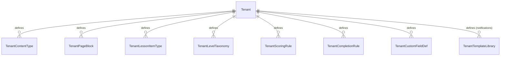

# Tenant-Driven Customization Model

**Derives from:** [ADR-0018](../decisions/0018-tenant-driven-customization-model.md)
(supersedes ADR-0011).

LearnStack core is 100% domain-agnostic. Tenants build their own education platforms —
yoga, coding, music, language, exam prep, art, professional certification, anything —
without LearnStack writing per-vertical code. The mechanism is **data-driven
customization**: tenants declare content types, page blocks, lesson item types, scoring
rules, level taxonomies, completion rules, and custom field definitions as **rows in the
tenant's database**.

This document is the conceptual deep dive for ADR-0018: what gets stored, how renderers
compose primitives, how customization is versioned, and what cannot be customized.

## 1. Customization surfaces

Eight tenant-database tables drive customization:



| Table | What it customizes | Schema shape |
|-------|--------------------|--------------|
| `tenant_content_types` | Content entry schemas (vocabulary cards, asana poses, code challenges, …) | JSON Schema for field definitions |
| `tenant_page_blocks` | Page block schemas (hero, gallery, course list, custom) | JSON Schema + composite renderer key |
| `tenant_lesson_item_types` | Lesson item schemas (text + media + quiz + custom) | JSON Schema + player composite key |
| `tenant_level_taxonomies` | Level/grade/tier flat lists (CEFR, difficulty, kyu/dan, …) | List of items with metadata |
| `tenant_scoring_rules` | Assessment scoring expressions | Sandboxed expression DSL |
| `tenant_completion_rules` | Lesson / module / course completion logic | Boolean expression DSL |
| `tenant_custom_field_defs` | Extra fields on built-in entities (User, Course, Enrollment) | JSON Schema |
| `tenant_template_library` | Notification templates (email, SMS, WhatsApp, in-app) | Liquid / Handlebars |

All eight tables are tenant-owned with RLS isolation (ADR-0003); some are also
organization-scoped where it makes sense.

## 2. Generic primitive renderers

The frontend ships a **fixed, closed set** of primitive renderers:

```typescript
// apps/web/src/shared/components/primitives/
const PRIMITIVE_RENDERERS = {
  text:        TextPrimitive,
  markdown:    MarkdownPrimitive,
  image:       ImagePrimitive,
  video:       VideoPrimitive,
  audio:       AudioPrimitive,
  pdf:         PdfPrimitive,
  code:        CodePrimitive,
  math:        MathPrimitive,         // LaTeX / MathML
  link:        LinkPrimitive,
  list:        ListPrimitive,
  tabs:        TabsPrimitive,
  embed_html:  SanitizedHtmlPrimitive,   // DOMPurify with allow-list
  badge:       BadgePrimitive,
  divider:     DividerPrimitive,
  spacer:      SpacerPrimitive,
} as const;
```

These map 1:1 to JSON Schema `type` + `format` combinations:

| JSON Schema | Primitive |
|-------------|-----------|
| `{ type: "string" }` | `text` |
| `{ type: "string", format: "markdown" }` | `markdown` |
| `{ type: "string", format: "uri", x-renderer: "image" }` | `image` |
| `{ type: "string", format: "uri", x-renderer: "video" }` | `video` |
| `{ type: "string", format: "uri", x-renderer: "audio" }` | `audio` |
| `{ type: "string", format: "uri", x-renderer: "pdf" }` | `pdf` |
| `{ type: "string", format: "code", x-language: "python" }` | `code` |
| `{ type: "string", format: "tex" }` | `math` |
| `{ type: "string", format: "uri" }` | `link` (fallback) |
| `{ type: "array" }` | `list` |
| `{ type: "object", x-renderer: "tabs" }` | `tabs` |
| `{ type: "string", format: "html" }` | `embed_html` (sanitised) |

**Composite renderers** sit atop primitives:

```typescript
const COMPOSITE_RENDERERS = {
  'default-card':    DefaultCardRenderer,      // image + title + description
  'content-list':    ContentListRenderer,      // grid / carousel / list of items
  'media-gallery':   MediaGalleryRenderer,
  'rich-page':       RichPageRenderer,
  'lesson-shell':    LessonShellRenderer,      // standard lesson play UI
  'quiz-shell':      QuizShellRenderer,
  'placement-shell': PlacementShellRenderer,
  'live-shell':      LiveShellRenderer,
  // ... small, fixed list
} as const;
```

Adding a new primitive or composite renderer is a LearnStack release (CODEOWNERS rule on
this folder). Tenants compose existing primitives — they cannot bring custom JSX.

## 3. Worked example: three tenants, same modules

### Example A — English learning platform

`tenant_content_types`:

```json
{
  "key": "vocabulary-card",
  "display_name": "Vocabulary Card",
  "schema_version": 1,
  "json_schema": {
    "type": "object",
    "required": ["word", "definition"],
    "properties": {
      "word":             { "type": "string", "minLength": 1, "maxLength": 100 },
      "pronunciation":    { "type": "string" },
      "definition":       { "type": "string", "format": "markdown" },
      "example_sentences":{ "type": "array", "items": { "type": "string" }, "maxItems": 5 },
      "audio_url":        { "type": "string", "format": "uri", "x-renderer": "audio" },
      "image_url":        { "type": "string", "format": "uri", "x-renderer": "image" },
      "level":            { "type": "string", "x-taxonomy": "cefr" }
    }
  },
  "renderer_key": "default-card"
}
```

`tenant_level_taxonomies` for `cefr`:

```json
{
  "key": "cefr",
  "display_name": "Common European Framework",
  "items": [
    { "key": "A1", "display_name": "Beginner",     "sort": 1, "metadata": { "color": "#e74c3c" } },
    { "key": "A2", "display_name": "Elementary",   "sort": 2, "metadata": { "color": "#e67e22" } },
    { "key": "B1", "display_name": "Intermediate", "sort": 3, "metadata": { "color": "#f39c12" } },
    { "key": "B2", "display_name": "Upper-Int.",   "sort": 4, "metadata": { "color": "#27ae60" } },
    { "key": "C1", "display_name": "Advanced",     "sort": 5, "metadata": { "color": "#2980b9" } },
    { "key": "C2", "display_name": "Mastery",      "sort": 6, "metadata": { "color": "#8e44ad" } }
  ]
}
```

`tenant_scoring_rules` for CEFR placement test:

```yaml
key: cefr-placement-v1
display_name: CEFR Placement Test Scoring
schema_version: 1
rules:
  - condition: "section.id == 'grammar' && score < 50"
    band_contribution: A1
    weight: 1.0
  - condition: "section.id == 'grammar' && score >= 50 && score < 70"
    band_contribution: A2
    weight: 1.0
  # ...
aggregation: weighted_majority
output_taxonomy: cefr
output_format: { type: "string", enum: ["A1","A2","B1","B2","C1","C2"] }
```

### Example B — Yoga studio platform

`tenant_content_types`:

```json
{
  "key": "asana-pose",
  "display_name": "Asana Pose",
  "schema_version": 1,
  "json_schema": {
    "type": "object",
    "required": ["english_name", "sanskrit_name"],
    "properties": {
      "english_name":   { "type": "string", "minLength": 1, "maxLength": 100 },
      "sanskrit_name":  { "type": "string", "minLength": 1, "maxLength": 100 },
      "transliteration":{ "type": "string" },
      "image_urls":     { "type": "array", "items": { "type": "string", "format": "uri", "x-renderer": "image" } },
      "instruction_video_url": { "type": "string", "format": "uri", "x-renderer": "video" },
      "difficulty":     { "type": "string", "x-taxonomy": "yoga-difficulty" },
      "benefits":       { "type": "array", "items": { "type": "string" } },
      "contraindications": { "type": "array", "items": { "type": "string" } },
      "category":       { "type": "string", "enum": ["standing", "seated", "supine", "prone", "balance", "inversion", "twist", "backbend"] },
      "hold_duration_seconds": { "type": "integer", "minimum": 5, "maximum": 600 }
    }
  },
  "renderer_key": "default-card"
}
```

`tenant_lesson_item_types` for `guided-sequence`:

```json
{
  "key": "guided-sequence",
  "display_name": "Guided Sequence",
  "schema_version": 1,
  "json_schema": {
    "type": "object",
    "properties": {
      "poses":      { "type": "array", "items": { "$ref": "#/$defs/pose-ref" } },
      "intro_audio_url":  { "type": "string", "format": "uri", "x-renderer": "audio" },
      "music_url":        { "type": "string", "format": "uri", "x-renderer": "audio" },
      "transition_seconds": { "type": "integer", "minimum": 1, "maximum": 30 }
    },
    "$defs": {
      "pose-ref": {
        "type": "object",
        "properties": {
          "content_type": { "const": "asana-pose" },
          "content_id":   { "type": "string", "format": "uuid" },
          "duration_seconds": { "type": "integer" },
          "instruction_override": { "type": "string" }
        }
      }
    }
  },
  "player_key": "lesson-shell"
}
```

Same modules. Different data.

### Example C — Coding bootcamp

`tenant_content_types`:

```json
{
  "key": "code-challenge",
  "display_name": "Code Challenge",
  "schema_version": 1,
  "json_schema": {
    "type": "object",
    "required": ["title", "language", "starter_code", "test_suite"],
    "properties": {
      "title":          { "type": "string" },
      "description":    { "type": "string", "format": "markdown" },
      "language":       { "type": "string", "enum": ["python", "javascript", "typescript", "go", "rust", "csharp"] },
      "starter_code":   { "type": "string", "format": "code", "x-language": "{language}" },
      "test_suite":     { "type": "string", "format": "code", "x-language": "{language}" },
      "expected_complexity": { "type": "string" },
      "hints":          { "type": "array", "items": { "type": "string", "format": "markdown" } },
      "difficulty":     { "type": "string", "x-taxonomy": "coding-difficulty" }
    }
  },
  "renderer_key": "code-challenge-shell"
}
```

Note: `code-challenge-shell` is a **composite renderer** that LearnStack ships (since
running test suites server-side is a paid LearnStack feature, gated by
`FeatureKeys.CodeChallengeRunner`). The composite is generic — it works for any language
declared in the schema; the tenant doesn't bring custom JSX.

## 4. Schema versioning

Every customization record carries `schema_version`. When a tenant edits a content type
in a backward-incompatible way (e.g. removes a required field), they publish a new
version:

```
tenant_content_types
  ├── (id=ct-vocab-01, key=vocabulary-card, schema_version=1, json_schema={...})  ← deprecated
  └── (id=ct-vocab-02, key=vocabulary-card, schema_version=2, json_schema={...})  ← active
```

Backward-compatible changes (adding optional fields, widening enums) increment the
revision suffix (`schema_revision: 1.1`); breaking changes increment the major
(`schema_version: 2`).

Existing content entries pin their `schema_version` at creation. Renderer maps each
entry to its own schema version's renderer. ADR-0013 (Page Block Schema Versioning)
sets the rule for page blocks; this document extends it to all customization surfaces.

## 5. Custom fields on built-in entities

A subset of built-in entities (`User`, `Course`, `Enrollment`, `LiveSession`, `Lesson`)
accept tenant-defined custom fields:

```sql
CREATE TABLE tenant_custom_field_defs (
    id              uuid PRIMARY KEY,
    tenant_id       uuid NOT NULL,
    target_entity   text NOT NULL,    -- "User", "Course", "Enrollment", etc.
    key             text NOT NULL,    -- e.g. "preferred_practice_time"
    display_name    text NOT NULL,
    json_schema     jsonb NOT NULL,   -- field definition
    is_required     boolean NOT NULL DEFAULT false,
    sort            int NOT NULL DEFAULT 0,
    created_at      timestamptz NOT NULL DEFAULT now(),
    UNIQUE (tenant_id, target_entity, key)
);
```

Values stored on the entity as a JSONB column:

```sql
ALTER TABLE users ADD COLUMN custom_fields jsonb NOT NULL DEFAULT '{}';
ALTER TABLE courses ADD COLUMN custom_fields jsonb NOT NULL DEFAULT '{}';
-- etc.
```

Query helpers:

```csharp
public static class CustomFieldExtensions
{
    public static T? GetCustomField<T>(this User user, string key)
        => user.CustomFields.TryGetProperty(key, out var v) ? v.Deserialize<T>() : default;

    public static void SetCustomField<T>(this User user, string key, T value)
        => user.CustomFields = JsonExtensions.Set(user.CustomFields, key, value);
}
```

Custom fields are rendered in the same primitive-composing way: the field's `json_schema`
maps to a primitive, the entity's Admin Studio detail page composes a form, the entity's
display surfaces render the values.

## 6. Scoring rule DSL (sandboxed)

`tenant_scoring_rules.rules` carries expressions that evaluate against an assessment
attempt's data. The expressions are **sandboxed**: no I/O, no arbitrary function calls,
no infinite loops, bounded execution time.

Candidate sandbox engines (ADR pending, due before Phase 08a):

- **CEL (Common Expression Language)** — Google's expression language; widely deployed
  (Kubernetes, Envoy, IAM); has a .NET port (`cel-dotnet`).
- **Restricted Lua** — embeddable, fast; NLua port; requires custom sandbox setup.
- **Custom YAML rule engine** — declarative-only (no expressions, just `match` clauses);
  simplest to sandbox but least expressive.

Decision deferred to ADR-XXXX; the rule SHAPE is settled — every rule is a
`{ condition, weight, band_contribution }` triple with `aggregation` strategy
(`weighted_majority`, `weighted_sum`, `threshold`) and `output_format`.

## 7. Completion rule DSL (boolean expressions)

`tenant_completion_rules` decides when a lesson / module / course is complete:

```yaml
key: lesson-complete-default
scope: lesson
expression: |
  all_items_viewed && (
    has_quiz ? quiz_score >= passing_threshold : true
  )
```

Same sandbox engine as scoring rules (decision pending).

## 8. What cannot be customized

LearnStack core owns:

- **Aggregate lifecycle** — `Course → CourseVersion → Module → Lesson → LessonItem`
  hierarchy. Tenant can't redefine that an enrollment binds to a `CourseVersion`.
- **Auth flow** — Keycloak realm structure, JWT shape, MFA enforcement.
- **Storage layout** — SeaweedFS bucket prefix `tenants/{tenant_id}/organizations/{org_id}/...`.
- **Outbox / event-bus contract** — integration event shapes are LearnStack-defined.
- **Primitive set** — adding `whiteboard` or `3d-model` primitive is a LearnStack release.
- **Audit pipeline** — modules cannot opt out of audit; per-(module, operation) toggling
  is per-tenant data, but the pipeline is mandatory.
- **Built-in scoring sandbox capabilities** — when the sandbox lands, its operators are
  closed (no `eval`, no HTTP, no file I/O).
- **Tenant isolation** — RLS / EF filters / architecture tests are not bypassable.

## 9. Admin Studio surface

A tenant admin defines customization data via Admin Studio screens:

```
Admin Studio
├── Content
│   ├── Content Types        ← list, create, edit, version
│   ├── Custom Fields        ← per entity
│   └── Templates            ← starter packs (from marketplace, Phase 12)
├── Page Builder
│   ├── Page Blocks          ← list, create, edit, version
│   └── Page Composer        ← drag-drop / picker for instance composition
├── Catalog
│   ├── Courses              ← CRUD
│   ├── Lesson Item Types    ← list, create, edit, version
│   └── Completion Rules     ← per scope (lesson/module/course)
├── Assessment
│   ├── Question Banks
│   ├── Assessments
│   ├── Scoring Rules        ← list, create, edit, version
│   └── Level Taxonomies     ← list, create, edit
├── Notifications
│   └── Templates            ← Liquid / Handlebars editor
└── Settings
    ├── Branding             ← logo, colours, typography, custom CSS (plan-gated)
    ├── Custom Domain        ← submit, verify, list, revoke (plan-gated, ADR-0022)
    └── Compliance           ← view-only summary of operator-set caps (ADR-0019)
```

Phase 06+ ships visual schema editors; Phase 04-05 ships JSON form editors first.

## 10. Hard architectural invariants

Architecture tests enforce:

1. **No domain-specific names in LearnStack modules.** `Cefr`, `Asana`, `CodeChallenge`,
   `English*`, `Yoga*`, `Coding*` — none appear in any LearnStack module type / namespace
   / file. Static analyser fails the build on violation.
2. **No `LearnStack.Verticals.*` source folder.** Architecture test asserts the folder
   doesn't exist.
3. **Primitive renderer set is closed.** Adding to `PRIMITIVE_RENDERERS` requires
   CODEOWNERS approval (LearnStack team only).
4. **Composite renderer set is closed.** Same as primitives.
5. **`tenant_*` customization tables have RLS.** Migration scan asserts the policy is
   present on every customization table.
6. **`tenant_*` customization keys are scoped to tenant.** `UNIQUE (tenant_id, key)` on
   every customization table.
7. **Scoring rule + completion rule expressions evaluate inside the sandbox.** Integration
   test asserts that an expression attempting to call `System.IO.File.ReadAllText` (or
   equivalent) is rejected at evaluation time.

## 11. Phasing

| Phase | Deliverable |
|-------|-------------|
| 02 | Customization tables created (empty); primitive renderer set scaffolded; `IModule.RegisterCustomizationSurface` interface for default seeds. |
| 04 | CMS / Page Builder: page blocks as data; first composite renderers; JSON form editor for content types. |
| 05 | Catalog / Learning Content: lesson item types as data; lesson player composites. |
| 06 | Admin Studio polish: visual schema editor (drag-and-drop field builder); preview pane. |
| 08a | Assessment: scoring rule DSL + sandbox; level taxonomies; completion rules. |
| 12 (opt) | Content template marketplace: pre-built JSON Schema + scoring rule + level taxonomy bundles tenants can install with one click (data sharing only, no code). |

## References

- ADR-0018 — Tenant-Driven Customization Model (supersedes ADR-0011).
- ADR-0013 — Page Block Schema Versioning.
- ADR-0017 — Tenant + Organization Hierarchy (custom fields can be org-scoped or
  tenant-wide).
- ADR-0021 — Feature-Based Entitlement (some customization surfaces gated by plan tier).
- [06-extension-model.md](06-extension-model.md) — rewritten to reflect this document.
- [02-domain-model.md](02-domain-model.md) — customization aggregates added.
