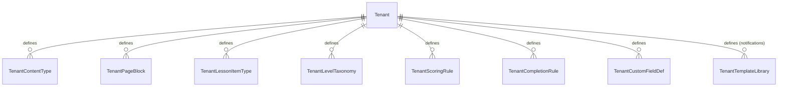

# Tenant-Driven Customization Model

**Derives from:** [ADR-0018](../decisions/0018-tenant-driven-customization-model.md)
(supersedes ADR-0011).

LearnStack core is 100% domain-agnostic. Tenants build their own education platforms —
yoga, coding, music, language, exam prep, art, professional certification, anything —
without LearnStack writing per-vertical code. The mechanism is **data-driven
customization**: tenants declare content types, page blocks, lesson item types, scoring
rules, level taxonomies, completion rules, and custom field definitions as **rows in the
tenant's database**.

This document is the conceptual deep dive for ADR-0018: what gets stored, how renderers
compose primitives, how customization is versioned, and what cannot be customized.

## 1. Customization surfaces

Eight tenant-database tables drive customization:



| Table | What it customizes | Schema shape |
|-------|--------------------|--------------|
| `tenant_content_types` | Content entry schemas (vocabulary cards, asana poses, code challenges, …) | JSON Schema for field definitions |
| `tenant_page_blocks` | Page block schemas (hero, gallery, course list, custom) | JSON Schema + composite renderer key |
| `tenant_lesson_item_types` | Lesson item schemas (text + media + quiz + custom) | JSON Schema + player composite key |
| `tenant_level_taxonomies` | Level/grade/tier flat lists (CEFR, difficulty, kyu/dan, …) | List of items with metadata |
| `tenant_scoring_rules` | Assessment scoring expressions | Sandboxed expression DSL |
| `tenant_completion_rules` | Lesson / module / course completion logic | Boolean expression DSL |
| `tenant_custom_field_defs` | Extra fields on built-in entities (User, Course, Enrollment) | JSON Schema |
| `tenant_template_library` | Notification templates (email, SMS, WhatsApp, in-app) | Liquid / Handlebars |

All eight tables are tenant-owned with RLS isolation (ADR-0003); some are also
organization-scoped where it makes sense.

## 2. Generic primitive renderers

The frontend ships a **fixed, closed set** of primitive renderers:

```typescript
// apps/web/src/shared/components/primitives/
const PRIMITIVE_RENDERERS = {
  text:        TextPrimitive,
  markdown:    MarkdownPrimitive,
  image:       ImagePrimitive,
  video:       VideoPrimitive,
  audio:       AudioPrimitive,
  pdf:         PdfPrimitive,
  code:        CodePrimitive,
  math:        MathPrimitive,         // LaTeX / MathML
  link:        LinkPrimitive,
  list:        ListPrimitive,
  tabs:        TabsPrimitive,
  embed_html:  SanitizedHtmlPrimitive,   // DOMPurify with allow-list
  badge:       BadgePrimitive,
  divider:     DividerPrimitive,
  spacer:      SpacerPrimitive,
} as const;
```

These map 1:1 to JSON Schema `type` + `format` combinations:

| JSON Schema | Primitive |
|-------------|-----------|
| `{ type: "string" }` | `text` |
| `{ type: "string", format: "markdown" }` | `markdown` |
| `{ type: "string", format: "uri", x-renderer: "image" }` | `image` |
| `{ type: "string", format: "uri", x-renderer: "video" }` | `video` |
| `{ type: "string", format: "uri", x-renderer: "audio" }` | `audio` |
| `{ type: "string", format: "uri", x-renderer: "pdf" }` | `pdf` |
| `{ type: "string", format: "code", x-language: "python" }` | `code` |
| `{ type: "string", format: "tex" }` | `math` |
| `{ type: "string", format: "uri" }` | `link` (fallback) |
| `{ type: "array" }` | `list` |
| `{ type: "object", x-renderer: "tabs" }` | `tabs` |
| `{ type: "string", format: "html" }` | `embed_html` (sanitised) |

**Composite renderers** sit atop primitives:

```typescript
const COMPOSITE_RENDERERS = {
  'default-card':     DefaultCardRenderer,      // image + title + description
  'content-list':     ContentListRenderer,      // grid / carousel / list of items
  'media-gallery':    MediaGalleryRenderer,
  'rich-page':        RichPageRenderer,
  'lesson-shell':     LessonShellRenderer,      // standard lesson play UI
  'quiz-shell':       QuizShellRenderer,
  'placement-shell':  PlacementShellRenderer,
  'live-shell':       LiveShellRenderer,
  'submission-shell': SubmissionShellRenderer,  // prompt + authoring surface + submit + result
  // ... small, fixed list
} as const;
```

Adding a new primitive or composite renderer is a LearnStack release (CODEOWNERS rule on
this folder). Tenants compose existing primitives — they cannot bring custom JSX.

**Every key in both registries is named for a capability, never for a domain.** A
`cefr-level-badge` or `asana-card` key would fail
`Core_Modules_HaveNo_DomainSpecific_Names`. When a tenant needs a domain-flavoured
presentation, it declares a `TenantPageBlock` row pointing at a generic composite — the
domain lives in the row's display name and its schema, not in the registry.

## 3. Worked example: three tenants, same modules

### Example A — English learning platform

`tenant_content_types`:

```json
{
  "key": "vocabulary-card",
  "display_name": "Vocabulary Card",
  "schema_version": 1,
  "json_schema": {
    "type": "object",
    "required": ["word", "definition"],
    "properties": {
      "word":             { "type": "string", "minLength": 1, "maxLength": 100 },
      "pronunciation":    { "type": "string" },
      "definition":       { "type": "string", "format": "markdown" },
      "example_sentences":{ "type": "array", "items": { "type": "string" }, "maxItems": 5 },
      "audio_url":        { "type": "string", "format": "uri", "x-renderer": "audio" },
      "image_url":        { "type": "string", "format": "uri", "x-renderer": "image" },
      "level":            { "type": "string", "x-taxonomy": "cefr" }
    }
  },
  "renderer_key": "default-card"
}
```

`tenant_level_taxonomies` for `cefr`:

```json
{
  "key": "cefr",
  "display_name": "Common European Framework",
  "items": [
    { "key": "A1", "display_name": "Beginner",     "sort": 1, "metadata": { "color": "#e74c3c" } },
    { "key": "A2", "display_name": "Elementary",   "sort": 2, "metadata": { "color": "#e67e22" } },
    { "key": "B1", "display_name": "Intermediate", "sort": 3, "metadata": { "color": "#f39c12" } },
    { "key": "B2", "display_name": "Upper-Int.",   "sort": 4, "metadata": { "color": "#27ae60" } },
    { "key": "C1", "display_name": "Advanced",     "sort": 5, "metadata": { "color": "#2980b9" } },
    { "key": "C2", "display_name": "Mastery",      "sort": 6, "metadata": { "color": "#8e44ad" } }
  ]
}
```

`tenant_scoring_rules` for CEFR placement test:

```yaml
key: cefr-placement-v1
display_name: CEFR Placement Test Scoring
schema_version: 1
rules:
  - condition: "section.id == 'grammar' && score < 50"
    band_contribution: A1
    weight: 1.0
  - condition: "section.id == 'grammar' && score >= 50 && score < 70"
    band_contribution: A2
    weight: 1.0
  # ...
aggregation: weighted_majority
output_taxonomy: cefr
output_format: { type: "string", enum: ["A1","A2","B1","B2","C1","C2"] }
```

### Example B — Yoga studio platform

`tenant_content_types`:

```json
{
  "key": "asana-pose",
  "display_name": "Asana Pose",
  "schema_version": 1,
  "json_schema": {
    "type": "object",
    "required": ["english_name", "sanskrit_name"],
    "properties": {
      "english_name":   { "type": "string", "minLength": 1, "maxLength": 100 },
      "sanskrit_name":  { "type": "string", "minLength": 1, "maxLength": 100 },
      "transliteration":{ "type": "string" },
      "image_urls":     { "type": "array", "items": { "type": "string", "format": "uri", "x-renderer": "image" } },
      "instruction_video_url": { "type": "string", "format": "uri", "x-renderer": "video" },
      "difficulty":     { "type": "string", "x-taxonomy": "yoga-difficulty" },
      "benefits":       { "type": "array", "items": { "type": "string" } },
      "contraindications": { "type": "array", "items": { "type": "string" } },
      "category":       { "type": "string", "enum": ["standing", "seated", "supine", "prone", "balance", "inversion", "twist", "backbend"] },
      "hold_duration_seconds": { "type": "integer", "minimum": 5, "maximum": 600 }
    }
  },
  "renderer_key": "default-card"
}
```

`tenant_lesson_item_types` for `guided-sequence`:

```json
{
  "key": "guided-sequence",
  "display_name": "Guided Sequence",
  "schema_version": 1,
  "json_schema": {
    "type": "object",
    "properties": {
      "poses":      { "type": "array", "items": { "$ref": "#/$defs/pose-ref" } },
      "intro_audio_url":  { "type": "string", "format": "uri", "x-renderer": "audio" },
      "music_url":        { "type": "string", "format": "uri", "x-renderer": "audio" },
      "transition_seconds": { "type": "integer", "minimum": 1, "maximum": 30 }
    },
    "$defs": {
      "pose-ref": {
        "type": "object",
        "properties": {
          "content_type": { "const": "asana-pose" },
          "content_id":   { "type": "string", "format": "uuid" },
          "duration_seconds": { "type": "integer" },
          "instruction_override": { "type": "string" }
        }
      }
    }
  },
  "player_key": "lesson-shell"
}
```

Same modules. Different data.

### Example C — Coding bootcamp

`tenant_content_types`:

```json
{
  "key": "code-challenge",
  "display_name": "Code Challenge",
  "schema_version": 1,
  "json_schema": {
    "type": "object",
    "required": ["title", "language", "starter_code", "test_suite"],
    "properties": {
      "title":          { "type": "string" },
      "description":    { "type": "string", "format": "markdown" },
      "language":       { "type": "string", "enum": ["python", "javascript", "typescript", "go", "rust", "csharp"] },
      "starter_code":   { "type": "string", "format": "code", "x-language": "{language}" },
      "test_suite":     { "type": "string", "format": "code", "x-language": "{language}" },
      "expected_complexity": { "type": "string" },
      "hints":          { "type": "array", "items": { "type": "string", "format": "markdown" } },
      "difficulty":     { "type": "string", "x-taxonomy": "coding-difficulty" }
    }
  },
  "renderer_key": "submission-shell"
}
```

**Two naming rules meet in this example, and they point in opposite directions.**

The content type's `key` is `code-challenge`. That is fine: it is a **row in the tenant's
database**, authored by the tenant, and it may name its domain as specifically as the
tenant likes. `vocabulary-card`, `asana-pose`, `code-challenge` and `breath-technique`
are all legitimate tenant data.

The renderer key and the feature key are **code**, and code may not name a domain. Both
were previously named for the first tenant that asked for them:

| Was | Is | Why |
|---|---|---|
| `code-challenge-shell` (composite renderer) | **`submission-shell`** | The capability is "prompt + authoring surface + submit + evaluated result panel". It serves a code exercise, a pronunciation recording, an essay, and a portfolio upload equally |
| `FeatureKeys.CodeChallengeRunner` | **`FeatureKeys.SandboxedEvaluation`** (`assessment.sandboxed_evaluation`) | The capability is "evaluate a learner's submitted artefact in a sandbox with a resource budget". Nothing about it is specific to code |

The rule is not stylistic. `Core_Modules_HaveNo_DomainSpecific_Names` enforces it
mechanically from
[Phase 02a Packet 10](../roadmap/phase-02a-kernel-tenancy.md) — a module type, namespace
or registry key matching `Cefr`, `Asana`, `CodeChallenge`, `English*`, `Yoga*` fails the
build. The old names would have failed it.

`submission-shell` is also where this document meets the **genericity boundary**. The
renderer is presentation and therefore inside the boundary; the *evaluation* it triggers
is external capability invocation and therefore outside it. Running a learner's submitted
program needs a sandbox, a runtime, a resource budget and a security boundary that
survives hostile input — none of which a JSON Schema or a rule DSL can declare. It is a
**platform feature gated by plan**, written by LearnStack, not a customization row. See
[ADR-0018 Amendment (2026-08-08)](../decisions/0018-tenant-driven-customization-model.md)
and [Platform Vision § Genericity boundary](01-platform-vision.md).

## 4. Schema versioning

Every customization record carries `schema_version`. When a tenant edits a content type
in a backward-incompatible way (e.g. removes a required field), they publish a new
version:

```
tenant_content_types
  ├── (id=ct-vocab-01, key=vocabulary-card, schema_version=1, json_schema={...})  ← deprecated
  └── (id=ct-vocab-02, key=vocabulary-card, schema_version=2, json_schema={...})  ← active
```

Backward-compatible changes (adding optional fields, widening enums) increment the
revision suffix (`schema_revision: 1.1`); breaking changes increment the major
(`schema_version: 2`).

Existing content entries pin their `schema_version` at creation. Renderer maps each
entry to its own schema version's renderer. ADR-0013 (Page Block Schema Versioning)
sets the rule for page blocks; this document extends it to all customization surfaces.

## 5. Custom fields on built-in entities

Tenant-defined custom fields attach to **tenant-owned** entities: `Membership`,
`Course`, `Enrollment`, `LiveSession`, `Lesson`. `target_entity = "User"` resolves to
`membership_profiles` — never to `users`, which is global, carries no `tenant_id`, and
therefore has no query filter and no Row Level Security policy. A tenant-authored
column on a global table is a cross-tenant read by construction
([Phase 03 § Tenant Data Ownership](../roadmap/phase-03-identity-admin.md)).

```sql
CREATE TABLE tenant_custom_field_defs (
    id              uuid PRIMARY KEY,
    tenant_id       uuid NOT NULL,
    target_entity   text NOT NULL,    -- "Membership", "Course", "Enrollment", …; never "User"
    pii_category    text NOT NULL,    -- PII-Identity | PII-Behaviour | PII-Sensitive | None; no default, see Phase 03
    key             text NOT NULL,    -- e.g. "preferred_practice_time"
    display_name    text NOT NULL,
    json_schema     jsonb NOT NULL,   -- field definition
    is_required     boolean NOT NULL DEFAULT false,
    sort            int NOT NULL DEFAULT 0,
    created_at      timestamptz NOT NULL DEFAULT now(),
    UNIQUE (tenant_id, target_entity, key)
);
```

Values stored on the entity as a JSONB column:

```sql
-- Values live on the tenant-owned row, never on a global one.
ALTER TABLE membership_profiles ADD COLUMN custom_fields jsonb NOT NULL DEFAULT '{}';
ALTER TABLE courses             ADD COLUMN custom_fields jsonb NOT NULL DEFAULT '{}';
-- Every table above is [TenantOwned] and carries the canonical RLS policy from
-- Database Standards; `users` is not in this list and never will be.
-- etc.
```

Query helpers:

```csharp
public static class CustomFieldExtensions
{
    public static T? GetCustomField<T>(this User user, string key)
        => user.CustomFields.TryGetProperty(key, out var v) ? v.Deserialize<T>() : default;

    public static void SetCustomField<T>(this User user, string key, T value)
        => user.CustomFields = JsonExtensions.Set(user.CustomFields, key, value);
}
```

Custom fields are rendered in the same primitive-composing way: the field's `json_schema`
maps to a primitive, the entity's Admin Studio detail page composes a form, the entity's
display surfaces render the values.

## 6. Scoring rule DSL (sandboxed)

`tenant_scoring_rules.rules` carries expressions that evaluate against an assessment
attempt's data. The expressions are **sandboxed**: no I/O, no arbitrary function calls,
no infinite loops, bounded execution time.

Candidate sandbox engines (ADR pending, due before Phase 08a):

- **CEL (Common Expression Language)** — Google's expression language; widely deployed
  (Kubernetes, Envoy, IAM); has a .NET port (`cel-dotnet`).
- **Restricted Lua** — embeddable, fast; NLua port; requires custom sandbox setup.
- **Custom YAML rule engine** — declarative-only (no expressions, just `match` clauses);
  simplest to sandbox but least expressive.

Decision deferred to ADR-XXXX; the rule SHAPE is settled — every rule is a
`{ condition, weight, band_contribution }` triple with `aggregation` strategy
(`weighted_majority`, `weighted_sum`, `threshold`) and `output_format`.

## 7. Completion rule DSL (boolean expressions)

`tenant_completion_rules` decides when a lesson / module / course is complete:

```yaml
key: lesson-complete-default
scope: lesson
expression: |
  all_items_viewed && (
    has_quiz ? quiz_score >= passing_threshold : true
  )
```

Same sandbox engine as scoring rules (decision pending).

## 8. Runtime cost model

Everything above describes what a tenant *can* declare. This section describes what it
*costs* to serve, because a customization model without a cost model is an invitation to
declare something the runtime cannot render inside a request budget. Every limit here is
enforced at write time, so a tenant learns about it while authoring rather than a learner
discovering it on a page load.

### 8.1 Validation timing — write time, not read time

| Validation | When | Failure mode |
|---|---|---|
| The `json_schema` is itself a valid JSON Schema (draft 2020-12), and every `x-renderer` / `x-taxonomy` / `x-language` extension resolves to a registry entry | **On saving the content type / block / lesson item type** | 400 with Problem Details naming the offending JSON pointer |
| A content entry conforms to its content type's schema at its pinned `schema_version` | **On saving the entry** | 400; the entry is not persisted |
| The declared limits in § 8.3 | **On saving the schema** | 400 |
| Renderer resolution: does `renderer_key` exist in `COMPOSITE_RENDERERS`? | **On saving**, again on **server render** as a cheap dictionary lookup | Save is rejected; a stale reference renders a fallback block plus a logged warning, never an exception |

**Nothing is schema-validated on the read path.** A published content entry has already
been validated against its pinned schema version, and re-validating it on every page load
would put a JSON Schema evaluation in the hot path of anonymous traffic for a result that
cannot have changed. The consequence is stated plainly: **the schema is a write-time
contract, and the read path trusts the database.** Anything that can write a content-entry
row without going through the validating command path — a manual `INSERT`, a bad
migration, a future bulk importer — breaks that trust for every subsequent read. Bulk
import therefore goes through the same validator, at
[Phase 04](../roadmap/phase-04-cms-media-pages.md).

The one read-time check is **structural, not semantic**: the renderer walks the entry's
JSON against the schema's field list and skips unknown fields. That is an O(fields) pass,
not a validation.

### 8.2 Cache strategy

Customization definitions are read on nearly every request and written a handful of times
per tenant per month. That ratio is the whole design.

| What | Layer | Key | TTL | Invalidated by |
|---|---|---|---|---|
| `TenantContentType` set for a tenant | L1 + L2 | `cust:{tenant_id}:content-types:{generation}` | L1 60s, L2 15 min | Generation bump |
| `TenantLevelTaxonomy` by key | L1 + L2 | `cust:{tenant_id}:taxonomy:{key}:{generation}` | same | Generation bump |
| `TenantPageBlock` set | L1 + L2 | `cust:{tenant_id}:blocks:{generation}` | same | Generation bump |
| Compiled JSON Schema validator | L1 only, per pod | `(tenant_id, content_type_key, schema_version)` | Process lifetime, bounded LRU | Immutable — a schema version never changes |

Two rules make this safe:

- **A generation counter, not prefix eviction.** Each tenant carries a
  `customization_generation` integer, bumped in the same transaction as any customization
  write. Cache keys embed it, so a write makes every stale key unreachable at once,
  across every pod, without enumerating keys. This is deliberate: the published
  `ICacheService.RemoveByPrefixAsync` contract cannot be honoured across instances by any
  candidate backend, and it is **removed** in
  [Phase 02a Packet 5](../roadmap/phase-02a-kernel-tenancy.md)
  ([ADR-0014 Amendment 2](../decisions/0014-adopt-dapr.md)). This pattern replaces it,
  and it is a convention here rather than a member of that interface — the counter is
  durable domain state, not a cache entry.
- **Compiled validators are cached separately from definitions**, keyed by an immutable
  `(key, schema_version)` tuple. Compiling a JSON Schema is the expensive part; because a
  published schema version is immutable ([§ 4](#4-schema-versioning)), the compiled form
  never needs invalidating — it only needs bounding, hence the LRU.

Cache misses cost one indexed query per tenant per definition set. A cold pod serving its
first request for a tenant performs at most four such queries, not one per entry.

### 8.3 The N+1 problem, and the limits that bound it

The guided-sequence example in [§ 3](#3-worked-example-three-tenants-same-modules) is a
textbook N+1 and it is worth being explicit about, because it is the shape tenants will
naturally author:

```json
"poses": { "type": "array", "items": { "$ref": "#/$defs/pose-ref" } }
```

Each `pose-ref` carries `{ content_type: "asana-pose", content_id: "<uuid>" }`. A naive
renderer resolves each reference with its own query, so a 40-pose sequence issues 40
round trips — and a lesson page containing three such sequences issues 120. At 2 ms per
round trip that is a quarter-second of pure latency for a page that reads four rows'
worth of actual information.

**The resolution contract:**

1. The renderer **collects every reference in the whole payload first**, walking the
   entry's JSON once and gathering `(content_type, content_id)` pairs into a set.
2. It issues **one batched query per content type** — `WHERE tenant_id = @t AND
   content_type = @ct AND id = ANY(@ids)` — not one per reference. Duplicated references
   to the same entry cost nothing extra.
3. It hydrates the payload from the resulting dictionary.
4. References that do not resolve render a placeholder and emit a warning. A dangling
   reference is a data problem, never an exception on a public page.

Total cost for any entry: **one query per distinct referenced content type**, regardless
of reference count. Reference resolution is capped at **depth 2** — an entry may
reference entries, and those may not reference further. Deeper composition is a
[Phase 05](../roadmap/phase-05-education-learning-content.md) decision with its own
batching design, not something a tenant can reach by nesting `$ref`s.

The `Customization_Reference_Resolution_Is_Batched` integration test asserts the query
count for a 40-reference entry is a small constant, not 40. Without a test that counts
queries, this contract silently regresses the first time someone writes a convenient
`foreach`.

### 8.4 Declared limits

Every limit is checked at write time and returns Problem Details naming the limit that
was exceeded. They are deliberately generous — they exist to stop pathological documents,
not to constrain reasonable authoring.

| Limit | Value | Why this one |
|---|---|---|
| `$ref` / `$defs` nesting depth inside one schema | 5 | JSON Schema validators are recursive; unbounded depth is a stack-exhaustion vector on a tenant-authored document |
| Reference resolution depth (entry → entry) | 2 | Bounds the batched-query fan-out at § 8.3 to a fixed small number of round trips |
| Properties in one content type | 100 | Beyond this the authoring UI is unusable and the row is a schema smell |
| Array `maxItems` where the schema omits it | 200 (applied as a default, not a rejection) | An unbounded array in a JSONB column is an unbounded render loop |
| References in one content entry | 500 | Caps the `ANY(@ids)` parameter list and the hydration dictionary |
| Block instances on one page | 100 | Each instance is a render subtree; the page is a document, not an application |
| Serialised size of one content entry | 1 MB | PostgreSQL will happily TOAST more; the browser will not happily render it |
| Content types per tenant | Plan-gated via `FeatureKeys` / `LimitKeys` | Unlimited content types is a Growth+ feature ([ADR-0021](../decisions/0021-feature-based-entitlement.md)) |

A schema that violates a structural limit is rejected on save. An **existing** entry that
would violate a newly tightened limit still renders — limits are enforced forward, and a
tightening ships with the migration that reports which existing rows exceed it.

### 8.5 The `embed-html` sanitisation contract

`embed-html` is the one primitive that takes an **HTML sink authored by a lower-trust
actor** and puts it in the tenant's page. Everything else in the primitive set renders
structured data through React text nodes and is safe by construction. This one is not
safe by construction; it is safe by contract, and the contract has to be written down —
calling the primitive set "closed and safe" without stating it is precisely the gap that
lets a reviewer approve an unsanitised path.

**The threat model.** A tenant's content editor is not the tenant's security team. In a
multi-branch business, an organization-level editor at one studio can author an
`embed-html` block that renders on a page a learner from another organization loads. The
actor is semi-trusted, the audience is not the actor, and the two may sit in different
organizations of the same tenant.

**The contract:**

| Rule | Detail |
|---|---|
| Sanitise **on write and on render** | Write-time sanitisation gives the author immediate feedback and keeps the stored value clean. Render-time sanitisation is the one that actually protects the learner, because it is the only one that also covers rows written before the current allow-list |
| Allow-list, never block-list | Elements: structural and text markup plus `iframe` (see below). Attributes: `class`, `id`, `href`, `src`, `alt`, `title`, `width`, `height`, `colspan`, `rowspan`. Everything else is stripped |
| No script execution surface | `<script>`, `<style>`, `<object>`, `<embed>`, `<form>`, every `on*` handler attribute, and `javascript:` / `data:` / `vbscript:` URL schemes are stripped unconditionally |
| `iframe` is allow-listed **by host** | An empty allow-list by default. A tenant admin — not a content editor — adds permitted embed hosts in Admin Studio; a frame whose `src` host is not listed is dropped. This is what makes "embed a YouTube video" possible without making "embed anything" possible |
| Rendered `sandbox` on every surviving frame | `sandbox="allow-scripts allow-same-origin"` is **not** used together; a frame gets `allow-scripts` **or** `allow-same-origin`, never both, because the combination lets the framed document remove its own sandbox |
| Never `dangerouslySetInnerHTML` on unsanitised input | The primitive is the **only** component in `apps/web` permitted to call it, and it does so exclusively on the sanitiser's output. `Only_SanitizedHtmlPrimitive_Uses_DangerouslySetInnerHtml` enforces the rule as a lint |
| CSP is the backstop, not the mechanism | The page's Content-Security-Policy forbids inline script regardless. A sanitiser bug is then a rendering defect rather than a stored-XSS incident |
| Plan-gated and audited | Authoring an `embed-html` block is a `MUST`-class audit operation: it is a content-injection surface, and "who added this frame" is the first question in any incident |

The sanitiser's allow-list lives in one module with a CODEOWNERS rule, alongside the
primitive registry. Widening it is a LearnStack release and a security review, not a
configuration change.

## 9. What cannot be customized

LearnStack core owns:

- **Aggregate lifecycle** — `Course → CourseVersion → Module → Lesson → LessonItem`
  hierarchy. Tenant can't redefine that an enrollment binds to a `CourseVersion`.
- **Auth flow** — Keycloak realm structure, JWT shape, MFA enforcement.
- **Storage layout** — SeaweedFS bucket prefix `tenants/{tenant_id}/organizations/{org_id}/...`.
- **Outbox / event-bus contract** — integration event shapes are LearnStack-defined.
- **Primitive set** — adding `whiteboard` or `3d-model` primitive is a LearnStack release.
- **Audit pipeline** — modules cannot opt out of audit; per-(module, operation) toggling
  is per-tenant data, but the pipeline is mandatory.
- **Built-in scoring sandbox capabilities** — when the sandbox lands, its operators are
  closed (no `eval`, no HTTP, no file I/O).
- **Tenant isolation** — RLS / EF filters / architecture tests are not bypassable.

Two further categories sit outside the model for a reason worth stating rather than
discovering, per
[ADR-0018 Amendment (2026-08-08)](../decisions/0018-tenant-driven-customization-model.md):

- **Stateful entitlement** — a ten-session credit pack, a "three make-up classes per
  term" allowance, a per-learner session quota. These need a balance that is decremented,
  refunded, expired and reconstructible in a dispute. A JSON Schema declares a shape; it
  cannot declare a ledger.
- **External capability invocation** — running a learner's submitted program, scoring
  pronunciation from an audio clip, automated proctoring. These need a sandbox, a
  runtime, a resource budget and a security boundary that survives hostile input. A rule
  DSL evaluates; it does not execute arbitrary programs.

Both are **platform features written by LearnStack and gated by plan** — generically
named, offered to every tenant, never per-vertical code. A tenant needing either needs a
LearnStack release or a provider integration, not a customization row.

## 10. Admin Studio surface

A tenant admin defines customization data via Admin Studio screens:

```
Admin Studio
├── Content
│   ├── Content Types        ← list, create, edit, version
│   ├── Custom Fields        ← per entity
│   └── Templates            ← starter packs (from marketplace, Phase 12)
├── Page Builder
│   ├── Page Blocks          ← list, create, edit, version
│   └── Page Composer        ← drag-drop / picker for instance composition
├── Catalog
│   ├── Courses              ← CRUD
│   ├── Lesson Item Types    ← list, create, edit, version
│   └── Completion Rules     ← per scope (lesson/module/course)
├── Assessment
│   ├── Question Banks
│   ├── Assessments
│   ├── Scoring Rules        ← list, create, edit, version
│   └── Level Taxonomies     ← list, create, edit
├── Notifications
│   └── Templates            ← Liquid / Handlebars editor
└── Settings
    ├── Branding             ← logo, colours, typography, custom CSS (plan-gated)
    ├── Custom Domain        ← submit, verify, list, revoke (plan-gated, ADR-0022)
    └── Compliance           ← view-only summary of operator-set caps (ADR-0019)
```

[Phase 04](../roadmap/phase-04-cms-media-pages.md) and
[Phase 05](../roadmap/phase-05-education-learning-content.md) ship JSON form editors
first; [Phase 06](../roadmap/phase-06-renderer-admin-studio.md) replaces them with the
visual schema editor and preview pane. The screen tree above is the target; each row
arrives with the aggregate it edits, per [§ 12](#12-phasing).

## 11. Hard architectural invariants

Architecture tests enforce:

1. **No domain-specific names in LearnStack modules.** `Cefr`, `Asana`, `CodeChallenge`,
   `English*`, `Yoga*`, `Coding*` — none appear in any LearnStack module type, namespace,
   file, renderer key, or feature key. `Core_Modules_HaveNo_DomainSpecific_Names`
   enforces it from
   [Phase 02a Packet 10](../roadmap/phase-02a-kernel-tenancy.md); it is the mechanical
   guarantee behind the platform's entire premise, and the rename in
   [§ 3](#3-worked-example-three-tenants-same-modules) exists because the old names would
   have failed it.
2. **No `LearnStack.Verticals.*` source folder.** `No_Source_Folder_Named_Verticals`
   asserts the folder doesn't exist.
3. **Primitive renderer set is closed.** Adding to `PRIMITIVE_RENDERERS` requires
   CODEOWNERS approval (LearnStack team only).
4. **Composite renderer set is closed.** Same as primitives.
5. **`tenant_*` customization tables have RLS**, built from the canonical template in
   [Database Standards](../standards/05-database.md) — one `AND`-ed policy, `ENABLE`
   **and** `FORCE`, explicit `WITH CHECK`. A migration scan asserts the policy is present
   on every customization table; the binding proof is the isolation suite running as
   `learnstack_app`.
6. **`tenant_*` customization keys are scoped to tenant and versioned.**
   `UNIQUE (tenant_id, key, schema_version)` identifies one immutable revision;
   `UNIQUE (tenant_id, key) WHERE status = 'active'` (a partial index) keeps at most one
   live definition per concept. `UNIQUE (tenant_id, key)` alone would reject the second
   revision of any key and make the first breaking change ADR-0013 requires impossible —
   see [§ 4](#4-schema-versioning) and
   [Phase 04 § Customization Key Shape and Immutable Schema Versions](../roadmap/phase-04-cms-media-pages.md).
7. **Scoring rule + completion rule expressions evaluate inside the sandbox.** Integration
   test asserts that an expression attempting to call `System.IO.File.ReadAllText` (or
   equivalent) is rejected at evaluation time.
8. **Reference resolution is batched.** `Customization_Reference_Resolution_Is_Batched`
   asserts a constant query count for a many-reference entry — see [§ 8.3](#83-the-n1-problem-and-the-limits-that-bound-it).
9. **Only the sanitised-HTML primitive may call `dangerouslySetInnerHTML`.**
   `Only_SanitizedHtmlPrimitive_Uses_DangerouslySetInnerHtml` is a frontend lint, and it
   is the rule that keeps [§ 8.5](#85-the-embed-html-sanitisation-contract)'s contract from being bypassed by
   a convenient one-off.

## 12. Phasing

The set was reduced in the 2026-08-08 restructure: two aggregates ship in Phase 02a
because [Phase 02d](../roadmap/phase-02d-walking-skeleton.md) needs them to render two
tenants; the rest land with their consumers, so no aggregate ships years before anything
reads it.

| Phase | Deliverable |
|-------|-------------|
| [02a Packet 8](../roadmap/phase-02a-kernel-tenancy.md) | `LearnStack.Modules.Customization` with **two** aggregates: `TenantContentType` and `TenantLevelTaxonomy`. Scoring and completion rule bodies stored as **opaque `text` with a `dialect` discriminator** — the engine is chosen in ADR-0025 and the three candidates do not share a column type. Primitive renderer set scaffolded; a small built-in seed (`default-card`, a stock `Plain` taxonomy). |
| [02d](../roadmap/phase-02d-walking-skeleton.md) | Both seed tenants render their own taxonomy and content shape from these two aggregates. First proof that the model works. |
| [03](../roadmap/phase-03-identity-admin.md) | `TenantCustomFieldDef`, with its mandatory `pii_category` and the `Membership` target. `users` gains no column. |
| [04](../roadmap/phase-04-cms-media-pages.md) | `TenantPageBlock`; CMS / Page Builder; JSON form editor for content types; validating bulk import. |
| [05](../roadmap/phase-05-education-learning-content.md) | **ADR-0025** picks the rule-evaluation engine; `TenantLessonItemType`; `TenantScoringRule` / `TenantCompletionRule` aggregates + evaluation; the reference-resolution batching and limits in [§ 8](#8-runtime-cost-model) get their integration tests. |
| [06](../roadmap/phase-06-renderer-admin-studio.md) | Admin Studio polish: visual schema editor, preview pane. |
| [08a](../roadmap/phase-08a-assessment-notifications.md) | `TenantTemplateLibrary`; assessment surfaces over the rule engine. |
| [12 (optional)](../roadmap/phase-12-hub-marketplace.md) | Content template marketplace: pre-built schema + rule + taxonomy bundles installable in one click (data sharing only, no code). |

## References

- ADR-0018 — Tenant-Driven Customization Model (supersedes ADR-0011). The 2026-08-08
  **Amendment** draws the genericity boundary and requires the domain-neutral renaming in
  [§ 3](#3-worked-example-three-tenants-same-modules).
- ADR-0013 — Page Block Schema Versioning.
- ADR-0017 — Tenant + Organization Hierarchy (custom fields can be org-scoped or
  tenant-wide).
- ADR-0021 — Feature-Based Entitlement (some customization surfaces gated by plan tier).
- [ADR-0003 Amendment 3](../decisions/0003-tenant-isolation-defense-in-depth.md) — the
  RLS template every `tenant_*` table is built from.
- [Platform Vision § Genericity boundary](01-platform-vision.md) — the product-facing
  statement of what is data and what is a platform feature.
- [06-extension-model.md](06-extension-model.md) — rewritten to reflect this document.
- [02-domain-model.md](02-domain-model.md) — customization aggregates added.
