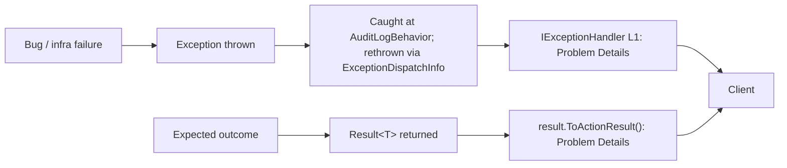
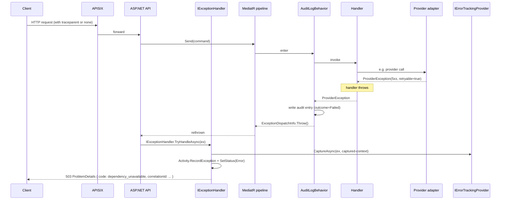
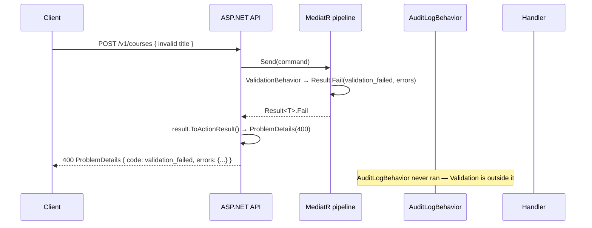
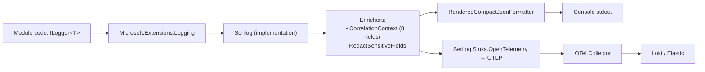
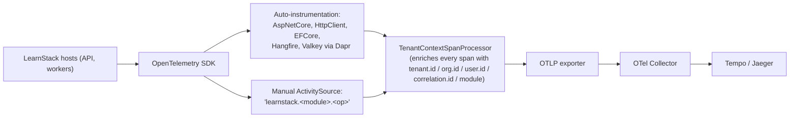
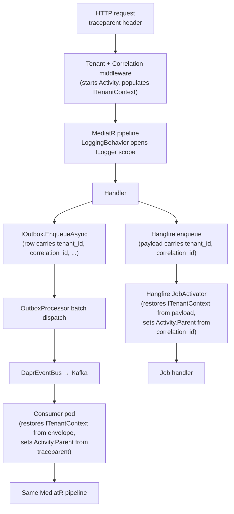
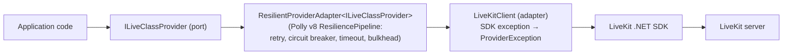

# Cross-Cutting Concerns — Errors, Logs, Traces, Metrics

**Derives from:** [ADR-0032](../decisions/0032-exception-handling-logging-and-observability.md),
[ADR-0014](../decisions/0014-adopt-dapr.md), [ADR-0016](../decisions/0016-audit-log-subsystem.md),
[ADR-0020](../decisions/0020-triple-deployment-hybrid-license.md). For the
day-to-day rules read [09-error-handling.md](../standards/09-error-handling.md),
[10-observability.md](../standards/10-observability.md), and
[02-backend-coding.md § Pipeline Behaviors](../standards/02-backend-coding.md).
This document explains the **shape** behind those rules so a reader can
reason about new cases without re-deriving the decisions.

LearnStack's cross-cutting layer answers three orthogonal questions:

1. **What went wrong, and what should the caller see?** — error handling.
2. **What happened, and can we replay it later?** — logging + audit.
3. **How did it perform, and where did time go?** — tracing + metrics.

The same primitive (`correlation_id` / W3C `traceparent`) threads through all
three so a single request can be reconstructed across HTTP → MediatR → DB →
audit → outbox → Dapr → consumer.

## 1. Two-Track Failure Model



The rule:

- **Exceptions** are for things that should not happen — bugs, infrastructure
  faults, contract violations, programmer errors.
- **`Result<T>`** is for things that *can* happen and the caller needs to
  decide what to do — validation failed, not found, forbidden, business-rule
  violation.

Both paths converge on **RFC 7807 Problem Details** at the API boundary, with
a stable `Error.Code` (one of the 13 listed in
[09-error-handling.md § Result Type](../standards/09-error-handling.md)), an
HTTP status mapped from the code, and a `correlationId` field.

The exception hierarchy
([09-error-handling.md § Hierarchy](../standards/09-error-handling.md)):

- `LearnStackException` — base. Constructors take a structured `Error` plus
  the underlying cause.
- `DomainException` — programmer error. The Roslyn analyzer
  `LearnStackException-DomainExceptionThrow` flags every `throw new
  DomainException` outside aggregate invariant checks; the architecture test
  `Domain_Methods_Do_Not_Throw_For_Expected_Cases` walks
  `Result<T>`-returning methods to confirm.
- `InfrastructureException` — transient DB / Valkey / SeaweedFS fault.
- `ProviderException` — upstream provider error; `IsClientError` flag splits
  4xx (provider's user mistake; do not Sentry) from 5xx (provider's infra
  fault; Sentry).
- `TenantContextMissingException` — request reached the pipeline without a
  resolved tenant.
- `UnreachableException` — case branch the type system can't prove
  impossible.

## 2. MediatR Pipeline Order

[ADR-0032 § Sub-decision 2](../decisions/0032-exception-handling-logging-and-observability.md)
binds the order. Reading bottom-most as innermost:

```
Request
  ▼
[1] ValidationBehavior       ←  FluentValidation; returns Result.Fail(validation_failed)
  ▼
[2] LoggingBehavior          ←  ILogger.BeginScope(tenant.id, organization.id, user.id,
                                                    module, correlation.id);
                                Activity.StartActivity(name);
                                latency histogram start
  ▼
[3] AuditLogBehavior         ←  try { handler outcome } catch {
                                  audit FAILED entry; ExceptionDispatchInfo.Throw();
                                }
  ▼
[4] TenantContextBehavior    ←  assert ITenantContext.IsResolved;
                                set RLS GUCs via DbConnectionInterceptor
  ▼
[5] AuthorizationBehavior    ←  IAuthorizationService.AuthorizeAsync;
                                Result.Fail(forbidden) on deny
  ▼
[6] TransactionBehavior      ←  DbContext.Database.BeginTransactionAsync();
                                commit on success-Result; rollback on fail-Result or exception
  ▼
[7] OutboxFlushBehavior      ←  enrol IOutbox messages in current tx;
                                they ship via DaprEventBus on commit
  ▼
[8] Handler                  ←  domain logic; returns Result<T>
```

Why this order:

- **Validation outermost.** Invalid input must never reach DB / audit / tenant
  resolution. Cheap to reject, expensive to roll back.
- **Logging before audit.** The structured-log scope (8 correlation fields)
  must exist *before* audit's catch-rethrow runs so audit entries inherit the
  trace context. If audit's snapshot fails too, the operator wants the failure
  reported with the same `correlation_id` as the original request.
- **Audit wraps everything inside it.** Per
  [ADR-0016](../decisions/0016-audit-log-subsystem.md), `AuditLogBehavior`
  catches handler exceptions, writes a failure-class audit entry, and
  rethrows via `ExceptionDispatchInfo` to preserve the original stack. No
  separate `ExceptionHandlingBehavior` is introduced — that responsibility
  already lives here, and the L1 `IExceptionHandler` is the final catch site.
- **Tenant context just inside audit.** Audit needs `actor`, `tenant_id`,
  `organization_id` to build a row; those must be resolved before the audit
  snapshot runs. The behavior validates the context (asserts the middleware
  populated it) and sets PostgreSQL session variables via the
  `DbConnectionInterceptor` so RLS policies see the right values.
- **Authorization after tenant.** A permission decision usually keys on
  `(tenant_id, user_id, resource)` — those must be ambient first.
- **Transaction after authorization.** No transaction is opened for a
  forbidden request.
- **Outbox flush inside the transaction.** Per
  [15-event-and-outbox.md](15-event-and-outbox.md), outbox rows write in the
  same transaction as the originating domain change; the behavior is the
  enrollment seam.
- **Handler at the innermost layer.** Pure domain + application logic; everything
  ambient (tenant, logger, transaction, audit context) is set up before it
  runs.

The MediatR pipeline does **not** contain an `ExceptionHandlingBehavior`. Two
catch sites are sufficient:

- **Inside `AuditLogBehavior`** — to emit a failure audit row before
  rethrowing.
- **At the L1 `IExceptionHandler`** — to translate to Problem Details and
  capture to error tracker.

## 3. Exception Flow Through the System



And the happy-path-with-Result.Fail flow:



Validation failures don't reach `AuditLogBehavior` because they short-circuit
upstream. This is deliberate — the audit log is for "something *happened* to
business data" not "the user typed a bad email address". The
`Validation`-class operations remain visible through metrics
(`learnstack_http_request_total{status=400}`) and request logs.

## 4. Sentry vs OpenTelemetry — Error Capture Boundary

Both backends receive *some* signal on every failure, but for different
audiences:

```
OTel: every failure SetStatus(Error) on its span.
      Operators see latency + error rate; long-tail debug via Tempo.

Sentry: only "something is wrong with our code / our infra".
        Sentry release tags pinpoint the commit; breadcrumbs reconstruct the
        last actions; alerting noise stays low.

→ Result.Fail(expected outcome) = OTel span SetStatus(Ok); no Sentry.
→ Exception = OTel RecordException + Sentry capture.
→ ProviderException 4xx = OTel SetStatus(Error); no Sentry.
→ ProviderException 5xx = OTel RecordException + Sentry capture.
→ OperationCanceled = OTel SetStatus(Cancelled); no Sentry.
```

The `IErrorTrackingProvider.CaptureAsync` boundary lives in the L1
`IExceptionHandler` (for unhandled exceptions) and in adapter `try/catch`
blocks (for provider failures that the handler caught and translated into
`Result.Fail`). Modules never reference `Sentry.SentrySdk` directly.

## 5. Logging Stack



Every module uses `ILogger<T>`; the Serilog implementation is wired once at
the host composition root. No module references `Serilog.ILogger` directly.

The 8 correlation fields
([10-observability.md § Correlation](../standards/10-observability.md)) ride
on Serilog's `LogContext` via `Enrich.WithCorrelationContext()`. The pattern
is "scope inherits" — the `LoggingBehavior` opens the scope once at the start
of the request; nested calls (handlers, EF interceptor logs, Dapr-emitted
logs through the auto-instrumentation) inherit it without per-call work.

Redaction (passwords, tokens, full PII payloads) happens in an enricher
**before** the formatter so neither console nor OTLP sink ever sees the
plaintext.

## 6. Tracing Stack



`TenantContextSpanProcessor` is the seam that lets auto-instrumentation
library spans (HttpClient, EF Core, Valkey via Dapr, SeaweedFS S3 SDK,
LiveKit) carry tenant attributes without per-call enrichment. The processor
reads from `ITenantContext` resolved by the tenant middleware before MediatR
ever runs, so every downstream span — even spans created by libraries the
LearnStack codebase has no knowledge of — picks up the right tags.

Sampling
([10-observability.md § Tracing](../standards/10-observability.md)) is
tail-based at the collector, not head-based at the SDK. 100% of error traces,
10% of non-error traces in production, 100% in staging.

## 7. Metrics Stack

Metrics use the standard OTel `Meter` API. The 15+ required metrics in
[10-observability.md § Metrics](../standards/10-observability.md) are emitted
by:

- The `LoggingBehavior` (request duration histogram, request count counter,
  outcome label from `Result.Code` or exception type).
- Module-specific code via injected `IMeterFactory.Create("learnstack")`.
- Adapter code via the resilience pipeline's built-in telemetry hooks
  (`learnstack_provider_request_duration_seconds`,
  `learnstack_provider_request_total{provider=...,outcome=...}`).

No high-cardinality labels (no `user_id`, no `tenant_id` directly — that goes
on spans, not metrics; metrics use `tenant_tier` if a per-tenant axis is
unavoidable).

## 8. Composition Root Branching for Deployment Mode

[ADR-0020](../decisions/0020-triple-deployment-hybrid-license.md) +
[Standards 20 § Composition Root and Deployment Mode](../standards/20-infrastructure-stack.md)
table extends with two new rows from this architecture:

| Concern | `Development` | `SaaS` | `Dedicated` | `SelfHostedOnline` | `SelfHostedAirGapped` |
|---|---|---|---|---|---|
| Error tracking | `NoOpErrorTracker` | `SentryErrorTracker` | `SentryErrorTracker` | `SentryErrorTracker` (optional) | `LocalFileErrorTracker` |
| OTLP exporter target | local OTel Collector (dev compose) | central Collector | central Collector | customer-managed Collector | local file `/var/learnstack/otel/` |

Air-gapped Self-Hosted is the load-bearing case here: every backend (Sentry,
the central Collector, possibly even DNS) is unreachable. The
`LocalFileErrorTracker` writes structured-JSON error records to a configured
directory; an operator's runbook explains how to ship those off-network later
if the customer ever wants them. The OTLP exporter can be configured to
write to a file sink instead of a network endpoint via the standard OTel
file-exporter.

Modules **never** branch on `DeploymentMode`. The composition root selects
the adapter at startup; the architecture test
`Modules_Do_Not_Reference_DeploymentMode` enforces the rule.

## 9. Correlation Propagation Across Async Boundaries



The primitive is **W3C `traceparent`** end to end. Every cross-boundary write
includes it. The receiving side resumes the trace by setting
`Activity.ParentId = traceparent`, so Tempo sees one continuous trace from
the original HTTP request to the eventual outbox-dispatched consumer or
Hangfire job execution.

### Hub HTTPS contract surface

The four `/api/internal/*` endpoints ([ADR-0019](../decisions/0019-learnstack-hub.md))
do not have a JWT tenant claim; their tenant context is read from the
request envelope's `tenantId` field after HMAC verification. The
`HubCorrelationMiddleware` accepts the inbound `traceparent` and starts an
`Activity` linked to it, so a Hub-side trace continues into LearnStack
seamlessly. Outbound calls (`POST /api/v1/internal/license/verify`, `POST
/api/v1/usage/report`) inject the current `traceparent` so the Hub-side
trace continues in the other direction.

## 10. Provider Resilience Pattern



Per [ADR-0032 § Sub-decision 5](../decisions/0032-exception-handling-logging-and-observability.md):

- The application sees only the port interface (`ILiveClassProvider`,
  `IPaymentProvider`, `IStorageProvider`, `ISearchProvider`, etc.).
- A decorator wraps the adapter with a Polly v8 `ResiliencePipeline` built
  from `appsettings.Resilience:<portName>:` configuration.
- The adapter is the only place that imports the provider SDK. Its job is
  exception translation — every SDK exception is mapped to the appropriate
  `ProviderException` subclass with the `IsClientError` flag set
  appropriately (4xx → true, 5xx → false).
- The `[add-provider-adapter](../../.claude/skills/add-provider-adapter/SKILL.md)`
  skill walks the canonical wiring; new adapters follow it without
  freelancing.

The architecture test `Adapters_Wrap_Provider_Exceptions` asserts SDK
exception types (`LiveKit.NET.LiveKitException`, `Stripe.StripeException`,
`Meilisearch.MeilisearchApiError`, …) never escape the
`LearnStack.Infrastructure.<Adapter>` namespace.

## 11. Frontend Surface

Two integration points
([09-error-handling.md § Frontend Error Handling](../standards/09-error-handling.md)):

- **Problem Details mapper.** The SDK turns Problem Details bodies into the
  `AppError` discriminated union; UI code switches on `code`. The shape is
  generated from the same OpenAPI spec so frontend and backend never drift.
- **Recovery surfaces.** App Router segment `error.tsx` handles
  segment-scoped failures; the root `app/global-error.tsx` is the last
  resort. Both display the `correlationId` from the most recent Problem
  Details response so a support handoff is one-step. Frontend Sentry attaches
  the same `correlation_id` as a tag.

## 12. Phase Ownership

| Concern | Phase | Notes |
|---|---|---|
| `Result<T>` + `Error` shape | Phase 01 (scaffolded) | Code already exists in `LearnStack.SharedKernel` |
| `LearnStackException` hierarchy | Phase 02a | Day-1 foundation |
| MediatR pipeline (8 behaviors) | Phase 02a | Order frozen by ADR-0032 |
| `LearnStackExceptionHandler : IExceptionHandler` | Phase 02a | L1 catch site |
| Serilog + OTel SDK wiring | Phase 02a | Hosts wire it once |
| `TenantContextSpanProcessor` | Phase 02a | OTel span enrichment |
| `IErrorTrackingProvider` socket | Phase 02a | Three implementations registered per `DeploymentMode` |
| `IProviderResilience<TPort>` + decorator | Phase 02a | Foundation for every adapter |
| Roslyn analyzer for `DomainException` | Phase 02a | Compile-time enforcement of "bug only" |
| Outbox / Hangfire correlation propagation | Phase 02b | Row schema + activator |
| Hub HTTPS correlation middleware | Phase 02b / 02c | Cross-repo |
| OTel Collector + Tempo + Loki + Prometheus deployment | Phase 11 | Production-side backends |
| Sentry SaaS / Self-Hosted config | Phase 11 | Per-deployment-mode wiring |
| 8 first-set dashboards + 10 alerts | Phase 11 | Grafana provisioning |

## References

- [ADR-0032 Exception Handling, Logging, and Observability Architecture](../decisions/0032-exception-handling-logging-and-observability.md)
- [ADR-0014 Adopt Dapr](../decisions/0014-adopt-dapr.md)
- [ADR-0016 Audit Log Subsystem](../decisions/0016-audit-log-subsystem.md)
- [ADR-0020 Triple Deployment + Hybrid License](../decisions/0020-triple-deployment-hybrid-license.md)
- [09-error-handling.md](../standards/09-error-handling.md)
- [10-observability.md](../standards/10-observability.md)
- [02-backend-coding.md § Pipeline Behaviors](../standards/02-backend-coding.md)
- [20-infrastructure-stack.md](../standards/20-infrastructure-stack.md)
- [31-audit-subsystem.md](31-audit-subsystem.md)
- [15-event-and-outbox.md](15-event-and-outbox.md)
