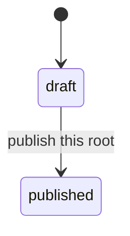

# ADR-0048: Publication Before Course Versioning

## Status

Accepted — 2026-09-14. Maintainer approval precedes P02d-1 implementation.

## Decision Drivers

- [Phase 02d](../roadmap/phase-02d-walking-skeleton.md) creates the first Education
  tables before course versioning, enrollment and an authoring UI exist. Their
  publication columns need a meaning before their first migration.
- Publication determines whether content may be served anonymously. Treating it as
  a catalog-listing flag would leave the lesson-body access rule undecided.
- A lesson needs an independent draft state: publishing its course must not expose
  every lesson that happens to reference it.
- The [Phase 05 target model](../architecture/02-domain-model.md#education-catalog)
  separates catalog identity from versioned learning structure. This interim state
  must not imply that a course version or a learner access grant already exists.
- [ADR-0042](0042-tenant-provisioning-cross-aggregate-transaction.md) permits one
  cross-root write, tenant provisioning. Education publication needs no second one.

## Considered Options

1. **Independent course and lesson publication** (chosen). Each root has its own
   state; serving a lesson requires both it and its course to be published.
2. **Course publication alone** (rejected). A new draft lesson would become readable
   merely by being attached to a published course.
3. **A minimal CourseVersion and Module now** (rejected for this slice). Their
   revision, cloning and enrollment semantics have no consumer in the anonymous
   skeleton. Phase 05 already owns their introduction and data migration.
4. **A phase note without an ADR** (rejected). Two values still define a lifecycle,
   and the publicly readable state is a security-sensitive contract under
   [Documentation Standards](../standards/13-documentation.md#adrs).

## Decision

LearnStack gives the walking skeleton's `Course` and `Lesson` roots independent
`draft` and `published` states. Publication means eligible for anonymous reading,
subject to tenant, organization, translation and deletion checks. A lesson is eligible
only when its parent course is also eligible. Publishing one root never changes the
other root's state.

### Lifecycle

- New roots start in `draft`. The only supported state change is `draft → published`.
- The database stores the two lowercase text values and rejects every other value.
- An already-published root is not published a second time. The domain reports an
  expected business-rule refusal; seed re-run handling belongs to P02d-2.
- Publication does not require at least one lesson, or a translation in every enabled
  locale. An empty published course is valid; a missing translation creates no URL
  in that locale. Phase 05 owns richer publish-readiness validation.
- Course publication does not freeze or snapshot the set of independently published
  lessons. It creates no `CourseVersion`. A new lesson starts as a draft even under
  a published course, and becomes eligible only through its own publication.
- Editing published content, unpublishing, deleting and reordering have no command
  in Phase 02d. Phase 05 owns those commands and their interaction with versioning.
  The inherited soft-delete columns remain part of the schema; their presence does
  not expose a deletion operation.
- Publishing is a MUST-class audited operation for both roots. Its audit row commits
  in the same transaction as its state change under
  [ADR-0033](0033-audit-durability-model.md). Publishing a course neither writes a
  lesson nor emits an audit row claiming that it did.

Both roots use this diagram independently. No reverse transition is available in
the walking skeleton, and a published lesson under a draft course remains hidden.

### Evolution obligations

[Phase 05](../roadmap/phase-05-education-learning-content.md) introduces
`CourseVersion`, modules, lesson items and separate catalog visibility. Its decision
pass defines how these compose with the two existing publication states, and its
migration preserves course and lesson identities, published localized URLs, lesson
order, organization scope, translated bodies and exact customization bindings.

[Phase 07](../roadmap/phase-07-enrollment-learner-portal.md) decides how content
published anonymously composes with learner Course Access. Publication is not an
enrollment, a paid access grant or a Hub entitlement.

## Context

The two roots and their translation satellites are the scope G2 and G3 put before
P02d-1. The aggregate and column details belong to the
[Education module spec](../modules/education/README.md); this record owns publication
semantics only. The target hierarchy in the Domain Model remains Phase 05's target.

## Consequences

- A draft lesson can coexist safely with a published course. Every read must apply
  the combined eligibility rule; checking only the lesson is insufficient.
- The database checks state values; publication eligibility across roots and locales
  is a read-path rule, not an extra cross-table database constraint.
- The skeleton deliberately exposes published lesson bodies anonymously. The absence
  of authentication is an intended product boundary for this phase.
- Phase 05 has an explicit migration obligation. Its versioned authoring model must
  preserve existing data rather than re-seed or silently rebind it.
- No dependency, provider, migration-chain crossing or Hub contract is introduced.

## Implementation Notes

- P02d-1: aggregate state and invariants, column checks, unit and database proofs.
- P02d-2: publication commands, audit catalogue entries and seed behavior. Command
  names, translation writes and seed inventory remain in that packet's decision pass.
- P02d-4: shared anonymous read eligibility, with draft-child and draft-parent cases
  that each have a published positive control. G29 owns exact response details.
- The Education spec, Domain Model interim notes and Phase 05 inherited scope link
  here. This acceptance establishes the contract; implementation belongs to the
  packets above.

## Architecture Tests

The existing `Cross_Aggregate_Writes_Are_Confined_To_Tenant_Provisioning` rule keeps
its one-entry allow-list. Education adds no exception. The existing audit catalogue
and matrix guards cover the publication commands when P02d-2 introduces them.

Behavioral tests, rather than a source-text scan, prove allowed and refused transitions
in P02d-1 and combined read eligibility in P02d-4.

## References

- [ADR-0008: Localization Schema](0008-localization-schema.md)
- [ADR-0018: Tenant-Driven Customization](0018-tenant-driven-customization-model.md)
- [ADR-0039: Optimistic Concurrency](0039-optimistic-concurrency-token.md)
- [ADR-0042: Cross-Aggregate Transaction](0042-tenant-provisioning-cross-aggregate-transaction.md)
- [Phase 02d decision register](../roadmap/phase-02d-walking-skeleton.md#the-decision-register)
