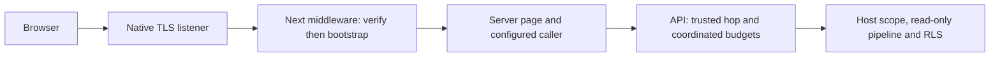

# ADR-0054: Bounded Public Renderer Admission

## Status

Accepted — 2026-10-09. The maintainer approved this ADR and the five-step
P02d-5 remediation plan. Implementation and its review/validation remain pending;
acceptance is not runtime delivery evidence. ADR-0053 remains Accepted outside
the bounded supersession below.

**Date:** 2026-10-09
**Deciders:** @cemil
**Bounded supersession:** ADR-0053, limited to accounting, native method/upgrade
admission and redirect-query wording.

## Decision Drivers

- An exhausted visitor must not spend the remaining shared renderer work budget.
- Unknown visitor identities must still be peer-gated before limiter allocation.
- Unsupported methods/upgrades need controlled refusal before framework dispatch.
- Redirect guarantees must describe the URL encoding the supported Next path emits.
- Preserve local topology, API tenant authority and the existing public contracts.

## Considered Options

1. **Coordinated admission over owned visitor limiters** (chosen): inspect an
   existing visitor without a debit; charge the peer only when visitor admission
   remains possible. Gate new visitor allocation on successful peer admission.
2. **Keep the peer-first chain** (rejected): a single IP can spend 600 peer permits
   with 60 successful calls and 540 visitor refusals, starving other visitors.
3. **Reverse the existing chain** (rejected): every unknown identity allocates a
   visitor partition even after the physical peer is exhausted.
4. **Add distributed quotas or change the numeric budgets** (rejected here): neither
   is necessary to repair this accounting defect; Phase 11 owns production fairness.
5. **Replace Next's redirect pipeline to retain every query byte** (rejected):
   equivalent percent encoding is sufficient; another response path increases the
   trusted surface without changing the query's meaning.

## Decision

LearnStack coordinates anonymous admission so an exhausted known visitor is refused
before any peer debit, while unknown visitor allocation remains peer-gated. The
public web listener accepts GET/HEAD and closes unsupported production upgrades.
Redirects retain inert query values and ordering through the supported URL
serializer, without promising byte-identical percent encoding.

### Anonymous accounting

Keep 60 calls/minute per canonical visitor IP and 600 calls/minute per physical peer,
one-minute fixed windows, no queue and pre-host/pre-database enforcement. Direct and
authenticated-hop traffic retain one visitor namespace. Invalid trusted visitor
metadata retains the current peer-IP fallback and masked refusal behavior.

The admission owner holds the actual visitor limiter instances, rather than a
parallel cache of guessed membership. One process-local owner lock, shared across
all visitor keys and physical peers, serializes positive acquisition, creation and
retirement. No network/database work, `await` or limiter disposal runs under this
lock; it introduces no rate-limit waiting queue. The acquisition order is:

1. For an existing visitor, make a zero-permit availability probe. If it refuses,
   return its refusal/Retry-After without acquiring a peer permit.
2. Acquire one physical-peer permit. If it refuses, return that refusal without
   creating an unknown visitor limiter or debiting a known visitor.
3. For a new visitor, create its limiter only now. Acquire one visitor permit.
   No competing positive visitor debit or retirement can occur between the probe
   and this debit; replenishment can only increase availability.

Use the selected refusal's Retry-After unchanged: the visitor probe's value when
it refuses, otherwise the peer refusal's value. If both budgets are exhausted,
the visitor refusal wins; do not combine their metadata or probe the peer for it.

Do not debit a visitor merely to obtain failure metadata after a statistics check;
replenishment can race that check. Do not call an opaque partition lookup to test
membership if the lookup itself creates a partition. Framework retry of the same
HTTP request reuses both successful and refused admission outcomes: it cannot
debit again if a later endpoint policy refuses. Each returned lease has independent
lifetime; cancellation, disposal and Retry-After remain explicit test obligations.

Retire only limiters whose full-quota idle state has lasted at least one complete
window. One non-overlapping periodic sweep visits the entire registry in bounded
batches; it cannot repeatedly inspect only the first batch. Final DI-owned disposal
marks admission closed, joins the sweeper and disposes every remaining instance
exactly once. Retirement shares the acquisition lock; removal is complete before
disposal outside that lock, and no request retains a removed limiter. A newly
reconstructed limiter must never restore quota before the preceding window expires.

This preserves the allocation-rate bound: a peer can create at most 600 new visitor
limiters in one peer window. It is not a fixed global cardinality cap; retained
state depends on active peers/windows and is reclaimed when idle. Do not introduce
an unbounded second identity registry or claim distributed memory/DDoS protection.

The peer budget allows at most 600 successful peer acquisitions and new visitor
allocations per peer window. Only requests eligible for visitor admission spend
peer permits; the budget does not bound all attempts or refusal-response work.
An exhausted known visitor can generate arbitrarily many 429 responses without
spending peer permits. Each still costs transport parsing, identity verification,
lock/probe work and response generation. Its admission path performs no registry
sweep, new limiter allocation or host/database lookup. Background sweep batches
are bounded; dispose removed instances outside the lock. Neither the old nor the
chosen limiter bounds incoming network traffic or the total cost of refusals.
Phase 11 owns upstream transport/edge protection and contention/load measurement;
this local correction supplies neither total-work protection nor measured throughput.

Ten legitimate visitors can exhaust the peer budget; NAT users still share an IP
quota. Budgets count API calls: middleware bootstrap consumes one call per admitted
HTTP request, including prefetch; product-page calls consume additional permits.

### Native method and upgrade admission

Apply GET/HEAD admission to every HTTP path reaching the native listener callback,
before Next dispatch and independently of middleware matcher exemptions. This
includes health, assets and scaffolds: OPTIONS, POST and other methods receive
the existing masked `404` with `Cache-Control: no-store`, and never reach bootstrap
or Next's Fetch-backed method conversion. HEAD emits no body. Node's HTTP parser
still owns malformed protocol input before the callback.

The current app route census has one explicit method handler, GET health, and no
POST handlers or Server Actions. Prove supported RSC/prefetch GET/HEAD and asset/
health behavior against the real launcher. Development HMR is a separately
validated GET upgrade, not a POST exemption. Future Server Actions/write routes
need an explicit admission decision in their owning Phase 02b BFF/auth or Phase 06
admin-studio work before a consumer ships.

Disable `poweredByHeader` separately to suppress framework identification on
framework-generated fallback responses as well as ordinary responses. This is
an identification control; it grants no admission or tenant authority.

Production has no WebSocket consumer: close every upgrade before delegation.
Development retains only Next's required, validated HMR upgrade path; refuse other
paths and close failed/unhandled delegation. Future Phase 02b BFF/auth write routes
or other WebSocket features need explicit admission before their endpoints ship.
Health/asset exemptions do not grant method, provenance or tenant authority.

### URL identity and redirects

Keep the signed raw request target as the authority for route/locale admission.
The observed middleware URL is compared only with the explicit projection performed
by pinned Next 15.5.18, including its full-URL RSC normalization and `_rsc` handling.
Accounting for that projection does not introduce `.rsc`/segment-suffix route
aliases or permit a normalized pathname to select a different raw lesson identity.

For redirects, preserve parameter values, duplicates and ordering as inert query
data; the supported serializer may percent-encode characters such as an apostrophe.
The query never supplies authority or a redirect destination. Continue using the
verified ingress host admitted by live bootstrap, accepted HTTPS port and locally
computed path. Canonical locale redirect status and membership-first precedence
remain unchanged.

## Context

Review of PR #26 at `07016405` reproduced the accounting defect using current source:
600 requests from one trusted visitor admit 60, refuse 540, and refuse a fresh
visitor afterward. ADR-0053 Amendment 3 explicitly records peer-first ordering;
this is a decision replacement, not an ADR-0041 false-when-written erratum.

An isolated comparison also showed that bare visitor-first ordering allocates 660
visitor partitions for 660 distinct identities while admitting only 600 calls;
peer-first allocates 600. Preserve that protection while removing refusal burn.

The native ingress exists because framework headers do not authenticate the original
socket peer. Its current wire format remains `v1.<payload>.<mac>`: canonical
unpadded base64url of UTF-8 JSON `[host, peer, method, target]`, authenticated by
HMAC-SHA256 over `learnstack.public-ingress.v1\0` plus the encoded payload. The
private paired hop secret is also this MAC key. A separate process key would need
an additional trusted distribution path to every verifier; this decision adds none.

The envelope has no nonce/expiry and proves origin/integrity, not freshness. The
supported listener strips submitted stamps and mints its own; direct stock Next
listeners are unsupported. Runtime diagnostics must never expose the envelope.
Changing the private secret requires paired verifier/launcher configuration and
restart; API rotation-list overlap remains available. Phase 11 owns production
key distribution, replay assessment and ingress lifecycle.

In text: the browser reaches native TLS ingress, then verified middleware/bootstrap
and the server caller, then API admission/host resolution and the read-only RLS path.

Middleware bootstrap also uses the configured caller/API path. No browser or web
component announces tenant/organization scope. Existing traceparent continuation
is preserved; Phase 11 owns participating/sampling policy. Request-local bootstrap
reuse and P6 prefetch/page choices are not delivered by accepting this ADR.

## Consequences

### Positive

- Exhausted-visitor floods no longer consume other visitors' remaining peer permits.
- New-identity allocation still stops at peer exhaustion, before host/database work.
- Unsupported methods/upgrades have a controlled native outcome.
- URL matching and redirect promises can be proved against the shipped framework.

### Negative

- The limiter owns synchronization, idle retirement and outcome replay explicitly.
- Known exhausted visitors' refusal traffic is outside the peer budget; total
  refusal CPU/network work remains unbounded by this limiter.
- The single owner lock serializes anonymous admission and bounded sweep batches
  across peers; contention is a throughput cost to measure in Phase 11.
- The admitted-call peer cap and fixed-window/NAT tradeoffs remain limitations.
- Exact redirect-query bytes are no longer guaranteed where URL encoding differs.

### Neutral

- No schema, migration, OpenAPI/SDK wire shape, tenant authority or Hub change.
- No distributed fairness, production ingress, auth or product-page scope moves.

## Implementation Notes

P02d-5's [remediation plan](../roadmap/phase-02d-walking-skeleton.md#p02d-5-external-review-remediation-2026-10-09)
owns implementation and review steps. Acceptance appends dated bounded
supersession/navigation to ADR-0053 for accounting, web method/upgrade admission
and redirect-query wording, preserving its original body and delivery history.
[ADR-0036 Amendment 11](0036-tenant-resolution-trusted-inputs.md#2026-10-09--amendment-11-bounded-admission-and-amendment-navigation)
identifies this decision replacement and its accounting scope, following the
unchanged [Amendment 10](0036-tenant-resolution-trusted-inputs.md#2026-10-08--amendment-10-trusted-public-renderer-decision-navigation).
Host normalization, trusted-input resolution and assertion-only tenant authority
remain unchanged.
Update ongoing Standards 04/07/11, Architecture 14/25, phase/route guidance and
catalogue entries with their concrete enforcing tests. Existing
[G34/G36 acceptance](../roadmap/phase-02d-walking-skeleton.md#p02d-5-accepted-answers)
is historical; record this replacement explicitly rather than reopening it silently.

In [TrustedVisitorHttpTests](../../backend/tests/LearnStack.Tests.Integration/Database/TrustedVisitorHttpTests.cs),
replace `Visitor_refusals_charge_the_peer_once_and_preserve_its_remaining_allowance`:
its current 330 requests spend 330 peer permits, including 270 visitor refusals.
The replacement must prove those refusals spend no peer permits, leaving 540
after the first 60 admitted calls, and that later framework retries charge neither
outcome again. Retain the independent admitted-traffic ceiling proof in
`Physical_peer_ceiling_bounds_rotating_trusted_visitors_before_lookup`.
Adapt [AnonymousLimiterLifecycleTests](../../backend/tests/LearnStack.Tests.Unit/Api/Tenancy/AnonymousLimiterLifecycleTests.cs)
to the new owned registry while retaining both DI teardown paths and exact-once
child disposal. Update the catalogue's
[`Anonymous_Requests_Are_Rate_Limited_Per_Peer`](../standards/21-architecture-tests-catalogue.md#anonymous_requests_are_rate_limited_per_peer)
extension with actual replacement proofs. Prior delivery counts and CI runs remain
historical; only new executions establish remediation evidence.

## Architecture Tests

Accepted proof obligations, not registered or passing-test claims:

- Exhausted visitor then fresh visitor; no unknown-identity allocation after peer
  exhaustion; direct/hop shared quota; parallel last-permit admission/creation.
- Bounded work per known-visitor refusal: no host/database lookup, registry scan
  or new limiter allocation; peer allowance unchanged after repeated refusals.
  This proves local work bounds, not a bound on total refusal traffic or CPU.
- Visitor-first Retry-After selection with distinct refusal values, including
  both budgets exhausted; same-request successful/refused outcome replay through
  actual framework/endpoint retry; cancellation and independent lease disposal.
- Non-overlapping bounded sweep batches with eventual whole-registry coverage;
  idle retirement/expiry/replenishment without restoring unexpired quota;
  acquisition/retirement/shutdown races and exact-once disposal on both DI paths.
- Rejected methods on exempt and ordinary paths before Next; bodyless HEAD;
  production upgrade closure and retained development HMR with real sockets.
- Valid query `.rsc` normalization without route aliasing; inert redirect query
  encoding; framework identification suppressed on fallback responses.

Retain real HTTP/app-role integration evidence alongside deterministic accounting
tests. Register final rule names with their enforcing implementation; claim delivery
only after these tests and both independent review rounds pass.

## Amendments

### Amendment 1 — Accounting implementation (2026-10-09)

**Delivery note; independent reviews pending.** P02d-5 remediation Step 1
implements the anonymous-accounting portion of this Accepted decision, including
owned visitor limiters, request-result snapshots, bounded idle sweeping and joined
DI teardown. Native method/upgrade and URL controls remain pending Step 2. The
original acceptance status records the state when accepted; implementation does
not rewrite it. Concrete execution and review evidence lives in the
[Step 1 delivery record](../roadmap/phase-02d-walking-skeleton.md#remediation-step-1--coordinated-anonymous-admission)
and ongoing [catalogue entry](../standards/21-architecture-tests-catalogue.md#anonymous_requests_are_rate_limited_per_peer).

### Amendment 2 — Native and URL implementation (2026-10-09)

**Delivery note; independent reviews pending.** Remediation Step 2 implements the
native method/upgrade and URL portions of this decision. Current enforcement and
concrete execution/review evidence live in [Frontend Standards](../standards/07-frontend-architecture.md#native-admission-and-url-identity)
and the [Step 2 record](../roadmap/phase-02d-walking-skeleton.md#remediation-step-2--native-ingress-and-url-boundary).
Step 1's accounting implementation has completed both independent review rounds.
The accepted decision and prior delivery notes remain unchanged; fixture/tooling
remediation and final PR closeout remain Steps 3–5.

### Amendment 3 — Fixture proof implementation (2026-10-09)

**Delivery note; independent reviews pending.** Remediation Step 3 implements
owned fixture lifecycle and falsifiable containment controls. The decision and
prior delivery notes remain unchanged. Ongoing rules live in [Testing Standards](../standards/06-testing.md#public-renderer-fixture-ownership),
concrete enforcing tests in the [catalogue](../standards/21-architecture-tests-catalogue.md#p02d-5-public-server-rendering-controls),
and execution/review evidence in the [Step 3 record](../roadmap/phase-02d-walking-skeleton.md#remediation-step-3--fixture-reliability-and-containment).
Source/tooling remediation and final PR closeout remain Steps 4–5.

### Amendment 4 — Source and tooling proof implementation (2026-10-09)

**Delivery note; independent reviews pending.** Remediation Step 4 implements the
bounded source-analysis, runner, lint and CI evidence corrections without changing
this decision. Current rules live in [Frontend Coding Standards](../standards/03-frontend-coding.md#current-toolchain-and-lint-subjects)
and [Frontend Architecture Standards](../standards/07-frontend-architecture.md#public-source-fence-scope).
The [catalogue](../standards/21-architecture-tests-catalogue.md#p02d-5-public-server-rendering-controls)
names enforcing controls; the [Step 4 record](../roadmap/phase-02d-walking-skeleton.md#remediation-step-4--source-runner-and-tooling-proof)
owns execution/review evidence. Final corpus/CI/PR closeout remains Step 5.

### Amendment 5 — Remediation delivery navigation (2026-10-09)

**Delivery note.** All four runtime/proof remediation steps are delivered after
both independent review rounds and verified corrections. The original acceptance
and earlier delivery notes remain historical. Current implementation, validation,
reviews and unmerged PR readiness live in the [five-step remediation record](../roadmap/phase-02d-walking-skeleton.md#p02d-5-external-review-remediation-2026-10-09),
including its [corpus/PR closeout](../roadmap/phase-02d-walking-skeleton.md#remediation-step-5--corpus-and-pr-closeout).
This adds delivery navigation, not a new decision or a claim that PR #26 is merged.

### Amendment 6 — Merge closeout (2026-10-09)

All five remediation steps are complete and merged through
[PR #26](https://github.com/HodeTech/LearnStack/pull/26). The
[merge closeout](../roadmap/phase-02d-walking-skeleton.md#p02d-5-merge-and-closeout-2026-10-09)
owns the final head, merge verification and CI evidence. The accepted decision,
metadata and earlier delivery notes remain unchanged. This note records delivery
only; P02d-6/7 and Phase 11 retain their named work.

## References

- [ADR-0053 — Trusted Public Server Rendering](0053-trusted-public-server-rendering.md)
- [ADR-0052 — Anonymous Public Read Boundary](0052-anonymous-public-read-boundary.md)
- [ADR-0036 — Tenant Resolution Trusted Inputs](0036-tenant-resolution-trusted-inputs.md)
- [ADR-0035 — Demand-Gated Infrastructure](0035-demand-gated-infrastructure.md)
- [Documentation Standards](../standards/13-documentation.md#correcting-and-amending-adrs)
- [Frontend Architecture](../architecture/14-frontend-architecture.md)
- [Deployment Models](../architecture/25-deployment-models.md)
- [API Design Standards](../standards/04-api-design.md)
- [Frontend Architecture Standards](../standards/07-frontend-architecture.md)
- [Security Standards](../standards/11-security.md#rate-limiting)
- [Architecture Tests Catalogue](../standards/21-architecture-tests-catalogue.md)
- [Frontend Route Workflow](../../.claude/skills/add-frontend-route/SKILL.md)
- [Phase 11](../roadmap/phase-11-production-hardening.md)
