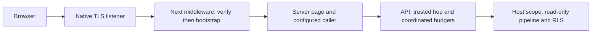

# ADR-0054: Bounded Public Renderer Admission

## Status

Proposed — maintainer approval required before implementing the changed contracts.
ADR-0053 remains Accepted; this proposal closes no gate and claims no delivery.

**Date:** 2026-10-09
**Deciders:** @cemil

## Decision Drivers

- An exhausted visitor must not spend the remaining shared renderer work budget.
- Unknown visitor identities must still be peer-gated before limiter allocation.
- Unsupported methods/upgrades need controlled refusal before framework dispatch.
- Redirect guarantees must describe the URL encoding the supported Next path emits.
- Preserve local topology, API tenant authority and the existing public contracts.

## Considered Options

1. **Coordinated admission over owned visitor limiters** (recommended): inspect an
   existing visitor without a debit; charge the peer only when visitor admission
   remains possible. Gate new visitor allocation on successful peer admission.
2. **Keep the peer-first chain** (rejected): a single IP can spend 600 peer permits
   with 60 successful calls and 540 visitor refusals, starving other visitors.
3. **Reverse the existing chain** (rejected): every unknown identity allocates a
   visitor partition even after the physical peer is exhausted.
4. **Add distributed quotas or change the numeric budgets** (rejected here): neither
   is necessary to repair this accounting defect; Phase 11 owns production fairness.
5. **Replace Next's redirect pipeline to retain every query byte** (rejected):
   equivalent percent encoding is sufficient; another response path increases the
   trusted surface without changing the query's meaning.

## Decision

LearnStack coordinates anonymous admission so an exhausted known visitor is refused
before any peer debit, while unknown visitor allocation remains peer-gated. The
public web listener accepts GET/HEAD and closes unsupported production upgrades.
Redirects retain inert query values and ordering through the supported URL
serializer, without promising byte-identical percent encoding.

The following contracts become binding only if this proposal is Accepted.

### Anonymous accounting

Keep 60 calls/minute per canonical visitor IP and 600 calls/minute per physical peer,
one-minute fixed windows, no queue and pre-host/pre-database enforcement. Direct and
authenticated-hop traffic retain one visitor namespace. Invalid trusted visitor
metadata retains the current peer-IP fallback and masked refusal behavior.

The admission owner holds the actual visitor limiter instances, rather than a
parallel cache of guessed membership. Serialize positive acquisition, creation and
retirement through the same short in-process critical section:

1. For an existing visitor, make a zero-permit availability probe. If it refuses,
   return its refusal/Retry-After without acquiring a peer permit.
2. Acquire one physical-peer permit. If it refuses, return that refusal without
   creating an unknown visitor limiter or debiting a known visitor.
3. For a new visitor, create its limiter only now. Acquire one visitor permit.
   No competing positive visitor debit or retirement can occur between the probe
   and this debit; replenishment can only increase availability.

Do not debit a visitor merely to obtain failure metadata after a statistics check;
replenishment can race that check. Do not call an opaque partition lookup to test
membership if the lookup itself creates a partition. Framework retry of the same
HTTP request reuses both successful and refused admission outcomes: it cannot
debit again if a later endpoint policy refuses. Each returned lease has independent
lifetime; cancellation, disposal and Retry-After remain explicit test obligations.

Retire only limiters whose full-quota idle state has lasted at least one complete
window. One non-overlapping periodic sweep visits the entire registry in bounded
batches; it cannot repeatedly inspect only the first batch. Final DI-owned disposal
marks admission closed, joins the sweeper and disposes every remaining instance
exactly once. Retirement shares the acquisition lock; removal is complete before
disposal outside that lock, and no request retains a removed limiter. A newly
reconstructed limiter must never restore quota before the preceding window expires.

This preserves the allocation-rate bound: a peer can create at most 600 new visitor
limiters in one peer window. It is not a fixed global cardinality cap; retained
state depends on active peers/windows and is reclaimed when idle. Do not introduce
an unbounded second identity registry or claim distributed memory/DDoS protection.

The 600-call peer ceiling remains an aggregate capacity limit. Ten legitimate
visitors can exhaust it; NAT users still share an IP quota. The correction prevents
already-exhausted visitors from spending the remaining peer budget. Budgets count
API calls: middleware bootstrap consumes one call per admitted HTTP request,
including prefetch; product-page calls consume additional permits.

### Native method and upgrade admission

Before Next dispatch, admit only GET/HEAD for the current public/scaffold surface.
Other methods receive the existing masked `404` with `Cache-Control: no-store`,
and never reach bootstrap or Next's Fetch-backed method conversion. HEAD emits no
body. Disable framework identification via `poweredByHeader: false`.

Production has no WebSocket consumer: close every upgrade before delegation.
Development retains only Next's required, validated HMR upgrade path; refuse other
paths and close failed/unhandled delegation. Future Phase 02b BFF/auth write routes
or other WebSocket features need explicit admission before their endpoints ship.
Health/asset exemptions do not grant method, provenance or tenant authority.

### URL identity and redirects

Keep the signed raw request target as the authority for route/locale admission.
The observed middleware URL is compared only with the explicit projection performed
by pinned Next 15.5.18, including its full-URL RSC normalization and `_rsc` handling.
Accounting for that projection does not introduce `.rsc`/segment-suffix route
aliases or permit a normalized pathname to select a different raw lesson identity.

For redirects, preserve parameter values, duplicates and ordering as inert query
data; the supported serializer may percent-encode characters such as an apostrophe.
The query never supplies authority or a redirect destination. Continue using the
verified ingress host admitted by live bootstrap, accepted HTTPS port and locally
computed path. Canonical locale redirect status and membership-first precedence
remain unchanged.

## Context

Review of PR #26 at `07016405` reproduced the accounting defect using current source:
600 requests from one trusted visitor admit 60, refuse 540, and refuse a fresh
visitor afterward. ADR-0053 Amendment 3 explicitly records peer-first ordering;
this is a proposed decision replacement, not an ADR-0041 false-when-written erratum.

An isolated comparison also showed that bare visitor-first ordering allocates 660
visitor partitions for 660 distinct identities while admitting only 600 calls;
peer-first allocates 600. Preserve that protection while removing refusal burn.

The native ingress exists because framework headers do not authenticate the original
socket peer. Its current wire format remains `v1.<payload>.<mac>`: canonical
unpadded base64url of UTF-8 JSON `[host, peer, method, target]`, authenticated by
HMAC-SHA256 over `learnstack.public-ingress.v1\0` plus the encoded payload. The
private paired hop secret is also this MAC key. A separate process key would need
an additional trusted distribution path to every verifier; this proposal adds none.

The envelope has no nonce/expiry and proves origin/integrity, not freshness. The
supported listener strips submitted stamps and mints its own; direct stock Next
listeners are unsupported. Runtime diagnostics must never expose the envelope.
Changing the private secret requires paired verifier/launcher configuration and
restart; API rotation-list overlap remains available. Phase 11 owns production
key distribution, replay assessment and ingress lifecycle.

In text: the browser reaches native TLS ingress, then verified middleware/bootstrap
and the server caller, then API admission/host resolution and the read-only RLS path.

Middleware bootstrap also uses the configured caller/API path. No browser or web
component announces tenant/organization scope. Existing traceparent continuation
is preserved; Phase 11 owns participating/sampling policy. Request-local bootstrap
reuse and P6 prefetch/page choices cannot be claimed as delivered by this proposal.

## Consequences

### Positive

- Exhausted-visitor floods no longer consume other visitors' remaining peer permits.
- New-identity allocation still stops at peer exhaustion, before host/database work.
- Unsupported methods/upgrades have a controlled native outcome.
- URL matching and redirect promises can be proved against the shipped framework.

### Negative

- The limiter owns synchronization, idle retirement and outcome replay explicitly.
- The aggregate peer cap and fixed-window/NAT tradeoffs remain visible limitations.
- Exact redirect-query bytes are no longer guaranteed where URL encoding differs.

### Neutral

- No schema, migration, OpenAPI/SDK wire shape, tenant authority or Hub change.
- No distributed fairness, production ingress, auth or product-page scope moves.

## Implementation Notes

P02d-5's [remediation plan](../roadmap/phase-02d-walking-skeleton.md#p02d-5-external-review-remediation-2026-10-09)
owns implementation and review steps. On acceptance, append a dated bounded
supersession/navigation note to ADR-0053 for accounting, web method/upgrade admission
and redirect-query wording; preserve its original body and delivery history.
Update ongoing Standards 04/07/11, Architecture 14/25, phase/route guidance and
catalogue entries with their concrete enforcing tests. Existing G34/G36 acceptance
is historical; record this replacement explicitly rather than reopening it silently.

## Architecture Tests

Proposed obligations, not registered or passing tests: exhausted visitor then fresh
visitor; unknown-identity allocation after peer exhaustion; direct/hop shared quota;
parallel last-permit admission; expiry/replenishment without quota reset; same-request
framework/endpoint retry; cancellation/disposal; rejected method/upgrade before Next;
valid query `.rsc` normalization without route aliasing; inert redirect query encoding.
Retain real HTTP/app-role integration evidence alongside deterministic accounting
tests. Register final rule names when implementation is selected; claim delivery
only after these tests and both independent review rounds pass.

## References

- [ADR-0053 — Trusted Public Server Rendering](0053-trusted-public-server-rendering.md)
- [ADR-0052 — Anonymous Public Read Boundary](0052-anonymous-public-read-boundary.md)
- [ADR-0035 — Demand-Gated Infrastructure](0035-demand-gated-infrastructure.md)
- [Documentation Standards](../standards/13-documentation.md#correcting-and-amending-adrs)
- [Frontend Architecture](../architecture/14-frontend-architecture.md)
- [Security Standards](../standards/11-security.md#rate-limiting)
- [Phase 11](../roadmap/phase-11-production-hardening.md)
