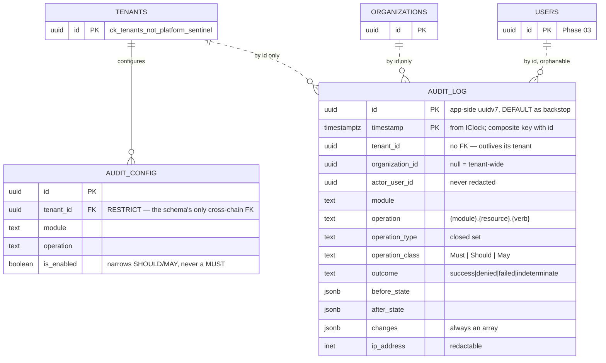
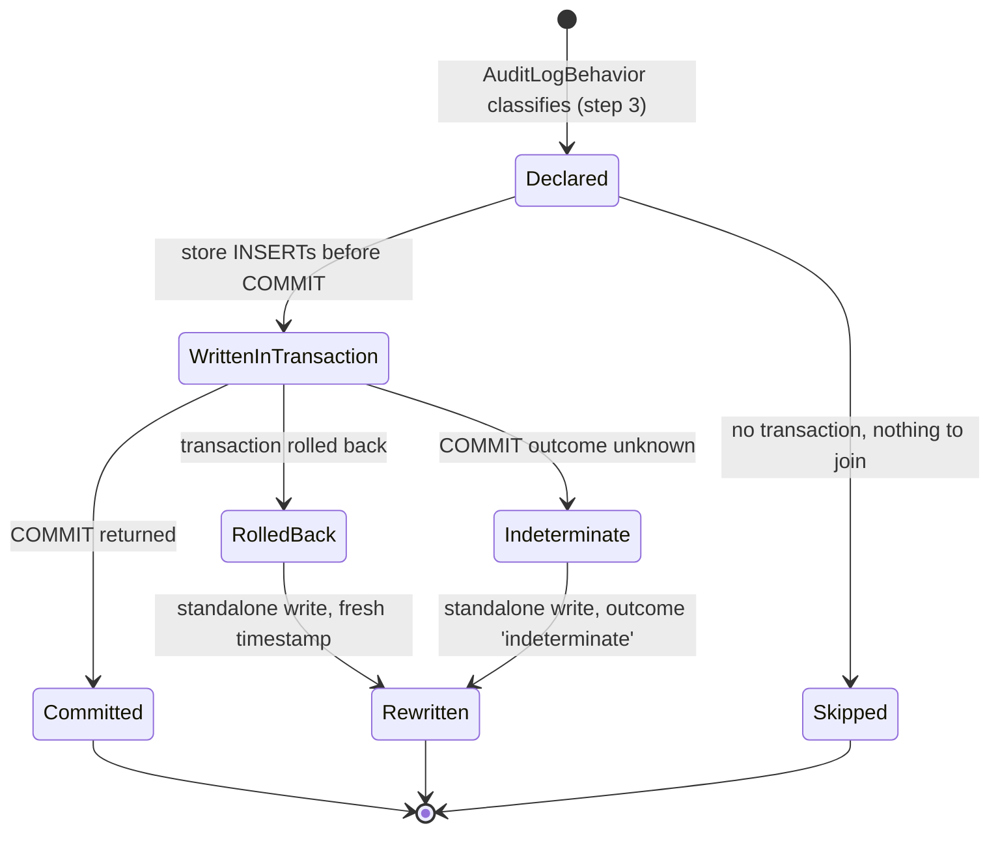
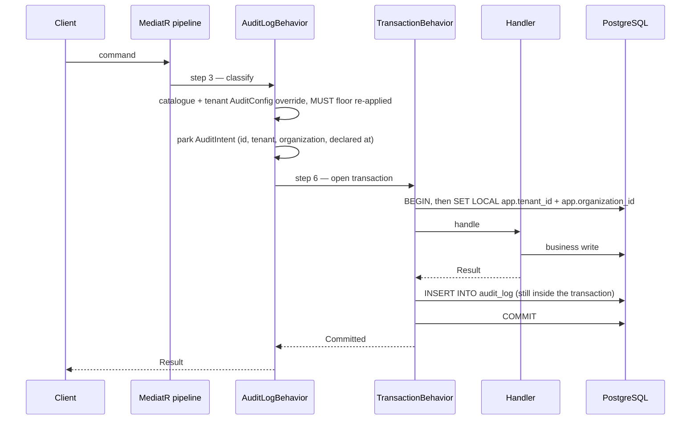
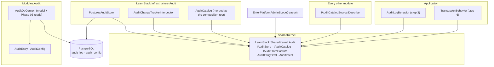

# Module Spec — Audit

**Status:** Design stable, write path implemented. Shipped today: the two tables and
their isolation, the three append-only layers, the SharedKernel ports and value types,
`AuditDbContext`, and — in `LearnStack.Infrastructure.Audit` — `AuditStateCapture`,
`AuditChangeTrackerInterceptor`, `PostgresAuditStore` with all four write methods, the
merged `AuditCatalog` and `AuditConfigService`, registered at both composition roots and
attached to every module's `DbContext`. The pipeline is lit: `AuditLogBehavior`
classifies and parks intents at step 3 and reconciles in its `finally`,
`TransactionBehavior` flushes the MUST-class rows on the owning frame immediately before
`COMMIT`, and `PlatformAdminScope.EnterAsync` writes its own `security-event` row on the
scope's platform-role connection before the operation runs. The observable half of the
fail-closed rule ships with it — the `audit` health check, the two counters, and the
`Critical` line ([ADR-0033 Amendment 3](../../decisions/0033-audit-durability-model.md)).
**Still open inside Packet 9**: `AuditingTenantAssertionRecorder`, which turns the two
`tenancy.tenant_assertion.*` slugs from declared into written, and the entitlement socket
of [ADR-0045](../../decisions/0045-entitlement-and-feature-flag-socket.md). Rows marked
`(planned)` in [the coverage matrix](audit.md) belong to the phase their cell names.
The **read** side — the query API of
[§ Querying](../../architecture/31-audit-subsystem.md), its export job and its permission
registry — lands with Identity in
[Phase 03](../../roadmap/phase-03-identity-admin.md). Partitioning, the retention purge
and the GDPR redaction path land in
[Phase 11](../../roadmap/phase-11-production-hardening.md) against written triggers
([ADR-0035](../../decisions/0035-demand-gated-infrastructure.md)).

The third module spec in the repository, per
[Documentation Standards § Per-Module Specifications](../../standards/13-documentation.md).

## Overview

Audit owns **the record of what happened**, and nothing about deciding what should.

Its subject matter is one table other modules never write directly and one that
configures how much of it they fill. The conceptual description — the pipeline, the
capture, the classification, the two durability classes — is
[Audit Subsystem](../../architecture/31-audit-subsystem.md); the deciding records are
[ADR-0033](../../decisions/0033-audit-durability-model.md) for durability and
[ADR-0044](../../decisions/0044-audit-write-path.md) for the write path. This file is
the module's own contract: what it owns, what it exposes, and what a reader has to
know before touching it.

**It owns:**

- **`audit_log`** — one row per audited operation, append-only, tenant-owned and
  organization-scoped. `AuditEntry` maps it; nothing constructs that type. Rows arrive as
  `PostgresAuditStore`'s parameterised `INSERT`, and the aggregate exists for the model
  and for the Phase 03 read API.
- **`audit_config`** — a tenant's per-`(module, operation)` override, tenant-owned and
  tenant-wide. It can narrow a SHOULD or a MAY and can never remove a MUST.
- **`AuditDbContext`** — the model those two tables are mapped by, and from
  [Phase 03](../../roadmap/phase-03-identity-admin.md) the read side of the audit admin
  API. Not a write path: nothing saves through it.

**It does not own:**

- **Deciding what is audited.** Each module declares its own coverage in code, through
  `IAuditCatalogSource.Describe(IAuditCatalogBuilder)`, and states it for a human in
  its own `audit.md`. This module holds the registry those declarations land in, not
  the declarations
  ([ADR-0044 § 6](../../decisions/0044-audit-write-path.md)).
- **Writing the row.** `AuditLogBehavior` — a cross-cutting behavior in
  `LearnStack.Application`, not a handler here — classifies and parks the intent, and
  `TransactionBehavior` flushes it immediately before `COMMIT`. A module that called
  `IAuditStore` from a handler would be writing outside the guarantee
  [ADR-0033](../../decisions/0033-audit-durability-model.md) makes.
- **The store, the capture and the catalogue.** `PostgresAuditStore`,
  `AuditStateCapture` and `AuditChangeTrackerInterceptor` live in
  `LearnStack.Infrastructure.Audit`, not here
  ([ADR-0044 § 11](../../decisions/0044-audit-write-path.md)), and the merged
  `IAuditCatalog` is built at the composition root from every module's
  `IAuditCatalogSource`. The reason is a reference edge rather than taste: the
  interceptor is attached to **every** module's `DbContext` by `AddModuleDbContext`, so
  a home for it inside this module would make every module reference the Audit module.
  `LearnStack.Infrastructure.Audit`'s csproj references `LearnStack.SharedKernel` and
  nothing else, which is what keeps that impossible. The **ports** those types implement
  live in `LearnStack.SharedKernel.Audit`, beside the value types every module's
  catalogue source names.
- **The log's own retention or redaction.** Both are Phase 11, both run as
  `learnstack_platform` through the audited `EnterPlatformAdminScope(reason)` path, and
  both are already bounded by what this packet's migration grants: a `DELETE`, and an
  `UPDATE` restricted to six columns.
- **Anything a reader would call a metric.** Counters, latencies and error rates are
  [ADR-0032](../../decisions/0032-exception-handling-logging-and-observability.md)'s,
  and an audit row is not a log line: it is a record a regulator reads and a tenant
  admin can be shown.

**One property is worth stating before anything else.** `audit_log` is the only table
in the schema whose rows cannot be corrected. `learnstack_app` holds no `UPDATE` and no
`DELETE`; `learnstack_platform`'s `UPDATE` names six columns and no more; and the table
owner — which no grant bounds — is stopped by
`audit_log_append_only_guard`. So a wrong `tenant_id`, a wrong `operation` or a wrong
`outcome` is permanent. That is why every one of those values is decided at pipeline
step 3 from the tenant context and the catalogue, and never from the payload the row
describes.

## Entity-relationship diagram

`AuditEntry` references a tenant, an organization and a user **by id and by nothing
else** — no navigation, no foreign key on the first, and a deliberately orphanable
`actor_user_id`. The dashed edges below are id references across a module boundary,
which is the only kind this schema has.

Text fallback, for a renderer without Mermaid:

- `audit_log` — the append-only record. Composite primary key `(id, timestamp)`. Carries
  `tenant_id` with **no** foreign key, `organization_id` nullable, `actor_user_id`
  nullable and never redacted.
- `audit_config` — per-tenant overrides, keyed `(tenant_id, module, operation)`. Its
  foreign key to `tenants` is the schema's only one crossing two migration chains, which
  is why `make migrate` applies Tenancy first.
- `tenants`, `organizations`, `users` — other modules' tables. Only `audit_config` has a
  real edge; the rest are id references a query joins on and a constraint does not.

**Why `audit_log` has no foreign key**, restated here because a reader of an ER diagram
looks for one: the platform-scope row carries `TenantId.PlatformSentinel`, which by
[ADR-0044 § 1](../../decisions/0044-audit-write-path.md) has no `tenants` row by
construction, and a constraint admits no exception — not for `learnstack_platform` and
not under `BYPASSRLS`. Independently, the record of what happened to a tenant has to
outlive the tenant.

## State diagrams

Neither table's rows have a lifecycle: an `audit_log` row is written once and never
changes state, and an `audit_config` row is a boolean. What does have one is the
**intent** — the parked declaration `AuditLogBehavior` creates at step 3 and
`TransactionBehavior` resolves, which is the mechanism
[ADR-0033](../../decisions/0033-audit-durability-model.md) exists to define.

Text fallback:

1. **Declared** — an intent is parked per audited `(resource, operation)`, not per
   request, so one command can declare two ([ADR-0044 § 3](../../decisions/0044-audit-write-path.md)).
2. **WrittenInTransaction** — the row is inserted on the business transaction, immediately
   before `COMMIT`, while `app.tenant_id` is set and the policy accepts it.
3. **Committed** — the ordinary end. The row and the state change are one transaction.
4. **RolledBack** — the business write failed. The row is re-written standalone, so the
   attempt survives; the re-write takes a fresh clock reading.
5. **Indeterminate** — `COMMIT` threw in a way that leaves the server-side outcome
   unknown. A second row is written with `outcome = 'indeterminate'` and the **same**
   `AuditEntryId`; the composite primary key makes the pair legal, and a `23505` on the
   re-write is positive evidence the first row is durable
   ([ADR-0044 § 5](../../decisions/0044-audit-write-path.md)).
6. **Skipped** — no transaction was opened, so there is nothing to join. The standalone
   path writes the row itself.

Only the **owning** unit-of-work frame moves an intent out of `Declared`. A joiner that
called `MarkCommitted` would mark a row nothing has committed, and if the outer
transaction then rolled back the reconcile step would do nothing and the MUST row would
be lost — which is the failure ADR-0033 exists to prevent.

## Sequence diagrams

**The primary write use case**: a MUST-class operation on the ordinary request path.
The row is written by the pipeline, never by the handler, and it commits with the state
change or not at all.

Text fallback: classify and park at step 3; open the transaction and announce the tenant
at step 6; the handler writes; the audit row is inserted on the same transaction
immediately before `COMMIT`; the commit makes both durable together. If `COMMIT` fails
the intent moves to `RolledBack` or `Indeterminate` and the standalone writer re-writes
the row on its own short transaction, announcing both session variables from the draft.

**The module publishes no integration event**, so there is no second diagram here. See
[§ Integration-event catalogue](#integration-event-catalogue) — deliberately empty —
rather than reading the absence as an omission.

## Component diagram

Text fallback: every arrow points at the ports in `LearnStack.SharedKernel.Audit`, and
no arrow points at this module's assembly. That is the whole shape.
`AuditLogBehavior` and `TransactionBehavior` live in `LearnStack.Application` and reach
the store through `IAuditStore`; each module's `IAuditCatalogSource` is discovered from
DI; `PostgresAuditStore`, `AuditChangeTrackerInterceptor` and the merged catalogue live in
`LearnStack.Infrastructure.Audit`, whose csproj references `LearnStack.SharedKernel` and
nothing else ([ADR-0044 § 11](../../decisions/0044-audit-write-path.md)). This **module**
holds the two aggregates and the context that maps them, and that split is not
bookkeeping: the interceptor is attached to every module's `DbContext`, so the assembly
holding it must be one every module may reference. Mapping `AuditEntry` into every
module's context would need SharedKernel to reference the Audit module, which already
references SharedKernel — the circular reference ADR-0033 rejects.

**The fourth external caller is not a behavior.** `EnterPlatformAdminScope(reason)`
writes its own row through `IAuditStore.WritePlatformScopeAsync` on the scope's own
platform-role connection, before the operation runs
([ADR-0044 § 10](../../decisions/0044-audit-write-path.md)). It is a service method
rather than a MediatR request, so it has no request type to key a catalogue entry on and
its entry is registered by slug.

## Integration-event catalogue

**This module publishes none, and that is a decision rather than a gap.**

An audit row that arrived at a consumer as an integration event would be a second copy
of the record with its own delivery semantics — retried, reordered, and durable
independently of the transaction that produced it. The guarantee
[ADR-0033](../../decisions/0033-audit-durability-model.md) makes is about one row in one
transaction; a published mirror of it would be a second answer to "what happened", and
the two would disagree the first time a delivery failed.

The Hub-side stream that
[Audit Subsystem § 12](../../architecture/31-audit-subsystem.md) describes is a
**read** of this table by the operator plane, not a publication by this module, and it
is bounded by [ADR-0034](../../decisions/0034-hub-contract-surface-invariant.md)'s two
invariants like every other crossing.

This module **consumes** none either. It has no inbox and no projection.

## Permission matrix

[permissions.md](permissions.md) — seven keys, six Tenant-scope and one Platform-scope, all forward declarations. The registry
that makes them enforceable lands with Identity in
[Phase 03](../../roadmap/phase-03-identity-admin.md).

## Audit coverage matrix

[audit.md](audit.md). The module that owns the log is audited like any other: reading
someone's audit trail is itself a `ReadSensitive` operation, and redacting or purging a
row is a `security-event` — the class
[Audit Coverage § Required Behaviours](../../standards/18-audit-coverage.md) puts every
platform-bypass code path on, and the one a compliance query filters for.

## Performance budget

The budget that matters here is on the **write** path, because it is paid by every
audited request rather than by a reader.

| Operation | Target | Why that number |
|---|---|---|
| Classify (step 3) | < 0.1 ms | An in-memory dictionary lookup plus a cached override. Never a database read: at step 3 no transaction is open and `app.tenant_id` is unset, so a lookup against `audit_config` would return **zero rows silently** — which reads exactly like "this tenant has no overrides". |
| Capture (interceptor) | < 1 ms per `SaveChanges` | Walks `ChangeTracker` entries already materialised for the save. Bounded by the size cap on the three `jsonb` columns, not by entity count. |
| In-transaction `INSERT` | < 1 ms | One parameterised statement on a connection that is already open and already has its tenant announced. It adds no round trip of its own. |
| Standalone write | < 5 ms | Its own connection, its own `BEGIN`/`COMMIT`, and two `set_config` calls. Off the happy path — it runs for `denied`, for a rolled-back business write, and for the commit-in-doubt re-write. |
| Read, tenant's own log, newest first | < 50 ms p95 | `ix_audit_log_tenant_id_timestamp` answers it as an index scan. The budget is Phase 03's to hold; it is here because the index that serves it ships now. |

Two budget-shaped facts that are not latency:

- **`audit_log` grows without bound until Phase 11.** There is no partitioning and no
  retention purge in this packet, deliberately — audit correctness cannot be added later
  and audit scale can, and the platform has no rows yet to scale
  ([ADR-0028's 2026-09-07 amendment](../../decisions/0028-audit-log-partition-management.md)).
- **Four indexes, not five.** The canonical organization-scoped template carries an index
  on `(tenant_id, organization_id)`; this table does not take it, because a fifth index on
  a high-volume append-only table is a write cost paid on every row for a predicate arm
  the shipped readers do not take. The reasoning is in
  [Audit Subsystem § 7](../../architecture/31-audit-subsystem.md), and Phase 03's admin
  API is where to revisit it against a measured plan.

## Risks and open questions

- **A wrong row is permanent.** Append-only has no correction path by design, and the
  six redactable columns are for erasure rather than for repair. The mitigation is
  entirely upstream: `tenant_id`, `organization_id`, `operation` and `outcome` are
  decided at step 3 from the tenant context and the catalogue, never from the request
  payload, and the isolation suite writes each of them under a foreign tenant to prove
  the policy refuses it.
- **The owner can disable a trigger.** `ALTER TABLE audit_log DISABLE TRIGGER` is not
  stopped by anything inside the database. The bound is operational: `learnstack_migration`
  is a migration credential, and nothing the platform runs day to day holds it. Stated
  rather than mitigated, because a mitigation that does not exist is worse than a
  documented limit.
- **`audit_config` ships with no writer.** Both runtime roles hold `SELECT` and nothing
  more, so the table is empty until Phase 06's Studio editor lands with the permission
  Phase 03 registers. An absent override reads as "no overrides", which is the safe
  answer, so nothing is lost by the gap — but the override branch is exercised by a test
  that seeds the row as the migration role rather than by any shipped caller.
- **Retention is unowned until Phase 11.** The purge, the partition-management job and
  the GDPR redaction path all sit behind the same trigger — measured `audit_log` growth.
  The grants they need are already written, which is the part that could not be added
  later without a migration on a table nobody may rewrite.
- **The read API's shape is Phase 03's to settle.** The four permission keys and the
  endpoint list in [Audit Subsystem § 11](../../architecture/31-audit-subsystem.md) are
  forward declarations; the export job's storage, its expiry and its own audit row are
  open.
